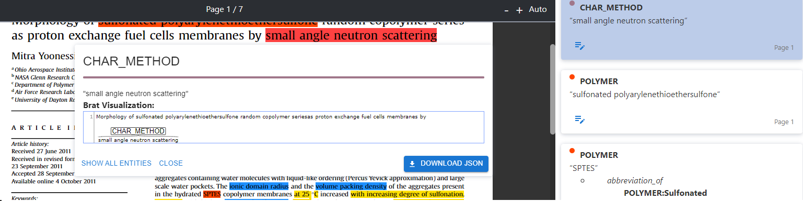
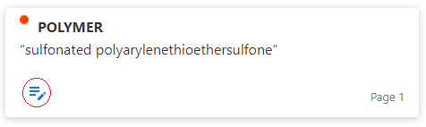
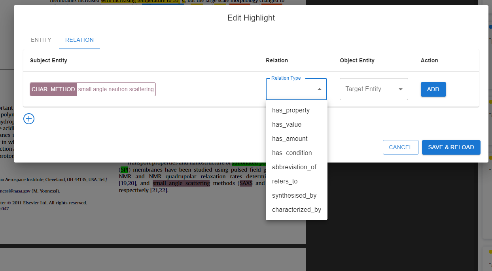

# User Manual

## Table of Contents
1. [Introduction](#introduction)
2. [Features](#features)
3. [Contact Support](#contact-support)

---

## 1. Introduction
Welcome to the **[Your Software Name]** user manual. This guide will help you install, configure, and use the software efficiently.

## 2. Features
### 2.1 Sign up and Login
#### How to Sign Up for an Account
1. Navigate to the **Sign Up** page. You can find this by clicking the **Sign Up** button on the homepage.

   

2. Fill in the required fields:
   - **Full Name**: Enter your full name.
   - **Email Address**: Provide a valid email address. 
   - **Password**: Choose a secure password that meets the system's requirements (e.g., minimum 8 characters, includes uppercase letters, numbers, and special characters).
   - **Confirm Password**: Fill in your password once again for verification. 
   

3. Click on the **Sign Up** button to submit your information.

4. Check your email for a confirmation link. Click the link to verify your account and complete the sign-up process.

   

---

#### How to Log In
1. Navigate to the **Login** page by clicking the **Login** button on the homepage.

   

2. Enter your **Email Address** and **Password** into the respective fields.

   

3. Click the **Login** button to access your account.

4. If you forget your password, click on the **Forgot Password** link below the login form. Follow the instructions sent to your email to reset your password.

   

---

#### Troubleshooting Sign-Up and Login Issues
- **Invalid Email**: Ensure your email address is correctly formatted and active.
- **Password Requirements**: Confirm your password meets the system's security requirements.
- **Account Not Verified**: If your account hasn’t been verified, check your email for the confirmation link or request a new one.
- **Forgot Password**: Use the **Forgot Password** option to reset your password if necessary.
- For additional assistance, contact our support team via the **Contact Support** section.

---

### 2.2 Using the Document Management Page

After logging in, you will be directed to the **Document Management** page, where you can manage all uploaded documents. Below is a guide on how to use this page effectively:

---

#### Features of the Document Management Page

1. **Viewing Uploaded Documents**:
   - The table displays all the documents you have uploaded.
   - Columns include:
     - **ID**: Unique identifier for the document.
     - **File Name**: Name of the uploaded file.
     - **Uploaded Time**: The timestamp when the document was uploaded.
     - **# Pages**: Total pages in the document.
     - **# Entities**: Number of entities extracted from the document.
     - **# Relations**: Number of relationships extracted.
     - **Status**: Current processing status of the document (e.g., Completed, In Progress, or Error).

2. **Navigating to Document Details**:
   - To view detailed information about a document, click on the **File Name**. This will redirect you to the **Detail View** page, where you can access the full content and analysis of the document.

3. **Downloading a Document**:
   - Click on the **Download** button (📥) in the **Actions** column to download the processed document and its results.

4. **Printing a Document**:
   - Click on the **Print** button (🖨️) to print the document directly from the browser.

5. **Deleting a Document**:
   - Click on the **Delete** button (🗑️) to permanently remove a document from the system.
     - **Warning**: Deletion is irreversible. Ensure you download any necessary files before proceeding.

6. **Searching for Documents**:
   - Use the **Search** bar above the table to quickly find a specific document by typing its name, ID, or other attributes.

7. **Filtering Documents**:
   - Use the **Filter** button (⚙️) to filter the displayed documents based on:
     - Status (e.g., Completed, In Progress).
     - Date uploaded.
     - Number of pages, entities, or relations.

8. **Sorting Documents**:
   - Click on the column headers (e.g., **ID**, **File Name**, **Uploaded Time**) to sort documents in ascending or descending order based on that attribute.

---

#### Additional Notes:
- By default, the page displays 10 documents per view. You can change the number of displayed rows using the **Rows per page** dropdown at the bottom-right corner of the table.
- Use the pagination controls (arrows at the bottom) to navigate between pages of documents.

This intuitive interface ensures that you can manage your uploaded documents with ease and efficiency.

### 2.3 PDF Upload and Processing
Users can upload PDF files into the system for automatic **Named Entity Recognition (NER)** and **Relation Extraction**. The system will analyze the document and label entities and their relationships within the text.

#### How to Upload a PDF:
1. Navigate to the **Dashboard** after accessing to system.

2. In the **Upload** section of the dashboard, click on the **Upload PDF** button.

3. Select your PDF file from your local system.

4. Once uploaded, the system will begin processing the file and extract the entities and relationships.

### 2.4 Paragraphs and Entities Editing Function
After the system processes the uploaded PDF and extracts entities and relations, users can edit the extracted text, entities, and relationships.

#### Editing Extracted Text:
1. Go to the **Paragraph Viewer** section by choosing the **Paragraph** button on the top of the most right sidebar. The extracted text area will be hightlighted on the PDF file and the list of paragraphs extracted from the PDF file will be displayed on the right sidebar.

2. Click on any parts of the hightlighted areas to check the content inside that paragraph.

3. To edit the text of the paragraph, Click on the edit button in the corner of paragraph panel to open the editting window and start edit the content of the paragraph. 

4. Click the button **Download JSON** to download the information of the current paragraph under JSON format.

5. Save changes by clicking the **Save & load** button.

#### Editing Named Entities and Relationship:
1. In the **Entity Viewer**, the system will display a list of recognized entities, go to the **Entity Viewer** section by choosing the **Entity** button on the top of the most right sidebar .

2. To see the detailed information of an entity, click on the highlighted area on the PDF viewer or click on the entity panel in the list of entity shown on the right sidebar. The detail window will show up and the screen will be scrolled to the position of the entity in the document and the entity in the list will be highlighted. 

3. The button **SHOW ALL ENTITIES** will visualize all the entities in the same paragraph that contain the current entity.

4. Click the button **Download JSON** to download the information of the current entity under JSON format.

5. To modify the information of the entity, click on the edit button in the right corner of each entity panel in the right sidebar. After the editting window show up, user can modify the type and text of the current entity as well as the relations to other entities.

6. To change the type of the entity, click on the current type to open up the list of available entity types and choose the new type.

7. To change the text of the entity, drag and click on the new span of text in the current paragraph.

8. To delete the current entity, click the **DELETE** button on the right corner of the window. Be cautious, because this action cannot be undone.  

9. To change the relation of the current entity, click on the **RELATION** button on the menu bar inside the editting window.

10. To add new relation of current entity, click on the add button on the window.

To add the relation type, click on the field **Relation Type** to open the list of available relation type and choose the suitable relation type.

To add the object to the relation, click on the field **Object Entity** to open the list of availabel entities inside the same paragraph and choose the suitable entity. 

Once finished, click button **ADD** to add new relation to current entity. 

11. To modify the information of an existing relation, click on the relation type of that relation or object entity and choose the new relation type and object entity as step 10.

12. To delete an existing relation from the current entity, click on the delete button on the row of that relation. 

13. Once finished, click **SAVE & RELOAD** to save changes, otherwise click **CANCEL** to undo the changes.

The information of whole document can be downloaded by clicking the **DOWNLOAD RESULT** button on the most right corner of the interface. With the change of users, the downloaded results will be also changed arccording the changes of user

## 3. Contact Support
If you encounter any issues, please contact our support team:

- **Email**: support@yoursoftware.com
- **Phone**: +1-800-123-4567
- **Website**: [Support Page](http://yoursoftware.com/support)

