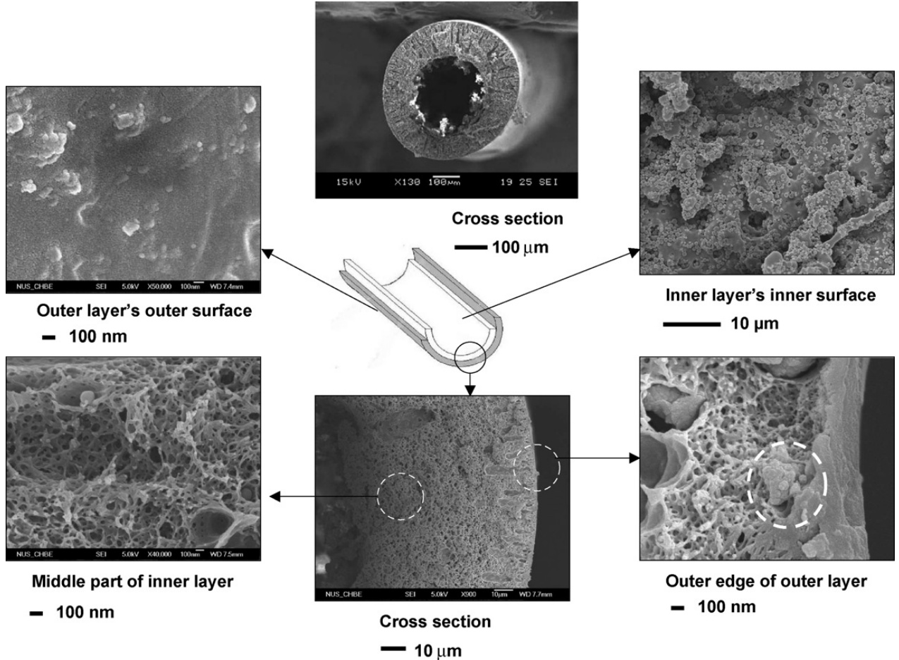
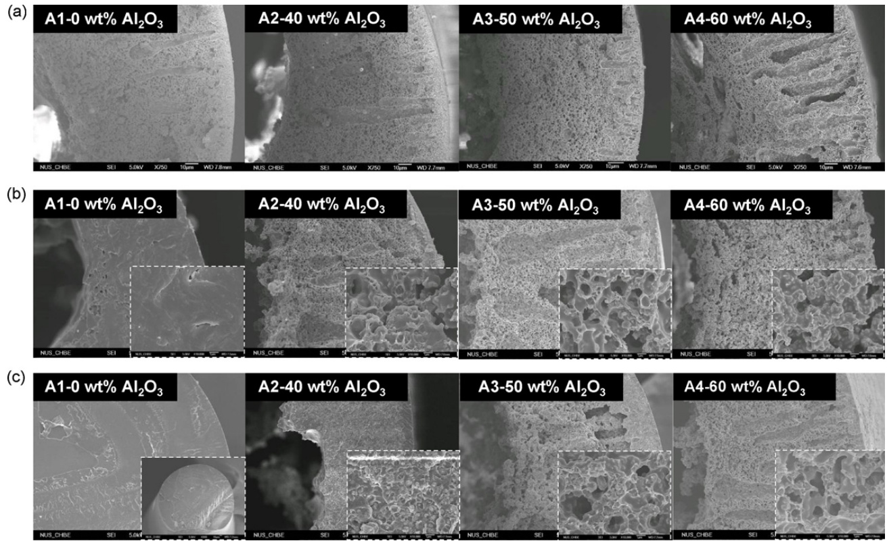
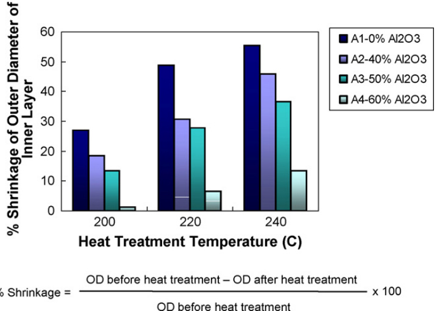
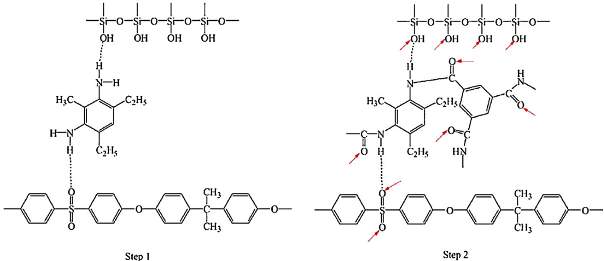
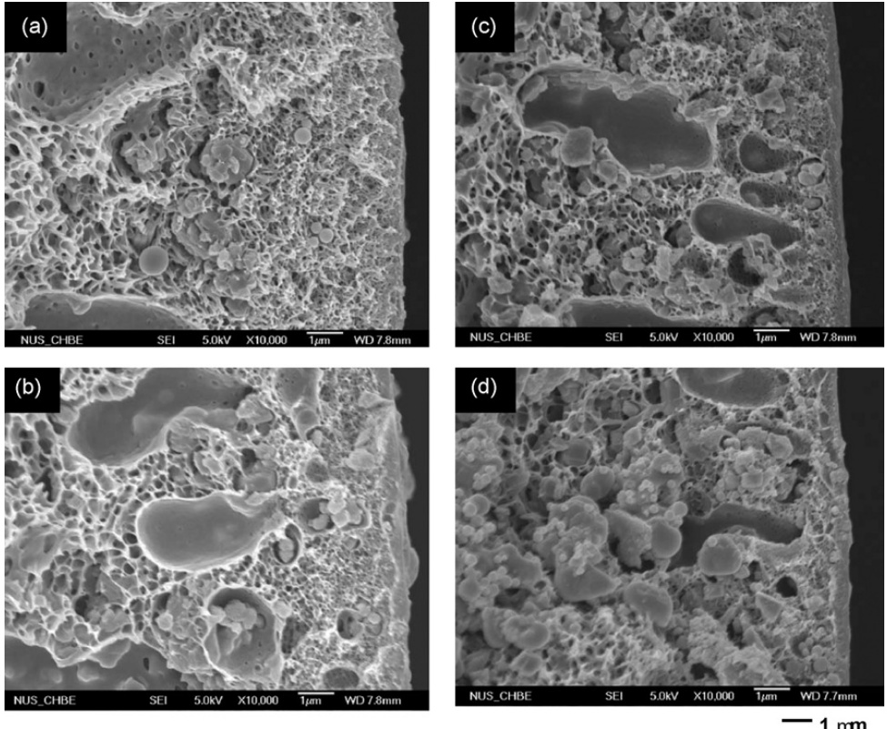
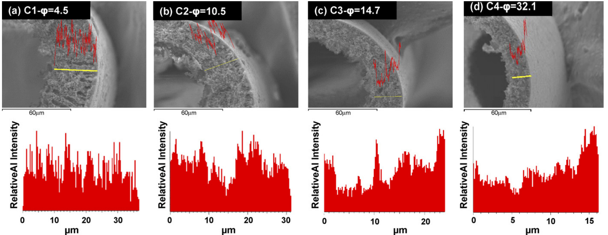
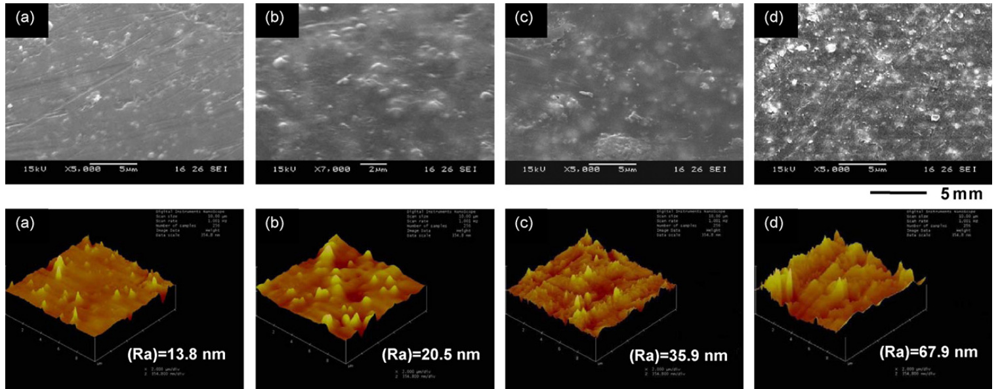
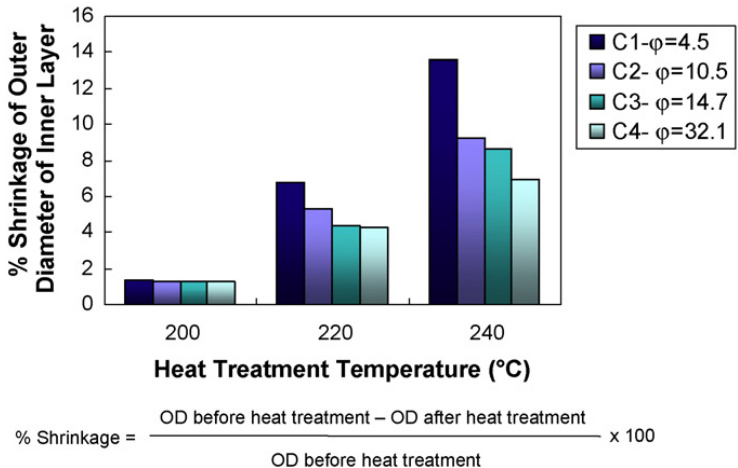

# The fabrication of hollow fiber membranes with double-layer mixed-matrix materials for gas separation  

Natalia Widjojo a, Tai-Shung Chung a,∗, Santi Kulprathipanja b  

a Department of Chemical and Biomolecular Engineering, National University of Singapore, 10 Kent Ridge Crescent, Singapore 117602, Singapore b UOP LLC, 50 East Algongquin Road, Des Plaines, IL 60017-5016, USA  

# a r t i c l e i n f o  

# a b s t r a c t  

Article history:   
Received 31 May 2008   
Received in revised form 22 July 2008   
Accepted 24 July 2008   
Available online 5 August 2008  

Keywords:   
Dual-layer mixed-matrix hollow fiber   
membranes   
Polyethersulfone (PES)   
$\mathsf{A l}_{2}\mathsf{O}_{3}$ particles   
Elongational draw ratio   
Gas separation performance   
Hollow fiber membranes  

The concept of fabricating hollow fibers with double-layer mixed-matrix materials using the same polymeric matrix has been demonstrated for gas separation. Polyethersulfone (PES)–beta zeolite $/\mathrm{PES}\mathrm{-Al}_{2}\mathrm{O}_{3}$ dual-layer mixed-matrix hollow fiber membranes with enhanced separation performance have been fabricated. This study presents an innovative approach of utilizing low cost PES and $\mathrm{{Al}_{2}\mathrm{{O}_{3}}}$ to replace expensive polyimides as the supporting medium for dual-layer mixed-matrix hollow fibers and eliminating interlayer de-lamination problems. The incorporations of $20\mathrm{wt}\%$ beta zeolite in the outer selective layer and 60 wt% $\mathrm{{Al}_{2}\mathrm{{O}_{3}}}$ in the inner layer coupled with spinning at high elongational draw ratios yield membranes with an $\mathrm{O}_{2}/\mathrm{N}_{2}$ selectivity of 6.89. The presence of $\mathrm{{Al}}_{2}\mathrm{{O}}_{3}$ particles enables the membrane to retain its porous substructure morphology in the course of annealing above the glass transition temperature of PES. Moreover, spinning at high elongational draw ratios results in the re-distribution of $\mathsf{A l}_{2}\mathsf{O}_{3}$ particles towards both edges of the inner layer. Not only do the permeance and selectivity of the fibers increase, but also greater mechanical properties and lower degree of shrinkages are obtained. Therefore, the combination of PES–beta zeolite and PES– $\mathsf{A l}_{2}\mathsf{O}_{3}$ nanoparticles with a reasonable draw ratio may be another promising approach to produce hollow fibers with double-layer mixed-matrix materials.  

$\copyright$ 2008 Elsevier B.V. All rights reserved.  

# 1. Introduction  

The intelligent incorporation of inorganic fillers within a continuous polymeric matrix represents a promising approach to attain superior gas separation performance that surpasses the Robeson trade-off line for permeability and permselectivity [1–3]. Recently, the application of mixed-matrix membranes (MMMs) for gas separation has attracted worldwide interest due to the potentially synergetic effects that can be reaped. To date, several research groups have demonstrated the feasibility of some molecularly engineered MMMs in flat, dense forms which comprised of inorganic particles like zeolites, carbon molecular sieves and others [1,2,4–16]. Nevertheless, the technical difficulties encountered in fabricating continuous and defect-free flat asymmetric or hollow fiber membranes hinder the progress of utilizing these organic–inorganic hybrids for industrial applications [17–21]. Therefore, a significant breakthrough on fabricating MMMs in useful configurations is undoubtedly essential and this signifies one immediate challenge for membrane researchers.  

In view of the desirable characteristics like larger surface-tovolume ratio and higher flux, asymmetric hollow fiber membrane is the preferred configuration for use in gas separation [22–27]. Therefore, further comprehensive research on MMMs should be devoted to the successful integration of inorganic particles to polymericbased hollow fiber membranes. Pioneering works on single-layer mixed-matrix hollow fiber membranes have revealed the need of a new fabrication approach that reduces material costs and provides greater flexibility for further modifications and improvements [28]. MMMs production by means of dual layer co-extrusion spinning technology opens up more application opportunities [28–33]. The exploitation of this technique effectively reduces fabrication costs and facilitates the control of inorganic particle distribution, i.e., introducing inorganic fillers primarily to the thin selective layer.  

A novel approach for controlling the distribution of inorganic nanoparticles in the outer skin of dual-layer mixed-matrix hollow fibers was first proposed in our early work by Jiang et al. [28]. The key factors influencing the nanoparticle distribution are: (1) shear within the spinneret, (2) die swell following dope extrusion from the annulus spinneret and (3) elongational drawing in the air gap. Subsequently, the fabrication of dual-layer mixed-matrix hollow fiber membranes were further developed by Chung and coworkers [29–31]. Currently, there exists a major challenge faced by researchers in fabricating dual-layer mixed-matrix hollow fiber membranes for gas separation. The conventional phase inversion process makes it difficult to obtain a mixed-matrix selective layer without severe polymer/particle interfacial voids. The presence of these undesirable interfacial voids diminishes the gas separation performance of MMMs and hence, this problem needs to be rectified.  

In view of the anticipated requirement for post-treatment to reduce or eliminate interfacial voids, the material selection for the inner and outer layers is important. Typically, the working polymers for the outer and inner layers should have a vast difference in their glass transition temperatures $(T_{\mathrm{g}})$ . In particular, the $T_{\mathrm{{g}}}$ of the polymer constituting the support layer should be significantly higher than the polymer used for the mixed-matrix layer. This allows the subsequent heat treatment to reduce or eliminate voids in the selective mixed-matrix layer without increasing the substructure resistance of the support layer [29–31]. Similar heat treatments may be utilized to eradicate the problem of delamination occurring between the inner and outer layers. Therefore, the related works on dual-layer mixed-matrix hollow fiber membranes reported by Chung and co-workers’ group [28–31] typically employ glassy polymers with relatively low $T_{\mathrm{{g}}}$ (e.g. polysulfone (PSf) and polyethersulfone (PES)) for the mixed-matrix layer, while glassy polyimides with high $T_{\mathrm{g}}$ (e.g. Matrimid and P84) are used for the support layer. From the engineering point of view, this approach has solved the problem of interfacial voids effectively. However, it is certainly not practical from the economical aspect since higher production cost is incurred as a result of using costly polyimides (e.g. approximately ∼USD 550/kg Matrimid) for the support layer. This raises an issue of whether the costly polymer can be replaced with a cheaper alternative, hence the primary goal in our present study.  

In the previous works on dual-layer hollow fiber membranes by Widjojo et al. [34,35], an indented dual-layer spinneret was invented to reduce the interlayer de-lamination [34] and $\mathsf{A l}_{2}\mathsf{O}_{3}$ nanoparticles were introduced into the inner support layer [34,35] to minimize its shrinkage and densification during heat treatment while retaining porous structure. It is found that the combination of the indented spinneret and inorganic nanoparticles synergistically results in MMMs with enhanced mechanical properties, faster spinning speed, looser substructure resistance, and greater overall separation performance. This inspires us to further explore the feasibility of designing dual-layer MMMs with both inner and outer layers made of mixed-matrix materials. Not only can it substitute expensive polyimide materials with less costly composite materials for the support layer, but also the addition of $\mathsf{A l}_{2}\mathsf{O}_{3}$ nanoparticles in the support layer probably enhances the gas separation performance and mechanical strength of the resultant membranes, even after heat treatment at above the $T_{\mathrm{{g}}}$ of the top selective layer.  

# 2. Experimental  

# 2.1. Materials  

Radel A polyethersulfone purchased from Solvay Advanced Materials was chosen as the polymeric material for both outer and inner layers of dual-layer mixed-matrix hollow fibers. NMethyl pyrrolidone (NMP) $(>99\%)$ and ethanol from Merck were used as solvent and additive, respectively. In addition, the selfsynthesized beta zeolite particles with an average diameter of $300\mathrm{nm}$ were added into the outer layer polymer solution as a dispersed phase. Aluminium oxide $\left({\sf A l}_{2}{\sf O}_{3}\right)$ with an average particle size of approximately $0.2\upmu\mathrm{m}$ and a density of $3.9\mathrm{g}/\mathrm{cm}^{3}$ from Nanoscale Materials Inc. was employed as an additive in the inner-layer dope solution. Methanol and hexane from Merck were utilized for the solvent exchange. All chemicals were used as received.  

# 2.2. Dual-layer hollow fiber membrane fabrication  

# 2.2.1. Dope formulation  

The outer layer dope composition was determined according to the procedure described elsewhere [30]. PES/NMP/ethanol with a weight ratio of $35/50/15$ was used as an outer layer dope. In addition, $20\mathrm{wt}\%$ of beta zeolite was added to the outer layer dope solution. For the inner-layer dope, a mixture of PES/NMP/ethano $=25/61/14$ was utilized. Different $\mathsf{A l}_{2}\mathsf{O}_{3}$ particle loadings, i.e., $0{-}60\mathrm{wt}\%$ , were added to the inner-layer dope solution. Both the outer and inner dope solutions were prepared according to the following procedure. The mixture of NMP (solvent) and ethanol (nonsolvent) was stirred at $0{\mathrm{-}}5{\mathrm{~}}^{\circ}{\mathrm{C}}$ inside an ice bath for 30 minutes. Then, a stipulated amount of nanoparticles was dispersed in the mixture at a high speed stirring for $_{3\mathrm{h}}$ . Subsequently, one-fifth of the total polymer amount was initially added slowly into the solution. Once it was fully dissolved, the remaining polymer was added. The dope solution was kept at high speed agitation until the polymer was dissolved completely. All the solutions were degassed in the three-neck flask for several hours and then placed into two ISCO syringe pumps. Spinning took place after another $24\mathrm{h}$ of degassing.  

Table 1 Spinning conditions of PES–zeolite beta $/\mathrm{PES}\mathrm{-Al}_{2}0_{3}$ dual-layer mixed-matrix fibersa   

<html><body><table><tr><td>SpinningID</td><td>Outer dope flowrate(ml/min)b</td><td>Al2O3 loading in the inner layer (wt%)C</td><td>Take-up speed (m/min)</td><td>Elongationaldrawratio(o)d</td></tr><tr><td>A1</td><td>0.1</td><td>0</td><td></td><td></td></tr><tr><td>A2</td><td>0.1</td><td>40</td><td>Free</td><td></td></tr><tr><td>A3</td><td>0.1</td><td>50</td><td>fall</td><td></td></tr><tr><td>A4</td><td>0.1</td><td>60</td><td></td><td></td></tr><tr><td>B1</td><td>0.2</td><td>60</td><td></td><td></td></tr><tr><td>B2</td><td>0.1</td><td>60</td><td>Free</td><td></td></tr><tr><td>B3</td><td>0.075</td><td>60</td><td>fall</td><td></td></tr><tr><td>B4</td><td>0.05</td><td>60</td><td></td><td></td></tr><tr><td>C1</td><td>0.1</td><td>60</td><td>6.6</td><td>4.5</td></tr><tr><td>C2</td><td>0.1</td><td>60</td><td>16.2</td><td>10.5</td></tr><tr><td>C3</td><td>0.1</td><td>60</td><td>25.1</td><td>14.7</td></tr><tr><td>C4</td><td>0.1</td><td>60</td><td>32.9</td><td>32.1</td></tr></table></body></html>

a Inner dope flow rate $1\mathrm{ml/min}$ ; bore-fluid flow rate: $0.5\mathrm{cm}^{3}/\mathrm{min}$ ; bore-fluid composition (NMP/water): 95/5; external coagulant: water; coagulant bath and spinning temperature: $25^{\circ}C,$ relative humidity: $65\%$ ; air gap distance: 1 cm. b Weight ratio of outer layer dope solution PES:NMP:ethanol $=35;50;15$ [30]; zeolite loading $20\mathrm{wt}\%$ to polymer. c Weight ratio of inner-layer dope solution PES:NMP:ethanol $=25{:}61{:}1\cdot$ 4; $\mathsf{A l}_{2}\mathsf{O}_{3}$ particle loadings 0–60 wt% to polymer. d Elongation draw ratio: $\varphi=([(D_{0}^{2}$ uter-orifice ID $-D_{\mathrm{Inner-tube0D}}^{2}\rangle$ ) − (D2Outer-tube OD − D2Outer-tube ID)]Spinneret $/[D_{0\mathrm{D}}^{2}-D_{\mathrm{ID}}^{2}]_{\mathrm{Fiber}})$ [35].  

# 2.2.2. Dual-layer hollow fiber spinning process  

The dual-layer hollow fiber membranes with a mixed-matrix outer layer were fabricated by the co-extrusion technique using a dual-layer spinneret as described in our previous works [36–39]. Firstly, the dope solutions and bore-fluid were extruded at specified flow rates through a triple-orifice spinneret using three ISCO syringe pumps. A dry-jet wet-spinning process was used. Table 1 displays the sample ID and spinning conditions for the dual-layer mixed-matrix fibers spun as a function of $\mathsf{A l}_{2}\mathsf{O}_{3}$ nanoparticle loading in the inner layer, take-up speed and outer layer dope flow rate. The resultant fibers were immersed in the coagulation bath (i.e., water) and then transported over rollers. A take-up drum was used to collect the fibers. The as-spun dual-layer hollow fiber membranes were cut into pieces of approximately $30\mathrm{cm}$ and immersed in a clean water bath for 2 days. The fibers were solvent-exchanged by three consecutive $30{\cdot}\mathrm{min}$ immersions in a methanol circulation. The same procedure then was repeated using $n$ -hexane. Finally, these fibers were dried in air at ambient temperature.  

# 2.2.3. Post-treatment protocols  

Two post-treatment methods, namely heat treatment and twostep coatings were applied to eliminate voids created between nanoparticles and polymer matrix on the outer surface of dual-layer mixed-matrix hollow fiber membranes. Heat treatment processes were performed in a precise high-temperature programmable furnace (CenturionTM Neytech Qex). Its procedure was to anneal the as-spun fibers from room temperature to a high temperature (200, 220, 235, 240 or $245^{\circ}{\mathrm{C}})$ at a heating rate of $0.6^{\circ}C/\operatorname*{min}$ under vacuum; then hold them for $^{2\mathrm{h}}$ before cooling down naturally. The other method was a two-step coating approach invented by DuPont scientists [40] which has been investigated systematically by Jiang et al. [29]. The coating solution included (1) $0.2\mathrm{wt\%}$ diethyltoluenediamine in iso-octane and (2) a mixture of $0.2\mathrm{wt\%}$ of 1,3,5-benzenetricarbonyl chloride and $2\mathrm{wt}\%$ silicon rubber in isooctane. Each step of coating was conducted by dip coating fibers while applying vacuum from the fiber’s lumen side for $30\mathrm{min}$ . Finally, these fibers were dried at $100^{\circ}\mathrm{C}$ for $^{2\mathrm{h}}$ before the gas separation characterization.  

# 2.3. Membrane characterization  

The morphology of the dual-layer hollow fiber membrane was observed using field emission scanning electron microscopy (FESEM JEOL JSM-6700LV) and scanning electron microscopy (SEM JEOL JSM-5600LV). The sample was fractured in liquid nitrogen and coated with platinum before FESEM or SEM analysis. The line scan spectrum of energy dispersion of X-ray (EDX) was applied in the SEM samples to determine the particle distribution profile in the inner-layer cross-section area of dual-layer hollow fiber membranes. Furthermore, the Young’s modulus of dual-layer mixed-matrix hollow fibers with varying $\mathsf{A l}_{2}\mathsf{O}_{3}$ nanoparticle loadings in the inner layer was characterized using Instron 5542.  

The glass transition temperature $(T_{\mathrm{g}})$ of the dual-layer mixedmatrix hollow fibers was analyzed with differential scanning calorimetry (DSC) on a Mettler-Toledo DSC 822e. A small piece of fiber was weighed and placed into aluminium DSC pans. The tested samples were heated from 25 to $300^{\circ}\mathrm{C}$ at a heating rate of $10^{\circ}C/\operatorname*{min}$ in the first DSC cycle to remove thermal history; then held for $10\mathrm{min}$ at $300^{\circ}\mathrm{C}$ and cooled from 300 to $25^{\circ}{\mathsf{C}}$ at the rate of $20^{\circ}C/\operatorname*{min}$ ;  

finally repeated the above procedure for the second cycle. $T_{\mathrm{{g}}}$ of the sample was determined as the midpoint temperature of the transition region in the second heating cycle. The sensitivity of the DSC is $\pm1^{\circ}{\mathsf{C}}$ .  

The outer surface topology of dual-layer mixed-matrix hollow fiber membranes as a function of elongational draw ratio was further examined using a Nanoscope IIIa atomic force microscope (AFM) from Digital Instruments Inc. For each sample, an area of $10\upmu\mathrm{m}\times10\upmu\mathrm{m}$ was scanned at a rate of ${\sim}1\ H z$ using the tapping mode of the AFM. The mean roughness of specified area was calculated using the Nanoscope software.  

Pure gas permeation tests were carried out using the constant volume method described elsewhere [29]. Each module consisted of one fiber with an effective length of $5\mathrm{cm}$ and at least three modules were tested at $25^{\circ}{\mathsf{C}}$ . The gas permeation tests were run at $689.4757\times10^{3}$ Pa (100 psi) except for ${\mathrm{CO}}_{2}$ gas test run at $137.89514\times10^{3}\mathrm{Pa}(20\mathrm{psi})$ for all hollow fiber samples. The permeance, $P/L$ , was determined from the steady-state pressure increase as a function of time dp/dt $(1.333224\times10^{2}\mathrm{Pa}/\mathrm{s}$ $({\mathrm{mmHg}}/s).$ using the following equation:  

$$
{\frac{P}{L}}={\frac{273\times10^{10}}{760}}{\frac{V}{A T[p_{0}\times76/14.7]}}\left[{\frac{\mathrm{d}p}{\mathrm{d}t}}\right]
$$  

where $P$ is the permeability of separating layer in the unit of Barrer (1 Barrer $=7.5005\times10^{-18}\mathrm{m}^{2}s^{-1}\mathrm{Pa}^{-1})$ , L the thickness of the apparent dense-selective layer (cm), $V$ the volume of the permeation side $(\mathrm{cm}^{3})$ , A the effective separating area of the membrane $({\mathrm{cm}}^{2})$ ), T the operation temperature inside the permeation cell (K) and $p_{0}$ the feed gas pressure in psi. The permeance unit is GPU $(1\mathrm{GPU}=1\times10^{-6}\mathrm{cm}^{3}(\mathrm{STP})/\mathrm{cm}^{2}\:\mathrm{scmHg})$ .  

The ideal selectivity, $\alpha_{\mathsf{A}/\mathsf{B}}$ , could be determined from the following equation:  

$$
\alpha_{\mathrm{A/B}}={\frac{(P/L)_{\mathrm{A}}}{(P/L)_{\mathrm{B}}}}
$$  

# 3. Results and discussion  

# 3.1. Morphology of as-spun dual-layer mixed-matrix hollow fibers  

The typical morphology of as-spun PES–beta zeolite $/\mathrm{PES}\mathrm{-Al}_{2}\mathrm{O}_{3}$ mixed-matrix dual-layer hollow fibers is illustrated in Fig. 1 (sample ID: A2). It can be observed that the as-spun fiber utilizing the same polymer material, i.e., PES, shows a de-lamination-free structure with a porous supporting layer. Although the defects between polymer and beta zeolite particle in the outer layer’s outer surface are almost invisible at a magnification of 50,000 (i.e., the left-upper SEM picture) but an interfacial gap between the polymer and beta zeolite in the outer layer’s edge (i.e., the right-bottom picture) can be obviously observed. Normally in the dual-layer mixed-matrix fibers, heat treatment has been a common method to reduce or eliminate the voids between polymer matrix and particles [29–31]. However, it is not possible for hollow fibers made from the same PES polymer matrix in both layers to withstand high-temperature heat treatment above the $T_{\mathrm{{g}}}$ of PES without severe damage. In order to overcome this problem, two approaches are undertaken in this work as follows: (1) the addition of $\mathrm{{Al}}_{2}\mathrm{{O}}_{3}$ nanoparticles in the inner layer to enhance the mechanical strength as well as retain a porous substructure after heat treatment; and (2) the use of high elongation draw ratio to properly shift the particle distribution to critical locations across the inner layer.  

  
Fig. 1. SEM images of different skins of PES–beta zeolite/PES– $\cdot\mathbb{A}\mathbb{I}_{2}\mathbb{O}_{3}$ dual-layer mixed-matrix fiber membranes (sample ID: A2).  

  
Fig. 2. The effect of heat treatment temperature on fiber’s cross-section and inner layer’s structure and porosity (magnification $750\times$ ). (a) No heat treatment; (b) $200^{\circ}\mathrm{C}$ for 2 h; (c) $240^{\circ}\mathrm{C}$ for $^{2\mathrm{h}}$ . Inset images (b) and (c) show the inner layer’s structures at a higher magnification $(10,000\times,$ ).  

Table 2 The effect of different $\mathsf{A l}_{2}\mathsf{O}_{3}$ loadings and post-treatments on the gas separation performance (free-fall sample ID: A1–A4)   

<html><body><table><tr><td>SampleID (Al2O3loading)</td><td>Al2O3loading in the inner layer (wt%)</td><td>Heattreatmenttemperature</td><td>Po2 (GPU)a</td><td>PN2 (GPU)a</td><td>αO2/N2</td><td>Dense-selective thickness (μm)b</td></tr><tr><td>A1</td><td>0</td><td>225-240°C</td><td></td><td></td><td></td><td></td></tr><tr><td>A2</td><td>40</td><td>235°C</td><td>0.0069</td><td>0.0052</td><td>1.33</td><td></td></tr><tr><td></td><td></td><td>240°C</td><td>0.0046</td><td>0.0026</td><td>1.77</td><td></td></tr><tr><td></td><td></td><td>235°C</td><td>2.39</td><td>2.46</td><td>0.97</td><td></td></tr><tr><td></td><td></td><td>235°C+2stepcoatings</td><td>0.082</td><td>0.0199</td><td>4.13</td><td></td></tr><tr><td></td><td></td><td>240°C</td><td>0.109</td><td>0.0167</td><td>6.52</td><td>3.03</td></tr><tr><td></td><td></td><td></td><td></td><td></td><td></td><td></td></tr><tr><td>A4</td><td>60</td><td>235°C</td><td>3.11</td><td>3.57</td><td>0.87</td><td></td></tr><tr><td></td><td></td><td>235°C+2stepcoatings</td><td>0.734</td><td>0.392</td><td>1.87</td><td></td></tr><tr><td></td><td></td><td>240°℃</td><td>1.51</td><td>1.74</td><td>0.87</td><td></td></tr><tr><td></td><td></td><td>240°C+2stepcoatings</td><td>0.122</td><td>0.0190</td><td>6.42</td><td>2.70</td></tr></table></body></html>

a ${\mathrm{O}}_{2}$ and $\Nu_{2}$ were tested at $689.4757\times10^{3}$ Pa $100{\tt p s i};$ . b Intrinsic property of flat MMM PES–20 wt% beta zeolite: $P_{0_{2}}=0.33$ Barrer; $\mathrm{O}_{2}/\mathrm{N}_{2}=6.4$ [30].  

# 3.2. The effects of heat treatment on the morphology and separation performance of dual-layer mixed-matrix hollow fiber membranes  

Fig. 2 compares the inner layer’s structure of the fibers with different $\mathsf{A l}_{2}\mathsf{O}_{3}$ nanoparticle loadings before and after heat treatment. It can be found that those fibers without any particle loading in the inner layer show a severe densification after heat treatment at $200^{\circ}\mathrm{C}$ and even turn into solid fibers after heat treatment at $240^{\circ}\mathsf C_{\cdot}$ while those fibers spun with 40 wt% $\mathrm{{Al}}_{2}\mathrm{{O}}_{3}$ loading still retain their porous structures after heat treatment at $200^{\circ}\mathrm{C}$ and do not transform into a fully densified structure until heat treated at $240^{\circ}\mathrm{C}$ . On the contrary, fibers spun with 50 or $60\mathrm{wt}\%$ $\mathsf{A l}_{2}\mathsf{O}_{3}$ loading retain their porous substructure even after heat treatment at $240^{\circ}\mathsf C.$ Therefore, fibers made from 60 wt% $\mathsf{A l}_{2}\mathsf{O}_{3}$ loading were chosen for further studies.  

Table 2 summarizes the effect of different $\mathsf{A l}_{2}\mathsf{O}_{3}$ nanoparticle loadings on gas separation performance of dual-layer mixed-matrix fibers for free-fall samples A1–A4. All fibers show Knudsen diffusion selectivity before any post-treatment, thus heat treatment above the $T_{\mathrm{{g}}}$ of polymer and two-step coatings were applied to the as-spun fibers. For $\mathsf{A l}_{2}\mathsf{O}_{3}$ embedded samples post-treated at the same temperature, their permeance increases with an increase in $\mathsf{A l}_{2}\mathsf{O}_{3}$ nanoparticle loadings in the inner layer. However, no permeance can be detected for the post-annealed dual-layer fibers that contain no $\mathrm{{Al}}_{2}\mathrm{{O}}_{3}$ nanoparticle because of significant structure densification after heat treatment at elevated temperatures. In comparison to the intrinsic $\mathsf{O}_{2}/\mathsf{N}_{2}$ selectivity (6.4) of the PES–zeolite beta mixed-matrix flat dense membranes [30], the dual-layer mixed-matrix hollow fiber with $40\mathsf{w t\%}\mathsf{A l_{2}}0_{3}$ nanoparticle loading shows a much lower $\mathrm{O}_{2}/\mathrm{N}_{2}$ selectivity of 1.33–1.77 with an unimpressive $_{0_{2}}$ permeance when the heat treatment took place at $235^{\circ}\mathrm{C}$ and above. This is due to the fact that the substructure resistance in the inner layer comes into effect after heat treatment and hence results in a simultaneous reduction in both permeance and selectivity, which has been proven by SEM images in Fig. 2. On the other hand, the dual-layer mixed-matrix hollow fiber containing $50{-}60\mathsf{w t}\%\mathsf{A l}_{2}0_{3}$ nanoparticles achieves an $\mathrm{O}_{2}/\mathrm{N}_{2}$ comparable to or slightly surpassing that of the PES–beta zeolite mixed-matrix flat dense membranes and has a higher permeance than those with lower $\mathrm{{Al}}_{2}\mathrm{{O}}_{3}$ loadings when heat treated at similar temperatures. This phenomenon arises from the fact that higher $\mathrm{{Al}}_{2}\mathrm{{O}}_{3}$ loadings could retain the porous substructure during heat treatment and thus lead to insignificant substructure resistance. Further characterizations, i.e., measurements of mechanical strength and degree of shrinkage, will be discussed later to demonstrate the above speculation.  

# 3.3. Effect of outer layer thickness on gas separation performance  

The main function of the outer layer is to provide a denseselective layer for gas separation. By means of adjusting the outer layer dope flow rate while keeping the other spinning parameters constant, one may tailor the mixed-matrix outer layer as thin as possible to obtain high permeance [36]. However, there is a limitation in reducing the thickness of the outer layer since the mixed-matrix outer layer consists of beta zeolite with a particle size in the range of $250{-}300\mathrm{nm}$ . Table 3 compares the gas separation performance of dual-layer mixed-matrix hollow fibers as a function of outer-layer dope flow rates. Both permeance and selectivity are further enhanced when the outer layer dope flow rate decreases from 0.2 to $0.075\mathrm{ml/min}$ It can be found that the thinnest denseselective layer of mixed-matrix dual-layer fibers is $0.81\upmu\mathrm{m}$ with $\mathrm{O}_{2}/\mathrm{N}_{2}$ selectivity of 6.63.  

Table 3 The effect of outer layer dope flow rate on the gas separation performance (sample ID: B1–B4)   

<html><body><table><tr><td>SampleID</td><td>Outerlayerdope flow rate (ml/min)</td><td>Heattreatmenttemperature</td><td>Po2 (GPU)a</td><td>PN2 (GPU)a</td><td>αO2/N2</td><td>Dense-selective thickness (μm)b</td></tr><tr><td>B1</td><td>0.2</td><td>235°C+2stepcoatings 240°C+2stepcoatings</td><td>0.523 0.0620</td><td>0.134 0.00930</td><td>3.86 6.67</td><td>5.32</td></tr><tr><td>B2</td><td>0.1</td><td>235°C+2stepcoatings 240°C+2stepcoatings</td><td>0.71 0.122</td><td>0.82 0.0190</td><td>0.87 6.42</td><td>2.70</td></tr><tr><td>B3</td><td>0.075</td><td>235°C+2stepcoatings 240°C+2stepcoatings</td><td>0.99 0.407</td><td>1.02 0.0614</td><td>0.97 6.63</td><td>0.81</td></tr><tr><td>B4</td><td>0.05</td><td>240°C+2stepcoatings 245°C+2stepcoatings</td><td>0.62</td><td>0.51</td><td>1.21 2.71</td><td></td></tr></table></body></html>

a ${\mathrm{O}}_{2}$ and $\Nu_{2}$ were tested at $689.4757\times10^{3}$ Pa (100 psi). b Intrinsic property of flat MMM PES–20 wt% beta zeolite: $P_{0_{2}}=0.33$ Barrer; $\mathrm{O}_{2}/\mathrm{N}_{2}=6.4$ [30].  

The pore size of zeolite beta (on plane 1 0 0 : $6.6\mathring{\mathbf{A}}\times6.7\mathring{\mathbf{A}}$ ; on plane ⟨0 0 1⟩: $5.6\mathring\mathrm{A}\times5.6\mathring\mathrm{A})$ [41] is larger than the kinetic diameters of all gases tested in this work. From this point of view, it seems that the selectivity enhancement for the two gas pairs contradicts the ideal molecular sieving mechanism. However, the results are consistent with the previous reports because there are several mechanisms involved in selectivity improvement [10,14,15,42,43]; namely, (1) polymer chain rigidification near the particles; (2) pore opening reduction due to the partial pore blockage; (3) the orientation of the pore opening of the beta zeolite in the fiber’s outer layer relatively to the direction of gas flow.  

A further decrease in outer-layer dope flow rate to $0.05\mathrm{ml/min}$ results in $\mathrm{O}_{2}/\mathrm{N}_{2}$ selectivity in the range of Knudsen diffusion even after thermal treatment for samples before two step coating. This might be due to the fact that more defects are created on the outer surface when the outer layer thickness becomes thinner. As a result, the fibers cannot show high permselectivity because their defects are beyond repaired by means of heat treatment and two step coating methods.  

Since the newly developed dual-layer double-mixed-matrix hollow fiber membranes have comparable performance to those dual-layer single-mixed-matrix ones using P84 as the inner-layer material [31], the combination of PES–beta zeolite and $\mathsf{P E S}\mathrm{-Al}_{2}\mathsf{O}_{3}$ nanoparticles with a proper outer-layer dope flow rate may be a promising approach to replace highly expensive polyimide materials with high $T_{\mathrm{{g}}}$ as a porous inner layer in the fabrication of mixed-matrix dual-layer hollow fibers.  

# 3.4. Thermal, rheology and mechanical properties of PES–beta zeolite/ $'P E S{\sim}A l_{2}O_{3}$ dual-layer mixed-matrix hollow fibers  

Since heat treatment is applied to the fibers, it shows shrinkage in both radial and longitudinal directions. Fig. 3 shows the radial direction shrinkage. With the addition of $\mathsf{A l}_{2}\mathsf{O}_{3}$ nanoparticles into the inner layer, the dual-layer fiber has a less degree of shrinkage during heat treatment as compared to those fibers containing no particles. The degree of shrinkage in the transversal direction is defined as follows [35]:  

  
Fig. $3,\%$ Shrinkage of the outer diameter of the fibers as a function of heat treatment temperature $(2\mathfrak{h})$ and $\mathsf{A l}_{2}\mathsf{O}_{3}$ particle loadings. % Shrinkage $=$ (OD before heat treatment − OD after heat treatment)/OD before heat treatment $\times$ 100  

where DS is the degree of shrinkage, and OD is the outer diameter of the inner layer of the dual-layer mixed-matrix hollow fiber membranes. A possible explanation for the reduction of the degree of fiber shrinkage during heat-treatment is due to the rigidification of PES chains induced by the $\mathsf{A l}_{2}\mathsf{O}_{3}$ nanoparticles [7,8]. Table 4 indicates that the $T_{\mathrm{{g}}}$ of the fiber increases with an increase in $\mathsf{A l}_{2}\mathsf{O}_{3}$ nanoparticle loading, which provides strong evidence for chain rigidification. Furthermore, Table 4 also shows that the inner-layer dope viscosity increases with an increase of $\mathrm{{\smallAl}}_{2}\mathrm{{O}}_{3}$ particle loadings. Thus the degree of shrinkage decreases with an increase in particle loadings due to the increment in solid density. In addition, the particles which act as a hindrance among polymer chain reduce the shrinkage. This observation supports our hypothesis that the addition of $\mathsf{A l}_{2}\mathsf{O}_{3}$ nanoparticles in the inner layer can prevent the fiber from severe densification and shape deformation during hightemperature heat treatment.  

Table 4 shows the effects of the addition of $\mathsf{A l}_{2}\mathsf{O}_{3}$ nanoparticles on mechanical properties of the free-fall spun fibers (sample ID: A1 to A4). The fiber’s modulus increases while the elongation at break decreases with increasing $\mathsf{A l}_{2}\mathsf{O}_{3}$ nanoparticle loading.  

Table 4 The effect of $\mathrm{{Al}}_{2}\mathrm{{O}}_{3}$ loadings on the glass transition temperature, viscosity and mechanical properties of dual-layer mixed-matrix hollow fiber membranes   

<html><body><table><tr><td>Sample ID</td><td>Al2O3loadingin the inner layer(wt%)</td><td>Viscosityofinner-layer dope (x10-3 Pas (cP))a</td><td>Glass transition temperature (°C)</td><td>Theelongation at break (%)</td><td>Tensile strength (MPa)</td><td>Young's modulus (MPa)</td></tr><tr><td>A1</td><td>0</td><td>1.180</td><td>219 ± 1</td><td>72.2</td><td>31.6</td><td>44</td></tr><tr><td>A2</td><td>40</td><td>1.450</td><td>221 ± 1</td><td>17.4</td><td>41.8</td><td>240</td></tr><tr><td>A3</td><td>50</td><td>2.130</td><td>222±1</td><td>8.99</td><td>28.1</td><td>313</td></tr><tr><td>A4</td><td>60</td><td>4.110</td><td>229±1</td><td>4.02</td><td>14.3</td><td>356</td></tr></table></body></html>

a Measured using ARES Rheometer at shear rate of $10s^{-1}$ at $25^{\circ}\mathrm{C}$  

Table 5 The effect of elongational draw ratio and post-treatment on the gas separation performance (sample ID: C1–C4)   

<html><body><table><tr><td>SampleID</td><td>Elongational drawratio(Φ)</td><td>Heattreatmenttemperature</td><td>Po2 (GPU)a</td><td>PN (GPU)a</td><td>αO2/N2</td><td>Dense-selective thickness (μm)b</td></tr><tr><td rowspan="2">C1</td><td rowspan="2">4.5</td><td>240°C</td><td>1.51</td><td>1.74</td><td>0.87</td><td></td></tr><tr><td>240°C+2stepcoatings</td><td>0.122</td><td>0.0190</td><td>6.42</td><td>2.70</td></tr><tr><td rowspan="2">C2</td><td rowspan="2">10.5</td><td>240°C</td><td>4.93</td><td>5.03</td><td>0.98</td><td></td></tr><tr><td>240°C+2stepcoatings</td><td>0.213</td><td>0.0319</td><td>6.67</td><td>1.55</td></tr><tr><td rowspan="2">C3</td><td rowspan="2">14.7</td><td>240°C</td><td>5.71</td><td>5.88</td><td>0.97</td><td></td></tr><tr><td>240°C+2stepcoatings</td><td>0.241</td><td>0.0349</td><td>6.89</td><td>一 1.37</td></tr></table></body></html>

a $_{0_{2}}$ and $\Nu_{2}$ were tested at $689.4757\times10^{5}$ Pa $100{\tt p s i};$ . b Intrinsic property of flat MMM PES–20 wt% beta zeolite: $P_{0_{2}}=0.33$ Barrer; $\mathrm{O}_{2}/\mathrm{N}_{2}=6.4$ [30].  

  
Fig. 4. The interaction among the zeolite particles, chemicals in the coating solutions and polysulfone. The arrows indicate the sites possibly forming hydrogen bonding with amine groups in the other molecules.  

Clearly, the elasticity of the free-fall fiber reduces with an increase in $\mathsf{A l}_{2}\mathsf{O}_{3}$ nanoparticle loading. In addition, the tensile strength initially increases at $40\mathsf{w t\%}\mathsf{A l_{2}O_{3}}$ loading, but becomes weak at $60\mathsf{w t\%}\mathsf{A l_{2}}0_{3}$ loading. This observation reveals that the fibers incorporated with $60\mathrm{wt}\%$ $\mathrm{{Al}}_{2}\mathrm{{O}}_{3}$ nanoparticles has a low shrinkage and weak mechanical strengths.  

# 3.5. The effects of draw ratio on gas separation performance and mechanical properties  

Table 5 displays a comparison of gas separation performance among dual-layer mixed-matrix hollow fibers with $60\mathrm{wt}\%$ $\mathsf{A l}_{2}\mathsf{O}_{3}$ loading in the inner layer as a function of elongational draw ratios $(\varphi)$ . It shows that a significant improvement of both permeance and selectivity can be achieved for those fibers spun at a higher elongational draw ratio. The highest $_{0_{2}}$ permeance is 0.241 with $\mathsf{O}_{2}/\mathsf{N}_{2}$ selectivity of 6.89 at an elongational draw ratio of 14.7 after heat treatment at $240^{\circ}\mathrm{C}$ and two-step coatings. However, the use of two-step coatings procedure alone without applying heat treatment could not seal the defects. This might be due to the defects between particle and polymer still beyond the curing range of two-step coatings. The superiority of two-step coatings over one step one, i.e., silicon rubber coating, to cure defects in the mixed-matrix dual-layer hollow fibers has been demonstrated and discussed in details by Jiang et al. [29] and can be briefly explained in Fig. 4. The concept of two-step coatings was first proposed by DuPont scientists [40] and its superiority to cure the defects in the mixed-matrix hollow fiber membranes has been further patented [33]. Following their work, Jiang et al. [1] have successfully applied the two-step coating method to seal the defects in their dual-layer mixed-matrix hollow fibers. As compared to the common silicon rubber coating, it has shown a more superior gas separation performance. Two possible reasons might be due to: (1) the defects between particles and the polymer are still beyond the curing range of silicon rubber coating; (2) the hydrophobic silicon rubber may partially detach from the surface of the hydrophilic zeolite. The introduction of the reactive chemicals tends to form some stable structures between the particle surface and the polymer matrix might help to tighten the hollow fiber surface structure as well as trap the silicon rubber in the gaps more effectively.  

  
Fig. 5. SEM images of outer layer’s outer edge of dual-layer mixed-matrix fibers as a function of elongational draw ratio (a) $\varphi=4.5$ ; (b) $\varphi=10.5$ ; (c) $\varphi=14.7$ ; (d) $\varphi=32.1$ (sample ID: C1–C4).  

  
Fig. 6. The effect of elongation draw ratio on the $\mathrm{{Al}}_{2}\mathrm{{O}}_{3}$ particle distribution along radial direction of the inner-layer cross-section of PES–beta zeolite $\slash\mathrm{PES}\mathrm{-Al}_{2}0_{3}$ mixed-matrix dual-layer hollow fiber membranes: (a) $\varphi=4.5$ ; (b) $\varphi=10.5$ ; (c) $\varphi=14.7$ ; (d) $\varphi=32.1$ (sample ID: C1–C4).  

The feasible interactions among the chemicals in the coating solutions, the zeolite particles, and the polysulfone are drawn in Fig. 4. Since the zeolite and polysulfone contain hydroxyl and sulfone groups, respectively, it is thought that the amines in the diethyltoluenediamines could induce the hydrogen bonding with the hydroxyl and sulfone groups. Besides the hydrogen bonding, the 1,3,5-benzenetricarbonyl chloride may react with the amine producing an amide group. Consequently, the network resulted from these two reactions help to narrow the gap between the particles and the polymer, which can trap the silicon rubber chains effectively.  

It has been proven in our previous works [28,35,44], that the particle distribution across the fiber’s wall transforms from a convex induced by the shear stress within the spinneret to a concave profiles induced by the elongation stress in the air gap region as the elongational draw ratio increases from a free-fall spinning to a high elongational draw spinning. In this work, we believe that there are two types of particle movements as a function of elongational draw ratio, namely: (1) migration of beta zeolite particles in the outer layer towards outer layer’s outer edge and (2) movement of $\mathsf{A l}_{2}\mathsf{O}_{3}$ particles in the inner layer towards both edges, since two different particles were applied simultaneously in the outer and inner layers. The migration of both particles from the middle portion to the edge of fibers as a function of elongational draw ratio can be determined qualitatively from the increasing number of particles in the outer layer’s outer edge of the fibers shown in the SEM images in Fig. 5. In conjunction, SEM-EDX images of $\mathsf{A l}_{2}\mathsf{O}_{3}$ particles in the fiber’s cross-section in Fig. 6 further confirms that there is a shift in $\mathsf{A l}_{2}\mathsf{O}_{3}$ particles from the middle part to both edges with an increase in elongation draw ratio. However, the aluminium (Al) intensity near the outer edge of fibers might as well include the Al content of beta zeolite, since it also consists of Al element. The effects of elongational draw ratio on the number of particles in the outer surface, the AFM topology and mean roughness calculation (Ra) of the outer surface are shown in Fig. 7. It can be observed that the number of nanoparticles residing in the inner layer’s outer surface increases with an increase in elongational draw ratio. Simultaneously, the increment of mean roughness in the outer surface of fibers from $13.8\mathrm{nm}$ at $\varphi=4.5$ to $67.9\mathrm{nm}$ at $\varphi=32.1$ further supports the occurrence of particle distribution movement when spinning at a high elongational draw ratio.  

  
Fig. 7. SEM and AFM 3D images and mean roughness (Ra) calculation of outer layer’s outer surface of dual-layer mixed-matrix fibers as a function of elongational draw ratio (a) $\varphi=4.5$ ; (b) $\varphi=10.5$ ; (c) $\varphi=14.7$ ; (d) $\varphi=32.1$ (sample ID: C1–C4).  

Table 6 The effect of elongational draw ratio on the mechanical property of the dual-layer mixed-matrix hollow fiber membranes (sample ID: C1–C4)   

<html><body><table><tr><td>Sample ID</td><td>Elongationdraw ratio()</td><td>Tensile strain(%)</td><td>Tensile stress(MPa)</td><td>Young's modulus(MPa)</td></tr><tr><td>C1</td><td>4.5</td><td>4.02</td><td>14.3</td><td>356</td></tr><tr><td>C2</td><td>10.5</td><td>6.51</td><td>24.6</td><td>378</td></tr><tr><td>C3</td><td>14.7</td><td>7.33</td><td>28.9</td><td>394</td></tr><tr><td>C4</td><td>32.1</td><td>7.48</td><td>32.2</td><td>430</td></tr></table></body></html>  

The migration of nanoparticles towards the edge has multiple effects. It will results in more micro-defects beneath the PES–beta zeolite layer (as shown in right-bottom figure of Fig. 1); thus creates more channels for gas transportation and reduces the substructure resistance. Since nanoparticles are accumulated towards both edges of the inner layer, elongated polymer chains would dominate in the middle part of the fiber cross-section. As a result, the fiber mechanical strength is improved and its shrinkage in the radial direction is reduced during heat treatment. Both the mechanical data tabulated in Table 6 and the degrees of thermal shrinkage shown in Fig. 8 confirm our hypotheses. All mechanical properties including tensile strength, Young’s modulus and elongation at break increase with an increase in elongation draw ratio from 4.5 to 14.7. Therefore, the combination of PES–beta zeolite and $\mathsf{P E S}\mathrm{-Al}_{2}\mathsf{O}_{3}$ nanoparticles with a reasonable draw ratio may be another promising approach to produce double-mixed-matrix hollow fibers.  

  
Fig. 8. % Shrinkage of the outer diameter of the fibers as a function of heat treatment temperature $(2\mathfrak{h})$ and elongation draw ratio. % Shrinkage $=$ (OD before heat treatment − OD after heat treatment)/OD before heat treatment $\times$ 100  

# 4. Conclusions  

PES–beta zeolite $\prime\mathrm{PES}\mathrm{-Al}_{2}\mathrm{O}_{3}$ dual-layer mixed-matrix hollow fibers with an enhanced gas separation performance and mechanical strength have been successfully fabricated using an economical polymer material, i.e., PES, as a substitute to an expensive polyimide material as the inner layer. Based on the gas separation results and characterizations in this work, the following conclusions can be drawn:  

(1) Two approaches to utilize the same polymer material for both layers, i.e., PES, in the fabrication of dual-layer mixed-matrix hollow fibers are proposed as follows: (a) the addition of $\mathrm{{Al}}_{2}\mathrm{{O}}_{3}$ nanoparticles in the inner layer to retain a porous structure of the fiber during heat treatment; (b) the use of a high elongation draw ratio to shift the particle distribution in the inner layer and enhance both gas separation performance and mechanical strength.   
(2) The dual-layer mixed-matrix hollow fibers with $50{-}60\mathrm{wt}\%$ $\mathsf{A l}_{2}\mathsf{O}_{3}$ nanoparticle loadings can achieve the intrinsic selectivity of the PES–beta zeolite mixed-matrix flat dense membranes with higher permeance as compared to those with lower $\mathsf{A l}_{2}\mathsf{O}_{3}$ loadings, i.e., $0{-}40\mathrm{wt}\%$ $\mathsf{A l}_{2}\mathsf{O}_{3}$ loadings when heat treated at similar temperatures due to a better porous substructure and a lower degree of shrinkage.   
(3) Both permeance and selectivity are further enhanced when the outer layer dope flow rate decreases from 0.2 to $0.075\mathrm{ml/min}$ The thinnest dense-selective layer of dual-layer mixed-matrix fibers is $0.81\upmu\mathrm{m}$ with $\mathsf{O}_{2}/\mathsf{N}_{2}$ of 6.63.   
(4) A significant enhancement in both permeance and selectivity has been achieved for those fibers spun at a higher elongation draw ratio with 60 wt% $\mathsf{A l}_{2}\mathsf{O}_{3}$ loading in the inner layer. The highest $_{0_{2}}$ permeance is 0.24 with $\mathrm{O}_{2}/\mathrm{N}_{2}$ selectivity of 6.89 at an elongation draw ratio of 14.7 after heat treatment at $240^{\circ}\mathrm{C}$ and two-step coatings.   
(5) Spinning at high elongational draw ratios results in the redistribution of $\mathsf{A l}_{2}\mathsf{O}_{3}$ particles towards both edges of the inner layer. Not only does permeance and selectivity increase, but also greater mechanical properties and lower degree of shrinkages are obtained. Therefore, the combination of PES–beta zeolite and $\mathsf{P E S}\mathrm{-Al}_{2}\mathsf{O}_{3}$ nanoparticles with a reasonable draw ratio may be another promising approach to produce double-mixedmatrix hollow fibers.  

# Acknowledgments  

The authors would like to thank the Singapore National Research Foundation (NRF) for her support on the Competitive Research Programme for the project entitled “Molecular Engineering of Membrane Materials: Research and Technology for Energy Development of Hydrogen, Natural Gas and Syngas” with grant number of R-279-000-261-281. Special appreciation is extended to Dr. Yi Li, Ms. Bee Ting Low and Mr. Seyed Saeid Hosseini for their valuable suggestions in this work. Miss Widjojo would like to express her thanks to UOP LLC financial support.  

<html><body><table><tr><td colspan="2">Nomenclature</td></tr><tr><td>D</td><td>diameter</td></tr><tr><td>ID</td><td>innerdiameter</td></tr><tr><td>OD</td><td>outerdiameter</td></tr><tr><td>Pa</td><td>permeanceofgasa</td></tr><tr><td>αA/B</td><td>selectivity of gas A over B</td></tr><tr><td>P</td><td>elongationaldrawratio</td></tr></table></body></html>  

# References  

[1] S. Kulprathipanja, R.W. Neuzil, N.N. Li, Gas separation by means of mixed matrix membranes, US Patent 4,740,219 (1988). [2] S. Kulprathipanja, Mixed matrix membrane development, Ann. N.Y. Acad. Sci. 984 (2003) 361.   
[3] L.M. Robeson, Correlation of separation factor versus permeability for polymeric membranes, J. Membr. Sci. 62 (1991) 4424.   
[4] M. Jia, K.V. Peinemann, R.D. Behling, Molecular sieving effect of the zeolite filled silicone rubber membranes in gas permeation, J. Membr. Sci. 57 (1991) 289.   
[5] J.M. Duval, A.J.B. Kemperman, B. Folkers, M.H.V. Mulder, G. Desgrandchamps, C.A. Smolders, Preparation of zeolite filled glassy polymer membrane, J. Appl. Polym. Sci. 54 (1994) 409. [6] S.B. Tantekin-Ersolmaz, Effect of zeolite particle size on the performance of polymer–zeolite mixed matrix membrane, J. Membr. Sci. 137 (1997) 145.   
[7] G. Saracco, H.W.J.P. Neomagus, G.F. Versteeg, W.P.M. Van Swaaij, Hightemperature membrane reactor: potential and problems, Chem. Eng. Sci. 54 (1999) 1997.   
[8] R.H.B. Bouma, A. Checchetti, G. Chidichimo, E. Drioli, Permeation through a heterogeneous membrane: the effect of the dispersed phase, J. Membr. Sci. 128 (1997) 141.   
[9] H.H. Yong, H.C. Park, Y.S. Kang, J. Won, W.N. Kim, Zeolite-filled polyimide membrane containing 2,4,6-triaminopyrimidine, J. Membr. Sci. 288 (2001) 151.   
[10] S.S. Chan, T.S. Chung, R. Wang, Z. Lu, C. He, Characterization of permeability and sorption in Matrimid/C60 mixed matrix membranes, J. Membr. Sci. 218 (2002) 1.   
[11] T.C. Merkel, B.D. Freeman, R.J. Spontak, A. He, I. Pinnau, Ultrapermeable, reverse-selective nanocomposite membranes, Science 296 (2002) 519.   
[12] H. Wang, B.A. Holmberg, Y. Yan, Homogeneous polymer–zeolites nanocomposite membranes by incorporating dispersible template-removed zeolite nanoparticles, J. Mater. Chem. 12 (2002) 3640.   
[13] R. Mahajan, W.J. Koros, Factors controlling successful formation of mixedmatrix gas separation materials, Ind. Eng. Chem. Res. 39 (2000) 2692.   
[14] Y. Li, T.S. Chung, C. Cao, S. Kulprathipanja, The effects of polymer chain rigidification, zeolite pore size and pore blockage on polyethersulfone (PES)–zeolite A mixed matrix membranes, J. Membr. Sci. 260 (2005) 45.   
[15] Y. Li, H.M. Guan, T.S. Chung, S. Kulprathipanja, Effects of novel silane modification of zeolite surface on polymer chain rigidification and partial pore blockage in polyethersulfone (PES)–zeolite A mixed matrix membranes, J. Membr. Sci. 275 (2006) 17.   
[16] Y. Li, T.S. Chung, S. Kulprathipanja, Novel $\mathbf{A}\mathbf{g}^{+}$ -zeolite/polymer mixed matrix composite membranes for gas separations, AIChE J. 53 (2007) 610.   
[17] J. Caro, M. Noack, P. Kolsch, R. Schaefer, Zeolite membrane-state of their development and perspective, Microporous Mesoporous Mater. 38 (2000) 3.   
[18] T.S. Chung, L.Y. Jiang, L. Yi, S. Kulprathipanja, Mixed matrix membranes (MMMs) comprising organic polymers with dispersed inorganic fillers for gas separation, Prog. Polym. Sci. 32 (2007) 483.   
[19] R. Mahajan, R. Burns, M. Scaefferm, W.J. Koros, Challenges in forming successful mixed matrix membranes with rigid polymeric materials, J. Appl. Polym. Sci. 86 (2002) 881.   
[20] M.G. Suer, N. Bac, L. Yilmaz, Gas permeation characteristics of polymer–zeolite mixed matrix membranes, J. Membr. Sci. 91 (1994) 77.   
[21] T.T. Moore, R. Mahajan, D.Q. Vu, W.J. Koros, Hybrid membrane materials comprising organic polymers with rigid dispersed phases, AIChE J. 50 (2004) 311.   
[22] T.S. Chung, A review of microporous composite polymeric membrane technology for air-separation, Polym. Polym. Comp. 4 (1996) 269.   
[23] T. Matsuura, Synthetic Membranes and Membrane Separation Process, CRC Press, Boca Raton, 1994.   
[24] O.M. Ekiner, G. Vassilatos, Polyaramide hollow fibers for hydrogen/methane separation—spinning and properties, J. Membr. Sci. 53 (1990) 259.   
[25] C. Cao, T.S. Chung, S.B. Chen, Z.J. Dong, The study of elongation and shear stress in spinning process and its effect on gas separation performance of Poly(ethersulfone) (PES) hollow fiber membranes, Chem. Eng. Sci. 59 (2004) 1053.   
[26] C. Cao, R. Wang, Z. Huang, S. Kulprathipanja, Formation of high-performance 6FDA-2,6-DAT asymmetric composite hollow fiber membranes for ${\mathrm{CO}}_{2}/{\mathrm{CH}}_{4}$ separation, J. Membr. Sci. 209 (2002) 309.   
[27] V. Bhardwaj, A. Macintosh, I.D. Sharpe, S.A. Gordeyev, S.J. Shilton, Polysulfone hollow fiber gas separation membranes filled with submicron particles, Ann. N.Y. Acad. Sci. 984 (2003) 319.   
[28] L.Y. Jiang, T.S. Chung, C. Cao, Z. Huang, S. Kulprathipanja, Fundamental understanding of nano-sized zeolite distribution in the formation of the mixed matrix single- and dual layer-asymmetric hollow fiber membranes, J. Membr. Sci. 252 (2005) 89.   
[29] L.Y. Jiang, T.S. Chung, S. Kulprathipanja, An investigation to revitalize the separation performance of hollow fibers with a thin mixed matrix composite skin for gas separation, J. Membr. Sci. 276 (2006) 113.   
[30] Y. Li, T.S. Chung, Z. Huang, S. Kulprathipanja, Dual-layer polyethersulfone (PES)/BTDA-TDI/MDI co-polyimide (P84) hollow fiber membranes with a submicron PES–zeolite beta mixed matrix dense-selective layer for gas separation, J. Membr. Sci. 277 (2006) 28.   
[31] L.Y. Jiang, T.S. Chung, S. Kulprathipanja, Fabrication of mixed matrix hollow fibers with intimate polymer–zeolite interface for gas separation, AIChE J. 52 (2006) 2898.   
[32] S. Husain, W.J. Koros, Mixed matrix hollow fiber membranes made with modified HSSZ-13 zeolite in polyetherimide polymer matrix for gas separation, J. Membr. Sci. 288 (2007) 195.   
[33] O.M. Ekiner, S.S. Kulkarni, Process for making hollow fiber mixed matrix membranes, US Patent 6,663,805 (2003).   
[34] N. Widjojo, T.S. Chung, W.B. Krantz, A morphological and structural study of Ultem/P84 copolyimide dual-layer hollow fiber membranes with delamination-free morphology, J. Membr. Sci. 294 (2007) 132.   
[35] N. Widjojo, S.D. Zhang, T.S. Chung, Y. Liu, Enhanced gas separation performance of dual-layer hollow fiber membranes via substructure resistance reduction using mixed matrix materials, J. Membr. Sci. 306 (2007) 147.   
[36] Y. Li, C. Cao, T.S. Chung, K.P. Pramoda, Fabrication of dual-layer polyethersulfone (PES) hollow fiber membranes with an ultrathin dense selective layer for gas separation, J. Membr. Sci. 245 (2004) 53.   
[37] D.F. Li, T.S. Chung, R. Wang, Y. Liu, Fabrication of fluoropolyimide/polyethersulfone (PES) dual-layer asymmetric hollow fiber membranes for gas separation, J. Membr. Sci. 198 (2002) 211.   
[38] Y. Liu, T.S. Chung, D.F. Li, R. Wang, High-selectivity anti-plasticization crosslinked polyimide/polyethersulfone dual-layer hollow fiber membranes, Ind. Eng. Chem. Res. 42 (2003) 1190.   
[39] L.Y. Jiang, T.S. Chung, D.F. Li, C. Cao, S. Kulprathipanja, Fabrication of Matrimid/polyethersulfone dual-layer hollow fiber membranes for gas separation, J. Membr. Sci. 240 (2004) 91.   
[40] O.M. Ekiner, R.A. Hayes, P. Manos, Reactive post treatment for gas separation membranes, US Patent 5,091,216 (1992).   
[41] W.M. Meier, D.H. Olson, Atlas of Zeolite Structure Types, 3rd edition, Butterworth-Heinemann, London, UK, 1992.   
[42] T.T. Moore, W.J. Koros, Non-ideal effects in organic-inorganic materials for separation membranes, J. Mol. Struct. 739 (2005) 87.   
[43] M. Moaddeb, W.J. Koros, Gas transport properties of thin polymeric membranes in the presence of silicon dioxide particles, J. Membr. Sci. 125 (1997) 143.   
[44] Y. Xiao, K.Y. Wang, T.S. Chung, J. Tan, Evolution of nano-particle distribution during the fabrication of mixed matrix $\mathrm{TiO}_{2}$ -polyimide hollow fiber membranes, Chem. Eng. Sci. 61 (2006) 6228.  