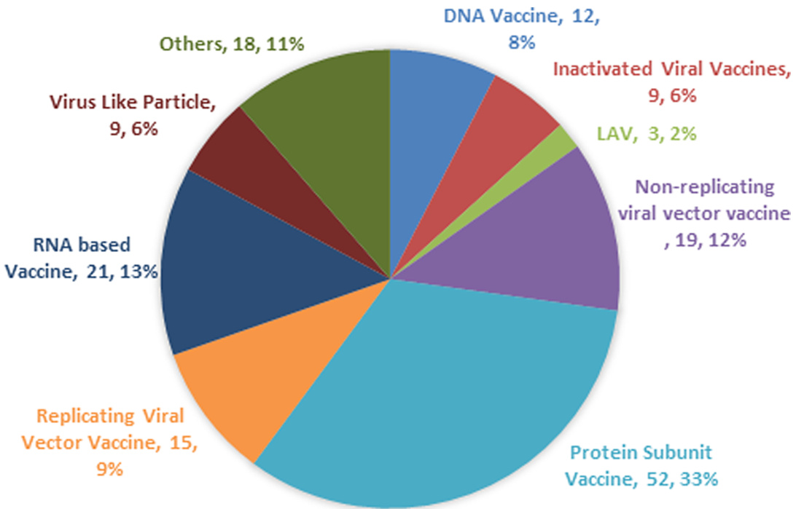

# Review  

# COVID-19 Vaccine: A comprehensive status report  

Simran Preet Kaur, Vandana Gupta \*  

Department of Microbiology, Ram Lal Anand College, University of Delhi, Benito Juarez Road, New Delhi 110021, India  

# A R T I C L E  I N F O  

Keywords:   
Vaccine   
SARS-CoV-2   
COVID-19   
Clinical Trials   
Convalescent Plasma Therapy   
Monoclonal Antibodies  

# A B S T R A C T  

The current COVID-19 pandemic has urged the scientific community internationally to find answers in terms of therapeutics and vaccines to control SARS-CoV-2. Published investigations mostly on SARS-CoV and to some extent on MERS has taught lessons on vaccination strategies to this novel coronavirus. This is attributed to the fact that SARS-CoV-2 uses the same receptor as SARS-CoV on the host cell i.e. human Angiotensin Converting Enzyme 2 (hACE2) and is approximately $79\%$ similar genetically to SARS-CoV. Though the efforts on COVID-19 vaccines started very early, initially in China, as soon as the outbreak of novel coronavirus erupted and then world-over as the disease was declared a pandemic by WHO. But we will not be having an effective COVID-19 vaccine before September, 2020 as per very optimistic estimates. This is because a successful COVID-19 vaccine will require a cautious validation of efficacy and adverse reactivity as the target vaccinee population include high-risk individuals over the age of 60, particularly those with chronic co-morbid conditions, frontline healthcare workers and those involved in essentials industries. Various platforms for vaccine development are available namely: virus vectored vaccines, protein subunit vaccines, genetic vaccines, and monoclonal antibodies for passive immunization which are under evaluations for SARS-CoV-2, with each having discrete benefits and hindrances. The COVID-19 pandemic which probably is the most devastating one in the last 100 years after Spanish flu mandates the speedy evaluation of the multiple approaches for competence to elicit protective im­ munity and safety to curtail unwanted immune-potentiation which plays an important role in the pathogenesis of this virus. This review is aimed at providing an overview of the efforts dedicated to an effective vaccine for this novel coronavirus which has crippled the world in terms of economy, human health and life.  

# 1. Introduction  

The novel beta-coronavirus SARS-CoV-2 is believed to have emerged last year in 2019 in Wuhan from Bats. Crossing the species barrier it entered human beings with furtherance of infection through human to human transmission. The beta-coronaviruses have jumped between the species and have caused three zoonotic outbreaks namely, SARS CoV (2002-03), MERS-CoV (2012), and SARS-CoV-2 (2019- till date) in the last 2 decades. The existence of a myriad of coronaviruses in bats, including many SARS-related CoV (Severe Acute Respiratory Syndrome related Coronaviruses) and the sporadic crossing over of the species barriers of the coronaviruses to humans, suggest that the future occurrences of zoonotic transmission events may sustain (Ou et al., 2020).  

Since its emergence in Nov 2019, it has spread to 188 countries and 25 territories around the globe, despite elaborate efforts by WHO and Governments to contain the infection, primarily owing to the highly infectious nature of this virus (Anon, 2020a; Anon, 2020b). As of 2 July 2020, 10,533,779 cases have been reported globally with 512,842 deaths ((WHO) World Health Organisation, 2020). There has been a monumental increase in the number of infected patients, with a 7-day moving average of 210,209 cases per day, as of 2 July 2020 (Anon, 2020a). SARS-CoV-2, a highly contagious virus, tends to spread by the inhalation of the respiratory aerosols, direct human contact, and via fomites. Social distancing, personal hygiene, frequent hand washing or sanitizing using the alcohol $(61-70\%)$ ) based hand-sanitizers, and disin­ fection of the surfaces are some steps which can protect the individuals from getting infected ((CDC), Centers for Disease Control and Preven­ tion, 2020). ${\mathrm{R}}_{0}$ is an epidemiological scale; used to measure the conta­ giousness of an infectious agent. Its magnitude depends upon various biological, environmental, and socio-behavioral factors. It can be defined as “the average number of secondary cases one would produce in a completely susceptible population in the absence of any deliberate intervention in disease transmission (Delamater et al., 2019).” SARS-CoV-2 has an ${\mathrm{R}}_{0}$ value range of 2-3 (Park, 2020) which is signif­ icantly higher in comparison to Spanish flu for which the ${\mathrm{R}}_{0}$ was recorded at 0.9-2.1 (Pyrek, 2018). According to WHO, people living with non-communicable diseases (co-morbid conditions) are prone to severe illness due to COVID-19 infection. The incubation period of the virus ranges from 2-14 days with a median of 5.1 days (Lauer et al., 2020). The symptoms include fever, dry cough, fatigue, shortness of breath, chills, muscles pain, headache, gastric disturbances and weight loss (CDC, 2020). Some patients may have lymphopenia and bilateral ground-glass opacity changes in the chest CT scans. The histological examinations of the lungs’ biopsy samples have shown a bilaterally diffused alveolar damage with cellular fibromyxoid exudates. A few interstitial mononuclear inflammatory infiltrates were observed both in the liver and the heart specimens (Xu et al., 2020). However, a large population of the infected patients have no or mild symptoms and remain asymptomatic (Shang et al., 2020).  

Structurally coronaviruses are pleomorphic, enveloped viruses with a characteristic fringe of projections composed of S protein on their surface. These viruses are equipped with a positive sense ssRNA genome, which is complexed with the nucleocapsid (N) protein forming helical nucleocapsids. The genome is both capped and polyadenylated (Carter and Saunders, 2007). The genetic analysis of SARS-CoV-2 and SARS-CoV has revealed $79\%$ similarity with a total of 380 amino acid substitutions condensed mainly within the NSP genes. Out of these substitutions, there are 27 amino acid replacements in the immune-dominant S protein while 102 and 61 amino acid substitutions are found in the NSP3 and NSP2. Whereas, NSP7, NSP13, E protein, and some accessory proteins are devoid of any amino acid substitutions (Wu et al., 2020). SARS-CoV and SARS-CoV-2 bind a common host receptor, hACE2, to gain entry into the cell but SARS-CoV-2 binds the receptor with a higher affinity than the SARS-CoV. MERS-CoV uses an entirely different receptor that is, Dipeptidyl Peptidase 4 (DPP4) (Wan et al., 2020) and the virus is distantly related to SARS-CoV-2 with around $50\%$ similarity as per the sequence analysis of the two viruses (Prof Roujian et al., 2020).  

The genome of SARS-CoV-2 is transcribed in at least 10 Open Reading Frames (ORFs). ORF1ab translates into a polyprotein which is processed into 16 non-structural proteins (NSPs) (Yoshimoto, 2020). The NSPs perform various functions like genome replication, inducing the cleavage of host mRNA, membrane rearrangement, generation of the autophagosome, cleavage of the NSP polyprotein, capping, tailing, methylation, unwinding of the RNA duplex, etc. which are essential for the viral life cycle (da Silva et al., 2020). Besides, the SARS-CoV-2 virus contains four structural proteins namely, spike (S), nucleocapsid (N), envelope (E), and membrane (M) proteins which are encoded by the $^{3^{\prime}}$ -end of the viral genome (Wrapp et al., 2020). Amongst the 4 struc­ tural proteins the S glycoprotein, being a large multi-functional trans-­ membrane protein, plays the vital role of viral attachment, fusion, and entry into the host cell (Wrapp et al., 2020). The S protein consists of S1 and S2 subunits, which are further split into different functional do­ mains. The S1 subunit has two functional domains viz. N-terminal Domain (NTD) and Receptor Binding Domain (RBD) and the latter contains conserved receptor binding motif (RBM) (Jiang et al., 2020). The alignment studies have revealed that the region of RBD sequence lies between the residues 331 and 524 of the S protein (Tai et al., 2020). Whereas, the S2 subunit has three operational domains namely, fusion peptide (FP), heptad repeat (HR) 1, and 2. The S1 protein trimer aligns itself at the top of the trimeric S2 stalk to form the immune-dominant S protein (Jiang et al., 2020). Interestingly, a furin cleavage site is observed within the spike protein of SARS-CoV-2 while it is absent in the SARS-CoV which may be a possible explanation of the variation in the pathogenicity of the virus (Walls et al., 2020). A host trans-membrane protease serine 2, (TMPRSS2) is responsible for the initial priming of the spike protein. The virus can utilize both TMPRSS2 and endosomal cysteine proteases cathepsin B and L (CatB/L) to initiate entry into the cell. The TMPRSS2 is responsible for the cleavage of the S protein to expose the FP region of the S2 subunit which is responsible for the initiation of the endosome mediated entry into the host cell. This in­ dicates that TMPRSS2 is a host factor that is essential for viral entry; therefore, the drugs approved for the inhibition of this protease (like camostatmesylate) could be used for therapeutic purposes (Hoffmann and Kleine-Weber, 2020). SARS-CoV-2 uses the human angiotensin-converting enzyme 2 (hACE2) receptor to seize the target cell through the spike glycoprotein (S-Protein), . It has been suggested that the coronaviruses exercise the use of conformational masking and glycan shielding of the spike protein to circumvent the host immune cells. The Cryo-EM structures have revealed the presence of two distinct: closed and open conformations of the S-Protein ectodomain trimer, as a consequence of the opening of the structure at the trimer apex. This conformational diversification is necessary for the receptor binding as the trimer opening exposes the RBM which is present at the interface between the protomers in the closed trimers (Walls, 2020).  

The E protein that forms E channels (called the viroporins), and is involved in a myriad of functions in the viral replication cycle involving assembly, release, pathogenesis, etc. (Gralinski and Menachery, 2020). These reprobate ion channels exist in the form of homo-pentamers with each subunit containing 50-120 amino acids. E channels contain at least one trans-membrane domain (TMD) which facilitates the linkage in host cell membranes. SARS CoVs generally contain three categories of ion channels namely: E, 8a, and 3a. The E and 8a ion channels contain the PDZ (Post Synaptic Density Protein; Disc Large Tumor Suppressor; Zonula Occludens-1 Protein) Domain Binding Motif (PBM) which is responsible for the over-expression of the inflammatory cytokines which may result in the cytokine storm (Pharmaceutical Targeting the Enve­ lope Protein of SARS-CoV-2: the Screening for Inhibitors in Approved Drugs, 2020). From the sequence alignment study of the E protein, it was observed that a negatively charged glutamate residue (E69) in SARS-CoV corresponds to a positively charged arginine residue (R69) in SARS-CoV-2 (Yoshimoto, 2020). However, this mutation is remote from the inhibitor binding site; therefore, E protein can be used as a phar­ maceutical target (Pharmaceutical Targeting the Envelope Protein of SARS-CoV-2: the Screening for Inhibitors in Approved Drugs, 2020).  

M protein, the central organizer of CoV assembly, is most abundantly expressed in the virus particle. It functions crucially in the morpho genesis and assembly of the SARS-CoV-2 by interacting with the essen­ tial structural proteins (Conserved Protein Domain Family: SARS-like-CoV_M, 2020). The binding of the M and N protein stabi­ lizes the N protein and RNA complex, and the internal core of the virus. In case of SARS-CoV, the M protein has also been shown to induce the process of apoptosis in the host cell (Yoshimoto, 2020).  

In addition to stabilizing the ssRNA genome of the virus particle, the N protein is an antagonist of the antiviral RNAi. It is responsible for the inhibition of the cell cycle of the host cell as it can inhibit the entry of the cell into the S-phase (Yoshimoto, 2020).  

Immunotherapy is considered as an effective method for the pro­ phylaxis and treatment of various infectious diseases and cancers, which involves the artificial triggering of the immune system to elicit the im­ mune response (Masihi, 2001). A vaccine that elicits the production of S protein neutralizing antibodies in the vaccinated subjects is the primary aim of all the programs for COVID-19 vaccines. Studies have revealed that there is a limited to no cross-neutralization between the sera of SARS-CoV and SARS-CoV-2, indicating that recovery from one infection may not shield against the other (Ou et al., 2020). Furthermore, a database of approximately 5500 full-length genomes of SARS-CoV-2 isolated from various countries is now available at NCBI which facili­ tates delineating the polymorphisms in S protein and other important proteins of the virus concerning vaccine development. The rationale for writing this review is to gather all the information about the COVID-19 vaccine development programs and give the readers and researchers insight into types of vaccines being worked upon and the current status of the clinical trials of these vaccines for ready reference.  

# 2. Vaccination strategies  

Many efforts have been directed towards the development of the vaccines against COVID-19, to avert the pandemic and most of the developing vaccine candidates have been using the S-protein of SARSCoV-2 (Dhama et al., 2020). As of July 2, 2020, the worldwide SARS-CoV-2 vaccine landscape includes 158 vaccine candidates, out of which 135 are in the preclinical or the exploratory stage of their development. Currently, mRNA-1273 (Moderna), Ad5-nCoV (CanSino Biologicals), INO-4800 (Inovio, Inc.), LV-SMENP-DC, Pathogen-specific aAPC (ShinzenGeno-Immune Medical Institute), and ChAdOx1 (Uni­ versity of Oxford) have entered the phase I/II clinical trials (WHO, 2020). The vaccines which are in the conduit are based upon inactivated or live attenuated viruses, protein sub-unit, virus-like particles (VLP), viral vector (replicating and non- replicating), DNA, RNA, nanoparticles, etc. with each exhibiting unique advantages and hindarances (Table 1) (Ning et al., 2020). COVID-19 vaccine landscape with percentage share of different types of vaccine is represented in Fig. 1. To enhance the immunogenicity, various adjuvant technologies like AS03 (GSK), MF-59 (Novartis), CpG 1018 (Dynavax), etc. are now accessible to the re­ searchers for the vaccine development (Le et al., 2020). The immuno-informatics approach is also used for the epitope identification for the SARS-CoV-2 vaccine candidates. It can be used to identify the significant cytotoxic T cell and B-cell epitopes in the viral proteins (Gupta et al., 2006; Baruah and Bose, 2020).  

# 2.1. Protein Sub-unit vaccine  

A subunit vaccine is the one which is based on the synthetic peptides or recombinant antigenic proteins, which are necessary for invigorating long-lasting protective and/or therapeutic immune response (Ning et al., 2020). The subunit vaccine, however, exhibits low immunogenicity and requires auxiliary support of an adjuvant to potentiate the vaccine-induced immune responses. An adjuvant may enhance the biological half-life of the antigenic material, or it may ameliorate the immunomodulatory cytokine response. The addition of an adjuvant, therefore, helps in overcoming the shortcomings of the protein subunit vaccines (Cao et al., 2018). The S protein of the SARS-CoV-2 is the most suitable antigen to induce the neutralizing antibodies against the path­ ogen. The S Protein consists of two subunits. The S1 subunit has the NTD, RBD, and RBM domains while the S2 subunit comprises of FP, HR 1, &2 (Ou et al., 2020). The virus enters into the cell via endocytosis by utilizing the S-Protein mediated binding to the hACE2 receptor. There­ fore, the S-Protein and its antigenic fragments are the prime targets for the institution of the subunit vaccine (Ning et al., 2020). The S glyco­ protein is a dynamic protein, possessing two conformational states i.e. pre-fusion and post-fusion state. Therefore, the antigen must maintain its surface chemistry and profile of the original pre-fusion spike protein to preserve the epitopes for igniting good quality antibody responses (Graham, 2020). Moreover, means to target the masked RBM as an an­ tigen will enhance the neutralizing antibody response and improve the overall efficacy of the vaccine.  

# 2.1.1. NVX-CoV2373 (Novavax, Inc.| Emergent BioSolutions)  

NVX-CoV2373 is a nano-particle based immunogenic vaccine which is based upon the recombinant expression of the stable pre-fusion, coronavirus S-Protein (Coleman et al., 2020). The protein was stably expressed in the Baculovirus system (Tu et al., 2020). The company plans to use the Matrix-M adjuvant to enhance the immune response against SARS-CoV-2 spike protein by the induction of high levels of neutralizing antibodies. In the animal models, a single immunization resulted in the high level of anti-spike protein antibodies which blocked the hACE2 re­ ceptor binding domain and could elicit SARS-CoV-2 wild type virus-neutralizing antibodies (Novavax covid 19 vaccine trial, 2020).  

Table 1 Outline of the vaccine production platforms for SARS-CoV-2 and their advan­ tages and limitations   

<html><body><table><tr><td>S. no.</td><td>Vaccine Platform</td><td>Advantages</td><td>Limitations</td></tr><tr><td>1</td><td>Live Attenuated Vaccine (LAV) /thewhole virus</td><td>·It has the intrinsic ability tostimulatetheimmune systemby inducing the toll-like receptors (TLRs) namely: TLR 3,TLR 7/8, and TLR 9 of the innate immune system that in- volves B cells, CD4 and CD8 T cells. ·It can be derived from</td><td>·LAV requires an extensive accessory testing to establish safety and efficacy. ·There is a probability of nucleotide substitution during viral replication, resulting in the creation of</td></tr><tr><td>2</td><td>Inactivated VirusVaccine</td><td>strains, reassortants, and reverse genetics. ·Stable and safer as compared to the LAVs. ●It has the pre-existing technology and infra- structure required for its development. ·Has already been tested</td><td>vaccination. ·Require the booster shots to maintain the immunity. ·Furthermore,large amounts of viruses need to be handled and</td></tr><tr><td>3</td><td>Sub-unit Vaccine</td><td>·It canbe used alongwith adjuvants toincrease their immunogenicity. ·Do not have any live component of the viral particle.</td><td>·Induce an immune response. ·Memory for future</td></tr><tr><td>4</td><td>Viral vector- based vaccine</td><td>·Thus,it is safe with fewer side-effects. ·Show a highly specific gene deliveryinto the host cell with a vigorous immune response. ·Avoids handling of any</td><td>responses is doubtful. ·The host may possess immunity against the vector duetoprior exposure,reducing the efficacy.</td></tr><tr><td>5</td><td>DNA Vaccines</td><td>infectious particle and it has been used widely for MERS-CoV with positive results from the trials. ·The synthetic DNA is temperature stable and cold-chain free ·It can be developed at an accelerated pace. ·It does not require the</td><td>·Maylead to cancer due to theintegration of the viral genome into the host genome. Though it elicits both Cytotoxic and humoral immunity, the titers remain low. ·Insertion of foreign DNA into the host</td></tr><tr><td>6</td><td>RNA Vaccines</td><td>·The translation of mRNA occurs in the cytosol of the host cell averting the risk of any sort of integration into the host genome.</td><td>·May induce the antibody production against itself. Safety issues with reactogenicity have been reported for various RNA based vaccines. ·It also shows instability.</td></tr></table></body></html>  

2.1.2. Molecular Clamp Stabilized spike protein vaccine candidate It is being developed by the University of Queensland in collabora­ tion with GSK and Dynavax. The University will have access to vaccine adjuvant platform technology (AS03 Adjuvant system), which is believed to strengthen the vaccine response and minimize the amount of vaccine required per dose (Lee, 2020). The University is developing a stabilized pre-fusion, recombinant viral protein sub-unit vaccine which is based upon the Molecular Clamp technology. This technology has been proved to induce the production of the neutralizing antibodies (Tu et al., 2020)  

  
Fig. 1. Pie Chart showing the different categories of SARS-CoV-2 vaccines under research (Anon, 2020c).  

# 2.1.3. PittCoVacc (University of Pittsburgh)  

It is a Micro-Needle Array (MNA) based recombinant SARS-CoV-2 vaccine which involves the administration of rSARS-CoV-2 S1 and rSARS-CoV-2-S1fRS09 (recombinant immunogens). A substantial in­ crease in the antigen specific antibodies with a statistical significance was observed in the pre-clinical trials at the end of two weeks in the mice models. Furthermore, the immunogenicity of the vaccine was main­ tained even after the sterilization using gamma radiation. The statisti­ cally significant titers of antibodies at the early stages and also before boosting, support the feasibility of the MNA-SARS-CoV-2 vaccine (Kim et al., 2020).  

# 2.1.4. Triple Antigen Vaccine (Premas Biotech, India)  

It is a multi-antigenic VLP vaccine prototype wherein the recombi­ nant spike, membrane, and envelope protein of SARS-CoV-2 have been co-expressed in an engineered Saccharomyces cerevisiae expression platform (D-Crypt™). The proteins then undergo self-assembly as the VLP. The TEM and allied analytical data simultaneously furnished the biophysical characterization of the VLP. This prototype has the potential to enter the pre-clinical trials as a vaccine candidate after further research and development. Furthermore, it is thought to be safe and easy to manufacture on a mass scale, in a cost-effective manner (Arora and Rastogi, 2020).  

# 2.2. Viral Vectored vaccines  

A vaccine based on viral vectors is a promising prophylactic solution against a pathogen. These vaccines are highly specific in delivering the genes to the target cells, highly efficient in the gene transduction, and efficiently induce the immune response, (Ura et al., 2014). They offer a long term and high level of antigenic protein expression and therefore, have a great potential for prophylactic use as these vaccines trigger and prime the cytotoxic T cells (CTL) which ultimately leads to the elimi­ nation of the virus infected cells (Le et al., 2020).  

# 2.2.1. Ad5-nCoV (CanSino Biologics Inc | Beijing Institute of Biotechnology)  

It is a recombinant, replication defective adenovirus type-5 vector (Ad5) expressing the recombinant spike protein of SARS-CoV-2. It was prepared by cloning an optimized full-length gene of the S Protein along with the plasminogen activator signal peptide gene in the Ad5 vector devoid of E1 and E3 genes. The vaccine was constructed using the Admax system from the Microbix Biosystem (Zhu et al., 2020). The phase I clinical trials have established a positive antibody response or seroconversion. A four-fold increase in the RBD and S protein-specific neutralizing antibodies was noted within 14 days of immunization and peaked at day 28, post-vaccination. Furthermore, the $\mathrm{CD}4+\mathrm{T}$ cells and $\mathrm{CD}8+\mathrm{T}$ cells response peaked at day 14 post-vaccination. However, the pre-existing anti-Ad5 immunity partly limited both the antibody and the T cell responses (Zhu et al., 2020). The study will further evaluate antibody response in the recipients who are between the age of 18 and 60, and received one of three study doses, with follow-up taking place at 3- and 6-months post-vaccination (Anon, 2020d).  

# 2.2.2. Coroflu (University of Wisconsin-Madison | FluGen | Bharat Biotech)  

M2SR, a self-limiting version of the influenza virus, which is modi­ fied by insertion of the SARS-CoV-2 gene sequence of the spike protein. Furthermore, the vaccine expresses the hemagglutinin protein of the influenza virus, thereby inducing immune response against both the viruses. The M2SR is self-limiting and does not undergo replication as it lacks the M2 gene. It is able to enter into the cell, thereby inducing the immunity against the virus. It shall be administered intra-nasally, mimicking the natural route of viral infection. This route activates several modes of the immune system and has higher immunogenicity as compared to the intramuscular injections (Anon, 2020e).  

# 2.2.3. LV-SMENP-DC (Shenzhen Geno-Immune Medical Institute)  

The LV-SMENP-DC vaccine is prepared by engineering the dendritic cells (DC) with the lentiviral vector expressing the conserved domains of the SARS-CoV-2 structural proteins and the protease using the SMENP minigenes. The subcutaneous inoculation of the vaccine presents the antigens on antigen presenting cells (APCs), that ultimately activate the Cytotoxic T cells and generate the immune response (Le et al., 2020).  

# 2.2.4. ChAdOx1 (University of Oxford)  

ChAdOx1 recombinant adenovirus vaccine was developed using codon optimized S glycoprotein and synthesized with the tissue plas­ minogen activator (tPA) leader sequence at $^{5}$ end. The sequence of SARS-CoV-2 coding for amino acids (2 to 1273) and the tPA leader and was propagated in the shuttle plasmid. This shuttle plasmid is respon­ sible for encoding the major immediate early genes of the human cytomegalovirus (IE CMV) along with tetracycline operator (TetO) sites and polyadenylation signal from bovine growth hormone (BGH) be­ tween the Gateway® recombination cloning site. The Adenovirus vector genome is constructed in the Bacterial Artificial Chromosome by inserting the SARS-CoV-2 S gene into the E1 locus of ChAdOx1 adeno­ virus genome. The virus was then allowed to reproduce in the $\mathrm{T-Rex}293$ HEK (Human Embryonic Kidney 293) cell lines and purified by the CsCl gradient ultracentrifugation. The absence of any sub-genomic RNA (sgRNA) in the intra-muscularly vaccinated animals from the preclinical trials is indicative of the escalated immunity against the virus (Doremalen et al., 2020). The previous studies have suggested that a single shot should marshal the immune response (Ou et al., 2020). The vaccine has entered phase II clinical trials, where it shall be evaluated in a large sample of the population (Anon, 2020f).  

# 2.3. mRNA Vaccine  

mRNA is an emerging, non-infectious, and a non-integrating plat form with almost no potential risk of insertional mutagenesis. Currently, the non-replicating RNA and the virus derived self-replicating RNAs are being studied. The immunogenicity of the mRNA can be minimized, and alterations can be made to increase the stability of these vaccines. Furthermore, the anti-vector immunity is also avoided as the mRNA is the minimally immunogenic genetic vector, allowing repeated admin­ istration of the vaccine (Cuiling et al., 2020). This platform has empowered the rapid vaccine development program due to its flexibility and ability to mimic the antigen structure and expression as seen in the course of a natural infection (Mulligan and Lyke, 2020).  

# 2.3.1. mRNA-1273 (Moderna TX, Inc)  

It is a vaccine composed of synthetic mRNA encapsulated in Lipid nanoparticle (LNP) which codes for the full-length, pre-fusion stabilized spike protein (S) of SARS-CoV-2. It has the potential to elicit a highly Sprotein specific antiviral response. Furthermore, it is considered to be relatively safe as it is neither made up of the inactivated pathogen nor the sub-units of the live pathogen (Tu et al., 2020). The vaccine has got a fast-track approval from FDA, to conduct the Phase II trials (Anon, $2020g)$ ).The company has released the interim phase I antibody data of eight participants who received various dose levels. The participants of the $25~{\upmu\mathrm{g}}$ dose group gave results comparable to the convalescent sera. Whereas, in participants who received the $100\upmu\mathrm{g}$ dose, the levels of nAb essentially surpassed the levels found in convalescent sera. The vaccine was found to be predominantly safe and well tolerated in the $25~{\upmu\mathrm{g}}$ and $100~{\upmu}g$ dose cohorts, while three participants experienced grade 3 sys­ temic symptoms after the administration of the second dose of $250~{\upmu\mathrm{g}}$ dose levels (Anon, 2020h).  

# 2.3.2. BNT162b1 (BioNTech| FosunPharma| Pfizer)  

BNT162b1 is a codon-optimized mRNA vaccine that encodes for the trimerized SARS-CoV-2 RBD, a critical target of the virus nAb. The vaccine portrays an increased immunogenicity due to the addition of T4 fibritin-derived foldon trimerization domain to the RBD antigen. The mRNA is encapsulated in $80\mathrm{nm}$ ionizable cationic lipid nanoparticles, which ensures its efficient delivery. The Phase 1/2 clinical trials have revealed elevated RBD-specific IgG antibodies levels with a geometric mean concentration to be as high as 8 to 46.3 times titer of convalescent serum. Whereas, the geometric mean titers of the SARS-CoV-2 neutral­ izing antibodies were found to be 1.8 to 2.8 times the convalescent serum panel. Moderate and transient local reactions and systemic events were observed with no adverse effect. However, the data analysis did not evaluate the safety and immune responses beyond 2 weeks following the administration of the second dose (Mulligan and Lyke, 2020).  

# 2.4. DNA Vaccines  

The most revolutionary approach to vaccination is the introduction of the DNA vaccine which encodes for the antigen and an adjuvant which induces the adaptive immune response. The transfected cells express the transgene which provides a steady supply of the transgene specific proteins which is quite similar to the live virus. Furthermore, the antigenic material is endocytosed by the immature Dendritic Cells which ultimately present the antigen to the $\mathrm{CD}4+$ and $\mathrm{CD}8+$ T cells in asso­ ciation with MHC 2 and MHC 1 antigens on the cell surface hence stimulating effective humoral as well as cell-mediated immune re­ sponses (Hobernik and Bros, 2018).  

# 2.4.1. INO-4800 (Inovio Pharmaceuticals)  

It is a prophylactic DNA vaccine against SARS-CoV-2 (Anon, 2020i). It uses codon optimized S protein sequence of SARS-CoV-2 to which an IgE leader sequence is affixed. The SARS-CoV-2 IgE-spike sequence was synthesized and digested using BamHI and XhoI. The digested DNA was incorporated into the expression plasmid pGX0001 under the gover­ nance of IE CMV, and BGH polyadenylation signal. The presence of functional antibodies and T cell response in the preclinical trials suggest that the vaccine can produce an effective immune response within 7 days post-vaccination (Smith et al., 2020). The vaccine has entered the Phase I clinical trials (Phase I: NCT04336410) and it is estimated to complete this phase of clinical trials by July, wherein the participants received $1.0~\mathrm{mg}$ of INO-4800 by electroporation using CELLECTRA $\mathbf{\mathcal{Q}}$ 2000 device per dosing visit. The trial will evaluate the immunological profile, safety, and tolerability of the vaccine candidate upon intrader­ mal injection and the electroporation in healthy human adults (Anon, 2020i).  

# 2.5. Live Attenuated Vaccines  

# 2.5.1. DelNS1-SARS-CoV2-RBD (University of Hong Kong)  

This LAV is influenza-based vaccine strain with a deletion in the NS1 gene. It is re-organized to express the RBD domain of SARS-CoV-2 spike protein on its surface and, is cultivated in the chick embryo and/or Madin Darby Canine Kidney Cells (MDCK) cells. It is potentially more immunogenic than the wild type influenza virus and can be adminis­ tered as a nasal spray (Anon, 2020j).  

# 2.6. Others  

The revelation of the structure and genome of the SARS-CoV-2 has led to the rapid development of various vaccine candidates with potential immunogenicity but also adverse reactogenicities. The task of vaccine development is long and cumbersome which requires evaluation in some long-lasting clinical trials. Various Biotech ventures are using different technologies for the development of their vaccine candidates; British and American Tobacco Company (BAT) recently unfolded the COVID-19 vaccine using their new, and fast-growing tobacco plant technology (Anon, 2020k), while Tianjin University has developed an oral vaccine which has successfully employed Saccharomyces cerevisiae to carry the S protein. The GRAS (Generally Regarded As Safe) status of the yeast pro­ vides high scalability, robustness, and cost-effective production of cosmic dosages required to fight off this pandemic (Zhai et al., 2020). Further­ more, in silico studies, using various databases like VaxiJen, have revealed that the epitope sequences WTAGAAAYY and YDPLQPEL can be employed for the formulation of epitope-based peptide vaccines (Garg et al., 2020).  

# 2.6.1. Self Assembling Vaccine (HaloVax)  

The vaccine uses a heat shock protein (hsp) to activate the immune system. It is composed of a fusion protein sandwiched between an hsp and Avidin. Biotinylated immunogenic peptides are also incorporated to customize the vaccine (Voltron Therapeutics, Inc., 2020) Tables 2 and 3.  

# 3. Passive Immunization/adoptive immunity  

It is the use of preformed antibodies in therapeutics of various dis­ eases. It can be achieved by use of sera from convalescent patients, polyclonal serum raised in other animals such as horse, neutralizing monoclonal antibodies produced by hybridoma technology or human­ ized antibodies.  

# 3.1. Convalescent Plasma therapy  

To date, no distinct treatment has been proven to be efficacious against the COVID-19. Convalescent plasma (CP) therapy has been approved as an empirical treatment during the outbreaks ((WHO), World Health Organisation, 2014). It is considered as the archetypal immunotherapy which has been used for the treatment and prevention of various viral diseases in the past such as SARS, MERS, H1N1 pandemic, measles, mumps, etc. (Kai et al., 2020). A possible explana­ tion for the efficacy of this classic adoptive immunotherapy is that the neutralizing immune-globulins from CP may conquer viremia, block new infection, and accelerate clearance of the infected cells.  

Various studies conducted to evaluate therapeutic potential of CP have convincingly shown that administration of the neutralizing anti­ bodies in the critically ill patients led to the amelioration of the clinical status in all patients without any deaths (Kai et al., 2020; Shen et al., 2020a; Ahn et al., 2020a; Anon, 2020C). The dosage prescribed for the CP therapy has not been standardized yet and needs Randomised Clin­ ical Trials not only to eliminate the effect of other medicines but also to evaluate the efficacy and safety of CP therapy. (Zhang et al., 2020). The patients who were considered critically ill with some of them having co-morbid conditions like hypertension, cardiovascular diseases, cere­ brovascular diseases, chronic renal failure, etc. were included in the study. They were all admitted to the ICUs and were receiving either mechanical ventilation, high-flow nasal cannula oxygenation, or the low-flow nasal cannula oxygenation. All the patients in these studies were receiving antiviral or antibacterial or antifungal drugs for the treatment of co-infections (Kai et al., 2020). Compared to the control group, the CP treatment group showed no notable differences in the baseline characteristics but exhibited a sizable difference in the clinical outcomes (i.e. normalization of the body temperature, absorption of pulmonary lesions, resolution of ARDS, weaning off the mechanical ventilators, etc.), and the death rates. The patients were tested negative for the viral loads after 7-37 days of CP infusion (Shen et al., 2020b). A reduction in the net quantity of inflammatory biomarkers CRP, pro­ calcitonin, and Interleukin 6 (IL-6) in the trial group was observed along with a significant increase in the antibody titers (RBD specific IgM and IgG) post-convalescent plasma therapy (Ahn et al., 2020b). However, these uncontrolled and non-randomized trials for the CP therapy impede the researchers to come to a conclusive statement about the prospective potency of this treatment, and these observations require further eval­ uation which is ongoing in the clinical trials (Yan, 2020).  

# 3.2. Monoclonal Antibody  

The monoclonal antibodies (mAb) or therapeutic antibodies, created in the laboratory are the clones of a unique parent which can bind to a single epitope, that is, they have a monovalent affinity (Gelboin et al., 1999). The use of mAb in the prevention and treatment of infectious diseases can overcome various drawbacks which are cognate with the convalescent plasma therapy in terms of specificity, safety, low risk of blood-borne infection, purity, and other factors. A wide array of monoclonal antibodies have already been developed which are imple­ mented in the anti-tumor, anti-platelet, or antiviral therapy (Breedveld, 2000).  

A SARS-CoV specific human mAb CR3022 has been found to bind with the RBD of the S protein of SARS-CoV-2, stipulating it as a pro­ spective therapeutic agent, which can either be used alone or in com­ bination therapy for the management of COVID-19 (Tian et al., 2020). To achieve higher efficiency of disease prevention and treatment, a combinatorial effect of monoclonal antibodies recognizing different epitopes of the viral surface can be considered for the neutralization of the virus as it may prove to be more effective and prevent the viral escape (Tian et al., 2020).  

There are over 61 patents which claim to have prepared the SARSspecific, MERS-specific, and the diagnostic antibodies. Another group of 38 patents claims to have developed the antibodies that target the host proteins like IL-6/IL-6R, TLR3, CD16, ITAM (immune-receptor tyrosine-based activation motif), DC-SIGN (dendritic cell-specific inter­ cellular adhesion molecule-grabbing non-integrin), ICAM-3 (intercel­ lular adhesion molecule 3), or IP-10/CXCL10 (interferon $\upgamma$ -inducible protein 10). These antibodies can be used to counteract against the cytokine storm that has been reported to harmonize with the SARS-CoV2 infection (Liu et al., 2020). Tocilizumab, an anti-IL 6 receptor antibody is likely to control the hyper-inflammatory pulmonary symptoms which are coupled with the cytokine storm involving the chemokine dysregu­ lation and various interleukins. Tocilizumab has been reported to block the cytokine axis IL6 hence inhibiting the inflammatory cascade. How­ ever, further clinical trials are essential to establish the effectiveness of the mAb (Michot et al., 2020). Israel Institute for Biological Research (IIBR) claims to have successfully developed the mAb against SARS-CoV-2. The institute is in the process of patenting it which may soon be commercialized (Upadhyay, 2020). A group led by Professor Vijay Chaudhary at the University of Delhi, Centre for Innovation in Infectious Disease Research, Education and Training (UDSC-CIIDRET), is isolating the genes encoding the antibodies responsible for the neutralization of the SARS-CoV-2. These genes will be employed to foster the recombinant Ab by exploiting the pre-existing in-house anti­ body library and a library fabricated from the cells of convalescent COVID-19 patients (PIB, Delhi, 2020).  

# 4. Limitations  

The duration of clinical trials poses a sizable amount of hindrance to swift vaccine development. According to the norms laid down by the US Food and Drug Administration (FDA), and WHO, a vaccine candidate has to pass through at least three phases of placebo-controlled clinical trials for the validation of its safety and efficacy, which can take years to complete. Considering the severity of the pandemic, which has forced a complete shut-down of the global economy, speedy vaccine develop­ ment is necessary. Some authors suggest that the controlled human challenge studies may be conducted to suitably divert the Phase 3 testing, and allow the rapid licensure of the immunogenic vaccines. However, in the expanded field study participants will be monitored constantly to look for any long-term implications posed by the vaccine. Furthermore, the safety trials for the special groups including, children and pregnant women, and immuno-compromised patients can be con­ ducted before the extension of the vaccination to these groups (Eyal et al., 2020).  

The testing and development of safe and effective vaccines rely upon laboratory animal models. These animal models must show a similar course of the disease as in human beings. However, the standard inbred strains of mice are not susceptible to the COVID-19 infection, due to the difference between the humans and mice ACE2 receptors (Anon, 2020D). This calls for the development of transgenic mice, expressing the hACE2 receptor. Two animal models (hACE2 transgenic mice model and another, primate Macaques model) were previously developed for the SARS-CoV but the current situation requires steady breeding and distribution of these animal models to meet demands of the researchers around the globe (Mice and Bao, 2020). The SARS-CoV-2 virus isolates can efficiently replicate in the lungs of the Syrian hamsters. The lungs of infected hamsters exhibit the pathological lesions analogous to the COVID-19 patients with pneumonia. Moreover, the nAb response exhibited by the infected hamster demonstrated immunity against the succeeding re-challenge studies. Furthermore, the transfusion of convalescent sera into the naïve hamsters mounted the antibody response and hence hindered the viral replication in the lungs. The assemblage of these experiments have illustrated the Syrian hamster may be a perfect model for comprehending SARS-CoV-2 pathogenesis, and evaluating antiviral drugs, and the immunotherapies (Imai and Iwatsuki-Horimoto, 2020). Nevertheless, the assessment of the vaccine dependent immune enhancement cannot be extrapolated from the animal models and requires a legitimate survey from stage III human trials or the human challenge studies.  

Table 2 Rapidly progressing Anti COVID-19 vaccines. This table contains the information of rapidly developing vaccine candidates only, the list of all vaccine candidates in the   

<html><body><table><tr><td colspan="6">pipeline can be accessed from: https://airtable.com/shrSAi6t5WFwqo3GM/tblEzPQS5fnc0FHYR/viweyymxOAtNvo7yH?blocks=bip</td></tr><tr><td>S. no.</td><td>TypeofVaccine/Platform/RelatedUse/Ref</td><td>Developer</td><td>Clinical Trial Stage</td><td>Remarks</td></tr><tr><td>Viral vectored vaccines 1</td><td>Adenovirus Type 5 Vector/Non-replicating viral vaccine/Ebola/(Anon,2020A)</td><td>CanSino Biological Inc./Beijing Institute of Bio-technology</td><td>Phase 2 ChiCTR2000031781Phase</td><td>"A randomized,double-blind,placebo parallel- controlled phase I/II clinical trials for inactivated</td></tr><tr><td></td><td></td><td></td><td>1 ChiCTR2000030906 NCT:NCT04313127</td><td>NovelCoronavirusPneumoniavaccine(Vero cells)"have established a positive antibody response or the seroconversion alongwith CD4+ and CD8+ T cell response.</td></tr><tr><td>2</td><td>Inactivated viral vaccine/ Inactivated/ -/(Anon, 2020c) Lentiviral based Minigene dendritic cell (DC)</td><td>Wuhan Institute of Biological Products/Sinopharm Shenzhen Geno-Immune Medical</td><td>Phase 1/2: ChiCTR2000031809</td><td>Animal trials suggest that the vaccine protects the model animals withoutAntibody dependent enhancement (ADE). LV-SMENP-DC vaccine is designed by altering DC</td></tr><tr><td></td><td>and T cell vaccine (LV-SMENP-DC)/ - / (Anon, 2020l;Le et al.,2020)</td><td>Institute</td><td></td><td>with lentivirus vectors to express the “SARS-CoV- 2 SMENP minigene and immune modulatory genes". LV-DC that presents SARS-CoV-2 specific antigenswillactivatethe CTLs</td></tr><tr><td></td><td>The COVID-19/aAPCs :Pathogen-specific artificial antigen presenting cells (aAPC)/-/ ( Anon, 2020m)</td><td>Institute</td><td></td><td>Constructed throughmodifications oflentivirus by including immune modulatory genes along with viral minigenes, and antigens are presented on artificial antigen presenting cells (aAPCs).</td></tr><tr><td>5</td><td>ChAdOx1/ Non-replicating viral vector/ MERS, influenza, TB, Chikungunya, Zika, MenB, plague/ (Anon, 2020f; Doremalen et al.,2020)</td><td>University of Oxford/AstraZeneca</td><td>Phase 3:ISRCTN89951424 Phase2b/3: NCT04324606</td><td>A phase I/II single-blinded, randomized, placebo controlled, multi-center study was conducted to determine efficacy, safety, and immunogenicity of this vaccine in UKwithhealthy adult volunteers</td></tr><tr><td></td><td>Inactivated(formaldehydeinactivated+alum)/ SARS/ (Anon, 2020n; An0n,2020o)</td><td>Sinovac</td><td>Phase I/II:NCT04352608</td><td>are ongoing for the 1000 volunteers. Meanwhile taking the vaccine to the higher levels of clinical trials. The double-blind, placebo-controlled phase I trialsshowedthenAbseroconversionratetobe as</td></tr><tr><td></td><td>Adeno-based Gam-COVID-Vac/Non-replicating viral vector/-/(Anon,2020p;Anon,2020q)</td><td>GamaleyaResearchInstitute</td><td>Phase I: NCT04436471</td><td>high as 90% in 143 adults within 14 days of immunization. Two types of the vaccines—fluid based and powder based for infusions— will be tried on two batches of volunteers, 38individuals each.The</td></tr><tr><td></td><td>Ad26(alone or with ModifiedVacciniaVirus Ankara {MVA} boost) Non-replicating viral vaccine/</td><td>Janssen Pharmaceutical Companies/Beth Israel Deaconess</td><td>Pre-Clinical (Phase 1 in September 2020)</td><td>members willbeisolated in twoMoscow medical clinics. To accelerate the development of the vaccine the company will use the AdVac? and PER.C6@ technologies.</td></tr><tr><td></td><td>Ebola, HIV, RSV/ (Johnson & Johnson Announces a Lead Vaccine Candidate for COVID-19,2020;An0n,2020c) Influenza vector expressing RBD: DelNS1-SARS- CoV2-RBD/</td><td></td><td></td><td>"It is attenuated by the deletion of a key virulent element and the immune antagonist, NS1, which</td></tr><tr><td>10</td><td>Replicating viral vector (LAV)/ MERS/ (Anon, 2020j;Anon,2020c) CoroFlu, self-limiting influenza virus (M2SR) Non-replicating Viral Vector/(Anon, 2020e;</td><td>University ofWisconsin-Madison/</td><td></td><td>is potentially more immunogenic than the wild- type influenza virus." The M2SR is self-limiting because it does not undergoviralreplicationbecause of the absence</td></tr><tr><td>11</td><td>Anon, 2020c) Replicatingviral vector/measles vector/ West Nile, CHIKV, Ebola, Lassa, Zika, MERS/</td><td>TheInstitut Pasteur</td><td></td><td>of M2 gene. It will be administered via the nasal route. The proprietary measles vector (MV) technology is chosen to develop the vaccine againstSARS-</td></tr><tr><td></td><td>(Campbell, 2020; Anon, 2020c) OralCOVID-19Vaccine/ Recombinant adenovirus type 5 vector/</td><td></td><td></td><td>CoV-2 which was used in the MV-SARS-CoV vaccine candidate. It will be an oral vaccine that aims to induce the mucosal immune response.</td></tr><tr><td></td><td>CHIKV,LASV,NORV,EBOV,RVF,HBV,VEE/ (Anon, 2020r) DNA vaccines DNA Plasmid Vaccine (INO-4800)/ Lassavirus,</td><td></td><td></td><td>Pre-clinical trials reveal induction of the antigen-</td></tr><tr><td></td><td>Nipah virus, HPV,HIV,Filovirus/ (Anon, 2020i; Anon,2020c)</td><td></td><td></td><td>specific T cell responses, and functional nAb, thus creatinganobstaclefortheSproteintobind to the hACE2 receptor. Phase I clinical trials will evaluate the safety,immunogenicity,and</td></tr><tr><td>2</td><td>Electroporated linear DNA vaccine/ (BROOK, STONY, 2020)</td><td>LineaRx|Takis Biotech</td><td>Pre-Clinical</td><td>tolerabilityof thevaccine. There are 4candidates of linearDNAvaccine based upon S proteins and some selected epitopes.</td></tr><tr><td>3</td><td>Electroporated DNA vaccine/ (Anon, 2020s; Anon, 2020c)</td><td>ZydusCadila</td><td>Pre-Clinical</td><td></td></tr><tr><td>4</td><td>DNA vaccine/ (Anon, 2020c)</td><td>KarolinskaInstitute/Cobra Biologics (OPENCORONA Project)</td><td>Pre-Clinical</td><td>A DNA vaccine,which will be administered via intramuscularinjections.Itwillthenformthe</td></tr></table></body></html>  

<html><body><table><tr><td colspan="7">able2(continued)</td></tr><tr><td>S. no.</td><td>TypeofVaccine/Platform/RelatedUse/Ref</td><td>Developer</td><td>Clinical Trial Stage</td><td></td></tr><tr><td>5</td><td>DNA Vaccine (GX-19)/(Anon,2020c) RNA Vaccines</td><td>Genexine Consortium</td><td>Pre-Clinical</td><td>Expected to soon enter the clinical trialswith Kalbe Farma.</td></tr><tr><td>1</td><td>LNP- Encapsulated mRNA (mRNA-1273)/ Multiple Candidates/ (Anon, 2020c; Anon, 2020g)</td><td>Moderna/NIAID</td><td>Phase 2:NCT04405076 Phase 1 NCT04283461</td><td>In Phase 1 Trials, the seroconversion resulted in the nAblevels eitherclose to orhigher than the convalescent sera. The vaccine was generally safe</td></tr><tr><td>2</td><td>CureVacmRNA/ RABV, LASV, YFV, MERS, InfA, ZIKV, DengV, NIPV/ (Anon,2020t; Anon,2020c)</td><td>CureVac</td><td>Phase 1</td><td>and well tolerated. mRNA as a data carrier to instruct the human body to produce its own proteins capable of fighting a wide range of diseases is used.</td></tr><tr><td>3</td><td>LNP-nCoVsaRNA/RNA/EBOV,LASV, YFV, MERS,InfA,ZIKV,DENV,NIPV/ (Anon, 2020t;</td><td>Imperial College London</td><td>Phase 1:ISRCTN17072692</td><td>It is the purified synthetic mRNA which mimics the virus gene for a spike protein on its surface.</td></tr><tr><td>4</td><td>Anon,2020u) BNT162/ mRNA/(Anon, 2020c; Anon,2020t; Anon, 2020v)</td><td>BioNTech|FosunPharma|Pfizer</td><td>Phase1/2:NCT04380701</td><td>A robust immunogenic response with the geometric mean of nAb titres to be 1.8 and 2.8 times the nAb titres in the convalescent serum</td></tr><tr><td>4</td><td>LNP-encapsulated mRNA cocktail encoding VLP/RNA/(Anon,2020c;Anon,2020t)</td><td>Fudan University/Shanghai JiaoTong University/RNA Cure</td><td>Pre-Clinical</td><td>panel after the administration of the second dose.</td></tr><tr><td>5</td><td>LNP-encapsulated mRNA cocktail encoding RBD/mRNA/(Anon,2020c;Anon,2020t)</td><td>Biopharma Fudan University/Shanghai JiaoTongUniversity/RNA Cure</td><td>Pre-Clinical</td><td></td></tr><tr><td>6</td><td>mRNA onco-vaccine/(Anon, wo)</td><td>Biopharma BIOCAD</td><td>Pre-Clinical</td><td>They work by introducing sequences of molecules designed to make cells produce disease specific</td></tr><tr><td></td><td>ProteinSubunitVaccine VLPRecombinantSub-unit,Full lengthS trimer/</td><td></td><td></td><td>antigens and trigger a regular immune response. It demonstrated high immunogenicity in animal</td></tr><tr><td></td><td>nanoparticle + Matrix M (NVX-CoV2373)/RSV, CCHF,HPV,VZV,EBOV/(WHO,2020;NovavaX covid 19 vaccine trial, 2020;Anon, 2020c; Anon, 2020x)</td><td></td><td></td><td>model with measuring anti spike antibodies, that prevent the attachment of the spike protein to the receptor, as well as wild-type virus neutralizing antibodies.</td></tr><tr><td>2</td><td>Molecular Clamp Stabilized Recombinant spike protein/Subunit/ Nipah, influenza, Ebola, Lassa/ (Anon, 2020c; Anon,2020t)</td><td>University of Queensland|GSK| Dynavax</td><td>Pre-Clinical</td><td>It is a stabilized pre-fusion viral protein sub-unit vaccine which is based upon the Molecular Clamp technology and uses As03 adjuvant system from</td></tr><tr><td>3</td><td>S1 Microneedle array-based (PittCoVacc) Protein Subunit/ MERS/ (Kim et al.,2020) (Anon, 2020c)</td><td>University of Pittsburgh</td><td>Pre-Clinical</td><td>GSK. Micro-needleArray-based delivery of the recombinant SARS-CoV-2 S1 induced a statistically significant antigen-specific antibody response within 2 weeks of administration in the</td></tr><tr><td>4</td><td>Recombinant protein Subunit vaccine/Influenza, SARS-CoV/(Anon, 2020y) (Anon, 2020c) (Anon,</td><td>Sanofi</td><td>Pre-Clinical</td><td>mice models. It is a recombinant vaccine of unrevealed SARS- CoV-2 protein(s) which is expressed in baculovirus vector system.</td></tr><tr><td></td><td>2020t) Protein Sub-unit, gp-96 based/ HIV, malaria, Zika/ (Heat Biologics' COVID-19 Vaccine Program, 2020; Anon, 2020c)</td><td>Heat Biologics</td><td>Program announced in March 2020</td><td>It is a “Heat-shock protein gp96 complexed with an undisclosed SARS-CoV-2 peptide(s)". This technology is capable of generating long-term</td></tr><tr><td></td><td>Virus Like Particle (VLP)vaccine/(Anon,2020z)</td><td>Medigaco</td><td>Pre-Clinical</td><td>immune responses and may confer immunity to different coronaviruses. A recombinantSARS-CoV-2protein (undisclosed) VLP produced in tobacco.</td></tr><tr><td>LiveAttenuatedVaccine</td><td>Deoptimized live attenuated virus/HAV,InfA, ZIKV,FMD,SIV,RSV,DENV/(Anon,2020c; Anon, te)</td><td>Codagenix/Serum Institute of India</td><td>Pre-Clinical</td><td>Codagenix'stechnologyallowsfortherapid generation of multiple vaccine candidates against emergingviruses,startingwith only the digital</td></tr><tr><td>2</td><td>TNX-1800, Live Attenuated Horsepox virus/ smallpox, monkeypox/ (TNX-1800 (Coronavirus</td><td>Tonix Pharmaceuticals</td><td>Pre-IND</td><td>sequence of the viral genome. It is believed that horsepox has the potential to serve as a vector forvaccines to protect against</td></tr><tr><td>3</td><td>Vaccine),2020TNX-1800 (Coronavirus Vaccine),2020) Live attenuated recombinant measles virus (rMV)/ (Anon, 2020s; Anon, cc; Anon, 2020t)</td><td>ZydusCadila</td><td>Pre-Clinical</td><td>other infectious agents. Codon-optimized proteins of the new coronavirus, expressed by rMV,will usereverse genetics to</td></tr><tr><td>Others</td><td>Self-assembling vaccine/ (Voltron Therapeutics,</td><td>HaloVax (Voltron Therapeutics)</td><td></td><td>stimulate long-term neutralizing antibodies that protect against the infection The biotinylated immunogenic fusion protein is</td></tr></table></body></html>

Legend: CCHF: Crimean-Congo Hemorrhagic Fever; CHIKV: Chikungunya Virus; DengV: Dengue Virus; FMD: Foot and Mouth Disease; EBOV: Ebola Virus; HAV: Hepatitis A Virus; HBV: Hepatitis B Virus; HIV: Human Immunodeficiency Virus; HPV: Human Papilloma Virus; Inf: Influenza; LASV: Lassa Fever Virus; MenB: Meningitis B; NIPV: Nipah Virus; NORV: Norovirus; RABV: Rabies Virus; RVF: Rift Valley Fever; SARS: Severe Acute Respiratory Syndrome; SIV: Simian Immuno­ deficiency Virus; TB: Tuberculosis; VEE: Venezuelan Equine; Encephalitis Virus; VZV: Varicella Vaccine (Chickenpox); YFV: Yellow Fever Virus; ZIKV: Zika Virus.  

Table 3 Latest developments in the status of the promising SARS-CoV-2 vaccines   

<html><body><table><tr><td>Vaccine|Ref</td><td>Developer</td><td>Remarks</td><td>Clinical Trial Stage</td></tr><tr><td>ChAdOx1|(Folegatti and Ewer, 2020)</td><td>University of Oxford/ AstraZeneca</td><td>The preliminary reports of phase 1/2, single-blind, randomized controlledtrials of theChAdOx1nCoV-19vaccinehave showcased the spike-specificT-cell responses along with the Anti-spike IgG response in 91% participants as per the micro-neutralization assay (MNA80) while a plaquereduction neutralization assay(PRNT50)depicted a100% response after a single dose.Nevertheless, after the booster dose substantial correlation with the neutralizing antibody titers as measured by ELISA.The volunteers depicted local and systemic reactions which were minimizedbythe administration ofparacetamol.Thus,thevaccine</td><td>Phase 3: ISRCTN89951424</td></tr><tr><td>mRNA-1273|(Jackson et al., 2020)</td><td>Moderna/NIAID</td><td>candidatehasportrayed adequatesafety andimmunogenicityprofilein the phase 1/2 clinical trials. increase in all the participants.Seroconversion was observed after 15 days and the median magnitude of antibody responses was similar to the magnitude in convalescent sera.However, the pseudovirus neutralizing activitywas nothighbeforetheadministrationof theseconddose, whichindicates therequirement of a two-dose vaccination schedule. Furthermore, the serum neutralizing activity, a generally accepted</td><td>Phase3:NCT04470427</td></tr><tr><td>PiCoVacc| (Anon, 2020B)</td><td>Sinovac</td><td>functionalbiomarker of theinvivohumoralresponse against the respiratory viruses,has not been determined as of now. The phase 1/2clinical trials of theinactivatedviralvaccine candidate PiCoVaccdemonstrated thatthevaccineinducesneutralizingantibodies with a seroconversion rate of 90% in a 0,14 day schedule.The preliminary results confirmed the absence of adverse systemic or local events post-vaccination. The phase 2 clinical trials are expected to be concludedby the end of 2020.The Companyhas got the permissionfor conducting the phase 3 clinical trials in Brazil in collaboration with</td><td>Phase 3:NCT04456595</td></tr><tr><td>BBV152(A-C)|(Myupchar,2020)</td><td>BharatBiotech/ICMR/NIV</td><td>Instituto Butantan.Furthermore, it is expected to get further approvals in Bangladeshfor the phase 3 clinical trials. It is thewholevirion inactivated experimentalvaccine under thephase 1/2 clinical trials. These trials are supposed to study the safety and reactogenicity,tolerability,and theimmunogenicityin the healthy volunteers.Theinactivatedvaccine shallbe administered intramuscularlyintwo doses at day0 and day14 and the1125 volunteers shallbe observed for the next six months and will be evaluated for post-vaccination immune responses. The viral strain for the vaccine developmentwas isolated byICMR and transferred to</td><td>Phase 1/2: NCT04471519</td></tr><tr><td>Adenovirus Type5Vector/Non-replicating viral vaccine|(Zhu and Guan, 2020)</td><td>CanSinoBiological Inc./ BeijingInstitute of Bio- technology</td><td>Bharat Biotech where the process of inactivation was executed in a BSL- 3 facility. The randomized, double-blind,placebo controlled phase 2 clinical trials of therecombinantAd5-vectoredvaccinerepresented a positivecellular response at 5 × 1o10 viral particles along with seroconversion of the humoral immuneresponse.Severe adversereactions werereportedin 9% of the individuals in the 1 x 10l1 viral particles dose group and 1%</td><td>Phase 2: ChiCTR2000031781</td></tr><tr><td>BNT162|(An0n, 2020e)</td><td>BioNTech|FosunPharmal Pfizer</td><td>volunteers exhibited these adverse reactions in the 5×1010viral particles dose group. BNT162b1,the mRNA based vaccine induced ahigh,dose-dependent nAb titers alongwith theRBD-bindingIgG concentrations after the second dose. This was accompanied by the CD4+ and CD8+ T cell responses. The administration of the vaccine was accompanied by</td><td>Phase3:NCT04368728</td></tr><tr><td>ZyCoV-D|(CTRI/2020/07/026352,2020; Myupchar, 2020)</td><td>Zydus Cadila</td><td>certain adverse symptoms like fatigue, fever, chills, muscle pains etc. However, the recipients did not showcase any severe symptoms. encoding for the membrane proteins of the virus.The clinical trials to study theimmunogenicity,and safety of the vaccine,will administer three doses at an interval of 28 days in1048 individuals.</td><td>Phase 1/2:CTRI/2020/ 07/026352</td></tr></table></body></html>  

The Antibody dependent enhancement (ADE) is exploited by various viruses like Dengue, HIV, animal coronaviruses, etc. as an alternative method of infecting a variety of host cells. The virus-antibody complex can bind to the Fc receptors, activate the complement system, or induce a conformational change in the glycoprotein of the viral envelope (Yip et al., 2016). This mechanism is observed when the vaccine-induced antibodies are either non-neutralizing or they are present in inade­ quate concentrations. This process triggers the viral entry into the cell due to the intensified binding efficiency of the virus-antibody complexes to FcR bearing cells. The clinical and preclinical trials of SARS-CoV vaccine candidates have demonstrated the aggravation of the disease due to ADE. Vaccine Associated Enhanced Respiratory Disease (VAERD)  

can also be induced by virus-antibody immune complex and $\mathrm{T_{H}}2$ -biased responses (Graham, 2020).  

The viral genome is vulnerable to mutations and can undergo the antigenic shift and the antigenic drift, as it continues to spread from one population to the next. The mutations may vary according to the envi­ ronmental conditions of a geographical area, and the population den­ sity. By screening the 7500 samples of the infected patients, the scientists were able to figure out 198 mutations that may have materi­ alized independently which may indicate the evolution of the virus in­ side the human host. These mutations may lead to different subtypes which may allow the virus to escape the immune system even after the administration of the vaccine (Dorp et al., 2020).  

# 5. Conclusion  

SARS-CoV-2 has been the matter of the moment from the date it was declared as a pandemic, it has led to the termination of economic ac­ tivities universally. Scientists across the continents are joining hands for the innovative tie-ups with both the pharmaceutical giants and the medical start-ups to repurpose drugs, develop vaccines, and devices to impede the progress of this overwhelming pandemic. A large number of COVID-19 vaccine candidates based upon various platforms have already been identified. Despite the undergoing efforts, a definitive answer does not exist. The process of vaccine development is quite laborious with various stages, including the pre-clinical stage, and clinical development which is a three-phase process. However, if suffi­ cient data is already available, it has been recommended to skip a few stages, to accelerate the attainment of a vaccine faster with a quick regulatory review, approval, manufacturing, and quality control. This novel Coronavirus has therefore forced the scientific community to use unconventional approaches to accelerate the process of vaccine devel­ opment. According to WHO: “vaccine must provide a highly favorable benefit-risk contour; with high efficacy, only mild or transient adverse effects and no serious ailments.” The vaccine must be suitable for all ages, pregnant, and lactating women and should provide a rapid onset of protection with a single dose and confer safety for at least up to one year of administration.  

The use of novel technologies for vaccine development requires extensive testing for the safety and efficacy of a vaccine. The scientific community needs to construct various processes and capacities for the largescale manufacturing and administration of the coronavirus vac­ cines. The Coalition for Epidemic Preparedness Innovation (CEPI), an international non-governmental organization, which is funded by the Wellcome Trust, the European Commission, the Bill and Melinda Gates Foundation, and eight countries, is subsidizing the development of a large number of pandemic vaccine candidates around the globe. Mod­ erna and the Vaccine Research Centre are co-developing an mRNA based vaccine candidate, wherein the mRNA is encapsulated in the lipid nanoparticles while Codagenix in collaboration with the Serum Institute of India is currently focused on developing the live attenuated viral vaccine. The pharmaceutical giants like Novavax, Sichuan Clover Bio­ pharmaceuticals, iBio, and the University of Queensland are in the preclinical stage of the recombinant S glycoprotein vaccines. Additional strategies like the viral vector-based vaccines, targeting the S glyco­ protein are being developed by the University of Oxford and CanSino Biologics, and other companies, Inovio and the Applied DNA Sciences are currently developing the DNA based vaccine candidates against the SARS-CoV-2 S Protein. Some of these vaccine candidates are at least months, away from being ready for human use, while others may take longer if at all approved for final use.  

In India alone, six biotech ventures i.e. Serum Institute of India, ZydusCadila, Biological E, Indian Immunologicals, Bharat Biotech, and Mynvax are working in collaboration with various international vaccine developers. They are working on DNA vaccines, live attenuated re­ combinant measles vaccines, inactivated viral vaccines, subunit vac­ cines, and the vaccines developed by codon-optimization (Coronavirus,  

2020). Furthermore, the academic institutes like National Institute of Immunology (NII), Indian Institute of Science (IISc), International Center for Genetic Engineering and Biotechnology (ICGEB) New Delhi, Translational Health Science and Technology Institute (THSTI), etc. are attempting to develop the vaccines, and therapies, and the SARS-CoV-2 animal models to restrain the pandemic shortly (Nandi, 2020).  

The need of the hour is to develop a safe and effective COVID-19 vaccine which can induce an appropriate immune response to termi­ nate this pandemic. It is the universal priority to spot the international funding mechanisms to support the development, manufacturing, and stockpiling of the coronavirus vaccines. This pandemic should serve as the guidepost to the international research community to not only acknowledge the outbreak but also indurate the following coronavirus crossing into mammals. A pan-coronavirus vaccine is urgently needed as the delay of vaccine rollout even by one week will accompany millions of deaths. Furthermore, it appears to be a scientifically feasible task if sufficient resources are made available in due time.  

# Funding Information  

This work received no specific grant from any funding agency.  

# Declaration of Competing Interest  

The author(s) declare that there are no conflicts of interest.  

# References  

Ahn, J.Y., Sohn, Y., Lee, S.H., Cho, Y., Hyun, J.H., Baek, Y.J., Jeong, S.J., Kim, J.H., Ku, N.S., Yeom, J.S., Roh, J., Ahn, M.Y., Chin, B.S., Kim, Y.S., Lee, H., Yong, D., Kim, H.O., Kim, S., Choi, J.Y., 2020a. Use of Convalescent Plasma Therapy in Two COVID-19 Patients with Acute Respiratory Distress Syndrome in Korea. J Korean Med Sci 35 (14, April). https://doi.org/10.3346/jkms.2020.35.e149.   
Ahn, J.Y., Sohn, Y., Lee, S.H., et al., 2020b. Use of convalescent plasma therapy in two covid-19 patients with acute respiratory distress syndrome in Korea. J Korean Med Sci. https://doi.org/10.3346/jkms.2020.35.e149.   
Anon, 2020a. Countries where COVID-19 has spread www.worldometers.info. [Online] July 30, 2020. [Cited: July 31, 2020.]https://www.worldometers.info/coronavirus/ countries-where-coronavirus-has-spread/.   
Anon, 2020b. Coronavirus Resource Center https://coronavirus.jhu.edu/. [Online] Johns Hopkins University. [Cited: August 05, 2020.] https://coronavirus.jhu.edu/map. html.   
Anon, 2020c. COVID-19 Treatment and Vaccine Tracker. https://airtable.com/. [Online] Milken Institute. https://airtable.com/shrSAi6t5WFwqo3GM/tblEzPQS5fnc0FHYR/ viweyymxOAtNvo7yH?blocks=bipZFzhJ7wHPv7x9z.   
Anon, 2020d. A randomized, double-blind, placebo parallel-controlled phase I/II clinical trial for inactivated Novel Coronavirus Pneumonia vaccine (Vero cells) Registration no.: ChiCTR2000031809. http://www.chictr.org.cn. [Online]. http://www.chictr. org.cn/showprojen.aspx?proj=52227.   
Anon, 2020e. UW–Madison, FluGen, Bharat Biotech to develop CoroFlu, a coronavirus vaccine. https://www.businesswire.com. [Online] April 02. https://www.busin esswire.com/news/home/20200402005666/en/UW%E2%80%93Madison-FluGenBharat-Biotech-develop-CoroFlu-coronavirus.   
Anon, 2020f. A Study of a Candidate COVID-19 Vaccine (COV001). https://clinicaltrials. gov. [Online]. [Cited: June 8, 2020.]. https://clinicaltrials.gov/ct2/show/NCT04 324606?term=vaccine&cond=covid-19&draw=2.   
Anon, 2020g. Safety and Immunogenicity Study of 2019-nCoV Vaccine (mRNA-1273) for Prophylaxis of SARS-CoV-2 Infection (COVID-19). https://clinicaltrials.gov/. [Online]. https://clinicaltrials.gov/ct2/show/NCT04283461?term=vacci ne&cond=covid-19&draw $\bf\tilde{\rho}=2$ .   
Anon, 2020h. Moderna Announces Positive Interim Phase 1 Data for its mRNA Vaccine (mRNA-1273) Against Novel Coronavirus. https://investors.modernatx.com/. [Online] Moderna, Inc., May 18, 2020. [Cited: June 15, 2020.] https://investors. modernatx.com/news-releases/news-release-details/moderna-announces-positiveinterim-phase-1-data-its-mrna-vaccine.   
Anon, 2020i. Safety, Tolerability and Immunogenicity of INO-4800 for COVID-19 in Healthy Volunteers. https://clinicaltrials.gov/. [Online] 2020. 1. https://clinicaltrial s.gov/ct2/show/NCT04336410?term=inovio&cond=covid-19&draw=2&rank=1.   
Anon, 2020j. HKU joins global partnership to develop COVID-19 vaccine. https:// fightcovid19.hku.hk/. [Online], March 18, 2020. The University of Hong Kong. https ://fightcovid19.hku.hk/hku-state-key-laboratory-for-emerging-infectious-diseases -joins-global-effort-to-develop-covid-19-vaccine/.   
Anon, 2020k. (BAT), British and American Tobacco Company. Potential COVID-19 vaccine – BAT in the news. https://www.bat.com/. [Online] 2020. [Cited: June 1, 2020.]. https://www.bat.com/group/sites/UK__9D9KCY.nsf/vwPagesWebLive /DOBNHBWR.   
Anon, 2020l. Immunity and Safety of Covid-19 Synthetic Minigene Vaccine. https:// clinicaltrials.gov. [Online]. https://clinicaltrials.gov/ct2/show/NCT04276896.   
Anon, 2020m. Safety and Immunity of Covid-19 aAPC Vaccine. https://clinicaltrials. gov/. [Online]. https://clinicaltrials.gov/ct2/show/NCT04299724.   
Anon, 2020n. Sinovac gets regulatory approval to assess Covid-19 vaccine.. https:// www.clinicaltrialsarena.com. [Online] April 15. https://www.clinicaltrialsarena. com/news/sinovac-covid-19-vaccine-trial-approval/.   
Anon, 2020o. Sinovac reports positive data from Phase I/II trials of CoronaVac.. https:// www.clinicaltrialsarena.com/. [Online] June 15, 2020. [Cited: June 20, 2020.]. https://www.clinicaltrialsarena.com/news/sinovac-coronavac-data/.   
Anon, 2020p. An Open Study of the Safety, Tolerability and Immunogenicity of the Drug "Gam-COVID-Vac" Vaccine Against COVID-19. https://clinicaltrials.gov/. [Online] June 22, 2020. [Cited: June 22, 2020.]. NCT04436471. https://clinicaltrials.gov/ ct2/show/NCT04436471?term=vaccine&cond=covid-19&draw=4.   
Anon, 2020q. An Open Study of the Safety, Tolerability and Immunogenicity of "GamCOVID-Vac Lyo" Vaccine Against COVID-19. https://clinicaltrials.gov/. [Online] June 22, 2020. [Cited: June 22, 2020.]. NCT04437875. https://clinicaltrials.gov/c t2/show/NCT04437875.   
Anon, 2020r. Vaxart Announces Positive Pre-Clinical Data for its Oral COVID-19 Vaccine Program. https://investors.vaxart.com/. [Online] Vaxart Inc., April 21, https:// investors.vaxart.com/news-releases/news-release-details/vaxart-announcespositive-pre-clinical-data-its-oral-covid-19.   
Anon, 2020s. Zydus Cadila looks to expedite Covid-19 vaccine development. https:// www.pharmaceutical-technology.com. [Online] 17 February,. https://www.pharma ceutical-technology.com/news/zydus-cadila-covid-19-vaccine/.   
Anon, 2020t. Draft landscape of COVID-19 candidate vaccines. https://www.who.int/. [Online] June 22, 2020. [Cited: June 23, 2020.]. https://www.who.int/publicatio ns/m/item/draft-landscape-of-covid-19-candidate-vaccines.   
Anon, 2020u. Clinical trial to assess the safety of a coronavirus vaccine in healthy men and women. http://www.isrctn.com/ [Online] June 17, 2020. [Cited: June 22, 2020.]. ISRCTN17072692. http://www.isrctn.com/ISRCTN17072692.   
Anon, 2020v. A Trial Investigating the Safety and Effects of Four BNT162 Vaccines Against COVID-2019 in Healthy Adults. https://clinicaltrials.gov/. [Online] May 8. https://clinicaltrials.gov/ct2/show/NCT04380701.   
Anon, 2020w. BIOCAD started working on mRNA vaccine against coronavirus. https:// biocadglobal.com/. [Online], March 19. BIOCAD Biotechnology Company. https ://biocadglobal.com/index.php?posts&post=45.   
Anon, 2020x. Evaluation of the Safety and Immunogenicity of a SARS-CoV-2 rS (COVID19) Nanoparticle Vaccine With/Without Matrix-M Adjuvant. https://clinicaltrials. gov/. [Online] May 27, 2020. [Cited: June 15, 2020.]. https://clinicaltrials.go v/ct2/show/record/NCT04368988.   
Anon, 2020y. Sanofi joins forces with U.S. Department of Health and Human Services to advance a novel coronavirus vaccine. http://www.news.sanofi.us/. [Online] Sanofi U.S., February 18, 2020. http://www.news.sanofi.us/2020-02-18-Sanofi-joinsforces-with-U-S-Department-of-Health-and-Human-Services-to-advance-a-novel-c oronavirus-vaccine.   
Anon, 2020z. COVID-19 Vaccine Development Program. https://www.medicago.com/. [Online]. Medigaco Inc.. https://www.medicago.com/en/covid-19-programs/   
A randomized, double-blind, placebo parallel-controlled phase I/II clinical trial for inactivated Novel Coronavirus Pneumonia vaccine (Vero cells), 2020 http://www. chictr.org.cn. [Online]. http://www.chictr.org.cn/showprojen.aspx?proj=52227.   
Anon, 2020B. Sinovac COVID-19 Vaccine Collaboration with Butantan Receives Approval from Brazilian Regulator for Phase III Trial. http://www.sinovac.com/. [Online]July 06, 2020. [Cited: August 01, 2020.]. Sinovac Biotech Limited. http ://www.sinovac.com/?optionid=754&auto_id=907.   
Anon, 2020C. Treatment With Convalescent Plasma for Critically Ill Patients With Severe Acute Respiratory Syndrome Coronavirus 2 Infection. Chest (March). https://doi. org/10.1016/j.chest.2020.03.039.   
Anon, 2020D. COVID-19 / SARS-CoV-2. http://www.animalresearch.info/. [Online] April 30, 2020. [Cited: June 11, 2020.]. http://www.animalresearch.info/en/me dical-advances/diseases-research/sars-cov-2/.   
Arora, Kajal, Rastogi, Ruchir, et al., 2020. Multi-Antigenic Virus-like Particle of SARS CoV-2 produced in Saccharomyces cerevisiae as a vaccine candidate. Gurugram : s.n. bioRxiv (May 19). https://doi.org/10.1101/2020.05.18.099234.   
Baruah, V., Bose, S., 2020. Immunoinformatics-aided identification of T cell and B cell epitopes in the surface glycoprotein of 2019-nCoV. J Med Virol. 495–500. https:// doi.org/10.1002/jmv.25698.   
Breedveld, F.C., 2000. Therapeutic monoclonal antibodies. The Lancet 735–740. https:// doi.org/10.1016/S0140-6736(00)01034-5. PMID 10703815.   
BROOK, STONY, 2020. Applied DNA Sciences Subsidiary, LineaRx, and Takis Biotech Collaborate for Development of a Linear DNA Vaccine Candidate Against Wuhan Coronavirus 2019-nCoV. https://adnas.com/. [Online] Applied DNA Sciences, February 07. https://adnas.com/coronoavirus-applied-dna-linearx-takis-biotech -vaccine/.   
Campbell, Molly, 2020. Current Efforts in COVID-19 Vaccine Development. https:// www.technologynetworks.com/. [Online] Technology Networks, March 23. https ://www.technologynetworks.com/biopharma/articles/current-efforts-in-covid-19- vaccine-development-332429.   
Cao, Y., Zhu, X., Hossen, M.N., et al., 2018. Augmentation of vaccine-induced humoral and cellular immunity by a physical radiofrequency adjuvant. Nat Commun.   
Carter, John, Saunders, Venitia, 2007. Virology: Principles and Applications. Wiley, Hoboken, New Jersey, p. 382. ISBN: (Paperback) 9780470023877.   
(CDC), Centers for Disease Control and Prevention, 2020. How COVID-19 Spreads. CDC [Online] 2020. [Cited: June 1, 2020.] https://www.cdc.gov/coronavirus/2019- ncov/prevent-getting-sick/how-covid-spreads.html?CDC_AA_refVal=https%3A%2F %2Fwww.cdc.gov%2Fcoronavirus%2F2019-ncov%2Fprepare%2Ftransmission. html.   
CDC, 2020. Coronavirus Disease 2019 (COVID-19)- Symptoms of Covid-19. Centres for Disease Control and Prevention [Online]. https://www.cdc.gov/coronavirus /2019-ncov/symptoms-testing/symptoms.html.   
Coleman, Christopher M., Liu, Ye V., Mu, Haiyan, Taylor, Justin K., Massare, Michael, Flyer, David C., Glenn, Gregory M., Smith, Gale E., Frieman, Matthew B., 2020. Purified coronavirus spike protein nanoparticles induce coronavirus neutralizing antibodies in mice. Vaccine 3169–3174. https://doi.org/10.1016/j. vaccine.2014.04.016.   
Conserved Protein Domain Family: SARS-like-CoV_M, 2020. NCBI [Online]. [Cited: June 1, 2020.]. https://www.ncbi.nlm.nih.gov/Structure/cdd/cd21569.   
Coronavirus, 2020. Around 30 Indian attempts at COVID-19 vaccine, says Principal Scientific Adviser. [Online] The Hindu, May 11, 2020. [Cited: June 11, 2020.] thehindu.com/sci-tech/health/coronavirus-around-30-indian-attempts-at-covid-19- vaccine-says-principal-scientific-adviser/article31560932.ece. https://www.theh indu.com/.   
CTRI/2020/07/026352. 2020 http://ctri.nic.in/. [Online] July 31, 2020. [Cited: August 01, 2020.] http://ctri.nic.in/Clinicaltrials/showallp.php? mid1 $=$ 45306&EncHid=&userName=Zydus.   
Cuiling, Zhang, Giulietta, Maruggi, Hu, Shan, Junwei, Li, 2020. Advances in mRNA Vaccines for Infectious Diseases. Frontiers in Immunology 594. DOI=10.3389/ fimmu.2019.00594.   
da Silva, S., da Silva, C., Mendes, R., Pena, L., 2020. Role of Nonstructural Proteins in the Pathogenesis of SARS-CoV-2. Journal of medical virology. https://doi.org/10.1002/ jmv.25858, 10.1002/jmv.25858 p.   
Delamater, P.L., Street, E.J., Leslie, T.F., Yang, Y., Jacobsen, K.H., 2019. Complexity of the Basic Reproduction Number (R0). s.l. : Emerging Infectious Diseases 25. https:// doi.org/10.3201/eid2501.171901.   
Dhama, K., Sharun, K., Tiwari, R., Dadar, M., Malik, Y.S., Singh, K.P., Chaicumpa, W., 2020. COVID-19, an emerging coronavirus infection: advances and prospects in designing and developing vaccines, immunotherapeutics, and therapeutics. Hum Vaccin Immunother. https://doi.org/10.1080/21645515.2020.1735227.   
Doremalen, Neeltje van, Lambe, Teresa, Spencer, Alexandra, BelijRammerstorfer, Sandra, Purushotham, Jyothi N., Port, Julia R., Avanzato, Victoria, Bushmaker, Trenton, Flaxman, Amy, Ulaszewska, Marta, Feldmann, Friederike, Allen, Elizabeth R., Sharpe, Hannah, 2020. Jonathan ChAdOx1 nCoV-19 vaccination prevents SARS-CoV-2 pneumonia in rhesus macaques. s.l. : bioRxiv. https://doi.org/ 10.1101/2020.05.13.093195.   
Dorp, Lucy van, Acman, Mislav, Richard, Damien, Shaw, Liam P., Ford, Charlotte E., Ormond, Louise, Owen, Christopher J., Pang, Juanita, Tan, Cedric C.S., Boshier, Florencia A.T., Ortiz, Arturo Torres, Balloux, François, 2020. Emergence of genomic diversity and recurrent mutations in SARS-CoV-2. s.l. $:$ Infection, Genetics and Evolution 104351. https://doi.org/10.1016/j.meegid.2020.104351.   
Eyal, N., Lipsitch, M., Smith, P.G., 2020. Human Challenge Studies to Accelerate Coronavirus Vaccine Licensure. s.l. : The Journal of infectious diseases 1752–1756. https://doi.org/10.1093/infdis/jiaa152.   
Folegatti, Pedro M, Ewer, Katie J, et al., 2020. Safety and immunogenicity of the ChAdOx1 nCoV-19 vaccine against SARS-CoV-2: a preliminary report of a phase 1/2, single-blind, randomised controlled trial. The Lancet (July).   
Garg, P., Srivastava, N., Srivastava, P., 2020. An Integrated In-Silico Approach to Develop Epitope-Based Peptide Vaccine against SARS-CoV-2. s.l. : Preprints, 2020050401. https://doi.org/10.20944/preprints202005.0401.v1).   
Gelboin, Harry V, et al., 1999. Inhibitory monoclonal antibodies to human cytochrome P450 enzymes: a new avenue for drug discovery. Trends in Pharmacological Sciences. 432–438. https://doi.org/10.1016/S01.   
Gralinski, L.E., Menachery, V.D., 2020. Return of the Coronavirus: 2019-nCoV. Viruses 135.   
Graham, B.S., 2020. Rapid COVID-19 vaccine development. Science (May 29), 945–946.   
Gupta, V., Tabiin, T.M., Sun, K., Chandrashekaran, A., Anwar, A., Yang, K., Chikhlikar, P., Salmon, J., Brusic, V., Marques, E.T.A., Kellathur, S.N., August, T.J., 2006. SARS coronavirus nucleocapsid immunodominant T-cell epitope cluster is common to both exogenous recombinant and endogenous DNA-encoded immunogens. Virology 347 (1), 127–139 (impact factor: 2.657).   
Heat Biologics’ COVID-19 Vaccine Program, 2020. Heat Biologics. https://www.heatbio. com/. [Online]. https://www.heatbio.com/product-pipeline/covid-19-vaccine.   
Hobernik, D., Bros, M., 2018. DNA Vaccines-How Far From Clinical Use? Int J Mol Sci. 3605. https://doi.org/10.3390/ijms19113605. PMID: 30445702; PMCID: PMC6274812.   
Hoffmann, Markus, Kleine-Weber, Hannah, et al., 2020. SARS-CoV-2 Cell Entry Depends on ACE2 and TMPRSS2 and Is Blocked by a Clinically Proven Protease Inhibitor. Cell 271–280. https://doi.org/10.1016/j.cell.2020.02.052.   
Imai, Masaki, Iwatsuki-Horimoto, Kiyoko, et al., 2020. Syrian hamsters as a small animal model for SARS-CoV-2 infection and countermeasure development. Proceedings of the National Academy of Sciences (May), 16587–16595.   
Jackson, Lisa A., Anderson, Evan, J., et al., 2020. An mRNA Vaccine against SARS-CoV-2 — Preliminary Report. N Engl J Med. (July).   
Jiang, S., Du, L., Shi, Z., 2020. An emerging coronavirus causing pneumonia outbreak in Wuhan, China: calling for developing therapeutic and prophylactic strategies. Emerging microbes & infections 275–277. https://doi.org/10.1080/ 22221751.2020.1.   
Johnson & Johnson Announces a Lead Vaccine Candidate for COVID-19, 2020. Landmark New Partnership with U.S. Department of Health & Human Services; and Commitment to Supply One Billion Vaccines Worldwide for Emergency Pandemic Use. https://www.prnewswire.com/. [Online]. https://www.prnewswire.com/ne   
S.P. Kaur and V. Gupta dmark-new-partnership-with-us-department-of-health–human-services-and-comm itment-to-supply-one-billion-vaccines-worldwide-for-emergency-pandemic-.   
Kai, Duan, Liu, Bende, Li, Cesheng, Zhang, Huajun, Yu, Ting, Qu, Jieming, Zhou, Min, Chen, Li, Meng, Shengli, Hu, Yong, Peng, Cheng, Yuan, Mingchao, Huang, Jinyan, Wang, Zejun, Yu, Jianhong, Gao, Xiaoxiao, Wang, Dan, Yu, Xiaoqi, Li, Li., Zhang, Jiayou, Wu, Xiao, Li, Bei, Yanpin, 2020. Effectiveness of convalescent plasma therapy in severe COVID-19 patients. Proceedings of the National Academy of Sciences (April). https://doi.org/10.1073/pnas.2004168117.   
Kim, E., et al., 2020. Microneedle array delivered recombinant coronavirus vaccines: Immunogenicity and rapid translational development. EBioMedicine. https://doi. org/10.1016/j.ebiom.2020.102743.   
Lauer, S.A., Grantz, K.H., Bi, Q., et al., 2020. The Incubation Period of Coronavirus Disease 2019 (COVID-19) From Publicly Reported Confirmed Cases: Estimation and Application. Ann Intern Med. 577–582. Tollefsen, Stig, Saville, Melanie, Mayhew, Stephen, 2020. The COVID-19 vaccine development landscape. Nature Reviews Drug Discovery 19 (5), 305–306.   
Lee, Jaimy, 2020. These 23 companies are working on coronavirus treatments or vaccines — here’s where things stand. Market watch [Online] May 6, 2020. [Cited: June 1, 2020.]. https://www.marketwatch.com/story/these-nine-companies-are-wo rking-on-coronavirus-treatments-or-vaccines-heres-where-things-stand-2020-03-06.   
Liu, Cynthia, Zhou, Qiongqiong, Li, Yingzhu, Garner, Linda V., Watkins, Steve P., Carter, Linda J., Smoot, Jeffrey, Gregg, Anne C., Daniels, Angela D., Jervey, Susan, Albaiu, Dana, 2020. Research and Development on Therapeutic Agents and Vaccines for COVID-19 and Related Human Coronavirus Diseases. ACS Central Science 315–331. https://doi.org/10.1021/acscentsci.0c00272.   
Masihi, K Noel., 2001. Fighting infection using immunomodulatory agents. Expert Opinion on Biological Therapy 641–653. https://doi.org/10.1517/ 14712598.1.4.641.   
Mice, L., Bao, et al., 2020. The Pathogenicity of 2019 Novel Coronavirus in hACE2 Transgenic. s.l. : bioRxiv. https://doi.org/10.1101/2020.02.07.939389 preprint.   
Michot, Jean-Marie, Albiges, Laurence, Chaput, Nathalie, Saada, Veronique, Fanny, 2020. Tocilizumab, an anti-IL6 receptor antibody, to treat Covid-19-related respiratory failure: a case report. Annals of Oncology. https://doi.org/10.1016/j. annonc.2020.03.300.   
Mulligan, Mark J., Lyke, Kirsten E., et al., 2020. Phase 1/2 Study to Describe the Safety and Immunogenicity of a COVID-19 RNA Vaccine Candidate (BNT162b1) in Adults 18 to 55 Years of Age: Interim Report; preprint. s.l. : medRxiv, 06.30.20142570, 2020, medRxiv.   
Myupchar, 2020. Race for COVID-19 vaccine: Covaxin and ZyCoV-D begin human trials in India, Moderna publishes preliminary data from phase 1. https://www.firstpost. com/. [Online] July 15, 2020. [Cited: August 01, 2020.]. https://www.firstpost. com/health/race-for-covid-19-vaccine-covaxin-and-zycov-d-begin-human-trials-in-i ndia-moderna-publishes-preliminary-data-from-phase-1-8600211.html/amp.   
Nandi, Jayashree, 2020. Top Indian scientists join global fight against coronavirus. https://www.hindustantimes.com. [Online] Hindustan Times, New Delhi, March 30, 2020. [Cited: June 9, 2020.]. https://www.hindustantimes.com/india-news/top-i ndian-scientists-join-global-fight-against-virus/story-CKRGfycsjBJD2ypLcbJPHM. html.   
Ning, Wang, Jian, Shang, Shibo, Jiang, Lanying, Du, 2020. Subunit Vaccines Against Emerging Pathogenic Human Coronaviruses. Frontiers in Microbiology. https://doi. org/10.3389/fmicb.2020.00298.   
Novavax covid 19 vaccine trial, 2020. Clinical Trials Arena [Online]. https://www.clinic altrialsarena.com/news/novavax-covid-19-vaccine-trial/.   
Ou, X., Liu, Y., Lei, X., et al., 2020. Characterization of spike glycoprotein of SARS-CoV-2 on virus entry and its immune cross-reactivity with SARS-CoV. Nat Commun 1620, 11. https://doi.org/10.1038/s41467-020-15562-9.   
Park, Su Eun, 2020. Epidemiology, virology, and clinical features of severe acute respiratory syndrome -coronavirus-2 (SARS-CoV-2; Coronavirus Disease-19). Clin Exp Pediatr 119–124. https://doi.org/10.3345/cep.2020.00493.   
Pharmaceutical Targeting the Envelope Protein of SARS-CoV-2: the Screening for Inhibitors in Approved Drugs, 2020. Chernyshev, Anatoly. XR Pharmaceuticals Ltd., Cambridge, New Zealand.   
PIB, Delhi, 2020. DBT/ Anti-COVID consortium- Efforts underway to produce therapeutic antibodies against COVID-19: Isolating genes encoding antibodies for neutralising the SARS-CoV-2, COVID-19. https://pib.gov.in/. [Online] April 12, 2020. [Cited: June 07, 2020.] https://pib.gov.in/PressReleaseIframePage.aspx?PRID $\vDash$ 1613531.   
Prof Roujian, Lu, Zhao, Xiang, Li, Juan, Niu, Peihua, Bo, Yang, Honglong, Wu, et al., 2020. Genomic characterisation and epidemiology of 2019 novel coronavirus: implications for virus origins and receptor binding. The Lancet 565–574. https://doi. org/10.1016/S0140-6736(20)30251-8.   
Pyrek, Kelly M., 2018. 100 Years after the Spanish Flu: Lessons Learned and Challenges for the Future [Online] October 11, 2018. https://www.infectioncontroltoday.com/ public-health/100-years-after-spanish-flu-lessons-learned-and-challenges-future. htt ps://www.infectioncontroltoday.com/.   
Shang, W., Yang, Y., Rao, Y., et al., 2020. The outbreak of SARS-CoV-2 pneumonia calls for viral vaccines. NPJ Vaccines. https://doi.org/10.1038/s41541-020-0170-0.   
Shen, Chenguang, et al., 2020a. Treatment of 5 Critically Ill Patients With COVID-19 With Convalescent Plasma. JAMA 323 (16), 1582–1589. https://doi.org/10.1001/ jama.2020.4783.   
Shen, C., Wang, Z., Zhao, F., et al., 2020b. Treatment of 5 Critically Ill Patients With COVID-19 With Convalescent Plasma. JAMA 323 (16), 1582–1589. https://doi.org/ 10.1001/jama.2020.4783, 2020.   
Smith, T.R.F., Patel, A., Ramos, S., et al., 2020. Immunogenicity of a DNA vaccine candidate for COVID-19. 2601. s.l. : Nat Commun 11. https://doi.org/10.1038/ s41467-020-16505-0. (RBD) of 2019 novel coronavirus: implication for development of RBD protein as a viral attachment inhibitor and vaccine. Cell Mol Immunol. https://doi.org/10.1038/ s41.   
TNX-1800 (Coronavirus Vaccine), 2020. Online] Tonix Pharmaceuticals. https://www. tonixpharma.com. https://www.tonixpharma.com/pipeline/tnx-1800-coronavirusvaccine.   
Tian, X., Li, C., Huang, A., Xia, S., Lu, S., Shi, Z., Lu, L., Jiang, S., Yang, Z., Wu, Y., Ying, T., 2020. Potent binding of 2019 novel coronavirus spike protein by a SARS coronavirus-specific. Emerg Microbes Infect 382–385. https://doi.org/10.1080/ 22221751.2020.1729069.   
Tu, Y.-F., Chien, C.-S., Yarmishyn, A.A., Lin, Y.-Y., Luo, Y.-H., Lin, Y.-Y., Lai, W.-Y., Yang, D.-M., Chou, S.-J., Yang, Y.-P., Wang, M.-L., Chiou, S.-H., 2020. A Review of SARS-CoV-2 and the Ongoing Clinical Trials. International Journal of Molecular Sciences 2657.   
Upadhyay, Lipi, 2020. Italy claims to have developed the first COVID-19 vaccine: Here is what we know about all the potential coronavirus vaccines.. https://timesofindia. indiatimes.com/. [Online] May 8, 2020. [Cited: May 31, 2020.]. https://timesofindi a.indiatimes.com/life-style/health-fitness/health-news/italy-claims-to-develop-fir st-covid-19-vaccine-here-is-the-current-status-of-all-the-potential-coronavirus-vacci nes/photostory/75575319.cms.   
Ura, T., Okuda, K., Shimada, M., 2014. Developments in Viral Vector-Based Vaccines. Vaccines (Basel) 624–641. https://doi.org/10.3390/vaccines2030624. PMID: 26344749; PMCID: PMC4494222.   
Voltron Therapeutics, Inc, 2020. Enters into Sponsored Research Agreement with The Vaccine & Immunotherapy Center at the Massachusetts General Hospital to Develop Potential COVID-19 Vaccine. https://www.prnewswire.com/. [Online] April 02, 2020. https://www.prnewswire.com/news-releases/voltron-therapeutics-inc-entersinto-sponsored-research-agreement-with-the-vaccine–immunotherapy-center-atthe-massachusetts-general-hospital-to-develop-potential-covid-19-vaccine301034225.html.   
Walls, A.C., Park, Y.-J., Tortorici, M.A., Wall, A., McGuire, A.T., Vessler, D., 2020. Structure, function, and antigenicity of the SARS-CoV-2 spike glycoprotein. Cell 281–292.   
Walls, 2020. Structure, Function, and Antigenicity of the SARSCoV-2 Spike Glycoprotein. Cell 281–292.   
Wan, Y., Shang, J., Graham, R., Baric, R.S., Li, F., 2020. Receptor recognition by novel coronavirus from Wuhan: an analysis based on decade-long structural studies of SARS. J Virol. https://doi.org/10.1128/JVI.00127-20.   
(WHO), World Health Organisation, 2014. Use of convalescent whole blood or plasma collected from patients recovered from Ebola virus disease. s.l. : World Health Organisation. September.   
(WHO) World Health Organisation, 2020. Coronavirus disease (Covid-19) Situation Report- 164. s.l.: World Health Organisation.   
WHO, 2020. Draft landscape of COVID-19 candidate vaccines. s.l. $\stackrel{*}{,}$ World Health Organisation.   
Wrapp, Daniel, Wang, Nianshuang, Corbett, Kizzmekia S., Goldsmith, Jory A., Hsieh, Ching-Lin, Abiona, Olubukola, Graham, Barney S., Jason, S., 2020. Mclellan Cryo-EM structure of the 2019-nCoV spike in the prefusion conformation. Science (13 March), 1260–1263.   
Wu, A., Peng, Y., Huang, B., Ding, X., Wang, X., Niu, P., et al., 2020. Commentary genome composition and divergence of the novel coronavirus (2019-nCoV) originating in China. Cell Host Microbe 325–328. https://doi.org/10.1016/j. chom.2020.02.001.   
Xu, Z., Shi, L., Wang, Y., Zhang, J., Huang, L., Zhang, C., et al., 2020. Pathological findings of COVID-19 associated with acute respiratory distress syndrome. Lancet Respir Med.   
Yan, Xuebing. 2020 http://www.chictr.org.cn/showprojen.aspx?proj=49544. http:// www.chictr.org.cn. [Online] February 2020. Peiris, J.S.M., Jaume, M., 2016. Hong Kong Antibody-dependent enhancement of SARS coronavirus infection and its role in the pathogenesis of SARS: s.n. Hong Kong medical journal Xianggang yi xue za zhi / Hong Kong Academy of Medicine 25–31.   
Yoshimoto, F.K., 2020. The Proteins of Severe Acute Respiratory Syndrome Coronavirus2 (SARS CoV-2 or n-COV19), the Cause of COVID-19. The protein journal 198–216. https://doi.org/10.1007/s10930-020-09901-4.   
Zhai, P., Ding, Y., Wu, X., Long, J., Zhong, Y., Li, Y., 2020. The epidemiology, diagnosis and treatment of COVID-19. International Journal of Antimicrobial Agents. https:// doi.org/10.1016/j.ijantimicag.2020.105955.   
Zhang, B., Liu, S., Tan, T., et al., 2020. Treatment with convalescent plasma for critically ill patients with SARS-CoV-2 infection. Chest 2020, 30571–30577.   
Zhu, Feng-Cai, Li, Yu-Hua, Guan, Xu-Hua, Hou, Li-Hua, Wang, Wen-Juan, Li, Jing-Xin, Wu, Shi-Po, Wang, Bu-Sen, Wang, Zhao, Wang, Lei, Jia, Si-Yue, Jiang, Hu-Dachuan, Wang, Ling, Jiang, Tao, Hu, Yi, Gou, Jin-Bo, Xu, Sha-Bei, Xu, Jun-Jie, Wang, XueWen, Wang, Wei, Chen, Wei, 2020. Safety, tolerability, and immunogenicity of a recombinan tadenovirus type-5 vectored COVID-19 vaccine: a dose-escalation, openlabel, non-randomised, first-in-human trial. The Lancet. https://doi.org/10.1016/ S0140-6736(20)31208-3.   
Zhu, Feng-Cai, Guan, Xu-Hua, et al., 2020. Immunogenicity and safety of a recombinant adenovirus type-5-vectored COVID-19 vaccine in healthy adults aged 18 years or older: a randomised, double-blind, placebo-controlled, phase 2 trial. The Lancet (July).  