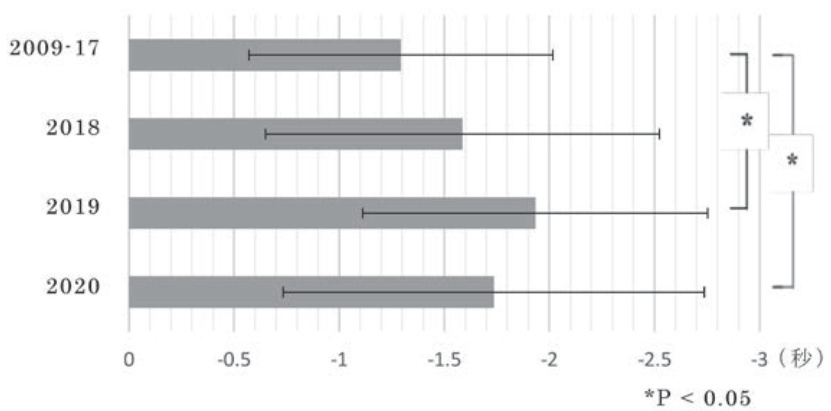
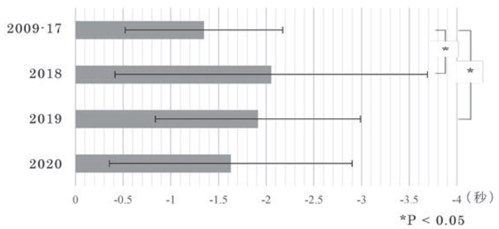
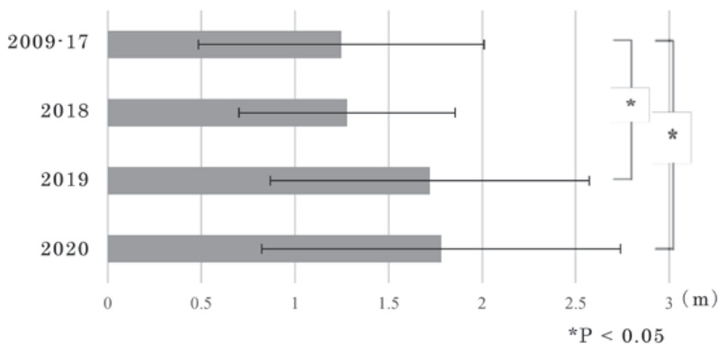

# 新型コロナウイルス感染症（COVID-19）による行動制限が幼児期の基礎運動能力に及ぼす影響  

Effect of activity restriction due to novel coronavirus infection （COVID-19） on fundamental motor ability in early childhood  

中村　容一・長堂　益丈・上地　勝 Yoichi Nakamura, Masutomo Nagado, Masaru Ueji  

# はじめに  

森（2010））、幼の基蓮動能力の推移全国調查の中、1980年代半1990年代半ばにかけては有意な低下がみられ、2002年と2008年には低下した水準から上昇することなく推移報告。の後、森（2017）²）、2016年全国調查、5歳前半から6歳前半の間で、往復走の記録が2008年の記録を有意に上回っていることを明らかにした。  

しかしながら、2019年に始まった新型コロナウイルス感染症（COVID-19）の拡大により、わが国では2020年の4月より緊急事態宣言が発出され、外出自粛が強く求められるようになり、幼児の保育園や幼稚園への通園が制限され、屋内外における運動遊びの機会の減少、運動会の自粛（中止）、さらには公園や運動施設の閉鎖・休業等、運動の機会は著しく減少した。そのため緊急事態宣言発出以前に比べ、幼児期の運動量減少による体力低下が懸念されている。  

本研究では、幼児期の体力水準が新型コロナの影響を受けたか否かを明らかにするため、新型コロナが流行する以前の年少児から年中児、年中児から年長児までの基礎運動能力の変化と、新型コロナによる行動制限がかかった期間の年少児から年中児、年中児から年長児までの基礎運動能力の変化を比較した。また、基礎運動能力の変化がいかなる要因により生じたかについて検討することとした。  

# 方　法  

対象者　I県内の幼稚園（子ども園）に通う幼児237名（年少児から年長児まで）を対象とした。幼児の総数は2009年度入園から2021年度入園までとし、その内訳は、6歳児：男児20名・女児30名（年長児）、5歳児：男児37名・女児41名（年長児）、4歳児：男児38名・女児34名（年中児）、3歳児：男児21名・女児16名（年少児）である。事前に倫理委員会の承認を得た上で、保育所の園長ならびに職員会で承認を受け、保護者へ説明を実施し、同意を得た上で測定および検査を実施した。  

測定項目　基礎運動能力のうち3項目（ $\textcircled{1}25\textmu$ 走 $\textcircled{2}$ 立ち幅跳び $\textcircled{3}$ ソフトボール投げ）を測定した。  

分析方法　2009年から2019年までの測定結果を「新型コロナの影響なし（新型コロナ無）」、2020年から2021年の測定結果を「新型コロナの影響あり（新型コロナ有）」として比較した。すべての測定結果は、平均値と標準偏差で示した。新型コロナの影響の有無からみた各年代における基礎運動能力の比較については対応のないt検定をおこなった。また、入園年度および年代間における基礎運動能力の変化および差については、一元配置の分散分析をおこない、群間で差が認められた場合には、多重比較検定（Tukey 法）を用いた。有意水準はすべて $5\%$ 未満（ $\mathrm{\Delta\mathrm{P}<0.05\mathrm{\Delta\cdot}}$ ）とした。  

# 結　果  

新型コロナの有無からみた基礎運動能力の値については、年少女児の立ち幅跳 $\mho^{\th}\mathinner{\mathcal{O}}$ み有意な差（表1）がみられたが、年中児および年長児では、男児、女児共新型コロナの有無において差はみられなかった。  

入園年度間における比較では、年少児で基礎運動能力の3項目の値において有意な差がみられた。年中児においては、女児の25m 走および立ち幅跳びで差がみられたが、男児では差がみられなかった。年長児においては、基礎運動能力3項目すべてにおいて新型コロナの有無で差はみられなかった（表2，表3，表4）。  

入園年度間における差の比較では、男児の年少児から年中児にかけての25m走で、新型コロナの影響を受けた入園年（2019年および2020年）のほうが影響を受けていない入園年（2009−2017年）に比べ、大きな能力の向上が認められた（図1）。男児の年中児から年長児の間では、3項目において入園年度間に有意な差はみられなかった。  

女児では、年少児から年中児にかけての25m 走で、新型コロナの影響を受けた入園年（2019年）のほうが影響を受けていない入園年（2009−2017年）に比べ、大きな能力の向上が認められた（図2）。また、ソフトボール投げにおいても新型コロナの影響を受けた入園年（2019年およ $7\ddot{\Gamma}2020$ 年）のほうが影響を受けていない入園年（2009−2017年）に比べ、大きな能力の向上が認められた（図3）。一方で、男児同様女児においても年中児から年長児の間では、3項目において入園年度間に有意な差はみられなかった。  

表1　コロナの影響の有無からみた基礎運動能力の比較（年少児）  

<html><body><table><tr><td>男见</td><td>口十無 (n = 357)</td><td>口十有 (n =81)</td><td>P值</td></tr><tr><td>25m走 (秒)</td><td>8.3 ± 1.2</td><td>8.8 ± 2.2</td><td>0. 054</td></tr><tr><td>立幅跳(cm)</td><td>73.8 ± 17.0</td><td>68.7 ± 23.3</td><td>0. 067</td></tr><tr><td>卜一投(m)</td><td>3.2 ± 1.2</td><td>3.0 ± 1.0</td><td>0.064</td></tr></table></body></html>  

<html><body><table><tr><td>女见</td><td>口十無 (n = 250)</td><td>口十有 (n = 69)</td><td>P值</td></tr><tr><td>25m走 (秒)</td><td>8.6 ± 1.4</td><td>8.5 ± 1.5</td><td>0. 455</td></tr><tr><td>立幅跳(cm)</td><td>67.4 ± 15.5</td><td>61.8 ± 19.2</td><td>0.028</td></tr><tr><td>卜一投(m)</td><td>2.5± 0.8</td><td>2.6 ± 0.8</td><td>0.532</td></tr></table></body></html>

20092019年の測定結果口無』  

表2　入園年度間における比較（年少児）  

<html><body><table><tr><td rowspan="2">男见</td><td colspan="5">入園年度</td><td rowspan="2">P值</td><td rowspan="2">多重比较</td></tr><tr><td>2021 (n = 41)</td><td>2020 (n = 40)</td><td>2019 (n = 31)</td><td>2018 (n = 37)</td><td>2009-17 (n = 289)</td></tr><tr><td>25m走（秒）</td><td>8.7 ± 1.7</td><td>8.8 ± 2.6</td><td>8.9 ± 1.3</td><td>8.6 ± 1.5</td><td>8.2 ± 1.1</td><td>0.003</td><td>2009-2017>2019,2020</td></tr><tr><td>立幅跳（cm）</td><td>65.3 ± 26.2</td><td>72.3 ± 19.5</td><td>70.2 ± 17.9</td><td>75.3 ± 19.1</td><td>74.0 ± 16.6</td><td>0.052</td><td>2009-2017>2021</td></tr><tr><td>投（m）</td><td>3.1 ± 0.9</td><td>2.9 ± 1.1</td><td>2.5 ± 1.1</td><td>3.2± 1.2</td><td>3.3 ± 1.1</td><td><0.001</td><td>2009-2017.2018>2019</td></tr><tr><td colspan="8"></td></tr><tr><td rowspan="2">女见</td><td>2021</td><td>2020</td><td>入園年度 2019</td><td>2018</td><td>2009-17</td><td rowspan="2">P值</td><td rowspan="2">多重比较</td></tr><tr><td>(n = 37) 8.4 ± 1.1</td><td>(n = 32) 8.7 ± 1.9</td><td>(n = 40) 8.7 ± 1.3</td><td>(n = 27) 9.3 ± 2.0</td><td>(n = 183) 8.5 ± 1.3</td></tr><tr><td>25m走（秒） 立幅跳（cm）</td><td>62.2 ± 16.5</td><td>61.4 ± 22.2</td><td>61.7 ± 15.6</td><td>61.4 ± 16.2</td><td>69.6 ± 14.9</td><td>0.074 0.001</td><td>2009-2017>2019</td></tr><tr><td>投（</td><td>2.9 ± 0.8</td><td>2.2 ± 0.7</td><td>2.0 ± 0.8</td><td>2.4 ± 0.5</td><td>2.6 ± 0.8</td><td><0.001</td><td>2009-2017,2021>2019,</td></tr></table></body></html>  

表3　入園年度間における比較（年中児）  

<html><body><table><tr><td rowspan="3">男见</td><td colspan="4">入園年度</td><td rowspan="3">P值</td><td rowspan="3">多重比较</td></tr><tr><td>2020 (n = 40)</td><td>2019 (n = 63)</td><td>2018 (n = 75)</td><td>2009-17 (n = 317)</td></tr><tr><td>25m走(秒)</td><td>7.1 ± 1.8</td><td>6.9 ± 0.8</td><td>7.0 ± 0.7</td><td>6.9 ± 0.7</td><td>0.533</td><td></td></tr><tr><td>立幅跳（cm)</td><td>96.9 ± 20.3</td><td>99.7 ± 14.8</td><td>99.1 ± 17.5</td><td>98.8 ± 16.5</td><td>0.867</td><td></td></tr><tr><td>投(m)</td><td>5.1 ± 2.0</td><td>5.0 ± 1.6</td><td>4.6 ± 1.5</td><td>4.9 ± 1.5</td><td>0.377</td><td></td></tr><tr><td rowspan="3"></td><td colspan="5">入園年度</td><td rowspan="3"></td></tr><tr><td>2020 (n =32)</td><td>2019 (n = 89)</td><td>2018 (n = 55)</td><td>2009-17 (n =203)</td></tr><tr><td>7.0 ± 0.8</td><td>6.8 ± 0.8</td><td>7.2 ±0.7</td><td>7.2 ± 0.8</td><td>0.001</td><td>2009-2017,</td></tr><tr><td>25m走 (秒) 立幅跳（cm）</td><td>88.1 ± 18.9</td><td>92.3 ± 10.2</td><td>85.9 ± 16.3</td><td>91.4 ± 14.3</td><td>0.032</td><td>2018>2019 2018>2019</td></tr><tr><td>投（m)</td><td>4.0 ± 0.9</td><td>3.7 ± 0.9</td><td>3.7 ± 0.7</td><td>3.8 ± 0.9</td><td>0.439</td><td></td></tr></table></body></html>  

表4　入園年度間における比較（年長児）  

<html><body><table><tr><td rowspan="2">男见</td><td colspan="3">入圍年度</td><td rowspan="2">P值</td><td rowspan="2">多重比较</td></tr><tr><td>2019 (n = 32)</td><td>2018 (n = 38)</td><td>2009-17 (n = 317)</td></tr><tr><td>25m走 (秒)</td><td>5.9 ± 0.5</td><td>6.0 ± 0.5</td><td>6.0 ± 0.5</td><td>0.563</td><td></td></tr><tr><td>立幅跳（cm)</td><td>120.3 ± 12.5</td><td>121.4 ± ：14.9</td><td>118.5 ± 15.2</td><td>0.448</td><td></td></tr><tr><td>投(m)</td><td>7.3 ± 2.2</td><td>6.6 ± ：2.1</td><td>7.2 ± 2.1</td><td>0.293</td><td></td></tr><tr><td colspan="6"></td></tr><tr><td rowspan="2">女见</td><td colspan="3">入園年度</td><td rowspan="2">P值</td><td rowspan="2">多重比较</td></tr><tr><td>2019 (n = 49)</td><td>2018 (n = 28)</td><td>2009-17 (n = 204)</td></tr><tr><td>25m走 (秒)</td><td>6.1 ± 0.4</td><td>6.1 ± 0.6</td><td>6.2 ± 0.5</td><td>0.161</td><td></td></tr><tr><td>立幅跳（cm)</td><td>113.0 ± 11.0</td><td>109.8 ± 14.8</td><td>111.3 ± 13.2</td><td>0.552</td><td></td></tr><tr><td>投(m)</td><td>5.6 ± 1.1</td><td>5.4 ± 1.2</td><td>5.3 ± 1.2</td><td>0.520</td><td></td></tr></table></body></html>  

新型コロナウイルス感染症（COVID-19）による行動制限が幼児期の基礎運動能力に及ぼす影響  

  
1人圜年度間差の比较 年少－年中(男) $25\mathrm{m}$ 走）  

  
2人圜年度間差の比较 年少－年中(女） $25\mathrm{m}$ 走）  

  
3人園年度間差の比较年少－年中(女）（ $\gamma>\vdash$ ボール投げ）  

# 考　察  

本研究では、幼児を対象に、新型コロナが流行する以前の年少児から年中児、年中児から年長児までの基礎運動能力の変化と、新型コロナによる行動制限がかかった期間の年少児から年中児、年中児から年長児までの基礎運動能力の変化を比較し、その変化はいかなる要因が考えられるかについて検討した。  

新型コロナの影響の有無からみた基礎運動能力の変化については、年少女児の立ち幅跳びを除き、有意な変化はみられなかった。入園年度間における比較では、年少児で基礎運動能力の値において有意な差がみられたが、年中児においては、女児の25m 走および立ち幅跳びを除き有意な差はみられなかった。また、年長児においては、基礎運動能力3項目すべてにおいて有無で差はみられなかった。入園年度間における差の比較では、年少児の男児（25m 走）、年少児の女児（25m 走およびソフトボール投げ）において、新型コロナの影響を受けたほうが新型コロナの影響を受けていない群よりも有意に高い結果となった。  

わが国において新型コロナの影響が出始めたのは、2020年4月7日付で発出された緊急事態宣言以降とされている 。日常生活においては、外出自粛が強く求められるようになり、幼児の保育園や幼稚園への通園が制限され、屋内外における運動遊びの機会の減少、運動会の自粛、さらには公園や運動施設の閉鎖・休業等、運動の機会は著しく減少した。このことから、運動量の減少に拍車がかかることを危惧し、今後の対策の基礎資料となり得る幼児の運動や生活に対する実態調査がおこなわれている。質問紙を中心とした先行研究によると、緊急事態宣言下における自粛要請期間中においては、外遊びによる身体活動量が減少することで、幼児の体力低下が懸念される報告がなさ）。、保者の蓮動对意識低下念、新型の影響受けた中での体力の維持・向上をねらいとした運動遊びの在り方はいかにあるべきか、についても報  

筆者、2009年幼の基蓮動能力の測定定期的施果報告）新型の影響体の低下念2019年、2020年、幼指導）基づいた感染予防対策を講じながら基礎運動能力の測定を継続してきた。本研究では、新型コロナ$\oslash$ 影響を受けた幼児の基礎運動能力は、2019年以前に比べ低下している、との仮説に基づいて検証したが、年少児、年中児、年長児を通して明確な差異は認められなかった。その理由として、 $_2\supset$ の要因が考えられる。 $1\textless{}$ 目は、幼児の自然成長における基礎運動能力の維持もしくは向上である。生活の変化に伴う幼児 $\oslash$ 基礎運動能力 $\frown{\mathcal{O}})$ 影響について調査した堺 の報告では、新型コロナにおける自粛が幼児の基礎運動能力へ影響を与えるとは限らず、成長に伴い向上していくとしている。、松本10 $\nmid$ 新型コロナの流行直前（2019年）と流行後（2020年）の基礎運動能力を比較しているが、明らかな差異は認められず、自然成長に伴う変化に留まっていたと報告している。これらの報告から、幼児の自然成長において、身体活動量の増減に限らず基礎運動能力は維持もしくは向上していく過程にあると推察される。 $_2\supset$ 目は、保護者や保育者の運動に対する意識の変化である。  

新型コロナウイルス感染症（COVID-19）による行動制限が幼児期の基礎運動能力に及ぼす影響緊急事態宣言発出以降、外出が自粛されることにより、幼児の外遊びは大きく制限された。このことは保護者や保育者の意識の変化に現れている。福原ら は、新型コロナの影響による幼児の家庭生活と保護者の受けとめ方について報告しているが、それによると「外出機会の減少」「メディア視聴増加の心配」「公園閉鎖による外遊びの減少」「コロナ不安と家庭での過ごし方」「在宅のストレスとその解消」等が懸念事項として挙がっている。しかしながら、その一方で「園でしていた活動を家でもしている」「新型コロナの影響なく活動している」といった運動量を確保しようとする回答 $\nmid$ 得られている。前述の松本らも、質問紙調査により、室内遊び時間が外遊び時間を上回ったものの、運動量の確保ができるよう保護者や保育者の意識の変化がみられたことが、基礎運動能力の維持にの考察  

以上のことから、本研究において、新型コロナの影響を受けた幼児の基礎運動能力が影響を受けていない幼児と比較しても、明確な差異が認められず同等の水準を維持した背景には、幼児の自然成長による維持・向上、保護者や保育者の幼児に対する運動への意識の変化が要因である可能性は考えられる。しかしながら、これらが基礎運動能力に変化をもたらさなかった要因であることを結論づけることはできない。基礎運動能力の値の変化のみでは純粋に新型コロナの影響が計れていない可能性が高いため、基礎運動能力の測定は継続しつつ、幼児の運動や遊びに対する取り組み姿勢や保護者や保育者の考え方・価値観等が反映された質問紙調査を併せて実施し、その因果関係を詳細に分析していくことが必要である。  

# 引用文献  

1）森司朗·杉原隆·吉田伊津美·筒井清次郎·鈴木康弘·中本浩·近藤充夫.（2010).2008年度の全国調查幼の運動能力.体の科学，60,56-66  
2）森司朗·吉田伊津美·筒井清次郎·鈴木康弘·中本浩·杉原隆.（2017).最近の幼兒の蓮動能力－2016年全国調查办－．日本体育学会大会予稿集，68，121bunya/0000121431_00106.html〉（2023年8月4日9時00分）  
4）鈴木瑛貴·遠藤隆志·谷珠江·馬場彩果·植草一世.（2022)．口幼の日常生活健康与之影響.植草学園短期大学紀要，23，87-95.  
5）矢野氏鄉．（2022).幼期の健康生活熊研宪－新型口感染症对影響調查－.近大学教育，34，65-76.  
6）中昌弘.（2022).子の蓮動保者对查の果.桃山学院教育大学研究要，4，46-63.  
7）中村容一·長堂益丈·上地勝·寺尾友宏·高橘·羽生美穗.（2019).幼の運動器のの基研究－健果の連性－.短期大学集，15,107-116.  
8）日本幼见体育学会前橘明著.（2021).幼见体育指導力个下4－新型口十感染症（COVID-19）对応いま、私たちにできること−．大学教育出版  
9）秋彦.（2023.生活の变化伴幼の蓮動能力の影響の考察：新型感染症生活の变化視点当.楼の聖母短期大学要，47，59-67.  
10）松本希·田智行·黑田慎太郎·森村和浩·田雅史.(2022).新型口感染症の流行幼の生活習惯体力及寸影響.就实教育寒践研究，15，135-145  
11）福原史子·蜂谷里香·本純子.（2022)．口幼の家庭生活保者の受方．／儿么清心女子大学要，67,87-97.  