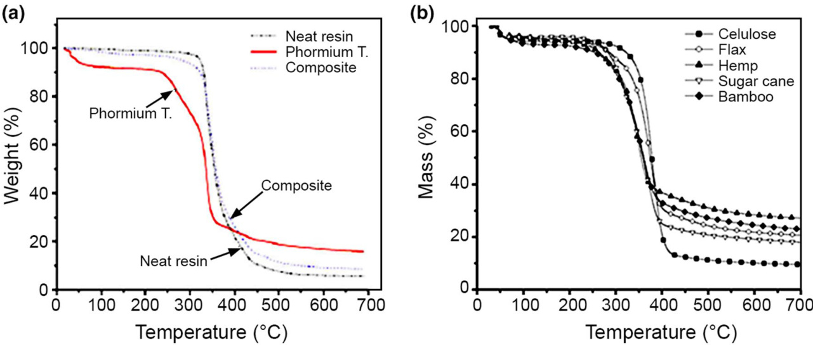
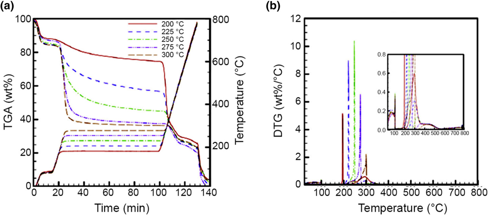
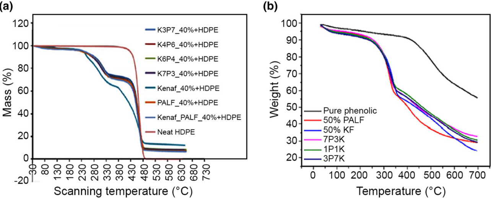
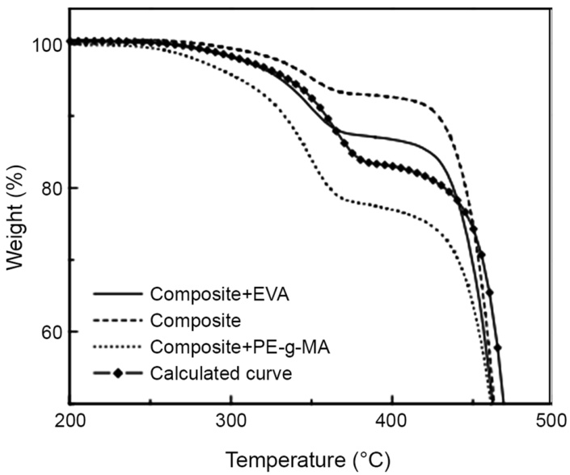
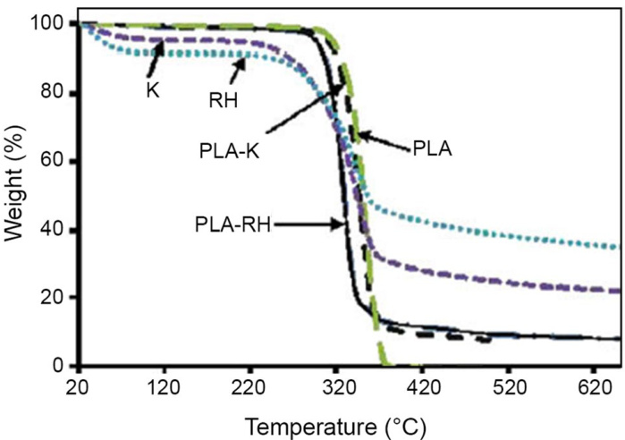
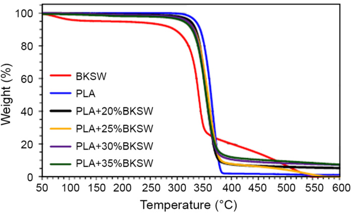
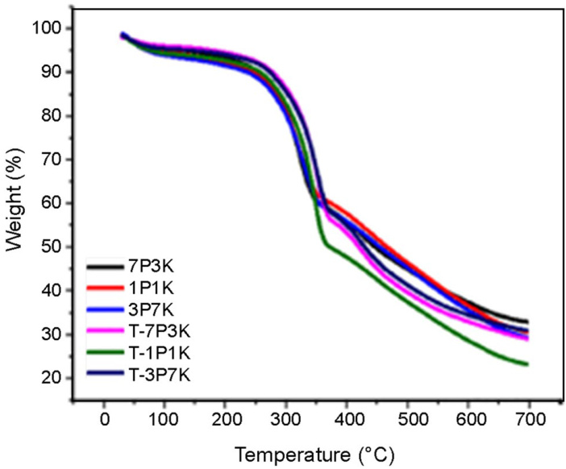
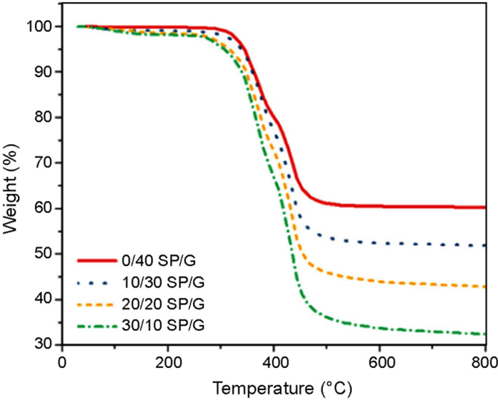
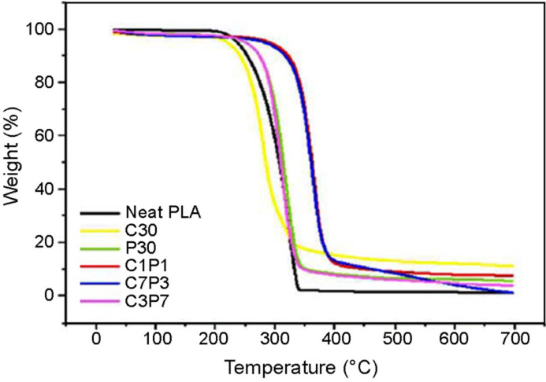
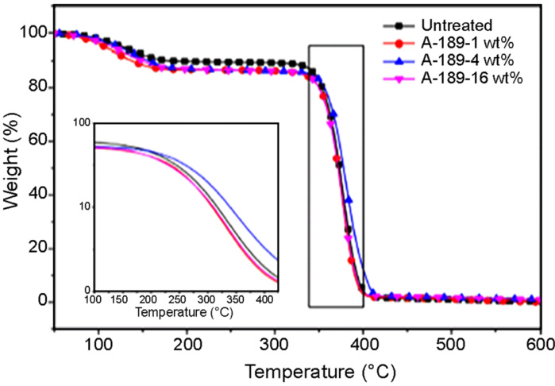

# Thermal stability of natural fibers and their polymer composites  

Mohammad Asim1 · Mohd T. Paridah1 · M. Chandrasekar2 · Rao M. Shahroze3 · Mohammad Jawaid1 · Mohammed Nasir4 $\circledcirc$ · Ramengmawii Siakeng5  

Received: 28 October 2019 / Accepted: 5 May 2020 / Published online: 21 May 2020   
$\circledcirc$ Iran Polymer and Petrochemical Institute 2020  

# Abstract  

Natural fiber-based composites are applied in many structural engineered products from civil constructions to automobile manufacturing due to the properties such as low density, high aspect ratio, biodegradability and ease to work. During the past decades such composites have been thoroughly studied for their mechanical properties and failure behavior and their properties compared with those of synthetic fiber-based composites. Other properties, such as the thermal behavior of natural fibers and composites, have also been studied because they determine the performance of their products possible. It deals with the effect of temperature on adhesive curing, effect of high temperature and fire damage during fabrication. Further, the thermal properties have equal importance in structural applications such as temperature transfer from end to end, load capacity at specific temperature, material behavior and dimensional stability at high temperature. In this respect the isothermal and non-isothermal thermogravimatric analyses are discussed and the improtance of glass transition temperature is studied during prepapration of composites to ensure their ultimate properties. Although there are several works that have been done on thermal behavior, especially thermogravimetric analysis of natural fibers and their composites, there is no review article available specially focused on natural fiber-based composites, hybrid composites, and nanocomposites. The aim of this review was to focus on the advances in the comprehension of thermogravimetric behavior of natural fibers and compare the effect of natural fibers as reinforced materials in polymer composites.  

Keywords  Thermogravimetric analysis $\cdot$ Natural fibers $^{\ast}$ Hybrid composites $\cdot$ Biopolymers $\cdot$ Nanocomposites  

\*	 Mohammad Jawaid jawaid_md@yahoo.co.in  

# Introduction  

Natural fibers are characterized as biodegradable, recyclable, and lignocellulosic fibers; however, recent studies have identified them as the best alternative to credible economics and natural protection [1]. Lignocellulosic fibers have many inherent advantages like non-abrasive nature, low energy consumption, high aspact ratio, low density, low cost, and biodegradability as compared to synthetic fibers [2–4]. Although the synthetic reinforced polymer composites possess higher mechanical properties in comparison to the natural fiber, they have a major limitation of being an environmental pollutant and non-biodegradabe material [5].  

The advance application of composites is based on the detail study of high specific strength-to-weight and specific stiffness-to-weight ratios of composite [6]. Apart from these specific properties such as mechancial, physical, thermal and electrical properties [7], other fundamental aspects need to be focused is life cycle assesment of the products. Further, the environmental concerns of their production are aimed to reduce the negative impact. It is also worth studying that the world has moved towards renewable and recycled materials from non-recycled materials [1, 8]. The natural fibers and thermoset matrix are used tremendously in automobile sectors for various light and heavy applications such as door panels, seat backs, headliners, package trays, dashboards, interior parts, etc. [9–11]. The market study on global natural fiber composite materials released by Lucintel [12] estimated the market growth at a compound annual growth rate (CAGR) of $8.2\%$ from 2015 to 2020.  

There are several large markets such as European Union (Directive 2000/53/EC) and other major automobile makers which give priority to the bio-based reinforced composites for global sustainability. The automobile industries have very complex and precise structures with more than 40,000 small and big parts of nearly 1000 various materials and 10,000 chemical substances. Among all materials, $75\%$ constitutes metals, $17\%$ materials are plastics and the rest are elastomers and textiles. Commercially, composite materials are very sucessful in semistructural applications and non-structural (cosmetics) purposes; however, the physical and thermal stability are the major constraints [8]; further, the application of biomaterials is restricted due to its heterogeneous characteristics against the homogeneous and very precise synthetic fibers [13]. These biomaterials can be modified by chemical treatment and bring uniformity in interfacial bonding of fibers and matrix that will ultimately improve the thermal resistance and mechancial properties of composites. Although the surface modification increases the processing cost, it improves the quality of composites that reduces the economical competitiveness of the natural fiber composites [14]. However, the choice of natural fibers is still the subject of extensive research around the world. During the extraction of polymers, some basic properties are studied by researchers and manufacturers on thermoset and thermoplastic behaviors, curing temperature and melting temperature. Virgin polymers usually have singular and specific type of chemical structure, so similar basic properties have been found. But natural fibers are very different from each other in terms of constituent species; even similar fibers have different compositions due to topography and climate. Therefore, each fiber is required to be studied for its properties as well as its behavior when used as a reinforced material. Natural fibers consist of so many minor chemical compositions which affect their interfacial bonding with polymers.  

Thermal properties of natural fiber-reinforced composites are a major constrain in their application. At higher temperatures the fiber components, like cellulose, hemicellulose and lignin, start degrading and the major properties of composite change. The suitability of natural fibers with polymers and high temperature stability have been studied for several decades, though the stability of natural fiber with different types of polymers, two different natural fibers reinforced polymer composites or natural fiber reinforced blended with two different polymers are needed to compile information through comparative studies. This study helps researchers select reinforced materials and matrices for the required thermal stability.  

Table 1   Chemical properties of cellulose-based natural fibers [174, 175]   

<table><tr><th>Fibers</th><th>Cellulose</th><th>Lignin</th><th>Hemicellulose</th><th>Pectin</th><th>Ash</th><th>Moisture content</th><th>Wax</th></tr><tr><td>Flax</td><td>71</td><td>2.2</td><td>18.6–20.6</td><td>2.3</td><td>–</td><td>8–12</td><td>1.5–3.3</td></tr><tr><td>Kenaf</td><td>31–72</td><td>15–19</td><td>21.5–23</td><td>–</td><td>2–5</td><td>–</td><td>–</td></tr><tr><td>Jute</td><td>45–71.5</td><td>12–26</td><td>13.6–21</td><td>0.2</td><td>0.5–2</td><td>12.5–13.7</td><td>0.5</td></tr><tr><td>Hemp</td><td>57–77</td><td>3.7–13</td><td>14–22.4</td><td>0.9</td><td>0.8</td><td>6.2–12</td><td>0.8</td></tr><tr><td>Ramie</td><td>68.6–91</td><td>0.6–0.7</td><td>5–16.7</td><td>1.9</td><td>–</td><td>7.5–17</td><td>0.3</td></tr><tr><td>Kenaf</td><td>37–72</td><td>15–21</td><td>18–24</td><td>–</td><td>2–4</td><td>–</td><td>–</td></tr><tr>Çissusquadrangularis</tr><td>77.17</td><td>10.45</td><td>11.02</td><td>–</td><td>–</td><td>–</td><td>7.3</td><td>0.14</td></tr><tr><td>Abaca</td><td>56–63</td><td>7–9</td><td>15–17</td><td>–</td><td>3</td><td>5–10</td><td>–</td></tr><tr><td>Sisal</td><td>47–78</td><td>7–11</td><td>10–24</td><td>10</td><td>0.6–1</td><td>10–22</td><td>2</td></tr><tr><td>Henequen</td><td>77.6</td><td>13.1</td><td>4–8</td><td>–</td><td>–</td><td>–</ td><td>–</td></tr></table>  

A full study is needed to understand the thermal effects on natural fibers and their composites. So far, no studies have reported on the thermogravimetric analysis of natural fibers and their composites. This study is motivated to compile all previous research work on the effect of temperature and its effect on fiber weight loss and its characteristics.  

# Natural fiber  

Natural fiber is an organic complex material, composed of three major constituents, i.e., cellulose, hemicellulose lignin and some minor components like extractives. Table 1 lists some major agriculture crops and their respective chemical compositions. When the temperature is applied, it results in a variety of physical and chemical changes that ultimately determine the property.  

The natural fibers such as water hyacinth, reed (Phragmites vulgaris), roselle and sisal (Agave sisalana Perr.)  

differ in their decomposition temperature $(T_{\mathrm{d}})$ . To evaluate the behavior of thermal degradation, the temperature range was examined between 290 and $490~^{\circ}\mathrm{C}$ [15]. Initial weight loss was recorded in the temperature range between 50 and $100~^{\circ}\mathrm{C}$ due to evaporation of water molecules. Further weight loss was found in the temperature range of $200{-}350~^{\circ}C$ due to the degradation of hemicelluloses, though thermal degradability of lignin and hemicellulose were in the temperature range of $300{-}450~^{\circ}\mathrm{C}$ and $200{-}300~^{\circ}\mathrm{C}$ , respectivily. Due to hemicellulose and lignin, approximately $60\%$ of the thermal decomposition of natural fibers occurred in the temperature range of 230 and $350~^{\circ}\mathrm{C}$ [16]. The initial decomposition of the components may explain the lower thermal stability [15]; however, oxidative decomposition, characterized by rapid weight loss at higher temperatures, is more consistent with thermal stability [17]. Table 2 gives a detailed description of thermal degradation of various natural fibers at different temperetures.  

Table 2   DTG data of biomass samples [176] (with permission)   

<table><tr><th>Fibers</th><th colspan='2'>First-stage</th><th colspan='2'>Second-stage</th></tr><tr><td rowspan='3'>Cellulose</td><td>T$_\mathrc$ (°C)</td><td>Temperature range</td><td>T$_\mathrc$ (°C)</td><td>Temperature range</td></tr><tr><td>–</td><td>–</td><td>548</td><td>450–600</td></tr><tr><td>Almond shell</td><td>298</td><td>250–390</td><td>477</td></tr><tr><td>Briquette</td><td>343</td><td>260–400</td><td>509</td><td>410–550</td></tr><tr><td>Cocoa bean husk</td><td>312</td><td>225–350</td><td>627</td><td>425–634</td></tr><tr><td>Coffee bean husk</td><td>319</td><td>220–360</td><td>502</td><td>440–520</td></tr><tr><td>Corncob</td><td>289</td><td>250–340</td><td>454</td><td>400–550</td></tr><tr><td>Pineapple leaf</td><td>344</td><td>250–380</td><td>496</td><td>420–570</td></tr><tr><td>Rice husk</td><td>334</td><td>260–360</td><td>450</td><td>400–540</td></tr><tr><td>Sainfoin</td><td>301</td><td>230–330</td><td>456</td><td>390–522</td></tr><tr><td>Scrubland pruning</td><td>334</td><td>260–370</td><td>538</td><td>400–760</td></tr><tr><td>Thistle</td><td>345</td><td>240–400</td><td>473</td><td>420–550</td></tr><tr><td>Wheat straw</td><td>312</td><td>260–360</td><td>543</td><td>420–650</td></tr></table>  

The thermogravimetric behavior of natural fibers directly depends on their chemical constituents. Similar natural fibers such as jute, sisal, wood and cotton have similar TG/ DTG curves and thermal decomposition pattern. Table 3 shows three stages of weight loss associated with the TG curve. The first stage explains the evaporation of moisture content at lower temperature, the second stage is decomposition of hemicellulose at medium temperature and the final stage illustrates the decomposition of lignin and cellulose at higher temperature. Sometimes the first stage does not appeare due to very low moisture content or minimum weight loss and exhibits the second stage as the first stage [18, 19]. Some researchers [13, 19] have considered the evaporation of moisture content to $200~^{\circ}\mathrm{C}$ as initial weight loss which corresponds to a maximum weight loss of $10\%$ . The second stage of degradation shows the loss of weight of more than $70\%$ of initial weight at temperature of about $500^{\circ}\mathrm{C}$ . The third stage represents the end of thermal degradation and makes sure that all the components of natural fibers are thermally degraded at temperature around $800^{\circ}\mathrm{C}$ and the final remaining mass reaches $20\%$ of the initial weight as ash and char content.  

The corresponding TGA curves revealed the contribution of fibers’ constituents in thermal degradation and showed the highest rate of thermal decomposition peaks. Figure 1b shows thermal decomposition of different natural fibers that reflects the different decomposition rate at different fiber constituent ratio.  

According to Monteiro et al. [13], less than $100^{\circ}\mathrm{C}$ caused an initial decrease in total weight percentage and the DTG peak indicates the availability of OH group in fiber cells. The thermal degradation of the major fiber composition (cellulose, hemicellulose and lignin) of natural fibers starts from the next stage. In the second stage, the curve of DTG reveals the decomposition of cellulose. In the stretch of the peak it is described that the initial decomposition is due to hemicellulose while the end portion shows lignin degradation. The third stage shows the char and other material decomposition reactions [20]. Natural fibers affect TGA results that work under different inert conditions (helium and nitrogen) or oxidative (air and oxygen) conditions [13].  

Table 3   Stages of thermal degradation of natural fibers   

<table><tr><th>Stage 1</th><th>Stage 2</th><th>Stage 3</th><th>References</th></tr><tr><td>50--100 ℃: Evaporation of moisture in the fibers degradation</td><td>200--300 ℃: Decomposition of hemicules</td><td>400--500 ℃: Weight loss due to lignin and cellulose</td><td>[$15$]\\<td></td></tr><tr><td>50--50 ℃:Attributed to the release of water absorbed by the fibers</td><td>250--370 ℃: Depolymerization of the hemicellulate and the cleavage of glycoside linkages of cellulose</td><td>340--370 ℃: Assigned to the degradation of α-cellulose</td><td>[$173$]\\</tr><tr><td>60--100 ℃: corresponds to vaporization of water molecules</td><td>282--306 ℃: thermal decomposition of hemi-cellulose, lignin, pectin and the glycoside linkages of cellulose</td><td>388.7--448 ℃: Degradation of α-cellulose</td><td>[$52$]\\</tr><tr><td></td><td>270--330 ℃: Associated with the degradation of hemicelluloses and pectins</td><td>448--472 ℃: Corresponds to the degradation of cellulose and lignins</td><td>[$19$]\\</tr></table>  

  
Fig. 1   TGA curves of different natural fiber polymers and their composites [42, 173]  

In another study, the thermal behavior of jute fiber was studied for untreated and alkali-treated jute fibers and different peaks of untreated and treated fibers were observed [21]. The untreated fibers revealed two peaks: the first peak represented the degradation of hemicellulose and glycosidic union de-polymerization at $300^{\circ}\mathrm{C}$ and the second peak which was recorded at $365~^{\circ}\mathrm{C}$ showed the thermal degradation of cellulosic content. Since cellulose contributes the major portion of natural fiber, the second peaks play a great role in weight loss. The broad peak in all the range represents the presence of lignin [21]. In alkali-treated fiber, unlike untreated fiber, there was only one peak that appeared at lower temperature compared to the second peak of untreated fiber. The first peak did not appear in treated fibers due to partial removal of lignin and hemicelluloses. The further degradation of complex structure of lignin and hemicellulose was revealed, but at the lower temperature of the second peak when compared to untreated fibers [22].  

The thermal properties of the agave fiber were investigated and the initial mass loss of $5\%$ was observed at $221~^{\circ}\mathrm{C}.$ , and in the second thermal degradation, a major weight loss at $379~^{\circ}\mathrm{C}$ was achieved with a $64\%$ reduction in mass [23]. Furthermore, the measured remaining residue of total mass was only $14\%$ and was found at about $990.5^{\circ}\mathrm{C}.$ . The thermal properties of the agave fibers revealed the sustainability of temperature up to $221~^{\circ}\mathrm{C}$ which can be utilized easily where the maximum temperature is less than $221~^{\circ}\mathrm{C}$ . Some works reported that natural fibers were incorporated in polymers as reinforcement and studied the main stages of weight loss due to reinforcement and effect on the thermal stability of composites. Through TGA, the thermal degradation process of composites can be studied and the obtained parameters determine the degree of degradation of materials [24]. Yao et al. [16] studied the degradation temperature of different natural fibers for comparative study. The thermal properties affect the morphology of natural fiber-reinforced composites significantly. Depending on the temperature, the composites expand or contract, creating cracks in the composites that eventually retain moisture.The natural fibers take up moisture through cappilary action, causing thickness swelling in composites [25]. Cellulose-reinforced polyethylene composites were used to pass through the oxidation process which improved the interfacial bonding of cellulose and matrix and also had a positive effect on thermal degradation [26]. Another experiment on untreated and silane-treated sisal fibers was done, and degradation temperature and mass loss were calculated [27]. The mass loss of $5\%$ , $10\%$ , and $50\%$ was recorded at 83, 255, and $360~^{\circ}\mathrm{C}$ for untreated fiber, and at 100, 278, and $365~^{\circ}\mathrm{C}$ for saline-treated fiber, in the stated order. The hemicellulose of sisal fibers was thermally degraded at $297~^{\circ}\mathrm{C}$ and cellulosic content was degraded as revealed in the second stage at $365~^{\circ}\mathrm{C}$ .  

# Thermogravimatric analysis (TGA)  

Thermogravimetric analysis (TGA) is a standard method to study the overall thermal stability of natural fibers. In this method, the thermal degradation of natural fiber composites with increasing the temperature is studied along with numerical calculation of quality degradation. When the temperature increases, the weight of the fiber drops slowly and at the point of glass transition weight drops sharply over a narrow range and finally turns back to zero slopes as the reactant is exhausted. The degradation process in TGA can be presented in the curve, which is dependent on the kinetic parameters of the pyrolysis such as frequency factor, reaction order, and activation energy. The value obtained in the curve depends upon various factors such as sample mass, sample shape, atmosphere, flow rate, heating rate, and the mathematical treatment applied.  

The differential thermal analysis (DTA) represents the reaction of heat with the sample and the reaction percentage per min is indicated by the deflection or peak. In a singlefactor experiment, if the temperature of reaction varies, the peak varies in respect to temperature as well as energy of activation. The difference in peak temperature determines the activation energy for the reactions with different reaction orders [28]. In thermal degradation, the thermogravimetric analysis (TGA) and derivative thermogravimetric (DTG) curves determine the weight loss and identify the decomposition of material at a certain temperature, respectively [26].  

# Isothermal and non‑isothermal thermogravimetric analysis  

TGA is known for the thermal degradation of material with respect to temperature and time, and for determining the final residue to analyze the thermal stability. In isothermal technique the temperature in furnace is constant and degradation or decomposition of mass is measured with time. In non-isothermal technique the temperature in furnace increases with time in a linear manner. In non-isothermal technique, the heating rate is constant and weight loss is measured with respect to time and temperature and a mass versus temperature or mass verses time curve is developed. Isothermal and non-isothermal techniques differ in the assumption of properties and process of data collections. This difference in data, due to its specific method, provides completely different information.  

The isothermal kinetic study predicted the thermal decomposition of hemicellulose, cellulose, lignin, and xylan [29]. The thermogravimetric analysis used five torrefaction temperatures of 200, 225, 250, 275, and $300~^{\circ}\mathrm{C}$ for 1-h span to study the recommendation value for the reaction of hemicellulose, cellulose, lignin and xylan shown in Fig. 2. The activation energy of hemicellulose, cellulose, lignin and xylan is 187.06, 124.42, 37.58 and $67.83\mathrm{kJ/mol}$ respectively.  

The non-isothermal method is used for the pyrolysis experiments which help to study relation of mass loss verses time. The method also helps to determine the activation energy which provides different results. However, the isothermal process of thermal degradation is used for plotting natural log of reaction coefficient against the inverse of temperature. In this plotted reduction method, the kinetic parameters are obtained from the slope and intercept of the resulting linearized equation.  

The data of non-isothermal experimentare are also used to plot an equation in a linearized manner, where the straight line represents the activation energy and reaction order. Isothermal and non-isothermal methods need different data to study the kinetic parameters [30]. Instead of error, singleheating-rate methods or non-isothermal method is very popular for analyzing the solid-state kinetics. There are various ways to study single-heating-rate methods such as Coats–Redfern method, MacCallum–Tanner equation, Madhusudana–Krishnan–Ninan equation, Horowitz–Metzger equation, Van Krevelen method, etc. [31].  

# Coats–Redfern equation  

The Coasts–Redfern equation (Eq. 1) has some disadvantages in calculation of activation energy and pre-exponential factor, which cannot be done without pre-assumption of the reaction model. It is recommended that you assume the initial value of the reaction order is $\mathbf{\Sigma}^{\leftarrow}n^{\mathbf{\gamma},}$ and find the correct value of the kinetic parameters until the best straight line is obtained, or the error is less than the tolerance value.  

  
Fig. 2   Distributions of a TGA and b DTG of natural fiber at five different torrefaction temperatures [29]  

$$
\operatorname{In}\left[{\frac{g(\alpha)}{T^{2}}}\right]=\operatorname{In}\left[\left({\frac{A R}{\beta E}}\right)\left(1-{\frac{2R T}{E}}\right)\right]-{\frac{E}{R T}}.
$$  

Sinc e 2RT  ≪ 1 in the temperature range usually employed, the term $\begin{array}{r}{\ln\left[\left(\frac{A R}{\beta E}\right)\left(1-\frac{2R^{2}}{E}\right)\right]}\end{array}$ in Eq. (1) is assumed to be sensibly constant. Thus, the slope of the plot of $\begin{array}{r}{\ln\left[\frac{g(\alpha)}{T^{2}}\right]}\end{array}$ versus $\left(-{\frac{1}{R T}}\right)$ will be equal to $E$ , and the value of pre-exponential factor can be calculated by equating the intercept of the equation equal to $\textstyle\left[\left({\frac{A R}{\beta E}}\right)\right].$ These reaction models can cause different kinetic parameters with the same experimental data. The resulting curve for the relevant data from each assumed model shows the amount of activation energy.  

# Horowitz–Metzger equation  

$$
\mathrm{In}~g(\alpha)=\left(\frac{A R T_{\mathrm{s}}^{2}}{\beta E}\right)-\frac{E}{R T_{\mathrm{s}}}+\frac{E\theta}{R T_{\mathrm{s}}^{2}}.
$$  

Activation energy values can be calculated from the plot of $\log(\alpha)$ versus $\theta$ , whose slope will be equal to $\frac{E}{R T_{s}}$ E.The major disadvantage of this method is its dependence on peak temperature, $T_{\mathrm{s}}$ , whose value depends on the heating rate and sample weight.  

# van Krevelen equation  

$$
\begin{array}{r l r}{\lefteqn{\mathrm{In}=\left[\frac{1-(1-\alpha)^{1-n}}{1-n}\right]=\mathrm{In}=\left[\frac{A}{\beta}\bigg(\frac{0.368}{T_{\mathrm{s}}}\bigg)^{\frac{E}{\kappa T_{\mathrm{s}}}}\bigg(\frac{E}{R T_{\mathrm{s}}}\bigg)^{-1}\right]}}\ &{}&{\qquad+\left(\frac{E}{R T_{\mathrm{s}}}+1\right)\mathrm{In}T.}\end{array}
$$  

The values of activation $E$ and $A$ can be calculated from the slope and intercept of the plot of $\textstyle\mathrm{In}\left[{\frac{1-(1-\alpha)^{1-n}}{1-n}}\right]$ versus ln $T_{:}$ respectively.  

By applying the equation of van Krevelen and Hoftyzer method (Eq. 4) [32, 33] limiting oxygen index (LOI) can be calculated by char residue obtained from TGA testing. Ferdosian et al. [33] studied the LOI by using data of TGA of bisphenol-based epoxy and epoxy composites comprising diglycidyl ether of bisphenol A (DGEBA)-based epoxy resin and various percentages of lignin-based epoxy. In this research TGA testing was investigated at heating rate $10^{\circ}\mathrm{C/min}$ and temperature range from room temperature to $800~^{\circ}\mathrm{C}$ . LOI is fire resistance testing, which helps to study the minimum amount of oxygen required to initiate the combustion of materials. It is one of the important tests to grade products according to the topography (presence of oxygen in atmosphare, mountainous areas have less oxygen content). This test is widely used in polymer composites and its effects on fire retardancy [34]:  

$$
\mathrm{LOI}=17.5+0.4\mathrm{CR},
$$  

where CR represents the char residue obtained from the TGA results.  

LOI can be calculated by putting char content in Eq. (4). According to the standard, below $20.95\%$ is considered as easily flammable; however, LOI above $28\%$ is considered as “self-extinguishing” materials [34].  

Another simple equation of heat resistance index $(T_{\mathrm{s}})$ has been used in research on the synthesis of bio-based epoxy resin from Japanese green tea (Camellia sinensis) [35]. Chain of synthesized epoxy was compared with the chain of bisphenol-A (BPA)-derived epoxy by using glass transition $(T_{\mathrm{g}})$ analysis. Thermograph from TGA showed good thermal stability at $169~^{\circ}\mathrm{C}$ with lower weight loss due to lesser amount of unreacted component. Equation (5) is used to calculate heat thermal resistant temperature of cured resins from the temperature difference at $5\%$ and $30\%$ weight loss (Td5 and Td30, respectively) obtained from TGA curves. $T_{\mathrm{s}}$ was determined by using Eq. (5) [36, 37]:  

$$
T_{\mathrm{{s}}}=0.49[\mathrm{{Td5}+0.6\times(\mathrm{{Td30}-\mathrm{{Td5})].}}}
$$  

The $T_{\mathrm{s}}$ of $5\%$ and $30\%$ weight loss of the resins cured with lignin were found to be lower than that of resin cured without lignin. It may be due to degradation or epimerization of the catechin compounds during extended periods of heat drying at $80~^{\circ}C$ ; consequently, the significant decrease in polyphenol content which is typically observed following heat treatment [38]. This also helps to understand that lignin can be used as a natural curing agent, and usable as a hard segment in epoxy resin network, which increases the glass transition of the resultant polymer network. Therefore, the use of lignin as a curing agent could induce relatively high chain rigidity in the polymer network due to increasing crosslinking [39]. Another research on extraction of phenolic resin from green tea leaves and its use for the production of thermoset epoxy resins showed its high reactivity associated with a high crosslinking density and high thermal resistance [37]. The statistic heat-resistant index temperature $(T_{\mathrm{s}})$ is characteristic of the thermal stability of the cured resins. This value is determined from the temperatures at $5\%$ weight loss (Td5) and $30\%$ weight loss (Td30) of the sample obtained by thermogravimetric analysis. The statistic heat-resistant index temperature $(T_{\mathrm{s}})$ is calculated by Eq. 5.  

# Material selection based on TGA  

When preparing new materials, the choice of raw materials, production technique, and final products are equally important. For heavy duty utilization, material should be mechanically strong and thermal stable as well, because heat from mechanical energy can reduce the loading capacity. In this case TGA helps to know the thermal properties of material and also helps to understand the suitability for the material. TGA helps a lot when structural precision is required in products. There are many machine components that are structurally stable after TGA testing. It can be assured at what temperature the material will change its phase or structure.  

Some researches based on kenaf fiber and pineapple leaf fiber-reinforced polymer composites have been performed on the thermal properties and found out the $\mathrm{T_{g}}$ . A research based on kenaf fiber and pineapple leaf fiber-reinforced high-density polyethylene [40] was studied and compared with kenaf fiber and pineapple leaf fiber-reinforced phenolic composites [41] shown in Fig. 3.  

From the figure it is shown that initial thermal degradation in both thermographs revealed between 280 and $300~^{\circ}C$ , due to degradation of cellulose and hemicellulose. Figure 3b has more fiber content so decomposition at this point must be higher. In Fig. 3a, the polymer showed melting point at $464.9~^{\circ}\mathrm{C}_{:}$ , and after addition natural fibers there is no improvement recorded. On the other hand, Fig. 3b shows very slow thermal degradation for the polymer and final residue is more than $50\%$ . After addition of natural fibers the thermal degration was decreased but the process was very slow due to the polymer. In conclusion, it is suggested that selection of polymer in composites must be based on its $\mathrm{T_{g}},$ where in fact polymer is the key factor of thermal stability in natural fiber-reinforced polymer composites.  

# Natural fiber‑reinforced composites  

# Thermoset composites  

Many researchers have studied various natural fiber-reinforcd based composites and characterized their properties. Among all those characterizations, the thermal properties of natural fiber-reinforced thermoset polymer composites are one of the critical features, analyzed by using thermogravimetric analysis which is summerized in Table 4.  

Thermal behavior of raw fibers of phormium and its reinforced composites was invesigated through the TGA technique [42], the thermal degradation reveales two primary phases in the curves shown in Fig. 1a. The initial weight loss in raw fibers of phormium was recorded $8\%$ between $37~^{\circ}C$ and $130~^{\circ}\mathrm{C}$ due to moisture content present in the fiber core. Fiber thermal degradation began between 200 and $305~^{\circ}\mathrm{C}$ , indicating that thermal degradation was caused by cleavage of cellulose glycosidic bonds and depolymerization of hemicellulose and pectin [43, 44]. The highest thermal degradation of natural fibers was recorded at $305{-}370^{\circ}\mathrm{C}$ due to the degradation of cellulosic content. Degradation temperature of lignin has a wide range between $200^{\circ}\mathrm{C}$ and $900^{\circ}\mathrm{C}$ due to the complex aromatic structure of lignin with various branches [43–45].  

The DTG curve of phormium-reinforced composites was acquired at $347~^{\circ}\mathrm{C}$ which is the highest among all natural fibers and matrix composite. The thermal degradation temperature of natural fibers and matrix are $337~^{\circ}\mathrm{C}$ and $347^{\circ}\mathrm{C}$ respectively. Another research based on jute fiber-reinforced vinyl ester composites illustrated that thermal degradation of composites occurs in two steps [22]. The first degradation step indicated the decomposition of natural fibers at $368~^{\circ}\mathrm{C}$ ; however, the second degradation step represented the decomposition of matrix. The thermal degradation of composites was studied at various heating rates and found slight variation. The thermal stability was improved with increasing the heat rate. The comparative study of residual amount of matrix, fiber and composites revealed that the residual amount of composites is in between that of the matrix and fibers.  

  
Fig. 3   Comparative thermographs of polymer composites for similar natural fibers  

Table 4   Works reported on thermogravimatric analysis of natural fiber-reinforced thermoset thermoplastic, and biopolymer-based composites   

<table><tr><th>Reinforcement</th><th>Matrix</th><th>References</th></tr><tr><td>Thermoset polymers</td><td></td><td></td></tr><tr><td>Phormium tenax leaf fibers</td><td>Epoxy resin</td><td>{[}42{]}</td></tr><tr><td>Coconut sheath fiber</td><td>Epoxy resin</td><td>{[}46{]}</td></tr><tr><td>Kenaf</td><td>Epoxy resin</td><td>{[}177{]}</td></tr><tr><td rowspan='3'>Cellulose fibers from eucalyptus wood</td><td>Epoxy resin</td><td>{[}178{]}</td></tr><tr><td>Phenolic resin</td><td>{[}179{]}</td></tr><tr><td>Phenolic foams</td><td></td></tr><tr><td>Pine needle</td><td>Urea formaldehyde (UF)</td><td>{[}181{]}</td></tr><tr><td>Hemp fiber mats</td><td>Unsaturated polyester resin</td><td>{[}182{]}</td></tr><tr><td>Hemp</td><td>Unsaturated polyester resin</td><td>{[}183{]}</td></tr><tr><td>Roselle fiber</td><td>Vinyl ester</td><td>{[}184{]}</td></tr><tr><td>Sugar palm fiber</td><td>Vinyl ester</td><td>{[}185{]}</td></tr><tr><td>Bleached Kraft softwood pulp fibers</td><td>Unsaturated polyester and vinyl ester</td><td></td></tr><tr><td>Themoplastic polymers</td><td></td><td></td></tr><tr><td rowspan='2'>Flax, hemp and sisal</td><td>Polypolyene</td><td>{[}58{]}</td></tr><tr><td>Polypropylene</td><td>{[}63{]}</td></tr><tr><td>Pine cone fibers</td><td>Polypropylene</td><td></td></tr><tr><td rowspan='2'>Coir fibers and shell particles</td><td>Polypropylene</td><td>{[}187{]}</td></tr><tr><td>Polypropylene</td><td>{[}187{]}</td></tr><tr><td>Hemp fibers</td><td>Polypropylene</td><td></td></tr><tr><td>Almond shells particles</td><td>Polypropylene</td><td>188</td></tr><tr><td>Almond shells particles</td><td>Polypropylene</td></td><td>189</td></tr><tr><td>Kenaf fiber</td><td>Polyurethane</td><td>{[}59{]}</td></tr><tr><td>Roselle fiber</td><td>Polyurethane</td><td>190</td></tr><tr><td>Doum fibers (Chamaerus humilis)</td><td>Low-density polyethylene</td><td>62</td></tr><tr><td>Sansevieria cylindrica</td><td>Polyester</td><td>191</td></tr><tr><td>Bion Polymer</td><td></td><td></td></tr><tr><td>Sisal fiber</td><td>Rubber seed oil-based polyurethane</td><td>77</td></tr><tr><td>Hemp fiber</td><td>Phenol-based cashew nut shell liquid (CNSL)</td><td>192</td></tr><tr><td>Sisal fibers</td><td>CNSL</td><td>192</td></tr><tr><td>Novel silk</td><td>Poly( butylene succinate)</td><td>193</td></tr><tr><td>Jute</td><td>Poly( butylene succinate)</td><td>194</td></tr><tr><td>Jute</td><td>Polylactic acid</td><td>74</td></tr><tr><td>Kenaf and rise husk</td><td>Polylactic acid</td><td>80</td></tr><tr><td>Coor and pineapple leaf fiber</td><td>Polylactic acid</td><td>137</td></tr></table>  

Thermal properties of treated and untreated coconut sheath fiber-reinforced epoxy composites were studied [46]. Both treated and untreated composites revealed weight loss at the same temperature. The initial weight losses were due to evaporation of hydroxyl groups and further thermal degradation was due to degradation of hemicellulose at 100–105, 230 and $300~^{\circ}\mathrm{C}$ , respectively. The final thermal degradation was subjected to the degradation of cellulose and epoxy at the temperature of $300{-}400~^{\circ}\mathrm{C}$ . The residual amount of treated composites was less than that of the untreated composites because char yield depends on the availability of lignin in the fibers. It indicated that treatment of natural fibers partially removed lignin and caused the char content to be less than that of the untreated composite [46].  

A comparative study of thermal properties of jute and bamboo composites was done and weight loss at various temperature was measured through TGA curves [47]. Initial weight loss near to $100~^{\circ}\mathrm{C}$ is due to the hydroxyl group presence in jute and bamboo fibers. Both composites were degraded thermally in the temperature range of $240{-}260~^{\circ}\mathrm{C}$ . The accurate thermal degradation of jute composite was recorded at $255~^{\circ}\mathrm{C}$ ; however,the bamboo composites were degraded thermally at $246~^{\circ}\mathrm{C}$ . The higher the thermal degradtion temperature of the composite jute, the better its thermal properties than the bamboo epoxy composite. A study based on date palm fiber (DPF)/epoxy composite at various fiber loadings was done to investigete the thermal properties through TGA analysis [48]. The initial loss in the range of $60{-}100^{\circ}\mathrm{C}$ is an indication of the presence of hydroxyl groups in DPF. Further it was observed that the presence of water molecule in the cell wall structure or void space and the water absorption at the fiber–matrix interfacial bonding [49] indicate the minimizing mechanical strength of natural fiber composites [50]. Further, the fiber loading of $40\%$ DPF and $50\%$ DPF exhibit the thermal degradation at $299.72~^{\circ}\mathrm{C}$ and $316.9~^{\circ}\mathrm{C}$ , respectivily. However, the final residual percentage of pure epoxy, $40\%$ DPF and $50\%$ DPF was $9.58\%$ , $12.51\%$ and $19.8\%$ , respectivily. The residual amounts were increased with increaseing the fibers in composites, though $60\%$ fiber loading reduced the residual amount because the matrix was less and could not hold the fibers properly. The thermal properties of DPF composites revealed that their properties are mainly due to the thermal decomposition of hemicellulose, lignin, pectin and the glycosidic linkages of cellulose of natural fibers [51].  

Thermal behavior of phenolic resin, untreated and saline-treated PALF and kenaf composites at various fiber loadings was investigated [52]. Kenaf and PALF composites revealed that weight loss below $100~^{\circ}\mathrm{C}$ corresponds to availability of hydroxyl group in all natural fiber-reinforced composites [18, 53]. Pure matrix did not show weight loss in the begining and a single-stage thermal degradation was found at $420.73~^{\circ}\mathrm{C}$ with $32.16\%$ weight loss. The thermal degradation of matrix depends on the dihydroxy phenyl methane units available in the phenolic groups [54]. Untreated PALF and kenaf composites indicated the first stage of thermal degradation at $282–303~^{\circ}\mathrm{C}$ , however, treated PALF and kenaf composites revealed initial stage of degradation at 293.14 and $305.41~^{\circ}\mathrm{C}$ , respectivily. The initial thermal degradation was initiated due to the persence of several constituents in natural fibers such as glycosidic linkages of cellulose, pectin hemicellulose and lignin [20]; however, thermal depolymerization of hemicellulose and cleavage of the glucosidic linkage of cellulose of treated composites improved the thermal stability [55]. The temperatures of final thermal degradation of PALF-reinforced composites and kenaf-reinforced composites were recorded between 388.7 and $422~^{\circ}\mathrm{C}$ and 408.58 and $447.99^{\circ}\mathrm{C}$ , respectively, because of the thermal degradation of $\upalpha$ -cellulose and depolymerization of matrix [26, 27].  

# Thermoplastic polymer composites  

There are several works reported on the fabrication process of natural fiber-reinforced thermoplastic composites and their properties such as physical, mechanical, thermal, electrical conductivity and fire retardency. Of all the properties, thermal properties are one of the most important for temperature tolerance of composites. The thermogravimetric analysis is one of the test methods used to study natural fiber-reinforced thermoplastic polymer composites, as shown in Table 4.  

Pineapple leaf fibers and betel nut husk-reinforced PP hybrid composites were studied at various fiber loadings with equal fiber ratio in hybrid composites [56]. The TGA curve of hybrid composite of all fiber loadings revealed that hydroxyl groups cause initial weight loss below $100~^{\circ}\mathrm{C}$ Hybrid composites with $5\%$ and $15\%$ fiber loading revealed that their thermal degradation occurs around $225{-}358~^{\circ}C$ and $223-374^{\circ}\mathrm{C}$ , respectively, whereas $10\%$ fiber loading hybrid composite exhibited that its decomposition is around $250{-}410^{\circ}\mathrm{C}$ In another study the flax/PP composites copolymerized with granulate MAPP of type A were studied by TGA and DTG and it turned out that the thermal degradation was three-stage. The first stage of thermal degradation is due to the presence of water molecules, the second degradation is due to hemicellulose and cellulose and the final stage is due to the presence of lignin [57]. The DTG curves did not show any charring peak at $500^{\circ}\mathrm{C}$ . However, the composites showed two distinct peaks in the range of $369.4\mathrm{-}374.8^{\circ}\mathrm{C}$ and $432.4\mathrm{-}481^{\circ}\mathrm{C}$ which indicated the rate of thermal degradation of flax and PP, respectively [58]. Another study on kenaf-reinforced thermoplastic polyurethane (TPU) composites showed thermal properties through TGA curves [59]. The initial weight loss was recorded about $9.5\%$ in the temperature range of $31{-}153^{\circ}\mathrm{C}$ , which showed very high moisture content in kenaf fibers. Further mass loss was recorded at $194-330^{\circ}\mathrm{C}$ due to the degradation of hemicellulose and cellulose and lastly degradation was due to lignin content at $305{-}386^{\circ}\mathrm{C}$ . The thermal degradation of pure TPU showed a wide range of temperature from 250 to $539~^{\circ}\mathrm{C}$ . The DTG peak of TPU degradation at $363~^{\circ}\mathrm{C}$ was due to the polymerization of polyol–isocyanate bond. Once the temperature is reached, the isocyanate is evaporated and condensed again into smoke, but the polyol is the same and decomposed at higher temperatures [60]. It is also observed that increasing the fiber loading in TPU decreased the thermal stability more than that of pure TPU. Thermal degradation of natural fiber-reinforced TPU composites revealed dehydration at initial temperature and showed thermal cleavage of glycosidic linkage by trans-glycosylation and scission of C–O and C–C bonds at low temperatures. Thermal degradation at higher temperature was attributed to the aromatization, involving dehydration reactions [59]. The thermal properties of pure LDPE and natural fiber-reinforced LDPE composites were investigated using TGA [61]. The initial mass loss between 100 and $150~^{\circ}\mathrm{C}$ showed that fibers have moisture content. Addition of reinforced materials reduced the thermal stability and the doum fibers and LDPE matrix showed high shear strength and frictional forces which prevented the breaking of LDPE chains that improved mechanical properties [62]. The thermal properties of pinus fibers, PP matrix and pinus fiber-reinforced PP composites were analyzed by TG technique [63]. The pinus fibers showed thermal degradation at two temperatures: the initial thermal degradation was recorded in the range of $220{-}280~^{\circ}C$ due to the degradation of hemicellulose; however, the second stage of thermal degradation was revealed in the range of $280–300~^{\circ}C$ due to degradation of lignin and cellulose [64]. After incorporation of pine cone fiber in PP, the degradation temperature decreased from $355~^{\circ}\mathrm{C}$ for neat PP to $321~^{\circ}\mathrm{C}$ for a $25\mathrm{wt}\%$ pine cone-reinforced PP. DTG illustrated that compatibilizer affected the thermal stability when compared to fiber/PP composites without compatibilizer. Thermal properties of curaua fiber-reinforced high-density polyethylene composites were studied in the presence of two different coupling agents shown in Fig. 4 [65]. The TGA results of pure HDPE showed less stability than the composites. The other composites containing coupling agent of PE- $^{\cdot g}$ -MA showed the least thermal stability. However, with other coupling agent, [poly(ethylene- $^{c o}$ -vinyl acetate)] (EVA), it was more stable. The least thermal stability was explained due to better interfacial bonding between the acid groups of the maleic anhydride and the $-\mathrm{OH}$ groups on the fiber surfaces. The better interaction may promote degradation process [65].  

The thermal degradation of untreated and treated jute/ HDPE composites was studied [66]. The complete decomposition of pure HDPE was observed at $430–515~^{\circ}\mathrm{C}$ . For the $30\%$ fiber loading of jute-reinforced HDPE the initial decomposition was between 304.7 and $382~^{\circ}\mathrm{C}$ due to dehydration and thermal cleavage of glycosidic linkage by transglycosylation and breakage linkage of $\mathrm{C}{-}\mathrm{O}$ and $\mathrm{C}{-}\mathrm{C}$ bonds.  

  
Fig. 4   Curaua fiber-reinforced high-density polyethylene composites [65] (with permission)  

The second thermal degradation was observed between 452 and $530.7~^{\circ}\mathrm{C}$ due to aromatization. Other researcher also found the same trend for PALF-reinforced HDPE composites [67]. The treated composite was decomposed at $364^{\circ}\mathrm{C}$ due to thermal cleavage and scission of ${\mathrm{C}}{-}\mathrm{O}$ and $\mathrm{C}{-}\mathrm{C}$ bonds. The major degradation was detected between the range of 479.7 and $598.7~^{\circ}\mathrm{C}$ which was almost the same as that of the untreated jute/HDPE composite and its char residue was lower than the char residue of untreated composites [66].  

# Natural fiber‑reinforced biopolymer composites  

The annual consumption of polymers are increasing with the rate of $5\%$ and is estimated to be more than 300 million tons [68]. Mostly, the polymers used in industrial production of plastics are extracted from petrochemical resources. Utilization of petrochemical-based polymers in plastic manufacturing is almost $7\%$ of the global oil and gas consumption [69].  

These non-degradable synthetic polymers pose a significant threat to the environment and sustainable development. Some initiatives have been taken to develop innovative technologies from renewable feed stocks to biopolymeric materials’ processing. Some renewable feed stocks such as natural oils, polysaccharides (starch and sugars), wood (lignocellulose) and proteins are broadly used to extract monomers [70, 71]. Among the renewable feedstocks, triglyceride oils extracted from soybeans are easily available, of relatively low cost and have chemical functionality, as well as 108 million metric tons of soybeans were harvested in USA in 2014 [72, 73].  

The thermal properties of jute/PLA composites were studied and weight loss at various temperatures was observed [74]. Jute fibers initially lost their weight near $100~^{\circ}\mathrm{C}$ due to water molecules present in the cell wall. The second and third thermal degradations were recorded at $280~^{\circ}\mathrm{C}$ and $360~^{\circ}\mathrm{C}$ , respectively, due to the decomposition of low molecular weight of hemicellulose, lignin and cellulose [75]. For jute/PLA composites, single-stage thermal degradation has also been recorded at $346~^{\circ}\mathrm{C}$ . The thermal stability of composite is lower than that of pure PLA, which may be due to the jute fibers. Alkali, permanganate and peroxide treatments of jute fiber reduced the thermal stability of the composites as compared to that of untreated jute fiber/PLA composites. However, silane treatment of jute fiber-reinforced composites improved the thermal properties due to the elimination of easily hydrolyzed substances which usually degrade below the degradation temperature of hemicellulose, lignin and cellulose [74, 76].  

A study on sisal/rubber seed oil-based polyurethane (RSOPU) composites showed thermal degradation at three distinct temperatures [77]. The initial weight loss was below $100~^{\circ}\mathrm{C}$ due to the evaporation of moisture content. The second and third stages of thermal degradation were due to cellulose, lignin and hemicellulose at 250 and $480~^{\circ}\mathrm{C}$ , respectively [78]. Three-stage degradation was recorded for thermal degradation of RSOPU. The urethane bonding of polyurethanes was degraded between 217 and $336~^{\circ}\mathrm{C}$ [79]. However, the final stage of thermal degradation was between 450 and $500~^{\circ}\mathrm{C}$ due to the degradation of rubber seed oil moiety [77].  

The thermal properties of kenaf and rice husk (RH)- reinforced PLA were investigated by TGA and it was found that the initial temperature belongs to moisture evaporation (Fig. 5) [80]. Fiber loading was studied and it was revealed that the addition of natural fiber decreases the temperature of thermal degradation of composites [81]. The highest weight loss of rice husk and kenaf was recorded between $230~\mathrm{C}$ and $360~^{\circ}\mathrm{C}$ corresponding to the degradation of the cellulosic substances of hemicelluloses, cellulose and lignin.  

Another research on TGA studies of silane-treated and -untreated sisal fibers-reinforced bio-PU composites recorded thermal decomposition and found similar mass degradation curve for both untreated and treated fibers [82]. However, silane-treated composites showed better thermal stability due to better interfacial bonding [27].  

A research based on the corn- and rice starch-based bioplastics for packaging applications was done using TGA and identified three stages of degradation: the first temperature range was between 100 and $200~^{\circ}\mathrm{C}$ and indicated small weight loss due to moisture evaporation; the second stage showed major evaporation between 250 and $300~^{\circ}\mathrm{C}$ which was due to the decomposition of gelatin and starch, and the third stage showed only char content [83]. The thermal properties of bamboo fiber-reinforced cashew nut shell liquid (CSNL) biocomposites were investigated by TGA and it was found that the first stage of degradation was in the temperature range between 250 and $380^{\circ}\mathrm{C}$ due to decomposition of pectin, hemicellulose and cellulose [84]. The second stage of thermal degradation revealed the degradation of polymers linkages in the range of $400{-}450~^{\circ}\mathrm{C}$ . Alkali modified fiberreinforced composites improved the maximum degradation temperature in the DTG curve from 400 to $421~^{\circ}\mathrm{C}$ [84]. Thermal degradation of the polymer showed a wide range of decomposition from 250 to $450~^{\circ}\mathrm{C}$ which was due to several chemical decompositions such as CO, $\mathrm{CO}_{2}$ , $\mathrm{CH_{4}}$ , phenols and cresols [85].  

  
Fig. 5   Thermogravimetric curves of K, RH, PLA, PLA-K and PLARH [80] (with permission)  

Thermal stability of natural fiber-reinforced CNSL composites was investigated and there was no weight loss below $100^{\circ}\mathrm{C}$ which was due to hydrophobic nature of CSNL [86]. The treated composites showed weight loss below $100~^{\circ}\mathrm{C}$ and treated composite with higher concentration of NaOH showed higher weight loss below $100~^{\circ}\mathrm{C}$ because alkaline treatment exposed the hydroxyl groups of the fiber and so increased their interaction with water [87]. The DTG curves clearly revealed the first peak which was due to evaporation of moisture and the second peak which was due to the degradation of primary constituents of natural fibers [88] and degradation of weak chain of the matrix [86]. Thermal degradation of natural fibers (Hibiscus sabdariffa)-reinforced CSNL composites recorded $10\%$ weight loss at $243.0~^{\circ}\mathrm{C}$ due to degradation of natural fibers [89]. The final thermal decomposition of composites was at $945.0^{\circ}\mathrm{C}$ . The thermal degradation stages indicated that cellulosic material affects the thermal stability of CSNL composites.  

The treatment of natural fibers with laccase is well studied as oxido-reductase enzyme. It has a dual character; it causes excessive polymerization or depolymerizes lignin compound through free radical reaction [90, 91]. Thermal stability of laccase-treated and -untreated fibers was observed at two temperatures: first it starts at $300~^{\circ}\mathrm{C}$ due to amorphous cellulose, and then the crystalline cellulose degrades at higher temperature around $350~^{\circ}\mathrm{C}$ [92]. It was also found that treated fibers improve the thermal stability. The comparative study of treated and untreated fibers showed that treated fibers increase the thermal stability from 449 to $491~^{\circ}\mathrm{C}$ . Thermal properties were improved in treated fibers because of their higher crystallinity index (CrI). It was observed that treated fibers improve the thermal stability with increasing the crystallinity of the fiber [20].  

Untreated and treated sisal-reinforced composites showed a rapid drop in temperature between 340 and $360^{\circ}\mathrm{C}$ , which is mainly due to degradation of materials [93]. The sisalreinforced PLA composites showed lower thermal stability than pure PLA, which may be due to the thermal degradation of fibers during manufacturing process. The other reason, which maybe alkali treatment, removed the lignin and damaged the cellulosic structure. Lower crystallinity index of treated composites could be another reason as well. In addition, the weight percentage of the residue of three materials differed from the others. Untreated composite had the most residues while the neat PLA had the least. It indicated that sisal fiber/PLA composites had a higher heat resistance than neat PLA because of sisal fibers as reinforcement, and heat resistance of untreated sisal which was better than that of treated sisal [93].  

A study on thermal properties of pure PLA and biocomposites with different bamboo char (BC) loadings showed a single-stage decomposition process [94]. Pure PLA revealed higher thermal stability than BC composites because pure PLA required higher temperature to break the moleculer chain. By addition of BC to PLA, the molecular mobility was increased and some other molecular chains were decomposed and crystalization was developed due to plasticization and heterogeneous nucleation, which resulted in decreasing of thermal degradation at lower temperature. Another research [95] revealed that starting temperature decreased and then increased, indicating improvement of crystallization and shifting thermal degradation to higher temperatures.  

The thermal properties of blended polymer of polyhydroxybutyrate (PHB) and poly(hydroxybutyrate-co-hydroxyvalerate (P(HB-HV)) were investigated by TGA technique and there was no weight loss below $100~^{\circ}\mathrm{C}$ due to the absence of hydroxyl groups [96]. The thermal degradation of pure PHB showed $5\%$ weight loss at $242^{\circ}\mathrm{C}$ ; however, the thermal degradation of P(HBHV) was observed at $249~^{\circ}\mathrm{C}$ . After the addition of natural fibers to PHB and P(HBHV), the thermal stability was improved by $10~^{\circ}C$ . Natural fiberreinforced PHB composites exhibited thermal degradation at $290~^{\circ}\mathrm{C}$ and natural fiber-reinforced P(HB-HV) composites showed thermal degradation at $270~^{\circ}\mathrm{C}$ . The higher fiber ratio enhanced the residual amount due to the presence of ashes. A study of Bhardwaj et al. [97] found that addition of cellulose does not produce changes in thermal stability of P(HB-HV), but it can increase the amount of final residue. A study on bleached Kraft soft wood (BKSW)-reinforced PLA biocomposites by TGA showed the first thermal degradation at $250~^{\circ}\mathrm{C}$ [98] which was due to the decomposition of hemicelluloses and cellulose [99], shown in Fig. 6. The thermal degradation of pure PLA started from the temperature $300{-}400^{\circ}\mathrm{C}$ . The addition of natural fibers to PLA reduced the thermal stability due to cellulose. The comparative study of kenaf/PLA and rice husk/PLA hybrid composites was performed to compare their thermal behavior [80]. Shibata et al. [100] found that hemicelluloses decompose first, followed by cellulose and lignin. After $360^{\circ}\mathrm{C}$ , the weight loss is due to the decomposition of non-cellulosic materials. The thermal degradation of pure PLA was at $323~^{\circ}\mathrm{C}$ ; after the incorporation of kenaf and rice husk the temperature of degradation declined to $321~^{\circ}\mathrm{C}$ and $305~^{\circ}\mathrm{C}$ , respectively. Kenaf-reinforced PLA composite showed $75\%$ weight loss at $357~^{\circ}\mathrm{C}$ , while rise husk/PLA composite degraded at $340^{\circ}\mathrm{C}$ . In all conditions, rise husk composite showed less thermal stability than kenaf composite, which may be due to the chemical composition of the two natural fibers [80].  

  
Fig. 6   TGA of PLA, BKSW and PLA composites reinforced with different filler contents [98] (with permission)  

# Natural fiber‑based hybrid composites  

# Hybrid thermoset composites  

Many researchers have reported on the thermogravimetric analysis of fiber/filler-reinforced thermoset polymer hybrid composites. Some TGA works are reported based on natural fiber-reinforced thermoset polymer hybrid composites, which are presented in Table 5.  

Silane-treated and -untreated PALF/KF-reinforced phenolic hybrid composites presented a major weight loss between 34 and $45\%$ in the temperature range of $278-306~^{\circ}C$ , shown in Fig. 7 [101], because of the decomposition of hemicellulose, lignin, pectin and the glycosidic linkages of cellulose [44, 46]. The weight losses of treated hybrid composites were higher, maybe due to partial removal of hemicellulose and lignin. In addition, cellulose was exposed by silane treatment. The silane coating on fibers improved the thermal stability of composites [41]. The DTG curve showed two peaks, which the first peak was below $100~^{\circ}\mathrm{C}$ due to hydroxyl groups in fibers [49]. The second peaks were due to the degradation of cellulose and hemicellulose of fibers and also the presence of voids and loose fibers presence within composites [101].  

The thermal properties of pure epoxy, EFB/epoxy composites and EFB/jute hybrid composites were compared by TGA [102]. EFB/jute hybrid composites improved the thermal stability due to thermal properties of jute fibers. The initial thermal degradations of hybrid composites were between the temperature $270~^{\circ}\mathrm{C}$ and $300~^{\circ}\mathrm{C}$ due to breakage of glycosidic linkage of cellulose. The second thermal degradation was due to the degradation of lignin in the temperature range of $340{-}360~^{\circ}C$ [103]. The thermal degradation of hybrid composite started between the temperature range of $250~^{\circ}\mathrm{C}$ and $400^{\circ}\mathrm{C}$ because of decomposition of the cellulosic and hemicellulosic components of the natural fiber in the composites [104]. Hybrid composites started thermal degradation at higher temperature due to presence of jute fibers; it also helps to increase the final residue [102].  

Table 5   Thermogravimatric analysis of natural fibersreinforced hybrid thermoset polymer composites   

<table><tr><th>Reinforcement</th><th>Matrix</th><th>References</th></tr><tr><td>Oil palm empty fruit bunch and woven jute fiber</td><td>Epoxy resin</td><td>[102]</td></tr><tr><td>Banana and flax</td><td>Epoxy resin</td><td>[195]</td></tr><tr><td>Jute fiber and oil palm empty fruit bunch</td><td>Epoxy resin</td><td>[108]</td></tr><tr><td>Kenaf and pineapple leaf fiber</td><td>Phenolic resin</td><td>[41]</td></tr><tr><td>Date palm wood flour/glass fiber</td><td>PP</td><td>[196]</td></tr><tr><td>Kenaf fibers</td><td>Poly(vinyl chloride)/thermoplastic</td><td>[124]</td></tr><tr><td rowspan='3'>Short hemp fiber/glass fiber</td><td>polyurethane blend</td><td></td></tr><tr><td>PP</td><td>[104]</td></tr><tr><td>High density polyethylene</td><td>[8]</td></tr><tr><td>Coir and pineapple leaf fiber</td><td>Polylactic acid</td><td>[137]</td></tr><tr><td>Bamboo fiber</td><td>Polypropylene/polylactic acid blend</td><td>[197]</td></tr><tr><td>Natural montrorilloneite and organically modified</td><td>Potato starch</td><td>[198]</td></tr></table>  

  
Fig. 7   TGA graph of PALF/kenaf-reinforced thermoset hybrid composites [101] (adopted)  

TGA of jute/glass/epoxy hybrid composites showed that initial thermal degradation of jute fibers was $31\%$ ; however, weight loss of fiber glass was only $1.95\%$ . The final thermal degradation was observed between $200~^{\circ}\mathrm{C}$ and $450~^{\circ}\mathrm{C}$ and it degraded approximately $70.70\%$ because of degradation of jute fibers present in epoxy composites. The residual amount of the total mass was recorded by only $6.48\%$ . The TGA curve of thermal degradation of $25\%$ jute fiber and $7\%$ glass fiber hybrid composites showed $1.52\%$ of the weight loss. The final weight loss was recorded between $200~^{\circ}\mathrm{C}$ and $450~^{\circ}\mathrm{C}$ , which was approximately $68.97\%$ . Last, the residual amount was only $17.5\%$ of the original mass. Another hybrid composite having different ratio of jute fiber and glass fibers, $18\%$ and $19\%$ respectively, revealed weight loss only $1.27\%$ of the initial weight. The weight loss in the temperature range of $200{-}450~^{\circ}\mathrm{C}$ was approximately $63.54\%$ and the final residual amount was $24.19\%$ of the original mass [105].  

Thermogravimetric analysis of pure epoxy, basalt composite and jute/basalt hybrid composite showed that thermal degradation starts around $330~^{\circ}\mathrm{C}$ with a maximum degradation at $375~^{\circ}\mathrm{C}$ . Basalt composites started their thermal decomposition at $363~^{\circ}\mathrm{C}$ , whereas jute/basalt hybrid composite was decomposed in two stages. The first stage of degradation was due to jute fabric decomposition at $250~^{\circ}\mathrm{C}$ and the second stage was due to epoxy decomposition at $320~^{\circ}\mathrm{C}$ [106]. The TGA result of jute/banana/epoxy hybrid composites having ratio 1:1 revealed initial temperature of thermal degradation at $200~^{\circ}\mathrm{C}$ because of the presence of solvent. The highest thermal degradation was found at $380~^{\circ}\mathrm{C}$ because of the decomposition of matrix and fibers. Jute/banana hybrid composites with fiber ratios of 3:1 and 1:3 revealed major weight loss at $377.72^{\circ}\mathrm{C}$ and $376.51^{\circ}\mathrm{C}$ respectively, which is associated with thermal degradation of natural fibers and matrix [107].  

In another study on treated and untreated EFB/jute/epoxy hybrid composites, the thermal properties were investigated using TGA curves [108]. The initial weight loss occurred below $100~^{\circ}\mathrm{C}$ due to water molecules present in the fibers. The major thermal degradation was recorded in the temperature range of $250{-}450~^{\circ}C$ . The initial thermal degradation process of untreated hybrid composites was started in the temperature range of $268-297^{\circ}\mathrm{C}$ because of the thermal decomposition of hemicellulose and $\upalpha$ -cellulose [109]. The temperature of final degradation was recorded in the range of $441-462^{\circ}\mathrm{C}$ which indicated the complete decomposition of matrix and lignocellulosic materials [110].  

The treated hybrid composites revealed the improved thermal stability. The final thermal degradation temperature of treated hybrid composite shifted to higher temperature due to complex reaction with treated chemicals. This behavior of thermal degradability was due to the increase in the molecular weight resulted from cross-linking reaction between epoxy matrix and lingocellulosic or molecular chain extension of the matrix itself [111, 112].  

# Hybrid thermoplastic polymer composites  

Thermogravimetric analysis of natural/synthetic fiber/fillerreinforced thermoplastic polymer hybrid composites have been reported by many researchers. Some TGA works on the lignocellulosic material-based thermoplastic hybrid composites are reported in Table 5. TGA of core/shell particle hybrid composites revealed a two-stage thermal degradation process. The alkali-treated hybrid composites showed better thermal stability due to removal of less thermal stable compounds in natural fibers [63, 113]. The hybrid composite curve exhibited stability toward $300~^{\circ}\mathrm{C}$ . The main thermal degradation of hybrid composites was initiated at higher temperature as compared to pure PP composites [19]. Another study based on thermal stability of bamboo/glassreinforced PP hybrid composites indicated that higher char residue helps to improve the fire retardancy of materials [114, 115].  

TGA analysis of $30\%$ fiber loading of grafted and ungrafted kenaf-reinforced blended poly(vinyl chloride) (PVC)/ethylene vinyl acetate (EVA) composites was investigated [116]. The initial thermal degradations of ungrafted kenaf composites were started in the temperature range of $200{-}400~^{\circ}\mathrm{C}$ . The maximum weight loss was recorded by $40\%$ at the temperature $296~^{\circ}\mathrm{C}$ which was related to the decomposition of hemicellulose and cellulose of fibers. The decomposition of cellulosic materials was due to the dehydration of cellulosic cells and breakage of glycosidic linkage through trans-glycosylation and scission of $\mathrm{-}\mathrm{CO}$ and C–C bonds [117]. However, another thermal degradation was found at $480^{\circ}\mathrm{C}$ and weight loss was $84.1\%$ . The addition of ungrafted kenaf fibers to the PVC/EVA blend matrix did not affect the degradation behavior. However, the grafted kenaf composites revealed that the initial thermal degradation occurred at $276~^{\circ}\mathrm{C}$ corresponding to the hemicellulose and lignin decomposition, and the second decomposition was at $290~^{\circ}\mathrm{C}$ due to lignin decomposition. The final thermal degradation was observed at $414^{\circ}\mathrm{C}$ , resulted from degradation of poly(methyl methacrylate) (PMMA). The DTG curves revealed that grafting of kenaf fibers reduced the thermal properties compared to ungrafted kenaf composite.  

Another study based on the thermal degradations of sugar palm/glass fibers/thermoplastic polyurethane hybrid composites was done by TGA, whose results are shown in Fig. 8 [118]. All types of hybrid composites revealed three steps of weight loss. Clearly, the first thermal degradation was due to the natural fibers’ degradation and then decomposition of glass fibers and last, the weight loss due to thermoplastic polyurethane (TPU). The higher ratio of sugar palm fibers and lower glass fibers increased the thermal degradation at lower temperature. The thermal degradation of pure glass fiber composite showed a weight loss of about $39.6\%$ between 200 and $450~^{\circ}\mathrm{C}$ , which is related to decomposition of the main constituent of sugar palm fibers. The residual amount was $60.4\%$ of initial mass. The DTG curve revealed a small peak between 230 and $330~^{\circ}\mathrm{C}$ corresponding to the thermal degradation of organic elements, while the second peaks were due to hemicellulose degradation in the range of $340{-}390^{\circ}\mathrm{C}$ . The third weight loss at $400^{\circ}\mathrm{C}$ and $480~^{\circ}\mathrm{C}$ was due to degradation of cellulose of fiber. A higher ratio of glass fibers led to thermal degradation at higher temperature of $435^{\circ}\mathrm{C}_{}$ Addition of sugar palm increased the weight loss, but the maximum temperature of thermal decomposition was the same as that of pure glass fiber composite that was the indication of the improvement in thermal stability of sugar palm fibers with TPU composites. The similar result of thermal degradation was also reported for jute–glass fiber composites [105].  

Another study [119] based on the thermal stability of sisal fiber/glass fiber/PP hybrid composites revealed thermal degradation at higher temperature. The thermal stability which was due to the molecular weight and caused by good compatibility of matrix and reinforced materials and the extension of molecular chain of PP by the compatibilizers [116]. Due to the addition of compatibilizer, the hybrid composites showed an insignificant thermal degradation at $200^{\circ}\mathrm{C}$ compared to the pure sisal composites. A work reported on sisal fibers showed that the thermal degradation of sisal fibers was $8\%$ at $200~^{\circ}\mathrm{C}$ due to the decomposition of hemicellulose [120]. Further improvement in thermal stability of sisal composite, using thermal stabilizer in polymer or pretreatment of fibre is recommended [121, 122].  

  
Fig. 8   TGA analysis of SP/G-reinforced TPU hybrid composites [118] (with permission)  

Thermal property of sisal/glass fiber/PP hybrid biocomposite was studied using TGA [123]. The result showed the addition of glass fibers improved the thermal stability. The peak at $190{-}375.8~^{\circ}C$ was due to the degradation of cellulose and hemicellulose, while the second peak was observed between 190 and $230~^{\circ}\mathrm{C}$ for various fiber loadings of hybrid composites. Compared to pure sisal composite, the temperature of thermal degradation at the third peak of the sisal/ glass hybrid composite was increased from 340 to $380~^{\circ}\mathrm{C}$ .  

Thermal degradation of poly(vinyl chloride) (PVC)/thermoplastic polyurethane (TPU)/kenaf fiber hybrid composite at various fiber loadings revealed an initial mass loss in the temperature range of $25{-}188~^{\circ}C$ due to hydroxyl groups [124]. The second weight loss was at temperature $188{-}500~^{\circ}C$ . The PVC/TPU/KF composites revealed high thermal degradation due to decomposition of hemicelluloses [26]. The composites having higher natural fiber content showed higher weight loss in the range of $250{-}300~^{\circ}C$ . It showed that lower natural fiber in the composites had better thermal properties. The last DTG curve of mass loss showed that the introduction of kenaf into the PVC/TPU increased the maximum degradation peak from 275 to $281.7~^{\circ}\mathrm{C}$ due to the kenaf properties.  

The thermal degradation curve of seaweed (Sw)/SPF hybrid composite revealed multiple steps of degradation [125]. The initial weight loss below $100~^{\circ}\mathrm{C}$ was due to the high moisture content and lower molecular weight compound [126]. The second weight loss which was recorded between 100 and $200~^{\circ}\mathrm{C}$ was associated with the hydroxyl group and glycerol [127]. The thermal degradation of agar was recorded above the temperature of $270~^{\circ}\mathrm{C}$ [128]. The maximum thermal degradation of starch carbon chain was found at temperature of $300~^{\circ}\mathrm{C}$ [129]; however, carbohydrate and protein from seaweed were recorded in the range of $180{-}450~^{\circ}C$ [130]. The thermal degradation range from 200 to $270~^{\circ}\mathrm{C}$ showed the decomposition of hemicellulose and cellulose; however, lignin degraded at higher temperature range of $270-370^{\circ}\mathrm{C}$ . The final thermal degradation beyond the temperature $500^{\circ}\mathrm{C}$ showed carbonate degradation in seaweed that could help to form char [131].  

A study on rice husks and sawdust used as filler in filled recycled high-density polyethylene (rHDPE) was done by thermogravimetric analysis to investigate thermo-oxidative degradation behavior under atmospheric air flow condition [132]. Addition of antioxidants (AOs) was not effective to control degradation mechanism of composites. Various ratios of AOs also showed almost the same trend; nevertheless the final residue for composites having $0.5\%$ AOs was higher. Comparative study of without/with fire retardant (FRs) revealed the composite with FRs had improved thermal stability. Composites with FRs started to decompose near $300^{\circ}\mathrm{C}$ due to lower thermal stability of saw dust than the rice husks and matrix. The thermal degradation of rice husk started above the temperature $350~^{\circ}\mathrm{C}$ ; however, the rHDPE degraded slowly until the temperature reached $500^{\circ}\mathrm{C}$ . The properties of the fire retardant develop a barrier by effective silica layer formed during the combustion process or thermal shielding by adding flame retardant agents that slow the burning reaction. The silica content in the rice husk plays a specific synergistic role as fire retardant/thermal resistant for the materials [133, 134].  

# Hybrid biopolymer composites  

Hybridization of different types of synthetic and natural fibers in polymer composite has been widely accepted for better thermal and mechanical properties of composite materials and also for overcoming the drawbacks of natural fiber [135]. Solely, reinforcement of natural fibers is not very encouraged in polymer composites, but environmentally it shows the positive potential in structural purposes. The studies are conducted on the hybridization of different types of natural fibers into polymer composites to improve the mechanical, physical and thermal properties [52, 136], as shown in Table 5.  

Thermal properties of PALF/coir-reinforced PLA hybrid composites were investigated at various fibers ratios, as seen in Fig. 9 [137]. Thermal properties of pure PLA and hybrid composites revealed a two-step degradation process. The first step showed the degradation of hemicellulose of composites and hybrid composites in the range of $200–300~^{\circ}\mathrm{C}$ . Another range between 400 and $500~^{\circ}\mathrm{C}$ was related to the decomposition of lignin and cellulose [26]. The lower $T_{\mathrm{g}}$ and the least final residue were observed for PLA; however, the hybrid composites with 1:1 ratio of coir/PALF and 7:3 ratio of coir/PALF showed higher $T_{\mathrm{g}}$ values of $290.07~^{\circ}\mathrm{C}$ and $288.64~^{\circ}\mathrm{C}$ , respectively. The differences in thermal properties are due to the primary constituents of natural fibers such as PALF which has low lignin [13] and coir which has high percentage of lignin [138]. Further, PALF/coirreinforced PLA hybrid composites have been studied after surface modification of fibers and comparing the properties [139]. Thermal stability of EFB/kenaf/PLA hybrid composite was studied by TGA that showed the weight loss for all composites at the temperature range of $55{-}135~^{\circ}\mathrm{C}$ due to hydroxy groups [140]. The thermal degradation of kenaf/ PLA composite was observed around $270~^{\circ}\mathrm{C}$ ; however, the EFB/PLA and EFB/kenaf/PLA revealed the same temperature of $240~^{\circ}\mathrm{C}$ for thermal degradation. Kenaf showed better interaction and homogeneous distribution than EFB with PLA and it showed insignificance thermal properties of EFB/kenaf/PLA hybrid composites.  

  
Fig. 9   TGA of PALF/coir-reinforced PLA hybrid composites [137]  

The thermograms of pure PLA, benzoyl peroxide-treated and untreated banana/sisal fiber hybrid composites exhibit a single-stage weight loss [141]. The thermal degradation temperature of pure PLA $\mathbf{\gamma}^{\prime}334\mathbf{\gamma}^{\circ}\mathbf{C})$ was lower than that of untreated hybrid composites $(342~^{\circ}\mathrm{C})$ and treated hybrid composites $(349^{\circ}\mathrm{C})$ ). The final residual amount of PLA was very low $(0.23\%)$ which showed the least thermal stability compared to hybrid composites. The thermal degradation of PLA was due to chain scission, formation of lactide monomers and cleavage of ester bonds that occurred at higher temperatures [142]. The untreated hybrid composites began thermal decomposition from 342 to $373~^{\circ}C$ , and the delayed thermal degradation exhibited that natural fibers in PLA led to a better thermo-oxidative stability due to presence of lignin in fibers [13, 143]. The final thermal degradations occurred at $373~^{\circ}\mathrm{C}$ due to presence of d-xylose and $\mathrm{L}$ -arabinose in the fibers. The aromatic reaction due to the presence of lignin and further dehydration reaction were main causes of breaking the chemical chain of proto-lignin available in the untreated banana and sisal fiber [144]. The initial degradation of treated hybrid composites showed maximum peak at $378.8~^{\circ}\mathrm{C}$ corresponding to a $90\%$ weight loss. Benzoyl peroxide is known for its effect on the cellulose structure leading to better thermal stability. The treatments of natural fibers partly wash out the hemicellulose and lignin and further react with the hydroxyl groups of cellulose and polymers [13, 145]. Final degradation of hybrid composites revealed the cellulose decomposition through cleavage of glycoside bonds such as CAH, CAO, CAC bonds and other processes like dehydration, decarboxylation and decarbonylation [146]. Surface treatment of hybrid composites showed strong cross-linking reaction between the matrix and fibers and restricted the molecular movement which improved thermal stability [143]. The thermal properties of pure cashew gum (CG), gelatin (G) and the CG/G hybrid films were investigated [147]. CG and CG/G revealed weight loss in three stages; however, gelatin showed only two steps of thermal degradation. The initial stage thermal decomposition in CG and CG/G was due to water molecules. The second stage of thermal degradation of CG and CG/G film was observed near the temperature of $264~^{\circ}\mathrm{C}$ and $257~^{\circ}\mathrm{C}$ , respectively, because of having low molecular weight proteins and polysaccharide components and glycerol evaporation [148]. The third weight loss temperature at $331~^{\circ}\mathrm{C}$ for CG, at $341~^{\circ}\mathrm{C}$ for $\mathrm{\bfG}$ and at $323~^{\circ}\mathrm{C}$ for CG/G films revealed the decomposition of the gelatin backbone and the cashew gum, and the same type of research was reported about carboxymethyl cellulose-cassava starch films [149], gelatin/chitosan films [150] and cassava starch-based films [151]. Among all films, CG/G film showed the highest residual amount $(22\%)$ and pure gelatin and cashew gum had $19\%$ and $14\%$ residual amount, respectively. Gelatin has been shown to help the thermal stability of CG/G film.  

Thermal degradation behavior of untreated, keratin biofiber treated with polyhedral oligomeric silsesquioxanes (POSS) and nanoclay/biofiber composites was investigated [152]. Unmodified and modified clay fiber showed weight loss below $200~^{\circ}\mathrm{C}$ that was attributed to the presence of hydroxyl group which may be due to air trap during the mixing process of nanoclay. In case of treated fiber with POSS, weight loss was absent below $200~^{\circ}\mathrm{C}$ that indicated the treated fibers are more hydrophilic in nature due to grafting of POSS molecules on the surface of the fiber which reduces number of polar groups. The first stage of decomposition of neat fiber and POSS modified fibers were $205~^{\circ}\mathrm{C}$ and $227~^{\circ}\mathrm{C}$ , respectively. Grafting of POSS nanocages improved thermo-oxidative stability which delayed maximum weight loss compared to pure keratin fiber. In another research, it is found that weight loss temperature increased from $441~^{\circ}\mathrm{C}$ to $573~^{\circ}\mathrm{C}$ due to increment in char yield which resist oxidation process and improve the flame retardancy of the materials [151].  

# Hybrid nanocomposites  

In fabrication and processing, the nanocomposites are very similar to the conventional polymer composites and the easier way of fabrication makes the nanocomposite more attractive [153]. Nanocomposites are more prominent of the conventional composites due to their light weight, good dimensional stability, enhanced heat and flame resistance, as well as barrier properties with far less loading of nanoparticles [154].  

DTG curves of silver nanoparticles filler PLA composites showed that addition of silver nanoparticles up to $1\%$ influenced the thermal stability insignificantly. The thermal degradation temperature of $5\%$ microcrystalline cellulose (5MCC)/PLA shifted to lower temperature, and further addition of $1\%$ of $\mathrm{Ag}$ decreased the temperature of thermal degradation about $25~^{\circ}\mathrm{C}$ [90]. TGA properties of all pine wood flour/zeolite hybrid composites were moderately stable up to the temperature above $200~^{\circ}\mathrm{C}$ , which is higher than the process temperatures for the twin-screw extruder and injection molding. The first thermal decomposition was around $230~^{\circ}\mathrm{C}$ and the second peaks were around $420~^{\circ}\mathrm{C}$ . The final residue of zeolite-containing composite was lower than that of wood flour composite [155].  

Thermal properties of kenaf/graphene nanopalates/PP/ MAPP nanocomposites revealed the effect of graphene nanopalates (GNP) on thermal stability of PP composite [156]. GNP loading of $3\mathrm{phr}$ showed the highest thermal stability due to high GNP aspect ratio and uniform distribution which provided barrier protection and hindered evolvement of gaseous molecules during thermal decomposition. Uniformly dispersed GNP hindered the supply of oxygen through formation of layers of char on nanocomposites’ surface thereby improving thermal stability. The composites exhibited single-step degradation peak in the range of $473\mathbf{-}490^{\circ}\mathrm{C}$ . The temperature of thermal degradation and char content increased with increasing inclusion of GNP.  

Researchers investigated the untreated and treated bamboo/PLA composites and compared them with nanoclay/ bamboo/PLA hybrid composites [157]. Initial and final thermal degradation temperatures of untreated bamboo composites were $284~^{\circ}\mathrm{C}$ and $372~^{\circ}\mathrm{C}$ , respectively. TGA curve of treated bamboo composites revealed marginally higher initial and final thermal degradation temperatures of $286~^{\circ}\mathrm{C}$ and $3738~^{\circ}\mathrm{C}$ due to silane treatment on fiber [158]. During the surface modification of fibers, the ethoxy groups in APS are hydrolyzed to reactive silanol in the presence of water–ethanol mixture. One end of the silanol forms hydrogen bond with free hydroxyl group of fiber and another end reacts with the hydroxyl group of PLA. Addition of nanoclay $(3\mathrm{~wt}\%)$ remarkably improved the thermal properties of bionanocomposites. Nanoclay/treated bamboo/PLA nanocomposite showed initial and final decomposition temperatures at $295~^{\circ}\mathrm{C}$ and $385~^{\circ}\mathrm{C}$ , respectively, and residual amount was $9.55\%$ . Nanoclay was dispersed homogeneously and acted as a gas barrier in form of a volatile by-product [159].  

Thermal properties of untreated and treated bamboo cellulose nanowhiskers (BCNW)/PLA composites changed from 100 to $150~^{\circ}\mathrm{C}$ due to dehydration of water molecules, as shown in Fig. 10 [160]. $1~\mathrm{wt}\%$ and $16\mathrm{wt}\%$ treatment of silane showed lower thermal stability than untreated samples; however, $4\mathrm{wt}\%$ treatment of composites improved the thermal stability. The untreated composites revealed high heat transfer within composites due to poor compatibility of PLA and untreated BCNW [161], which makes the thermal stability relatively higher compared to treated composites. Silane treatment with $4\mathrm{~wt}\%$ improved the interfacial property that connects with molecular chains of PLA tightly which requires high energy to break down into chemical and physical interactions [162]. Excess amount of silane started self-condensation reaction with BCNW and PLA molecule [163] and reduced thermal stability.  

  
Fig. 10   TGA of untreated and treated bamboo cellulose nanowhiskers (BCNW)/PLA composites [160] (with permission)  

The thermal stability of chitosan (CS)/bionanocomposite films and various oxidized nanocelluloses (ONC) and polymorphisms (CI and CII) was investigated [164]. Initial thermal degradation was located near $100~^{\circ}\mathrm{C}$ due to acetic acid and hydroxyl groups [165]. The higher thermal degradation of bionanocomposite films was found in the range of $200{-}400{}^{\circ}\mathrm{C}$ due to the degradation of CS and ONC. It can be seen that initial thermal decomposition and maximum peak of the blend improved slightly due to ONC polymorphs but the maximum peaks were laid between those of neat CS and the ONC. The comparative study of untreated and benzylated wheat straw nanocomposites was done based on the thermal properties [166]. The thermal decomposition of untreated composites occurred in two steps. The first thermal decomposition step showed $66.37\%$ weight loss in the temperature range of $230~^{\circ}\mathrm{C}$ and $380~^{\circ}\mathrm{C}$ due to hydroxyl groups and degradation of hemicellulose and cellulose of fibers. The second weight loss was about $24.45\%$ attributed to degradation of lignin between the temperature range of 380 and $500^{\circ}\mathrm{C}$ which showed higher thermal stability than that of hemicellulose and cellulose. After $500^{\circ}\mathrm{C}$ there was no weight loss recorded, what means ${\mathrm{Al}}_{2}{\mathrm{O}}_{3}$ and $\mathrm{SiO}_{2}$ were present in residue and stable at higher temperatures [167]. Benzylated wheat straw nanocomposites showed thermal degradation at higher temperature. After adding nanoclay (5 $\mathrm{wt}\%$ ) thermal properties improved the mechanism of nanoclay in composites, a protective barrier of ablative silicate layers on the remaining polymer [168] is formed by torturous path for volatile products whereby volatilization might be delayed [169]. The silicate layers in each BWS matrix are dispersed in any way and act as a barrier to heat transfer and thermal insulation, reducing the thermal degradation of the specimens to temperatures of $400^{\circ}\mathrm{C}$ .  

Thermal stability of cellulose nanocrystals $\mathrm{(CNC)/gra-}$ phene (GR)/PLA nanocomposites showed a significant mass loss $(>94~\mathrm{wt}\%)$ between 280 and $380~^{\circ}\mathrm{C}$ due to polymer backbone degradation [170]. The film, which contains $50/50\mathrm{CNC}$ and GR nanofillers, showed the highest thermal stability, which showed that the combination of these two nanofillers has the highest thermal properties of the film. $\mathrm{T_{g}}$ values of PLA nanocomposites slightly increased compared to that of the PLA, attributed to the chain mobility restriction produced by the addition of nanofillers. In the case of CNC50/GR50, the cold crystallization temperature (TCC) was shifted towards a higher temperature. In this case, the presence of both nanofillers in the same ratio resulted in a slower crystallization that may be attributed to a more heterogeneous crystallization process. The PLA-T showed a degree of crystallinity of $24.4\%$ which increased in all the PLA nanocomposites. Remarkably, the crystallinity degree was raised up to $31.1\%$ in the case of PLA-CNC95/5GR and $34.6\%$ for the PLA-GR system. The effect of plasticizers and nucleating agents has been already reported, and a broadening of the crystallization temperature window and the crystallization rate is expected from the combination of them [171]. Nucleating agents provide a heterogeneous nucleation at elevated temperatures when the driving force for homogeneous nucleation is weak, while plasticizer improves the crystallization at lower temperatures and allowing the chain mobility.  

# Conclusion  

The thermal behavior of natural fibers apparently bears a correlation with their chemical constituents such as cellulose, hemicellulose and lignin. Initial weight loss in natural fibers between the temperature 50 and $100~^{\circ}\mathrm{C}$ is associated with the evaporation of hydroxyl groups from the fiber surface. Isothermal and non-isothermal thermogravimatric analysis showed how the pyrolysis process works in both conditions, and also by using TGA process, LOI can be calculated. Thermal degradation of lignin and cellulose was recorded between 300 and $450~^{\circ}\mathrm{C}$ , while hemicelluloses being an amorphous material degraded in the temperature range of $200{-}300~^{\circ}\mathrm{C}$ . Approximately $60\%$ of the thermal decomposition of most natural fibers occurred within a temperature range between 230 and $350~^{\circ}\mathrm{C}$ . Beyond temperature $450~^{\circ}\mathrm{C}$ , the residue could be assigned as char or other products from decomposition reactions. Surface modified natural fibers revealed less mass loss in initial stage, indicating that the treatment partially makes the fibers somewhat hydrophilic in nature.  

The initial weight loss is due to the evaporation of moisture from the fiber surface, since the polymeric matrix contribution, if any, should be relatively small. For practical use, however, the temperature related to the onset of thermal degradation can be considered as the composite thermal stability limit [172]. The natural fiber-reinforced composites revealed weight loss below $100^{\circ}\mathrm{C}$ and showed that moisture was absorbed during the manufacturing process of composite. At high temperature, natural fiber-reinforced composites showed better thermal stability than natural fibers alone. The treated fibers further improved the thermal properties due to better interfacial bonding between fibers and matrix. Better fiber–matrix bond covers the fibers thoroughly and protects the fibers by avoiding direct contact with temperature, but treated fiber-reinforced composites mostly showed lower residual amount due to the partially wash out of lignin during treatement process. Thermal degradation is more dependent on the nature of polymers; therefore, thermosets are highly more stable than thermoplastics. The thermal degradation of hybrid composites was affected by different type of fibers due to variety in chemical constituents. The nanocomposites showed better thermal stability due to nano-size filler which acts as thermal resistant materials.  

The improvement of thermal stability in natural fiber-reinforced polymer composites has great concern in advanced materials. There are many works that are reported above in various circumstances which can help in selections of materials for a specific purpose. Still, the natural fiber-reinforced polymer composites are being investigated to advance their thermal resistant properties by using nanoparticles, fire retardants and naturally thermal rasistant lignocellulosic fibers.  

Acknowledgements  The authors would like to express their gratitude and sincere appreciation to the Department of Biocomposite and Technology, and Institute of Tropical Forestry and Forest Products (INTROP), Universiti Putra Malaysia for their scientific assistance and support to help accomplish this study.  

# References  

1.	 Asim M, Jawaid M, Abdan K, Ishak M (2018) The effect of silane treated fiber loading on mechanical properties of pineapple leaf/kenaf fiber filler phenolic composites. J Polym Environ 26:1520–1527   
2.	 Cordeiro EP, Pita VJ, Soares BG (2017) Epoxy-fiber of peach palm trees composites: the effect of composition and fiber modification on mechanical and dynamic mechanical properties. J Polym Environ 25:913–924   
3.	 Saba N, Jawaid M, Alothman OY, Paridah M, Hassan A (2016) Recent advances in epoxy resin, natural fiber-reinforced epoxy composites and their applications. J Reinf Plast Compos 35:447–470   
4.	 Asim M, Jawaid M, Abdan K, Ishak M (2017) Dimensional stability of pineapple leaf fiber reinforced phenolic composites. In: AIP conference proceedings, vol 1901, pp 030016   
5.	 Nasir M, Khali D, Jawaid M, Tahir P, Siakeng R, Asim M, Khan T (2019) Recent development in binderless fiber-board fabrication from agricultural residues: a review. Const Build Mater 211:502–516   
6.	 Lau KT, Hung PY, Zhu MH, Hui D (2018) Properties of natural fiber composites for structural engineering applications. Compos B 136:222–233   
7.	 Agrebi F, Hammami H, Asim M, Jawaid M, Kallel A (2020) Impact of silane treatment on the dielectric properties of pineapple leaf/kenaf fiber reinforced phenolic composites. J Compos Mater 54:937–946   
8.	 Sarasini F, Tirillò J, Sergi C, Seghini MC, Cozzarini L, Graupner N (2018) Effect of basalt fiber hybridisation and sizing removal on mechanical and thermal properties of hemp fiber reinforced HDPE composites. Compos Struct 188:394–406   
9.	 Siakeng R, Jawaid M, Ariffin H, Sapuan S, Asim M, Saba N (2019) Natural fiber reinforced polylactic acid composites: a review. Polym Compos 40:446–463   
10.	 Akampumuza O, Wambua P, Ahmed A, Li W, Qin XH (2017) Review of the applications of biocomposites in the automotive industry. Polym Compos 38:2553–2569   
11.	 Asim M, Jawaid M, Saba N, Nasir M, Sultan MTH (2017) Processing of hybrid polymer composites—a review. In: Hybrid polymer composite materials, vol 2. Elsevier, pp 1–22   
12.	 Global natural fiber composite market 2015–2020: trends, forecast, and opportunity analysis, December 2015   
13.	 Monteiro SN, Calado V, Rodriguez RJS, Margem FM (2012) Thermogravimetric behavior of natural fibers reinforced polymer composites: an overview. Mater Sci Eng A 557:17–28   
14.	 Asim M, Jawaid M, Abdan K, Nasir M (2018) Effect of alkali treatments on physical and mechanical strength of pineapple leaf fibers. IOP Conf Ser: Mater Sci Eng 290:012030   
15.	 Methacanon P, Weerawatsophon U, Sumransin N, Prahsarn C, Bergado D (2010) Properties and potential application of the selected natural fibers as limited life geotextiles. Carbohyd Polym 82:1090–1096   
16.	 Yao F, Wu Q, Lei Y, Guo W, Xu Y (2008) Thermal decomposition kinetics of natural fibers: activation energy with dynamic thermogravimetric analysis. Polym Degrad Stab 93:90–98   
17.	 Beg MDH, Pickering KL (2008) Accelerated weathering of unbleached and bleached Kraft wood fiber reinforced polypropylene composites. Polym Degrad Stab 93:1939–1946   
18.	 Puglia D, Monti M, Santulli C, Sarasini F, De Rosa IM, Kenny JM (2013) Effect of alkali and silane treatments on mechanical and thermal behavior of Phormium tenax fibers. Fiber Polym 14:423–427   
19.	 Essabir H, Bensalah M, Rodrigue D, Bouhfid R, Qaiss A (2016) Structural, mechanical and thermal properties of bio-based hybrid composites from waste coir residues: fibers and shell particles. Mech Mater 93:134–144   
20.	 Nasir M, Sulaiman O, Hashim R, Hossain K, Gupta A, Asim M (2015) Rubberwood fiber treatment by laccase enzyme and its application in medium density fiberboard. J Pure Appl Microbiol 9:2095–2100   
21.	 Ray D, Sarkar BK, Rana A, Bose NR (2001) The mechanical properties of vinylester resin matrix composites reinforced with alkali-treated jute fibers. Compos A 32:119–127   
22.	 Alvarez V, Rodriguez E, Vázquez A (2006) Thermal degradation and decomposition of jute/vinylester composites. J Therm Anal Calorim 85:383–389   
23.	 Alabdulkarem A, Ali M, Iannace G, Sadek S, Almuzaiqer R (2018) Thermal analysis, microstructure and acoustic characteristics of some hybrid natural insulating materials. Constr Build Mater 187:185–196   
24.	 Abu-Sharkh B, Hamid H (2004) Degradation study of date palm fiber/polypropylene composites in natural and artificial weathering: mechanical and thermal analysis. Polym Degrad Stab 85:967–973   
25.	 Wang W, Sain M, Cooper P (2005) Hygrothermal weathering of rice hull/HDPE composites under extreme climatic conditions. Polym Degrad Stab 90:540–545   
26.	 Azwa Z, Yousif B, Manalo A, Karunasena W (2013) A review on the degradability of polymeric composites based on natural fibers. Mater Des 47:424–442   
27.	 Głowińska E, Datta J, Parcheta P (2017) Effect of sisal fiber filler on thermal properties of bio-based polyurethane composites. J Therm Anal Calorim 130:113–122   
28.	 Alvarez V, Vázquez A (2004) Thermal degradation of cellulose derivatives/starch blends and sisal fiber biocomposites. Polym Degrad Stab 84:13–21   
29.	 Chen WH, Kuo PC (2011) Isothermal torrefaction kinetics of hemicellulose, cellulose, lignin and xylan using thermogravimetric analysis. Energy 36:6451–6460   
30.	 Hillier J, Bezzant T, Fletcher TH (2010) Improved method for the determination of kinetic parameters from non-isothermal thermogravimetric analysis (TGA) data. Energy Fuel 24:2841–2847   
31.	 Dhyani V, Bhaskar T (2018) Kinetic analysis of biomass pyrolysis. Waste Biorefin 2018:39–83   
32.	 Sharma P, Choudhary V, Narula AK (2008) Effect of structure of aromatic imide–amines on curing behavior and thermal stability of diglycidyl ether of bisphenol-A. J Appl Polym Sci 107:1946–1953   
33.	 Ferdosian F, Yuan Z, Anderson M, Xu CC (2016) Thermal performance and thermal decomposition kinetics of lignin-based epoxy resins. J Anal Appl Pyrol 119:124–132   
34.	 Nelson M (2001) A dynamical systems model of the limiting oxygen index test: II. retardancy due to char formation and addition of inert fillers. Combust Theor Model 5:59–83   
35.	 Basnet S, Otsuka M, Sasaki C, Asada C, Nakamura Y (2015) Functionalization of the active ingredients of Japanese green tea (Camellia sinensis) for the synthesis of bio-based epoxy resin. Ind Crops Prod 73:63–72   
36.	 Aouf C, Le Guernevé C, Caillol S, Fulcrand H (2013) Study of the $o$ -glycidylation of natural phenolic compounds: the relationship between the phenolic structure and the reaction mechanism. Tetrahedron 69:1345–1353   
37.	 Benyahya S, Aouf C, Caillol S, Boutevin B, Pascault JP, Fulcrand H (2014) Functionalized green tea tannins as phenolic prepolymers for bio-based epoxy resins. Ind Crops Prod 53:296–307   
38.	 Ross CF, Hoye C Jr, Fernandez-Plotka VC (2011) Influence of heating on the polyphenolic content and antioxidant activity of grape seed flour. J Food Sci 76:C884–C890   
39.	 Khalil HA, Marliana MM, Alshammari T (2011) Material properties of epoxy-reinforced biocomposites with lignin from empty fruit bunch as curing agent. BioResources 6:5206–5223   
40.	 Aji IS, Zainudin ES, Khalina A, Sapuan SM, Khairul MD (2012) Thermal property determination of hybridized kenaf/PALF reinforced HDPE composite by thermogravimetric analysis. J Therm Anal Calorim 109:893–900   
41.	 Asim M, Jawaid M, Paridah MT, Saba N, Nasir M, Shahroze RM (2019) Dynamic and thermo-mechanical properties of hybridized kenaf/PALF reinforced phenolic composites. Polym Compos 40:3814–3822   
42.	 De Rosa IM, Santulli C, Sarasini F (2010) Mechanical and thermal characterization of epoxy composites reinforced with random and quasi-unidirectional untreated Phormium tenax leaf fibers. Mater Des 31:2397–2405   
43.	 Manfredi LB, Rodríguez ES, Wladyka-Przybylak M, Vázquez A (2006) Thermal degradation and fire resistance of unsaturated polyester, modified acrylic resins and their composites with natural fibers. Polym Degrad Stab 91:255–261   
44.	 Arbelaiz A, Fernandez B, Ramos J, Mondragon I (2006) Thermal and crystallization studies of short flax fiber reinforced polypropylene matrix composites: effect of treatments. Thermochim Acta 440:111–121   
45.	 Yang H, Yan R, Chen H, Lee DH, Zheng C (2007) Characteristics of hemicellulose, cellulose and lignin pyrolysis. Fuel 86:1781–1788   
46.	 Kumar SS, Duraibabu D, Subramanian K (2014) Studies on mechanical, thermal and dynamic mechanical properties of untreated (raw) and treated coconut sheath fiber reinforced epoxy composites. Mater Des 59:63–69   
47.	 Biswas S, Shahinur S, Hasan M, Ahsan Q (2015) Physical, mechanical and thermal properties of jute and bamboo fiber reinforced unidirectional epoxy composites. Procedia Eng 105:933–939   
48.	 Gheith MH, Aziz MA, Ghori W, Saba N, Asim M, Jawaid M, Alothman OY (2019) Flexural, thermal and dynamic mechanical properties of date palm fibers reinforced epoxy composites. J Mater Res Technol 8:853–860   
49.	 Ridzuan M, Majid MA, Afendi M, Mazlee M, Gibson A (2016) Thermal behaviour and dynamic mechanical analysis of Pennisetum purpureum/glass-reinforced epoxy hybrid composites. Compos Struct 152:850–859   
50.	 Asim M, Jawaid M, Abdan K, Ishak MR (2016) Effect of alkali and silane treatments on mechanical and fiber-matrix bond strength of kenaf and pineapple leaf fibers. J Bionic Eng 13:426–435   
51.	 Zadeh KM, Ponnamma D, Al-Maadeed MAA (2017) Date palm fiber filled recycled ternary polymer blend composites with enhanced flame retardancy. Polym Test 61:341–348   
52.	 Asim M, Jawaid M, Nasir M, Saba N (2018) Effect of fiber loadings and treatment on dynamic mechanical, thermal and flammability properties of pineapple leaf fiber and kenaf phenolic composites. J Renew Mater 6:383–393   
53.	 Nair KM, Thomas S, Groeninckx G (2001) Thermal and dynamic mechanical analysis of polystyrene composites reinforced with short sisal fibers. Compos Sci Technol 61:2519–2529   
54.	 Lee YK, Kim DJ, Kim HJ, Hwang TS, Rafailovich M, Sokolov J (2003) Activation energy and curing behavior of resol-and novolac-type phenolic resins by differential scanning calorimetry and thermogravimetric analysis. J Appl Polym Sci 89:2589–2596   
55.	 Sreekala M, Kumaran M, Thomas S (1997) Oil palm fibers: morphology, chemical composition, surface modification, and mechanical properties. J Appl Polym Sci 66:821–835   
56.	 Akter M, Jahan E, Hasan M (2018) Mechanical, thermal and morphological properties of pineapple and betel nut husk fiber reinforced hybrid polypropylene composites. In: IOP Conference Series: Mater Sci Eng, 2018. vol 1. IOP Publishing, pp 012026   
57.	 Santos EF, Mauler RS, Nachtigall SM (2009) Effectiveness of maleated-and silanized-PP for coir fiber-filled composites. J Reinf Plast Compos 28:2119–2129   
58.	 El-Sabbagh A (2014) Effect of coupling agent on natural fiber in natural fiber/polypropylene composites on mechanical and thermal behaviour. Compos B 57:126–135   
59.	 El-Shekeil Y, Sapuan S, Abdan K, Zainudin E (2012) Influence of fiber content on the mechanical and thermal properties of Kenaf fiber reinforced thermoplastic polyurethane composites. Mater Des 40:299–303   
60.	 Beyler CL, Hirschler MM (2002) Thermal decomposition of polymers. SFPE Handb Fire Protect Eng 2:111–131   
61.	 Beckermann G, Pickering KL (2008) Engineering and evaluation of hemp fiber reinforced polypropylene composites: fiber treatment and matrix modification. Compos A 39:979–988   
62.	 Arrakhiz F, El Achaby M, Malha M, Bensalah M, Fassi-Fehri O, Bouhfid R, Benmoussa K, Qaiss A (2013) Mechanical and thermal properties of natural fibers reinforced polymer composites: Doum/low density polyethylene. Mater Des 43:200–205   
63.	 Arrakhiz F, El Achaby M, Benmoussa K, Bouhfid R, Essassi E, Qaiss A (2012) Evaluation of mechanical and thermal properties of Pine cone fibers reinforced compatibilized polypropylene. Mater Des 40:528–535   
64.	 Pracella M, Haque MM-U, Alvarez V (2010) Functionalization, compatibilization and properties of polyolefin composites with natural fibers. Polymer 2:554–574   
65.	 Araujo J, Waldman W, De Paoli M (2008) Thermal properties of high density polyethylene composites with natural fibers: coupling agent effect. Polym Degrad Stab 93:1770–1775   
66.	 Mohanty S, Verma SK, Nayak SK (2006) Dynamic mechanical and thermal properties of MAPE treated jute/HDPE composites. Compos Sci Technol 66:538–547   
67.	 Rana A, Mandal A, Bandyopadhyay S (2003) Short jute fiber reinforced polypropylene composites: effect of compatibiliser, impact modifier and fiber loading. Compos Sci Technol 63:801–806   
68.	 Halden RU (2010) Plastics and health risks. Annu Rev Publ Health 31:179–194   
69.	 Williams CK, Hillmyer MA (2008) Polymers from renewable resources: a perspective for a special issue of polymer reviews. Polym Rev 48:1–10   
70.	 Fertier L, Koleilat H, Stemmelen M, Giani O, Joly-Duhamel C, Lapinte V, Robin JJ (2013) The use of renewable feedstock in UV-curable materials—a new age for polymers and green chemistry. Prog Polym Sci 38:932–962   
71.	 Laurichesse S, Avérous L (2014) Chemical modification of lignins: towards biobased polymers. Prog Polym Sci 39:1266–1290   
72.	 USDA N (2015) Crop Production 2014 Summary. National Agricultural Statistics Service United States, Department of Agriculture, Washington   
73.	 Zhang C, Garrison TF, Madbouly SA, Kessler MR (2017) Recent advances in vegetable oil-based polymers and their composites. Prog Polym Sci 71:91–143   
74.	 Goriparthi BK, Suman K, Rao NM (2012) Effect of fiber surface treatments on mechanical and abrasive wear performance of polylactide/jute composites. Compos A 43:1800–1808   
75.	 Kabir M, Wang H, Lau K, Cardona F, Aravinthan T (2012) Mechanical properties of chemically-treated hemp fiber reinforced sandwich composites. Compos B 43:159–169   
76.	 Rosa MF, Chiou B-s, Medeiros ES, Wood DF, Williams TG, Mattoso LH, Orts WJ, Imam SH (2009) Effect of fiber treatments on tensile and thermal properties of starch/ethylene vinyl alcohol copolymers/coir biocomposites. Bioresour Technol 100:5196–5202   
77.	 Bakare I, Okieimen F, Pavithran C, Khalil HA, Brahmakumar M (2010) Mechanical and thermal properties of sisal fiber-reinforced rubber seed oil-based polyurethane composites. Mater Des 31:4274–4280   
78.	 Mishra S, Mohanty AK, Drzal LT, Misra M, Hinrichsen G (2004) A review on pineapple leaf fibers, sisal fibers and their biocomposites. Macromol Mater Eng 289:955–974   
79.	 Zhou Q, Zhang L, Zhang M, Wang B, Wang S (2003) Miscibility, free volume behavior and properties of blends from cellulose acetate and castor oil-based polyurethane. Polymer 44:1733–1739   
80.	 Yussuf A, Massoumi I, Hassan A (2010) Comparison of polylactic acid/kenaf and polylactic acid/rise husk composites: the influence of the natural fibers on the mechanical, thermal and biodegradability properties. J Polym Environ 18:422–429   
81.	 Zhao Q, Tao J, Yam RC, Mok AC, Li RK, Song C (2008) Biodegradation behavior of polycaprolactone/rice husk ecocomposites in simulated soil medium. Polym Degrad Stab 93:1571–1576   
82.	 Martin AR, Martins MA, da Silva OR, Mattoso LH (2010) Studies on the thermal properties of sisal fiber and its constituents. Thermo Acta 506:14–19   
83.	 Marichelvam M, Jawaid M, Asim M (2019) Corn and rice starchbased bio-plastics as alternative packaging materials. Fiber 7:32   
84.	 Junior AC, Barreto A, Rosa D, Maia F, Lomonaco D, Mazzetto S (2015) Thermal and mechanical properties of biocomposites based on a cashew nut shell liquid matrix reinforced with bamboo fibers. J Compos Mater 49:2203–2215   
85.	 Rout R, Jena S, Das S (2003) Spectral and thermal studies of biomass cured phenolic resin polymers. Biomass Bioenergy 25:329–334   
86.	 Silva ALd, Silva LRRd, Camargo IdA, Agostini DLdS, Rosa DdS, Oliveira DLVd, Fechine PBA, Mazzetto SE (2016) Cardanol-based thermoset plastic reinforced by sponge gourd fibers (Luffa cylindrica). Polímeros 26:21–29   
87.	 Modibbo U, Aliyu B, Nkafamiya I, Manji A (2007) The effect of moisture imbibition on cellulosic bast fibers as industrial raw materials. Int J Phys Sci 2:163–168   
88.	 Szcześniak L, Rachocki A, Tritt-Goc J (2008) Glass transition temperature and thermal decomposition of cellulose powder. Cellulose 15:445–451   
89.	 Thakur V, Singha A, Thakur M (2012) Biopolymers based green composites: mechanical, thermal and physico-chemical characterization. J Polym Environ 20:412–421   
90.	 Fortunati E, Armentano I, Iannoni A, Kenny J (2010) Development and thermal behaviour of ternary PLA matrix composites. Polym Degrad Stab 95:2200–2206   
91.	 Nasir M, Gupta A, Beg M, Chua GK, Jawaid M, Kumar A, Khan TA (2013) Fabricating eco-friendly binderless fiberboard from laccase-treated rubber wood fiber. BioResources 8:3599–3608   
92.	 Quintana E, Valls C, Barneto AG, Vidal T, Ariza J, Roncero MB (2015) Studying the effects of laccase treatment in a softwood dissolving pulp: cellulose reactivity and crystallinity. Carbohyd Polym 119:53–61   
93.	 Zhu Z, Wu H, Ye C, Fu W (2017) Enhancement on mechanical and thermal properties of PLA biocomposites due to the addition of hybrid sisal fibers. J Nat Fiber 14:875–886   
94.	 Qian S, Sheng K, Yao W, Yu H (2016) Poly (lactic acid) biocomposites reinforced with ultrafine bamboo-char: morphology, mechanical, thermal, and water absorption properties. J Appl Polym Sci 133:43425   
95.	 Ahmad E, Luyt A (2012) Morphology, thermal, and dynamic mechanical properties of poly (lactic acid)/sisal whisker nanocomposites. Polym Compos 33:1025–1032   
96.	 Torres-Tello EV, Robledo-Ortíz JR, González-García Y, PérezFonseca AA, Jasso-Gastinel CF, Mendizábal E (2017) Effect of agave fiber content in the thermal and mechanical properties of green composites based on polyhydroxybutyrate or poly (hydroxybutyrate-co-hydroxyvalerate). Ind Crop Prod 99:117–125   
97.	 Bhardwaj R, Mohanty AK, Drzal L, Pourboghrat F, Misra M (2006) Renewable resource-based green composites from recycled cellulose fiber and poly (3-hydroxybutyrate-co-3-hydroxyvalerate) bioplastic. Biomacromol 7:2044–2051   
98.	 Espinach F, Boufi S, Delgado-Aguilar M, Julián F, Mutjé P, Méndez J (2018) Composites from poly (lactic acid) and bleached chemical fibers: thermal properties. Compos B 134:169–176   
99.	 Reixach R, Puig J, Méndez JA, Gironès J, Espinach FX, Arbat G, Mutjé P (2015) Orange wood fiber reinforced polypropylene composites: thermal properties. BioResources 10:2156–2166   
100. Shibata S, Cao Y, Fukumoto I (2008) Flexural modulus of the unidirectional and random composites made from biodegradable resin and bamboo and kenaf fibers. Compos A 39:640–646   
101. Asim M, Paridah M, Saba N, Jawaid M, Alothman OY, Nasir M, Almutairi Z (2018) Thermal, physical properties and flammability of silane treated kenaf/pineapple leaf fibers phenolic hybrid composites. Compos Struct 202:1330–1338   
102. Jawaid M, Khalil HA, Alattas OS (2012) Woven hybrid biocomposites: dynamic mechanical and thermal properties. Compos A 43:288–293   
103. Ray D, Sarkar B, Das S, Rana A (2002) Dynamic mechanical and thermal analysis of vinylester-resin-matrix composites reinforced with untreated and alkali-treated jute fibers. Compos Sci Technol 62:911–917   
104. Panthapulakkal S, Sain M (2007) Injection-molded short hemp fiber/glass fiber-reinforced polypropylene hybrid composites: mechanical, water absorption and thermal properties. J Appl Polym Sci 103:2432–2441   
105. Braga R, Magalhaes P Jr (2015) Analysis of the mechanical and thermal properties of jute and glass fiber as reinforcement epoxy hybrid composites. Mater Sci Eng C 56:269–273   
106. Jamshaid H, Mishra R, Militky J, Pechociakova M, Noman MT (2016) Mechanical, thermal and interfacial properties of green composites from basalt and hybrid woven fabrics. Fiber Polym 17:1675–1686   
107. Boopalan M, Niranjana M,Umapathy M 2013Study on th mechanical properties and thermal properties of jute and banana fiber reinforced epoxy hybrid composites. Compos B 51:54–57   
108. Jawaid M, Khalil HA, Hassan A, Dungani R, Hadiyane A (2013) Effect of jute fiber loading on tensile and dynamic mechanical properties of oil palm epoxy composites. Compos B 45:619–624   
109.Threeopnatkul P,KaerkitchaN,AthipongarporN (2009) Effect of surface treatment on performance of pineapple leaf fiber-polycarbonate composites. Compos B 40:628–632   
110. Huda M, Drzal L, Mohanty A, Misra M (2007) The effct of silane treated-and untreated-talc on the mechanical and physicomechanical properties of poly (lactic acid)/newspaper fibers/talc hybrid composites. Compos B 38:367–379   
111. Nayak SK, Mohanty S (2010) Sisal glass fiber reinforced P hybrid composites: effect of MAPP on the dynamic mechanical and thermal properties. J Reinf Plast Compos 29:1551–1568   
112. Jawaid M, Alothman OY, Saba N, Tahir PM, Khalil HA (2015) Effect of fibers treatment on dynamic mechanical and thermal properties of epoxy hybrid composites. Polym Compos 36:1669–1674   
113. Arrakhiz F, Elachaby M, Bouhfid R, Vaudreuil S, Essassi M, Qaiss A (2012) Mechanical and thermal properties of polypropylene reinforced with Alfa fiber under different chemical treatment. Mater Des 35:318–322   
114. Nayak SK, Mohanty S, Samal SK (2009) Infuence of short bamboo/glass fiber on the thermal, dynamic mechanical and rheological properties of polypropylene hybrid composites. Mater Sci Eng A 523:32–38   
115. Samal SK, Mohanty S, Nayak SK (2009) Banana/glass fiberreinforced polypropylene hybrid composites: fabrication and performance evaluation. Polym Plast Technol Eng 48:397–414   
116. Bakar NA, Chee CY, Abdullah LC, Ratnam CT, Ibrahim NA (2015) Thermal and dynamic mechanical properties of grafted kenaf filled poly (vinyl chloride)/ethylene vinyl acetate composites. Mater Des 65:204–211   
117. Ibrahim NA, Yunus WMZW, Abu-Ilaiwi FA, Rahman MZA, Bin Ahmad M, Dahlan KZM (2003) Graft copolymerization of methyl methacrylate onto oil palm empty fruit bunch fiber using $\mathrm{H}_{2}\mathrm{O}_{2}/\mathrm{Fe}^{2+}\mathrm{as}$ an initiator. J Appl Polym Sci 89:2233–2238   
118. Atiqah A, Jawaid M, Sapuan S, Ishak M, Alothman OY (2018) Thermal properties of sugar palm/glass fiber reinforced thermoplastic polyurethane hybrid composites. Compos Struct 202:954–958   
119. Kc B, Tjong J, Jaffer S, Sain M (2018) Thermal and dimensional stability of injection-molded sisal-glass fiber hybrid PP biocomposites. J Polym Environ 26:1279–1289   
120. Idicula M, Neelakantan N, Oommen Z, Joseph K, Thomas S (2005) A study of the mechanical properties of randomly oriented short banana and sisal hybrid fiber reinforced polyester composites. J Appl Polym Sci 96:1699–1709   
121.Ademuwagun A,Myers J2014）Biobased fllers for polypro pylene for interior application. SAE Technical Paper   
122. Norberg I (2012) Carbon fibers from kraft lignin. KTH Royal Institute of Technology, Stockholm   
123. Birat K, Panthapulakkal S, Kronka A, Agnelli JAM, Tjong J, Sain M (2015) Hybrid biocomposites with enhanced thermal and mechanical properties for structural applications. J Appl Polym Sci 132:42452   
124. El-Shekeil Y, Sapuan S, Jawaid M, Al-Shuja²a O (2014) Infuence of fiber content on mechanical, morphological and thermal properties of kenaf fibers reinforced poly (vinyl chloride)/ thermoplastic polyurethane poly-blend composites. Mater Des 58:130–135   
125. Jumaidin R, Sapuan SM, Jawaid M, Ishak MR, Sahari J (2017) Thermal, mechanical, and physical properties of seaweed/sugar palm fiber reinforced thermoplastic sugar palm Starch/Agar hybrid composites. Int J Biol Macromol 97:606–615   
126. Sanyang ML, Sapuan SM, Jawaid M, Ishak MR, Sahari J (2015) Effect of plasticizer type and concentration on tensile, thermal and barrier properties of biodegradable films based on sugar palm (Arenga pinnata) starch. Polymer 7:1106–1124   
127.Prachayawarakorn J, Chaiwatyothin S, Mueangta S,Hanchana A (2013) Effect of jute and kapok fibers on properties of thermoplastic cassava starch composites. Mater Des 47:309–315   
128. Prachayawarakorn J, Limsiriwong N, Kongjindamunee R, Surakit S (2012) Effect of agar and cotton fiber on properties of thermoplastic waxy rice starch composites. J Polym Environ 20:88–95   
129. Nascimento T, Calado V, Carvalho C (2012) Development and characterization of flexible film based on starch and passion fruit mesocarp flour with nanoparticles. Food Res Int 49:588–595   
130. Sanchez-Silva L, Lopez-Gonzalez D, Garcia-Minguillan A, Valverde J (2013) Pyrolysis, combustion and gasification characteristics of Nannochloropsis gaditana microalgae. Bioresour Technol 130:321–331   
131. Ross A, Jones J, Kubacki M, Bridgeman T (2008) Classification of macroalgae as fuel and its thermochemical behaviour. Bioresour Technol 99:6494–6504   
132. Hamid MRY, Ab Ghani MH, Ahmad S (2012) Effect of antioxidants and fire retardants as mineral fillers on the physical and mechanical properties of high loading hybrid biocomposites reinforced with rice husks and sawdust. Ind Crop Prod 40:96–102   
133. Kord B (2011) Effect of calcium carbonate as mineral filler on the physical and mechanical properties of wood based composites. World Appl Sci J 13:129–132   
134. Zhao Q, Zhang B, Quan H, Yam RC, Yuen RK, Li RK (2009) Flame retardancy of rice husk-filled high-density polyethylene ecocomposites. Compos Sci Technol 69:2675–2681   
135. Siakeng R, Jawaid M, Arifin H, Sapuan S (2019) Mechanical, dynamic, and thermomechanical properties of coir/pineapple leaf fiber reinforced polylactic acid hybrid biocomposites. Polym Compos 40:2000–2011   
136. Sathishkumar T, Ja N, Satheeshkumar S (2014) Hybrid fiber reinforced polymer composites—a review. J Reinf Plast Compos 33:454–471   
137. Siakeng R, Jawaid M, Ariffin H, Sapuan S (2018) Thermal properties of coir and pineapple leaf fiber reinforced polylactic acid hybrid composites. In: IOP Conference Series: Mater Sci Eng 2018. vol 1. IOP Publishing, p 012019   
138. Jang JY, Jeong TK, Oh HJ, Youn JR, Song YS (2012) Thermal stability and flammability of coconut fiber reinforced poly (lactic acid) composites. Compos B 43:2434–2438   
139. Siakeng MJ, Asim M, Saba N, Sanjay MR, Siengchin S, Foud H (2020) Alkali treated coir/pineapple leaf fibers reinforced PLA hybrid composites: evaluation of mechanical, morphological, thermal and physical properties. Express Polym Lett (accepted)   
140. Islam MS, Ramli IB, Hasan M, Islam MM, Islam KN, Hasan M, Harmaen AS (2017) Effect of kenaf and EFB fiber hybridization on physical and thermo-mechanical properties of PLA biocomposites. Fiber Polym 18:116–121   
141. Asaithambi B, Ganesan GS, Ananda Kumar S (2017) Banana/ sisal fibers reinforced poly (lactic acid) hybrid biocomposites; influence of chemical modification of BSF towards thermal properties. Polym Compos 38:1053–1062   
142. Carrasco F, Pages P, Gamez-Perez J, Santana O, Maspoch ML (2010) Processing of poly (lactic acid): characterization of chemical structure, thermal stability and mechanical properties. Polym Degrad Stab 95:116–125   
143. Tee YB, Talib RA, Abdan K, Chin NL, Basha RK, Yunos KFM (2013) Thermally grafting aminosilane onto kenaf-derived cellulose and its influence on the thermal properties of poly (lactic acid) composites. BioResources 8:4468–4483   
144. Zainudin E, Sapuan S, Abdan K, Mohamad M (2009) Thermal degradation of banana pseudo-stem filled unplasticized polyvinyl chloride (UPVC) composites. Mater Des 30:557–562   
145. Kim KW, Lee BH, Kim HJ, Sriroth K, Dorgan JR (2011) Thermal and mechanical properties of cassava and pineapple flours-filled PLA bio-composites. J Therm Anal Calorim 108:1131–1139   
146. Almeida E, Frollini E, Castellan A, Coma V (2010) Chitosan, sisal cellulose, and biocomposite chitosan/sisal cellulose films prepared from thiourea/NaOH aqueous solution. Carbohydr Polym 80:655–664   
147. Oliveira M,Furtado R, astos M,Leitao R, Benevides S, Munz C, Cheng H, Biswas A (2018) Performance evaluation of cashew gum and gelatin blend for food packaging. Food Packag Shelf 17:57–64   
148. Mohajer S, Rezaei M, Hosseini SF (2017) Physico-chemical and microstructural properties of fish gelatin/agar bio-based blend films. Carbohydr Polym 157:784–793   
149. Tongdeesoontorn W, Mauer LJ, Wongruong S, Sriburi P, Rachtanapun P (2011) Effect of carboxymethyl cellulose concentration on physical properties of biodegradable cassava starchbased films. Chem Cent J 5:1–6   
150. Qiao C, Ma X, Zhang J, Yao J (2017) Molecular interactions in gelatin/chitosan composite films. Food Chem 235:45–50   
151. Wang X, Hu Y, Song L, Xing W, Lu H (2010) Thermal degradation behaviors of epoxy resin/POSS hybrids and phosphorus–silicon synergism of flame retardancy. J Polym Sci Pol Phys 48:693–705   
152. Arshad M, Kaur M, Ullah A (2016) Green biocomposites from nanoengineered hybrid natural fiber and biopolymer. ACS Sustain Chem Eng 4:1785–1793   
153. Saba N, Jawaid M, Asim M (2019) Nanocomposites with nanofibers and fillers from renewable resources. Green Compos Automot Appl 2019:145–170   
154. Azeez AA, Rhee KY, Park SJ, Hui D (2013) Epoxy clay nanocomposites–processing, properties and applications: a review. Compos B 45:308–320   
155. Kaymakci A, Gulec T, Hosseinihashemi SK, Ayrilmis N (2017) Physical, mechanical and thermal properties of wood/zeolite/ plastic hybrid composites. Maderas Cienc Tecnol 19:339–348   
156. Idumah CI, Hassan A (2017) Hibiscus cannabinus fiber/PP based nano-biocomposites reinforced with graphene nanoplatelets. J Nat Fiber 14:691–706   
157. Sajna V, Mohanty S, Nayak SK (2017) A study on thermal degradation kinetics and flammability properties of poly (lactic acid)/banana fiber/nanoclay hybrid bionanocomposites. Polym Compos 38:2067–2079   
158. Huda MS, Drzal LT, Mohanty AK, Misra M (2008) Effect of fiber surface-treatments on the properties of laminated biocomposites from poly (lactic acid) (PLA) and kenaf fibers. Compos Sci Technol 68:424–432   
159. Bikiaris D (2011) Can nanoparticles really enhance thermal stability of polymers? Part II: an overview on thermal decomposition of polycondensation polymers. Thermochim Acta 523:25–45   
160. Qian S, Sheng K (2017) PLA toughened by bamboo cellulose nanowhiskers: role of silane compatibilization on the PLA bionanocomposite properties. Compos Sci Technol 148:59–69   
161. Sun P, Liu G, Lv D, Dong X, Wu J, Wang D (2015) Effective activation of halloysite nanotubes by piranha solution for amine modification via silane coupling chemistry. RSC Adv 5:52916–52925   
162. Saini S, Belgacem MN, Salon MCB, Bras J (2016) Non leaching biomimetic antimicrobial surfaces via surface functionalisation of cellulose nanofibers with aminosilane. Cellulose 23:795–810   
163. Gwon JG, Cho HJ, Chun SJ, Lee S, Wu Q, Lee SY (2016) Physiochemical, optical and mechanical properties of poly (lactic acid) nanocomposites filled with toluene diisocyanate grafted cellulose nanocrystals. RSC Adv 6:9438–9445   
164. Adel A, El-Shafei A, Ibrahim A, Al-Shemy M (2018) Extraction of oxidized nanocellulose from date palm (Phoenix Dactylifera L.) sheath fibers: Influence of CI and CII polymorphs on the properties of chitosan/bionanocomposite films. Ind Crop Prod 124:155–165   
165. Choo K, Ching YC, Chuah CH, Julai S, Liou NS (2016) Preparation and characterization of polyvinyl alcohol-chitosan composite films reinforced with cellulose nanofiber. Material 9:644   
166. Jafari M, Davachi SM, Mohammadi-Rovshandeh J, PouresmaeelSelakjani P (2018) Preparation and characterization of bionanocomposites based on benzylated wheat straw and nanoclay. J Polym Environ 26:913–925   
167. Han R, Zhang L, Song C, Zhang M, Zhu H, Zhang L (2010) Characterization of modified wheat straw, kinetic and equilibrium study about copper ion and methylene blue adsorption in batch mode. Carbohydr Polym 79:1140–1149   
168. Di Y, Iannace S, Di Maio E, Nicolais L (2003) Nanocomposites by melt intercalation based on polycaprolactone and organoclay. J Polym Sci Pol Phys 41:670–678   
169. Seyfi J, Hejazi I, Mohamad Sadeghi GM, Davachi SM, Ghanbar S (2012) Thermal degradation and crystallization behavior of blend-based nanocomposites: role of clay network formation. J Appl Polym Sci 123:2492–2499   
170. Montes S, Etxeberria A, Mocholi V, Rekondo A, Grande H, Labidi J (2018) Effect of combining cellulose nanocrystals and graphene nanoplatelets on the properties of poly (lactic acid) based films. Express Polym Lett 12:543–555   
171. Saeidlou S, Huneault MA, Li H, Park CB (2012) Poly (lactic acid) crystallization. Prog Polym Sci 37:1657–1677   
172. Monteiro SN, Calado V, Rodriguez RJ, Margem FM (2012) Thermogravimetric stability of polymer composites reinforced with less common lignocellulosic fibers—an overview. J Mater Res Technol 1:117–126   
173. Dorez G, Taguet A, Ferry L, Lopez-Cuesta J (2013) Thermal and fire behavior of natural fibers/PBS biocomposites. Polym Degrad Stab 98:87–95   
174. Indran S, Raj RE (2015) Characterization of new natural cellulosic fiber from Cissus quadrangularis stem. Carbohyd Polym 117:392–399   
175. Asim M, Abdan K, Jawaid M, Nasir M, Dashtizadeh Z, Ishak M, Hoque ME (2015) A review on pineapple leaves fiber and its composites. Int J Polym Sci 2015:1–16   
176. Alvarez A, Pizarro C, Garcia R, Bueno J, Lavin A (2016) Determination of kinetic parameters for biomass combustion. Bioresour Technol 216:36–43   
177. Azwa Z, Yousif B (2013) Thermal degredation study of kenaf fiber/epoxy composites using thermo gravimetric analysis. In: Proceedings of the 3rd Malaysian Postgraduate Conference (MPC 2013), 2013. Education Malaysia, pp 256–264   
178. Asim M, Jawaid M, Paridah MT, Nasir M (2019) Thermo-gravimetric analysis of various ratio of blended phenolic and epoxy composites. IJITEE 9:5435–5439   
179. Rojo E, Alonso MV, Oliet M, Del Saz-Orozco B, Rodriguez F (2015) Effect of fiber loading on the properties of treated cellulose fiber-reinforced phenolic composites. Compos B 68:185–192   
180. Del Saz-Orozco B, Alonso MV, Oliet M, Dominguez JC, Rodriguez F (2015) Mechanical, thermal and morphological characterization of cellulose fiber-reinforced phenolic foams. Compos B 75:367–372   
181. Singha A, Thakur VK (2008) Mechanical, morphological and thermal properties of pine needle-reinforced polymer composites. Int J Polym Mater 58:21–31   
182. Mehta G, Drzal LT, Mohanty AK, Misra M (2006) Effect of fiber surface treatment on the properties of biocomposites from nonwoven industrial hemp fiber mats and unsaturated polyester resin. J Appl Polym Sci 99:1055–1068   
183. Dhakal H, Zhang Z, Bennett N (2012) Influence of fiber treatment and glass fiber hybridisation on thermal degradation and surface energy characteristics of hemp/unsaturated polyester composites. Compos B 43:2757–2761   
184.NaleneR,Sapuan S,Jawaid M,Ishak M,usiahL 28) The effects of chemical treatment on the structural and thermal, physical, and mechanical and morphological properties of roselle fiber-reinforced vinyl ester composites. Polym Compos 39:274–287   
185. Shahroze RM, Ishak MR, Salit MS, Leman Z, Chandrasekar M, Munawar NS, Asim M (2019) Sugar palm fiber/polyester nanocomposites: influence of adding nanoclay fillers on thermal, dynamic mechanical, and physical properties. J Vinyl Addit Technol.htps//doi.org/10.1002/vnl21736   
186. Du Y, Wu T, Yan N, Kortschot MT, Farnood R (2013) Pulp fiber-reinforced thermoset polymer composites: effects of the pulp fibers and polymer. Compos B 48:10–17   
187. Elkhaoulani A, Arrakhiz F, Benmousa K, ouhfid R, Qaiss A (2013) Mechanical and thermal properties of polymer composite based on natural fibers: moroccan hemp fibers/polypropylene. Mater Des 49:203–208   
188. Essabir H, Nekhlaoui S, Malha M, Bensalah M, Arrakhiz F, Qaiss A, Bouhfid R (2013) Bio-composites based on polypropylene reinforced with almond shells particles: mechanical and thermal properties. Mater Des 51:225–230   
189. El Mechtali FZ, Essabir H, Nekhlaoui S, Bensalah MO, Jawaid M, Bouhfid R, Qaiss A (2015) Mechanical and thermal properties of polypropylene reinforced with almond shells particles: Impact of chemical treatments. J Bionic Eng 12:483–494   
190. Radzi A, Sapuan S, Jawaid M, Mansor M (2017) Influence of fiber contents on mechanical and thermal properties of roselle fiber reinforced polyurethane composites. Fiber Polym 18:1353–1358   
191. Sreenivasan V, Rajini N, Alavudeen A, Arumugaprabu V (2015) Dynamic mechanical and thermo-gravimetric analysis of Sansevieria cylindrica/polyester composite: effect of fiber length, fiber loading and chemical treatment. Compos B 69:76–86   
192. Asim M, Saba N, Jawaid M, Nasir M, Pervaiz M, Alothman OY (2018) A review on phenolic resin and its composites. Curr Anal Chem 14:185–197   
193. Lee SM, Cho D, Park WH, Lee SG, Han SO, Drzal LT (2005) Novel silk/poly (butylene succinate) biocomposites: the effect of short fiber content on their mechanical and thermal properties. Compos Sci Technol 65:647–657   
194. Nam TH, Ogihara S, Nakatani H, Kobayashi S, Song JI (2012) Mechanical and thermal properties and water absorption of jute fiber reinforced poly (butylene succinate) biodegradable composites. Adv Compos Mater 21:241–258   
195. Srinivasan V, Boopathy SR, Sangeetha D, Ramnath BV (2014) Evaluation of mechanical and thermal properties of banana–flax based natural fiber composite. Mater Des 60:620–627   
196. AIMaadeed MA, Kahraman R, Khanam PN, Madi N (2012) Date palm wood flour/glass fiber reinforced hybrid composites of recycled polypropylene: mechanical and thermal properties. Mater Des 42:289–294   
197. Ying-Chen Z, Hong-Yan W, Yi-Ping Q (2010) Morphology and properties of hybrid composites based on polypropylene/ polylactic acid blend and bamboo fiber. Bioresour Technol 101:7944–7950   
198. Park HM, Lee WK, Park CY, Cho WJ, Ha CS (2003) Environmentally friendly polymer hybrids: part I mechanical, thermal, and barrier properties of thermoplastic starch/clay nanocomposites. J Mater Sci 38:909–915  