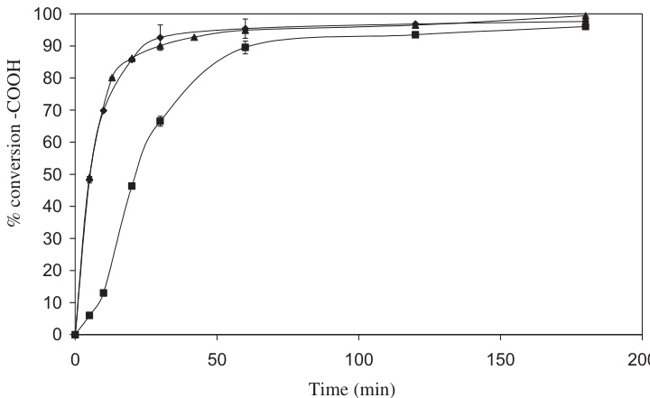
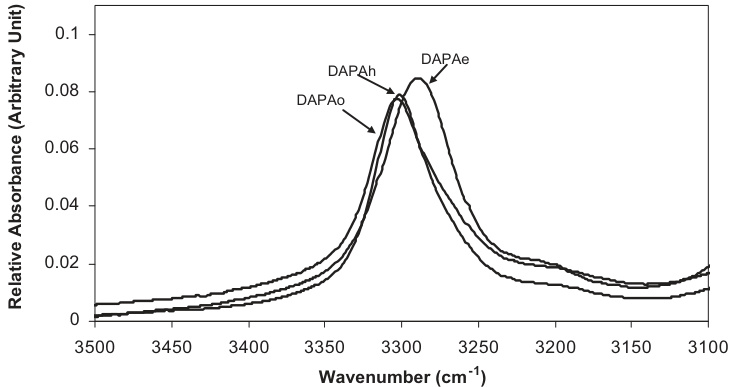
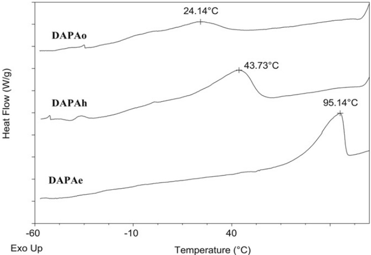
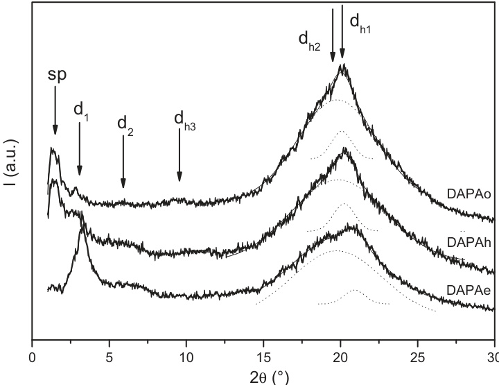
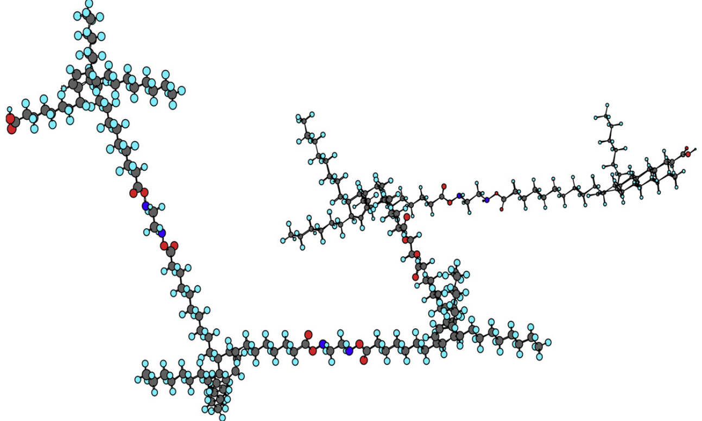
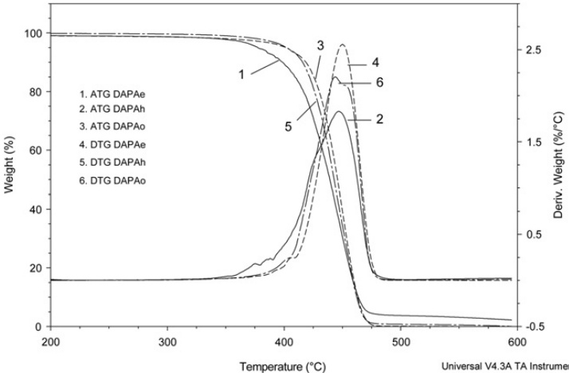

# Dimer acid-based thermoplastic bio-polyamides: Reaction kinetics, properties and structure  

Elodie Hablot a, Bertrand Donnio b, Michel Bouquey a, Luc Avérous a,\*  

a LIPHT-ECPM, EAc(CNRS) 4379, Université de Strasbourg, 25 rue Becquerel, 67087 Strasbourg Cedex 2, France b Institut de Physique et Chimie des Matériaux de Strasbourg (UMR 7504), CNRS, Université de Strasbourg, BP 43, F-67034 Strasbourg Cedex 2, France  

# a r t i c l e i n f o  

# a b s t r a c t  

Article history:   
Received 31 August 2010   
Received in revised form   
11 October 2010   
Accepted 12 October 2010   
Available online 26 October 2010 Keywords:   
Dimer fatty acids Aliphatic diamines Polyamides  

New dimer acid-based-polyamides were synthesized with rapeseed oil-based dimer acid (DA) and 1,2- diaminoethane, 1,6-diaminohexane or 1,8-diaminooctane to form DAPAe, DAPAh and DAPAo, respectively. Effects of diamine chain lengths on kinetics evolution as well as on the thermal, physical and mechanical properties of the different polyamides synthesized were investigated. DAPAo was found to be the most reactive diamine because of its higher nucleophilic character. Differential scanning calorimetry (DSC) combined with X-ray diffraction revealed a low-order semi-crystalline structure for all polyamides. A tentative schema for the structural organization of these DAPA is proposed and shows a specific organization with local semi-crystalline segregation domains. DAPAe was found to possess the higher melting temperature likely due to higher crystal cohesion, which was confirmed by higher Young modulus in stress-strain experiments. Rheological data showed an increase of the glass transition temperature concomitantly with the increase of diamine chain length. They also revealed an increase of complex viscosity with the diamine chain length. Investigation of thermal stability showed that DAPAe degrades before DAPAh and DAPAo in connection with the number of methylene units per diamine.  

$\circledcirc$ 2010 Elsevier Ltd. All rights reserved.  

# 1. Introduction  

Nowadays, replacing petroleum-based raw materials with renewable resources is a major concern in terms of both economical and environmental viewpoints [1]. Vegetable oils, present in abundance throughout the world, are expected to be ideal alternative chemical feedstock, since they have the particularity to contain several active chemical sites (double bonds, allylic moieties, ester groups, atoms in alpha of the ester groups) that can be used for polymerization purposes [2e6]. The glycerides are considered as building blocks to develop various types of innovative macromolecular architectures.  

While thermosets based on vegetable oils are largely developed because of the high functionality of triglycerides [7], thermoplastic materials have recently attracted researchers and industrials efforts. Except the PA 11 (Rilsan) from Arkema (France) elaborated from castor oil and produced since the 1940’s, most of these biobased thermoplastics are very recent such as, e.g., a new thermoplastics from dimer of fatty acid, called Platamid Rnew from Arkema.  

Dimers of fatty acids (DA), issued from vegetable oils and shown in Fig. 1, are well-known and commercially available. With two reactive functions per molecule, they are good candidates to elaborate thermoplastic polyamides by polycondensation [8e10]. DA are obtained by condensation of two unsaturated fatty acids such as oleic $56\%$ in rapeseed oil) and linoleic acids $26\%$ in rapeseed oil), for example. They are environmentally friendly chemicals, liquid at room temperature, noncrystalline, and have high molecular weights. Polyamides synthesized from these biobased dimer acids are less crystalline than conventional polyamides and are more flexible. Then they are widely used in printing inks, as varnishes and heat-seal coatings [11e13].  

Several syntheses based on DA have been reported in previous literature. Kinetics of condensation between ethylenediamine and DA was investigated by Kale et al. [14]. The reaction, studied in the temperature range of $399{-}465\mathrm{K}$ was found to be of overall second order with an activation energy of $76.44\mathrm{kJ}\mathrm{mol}^{-1}$ . Similar works were performed with and without catalysts [15,16].  

Kale et al. [13] have also worked on non-reactive fatty polyamides from dimer acid prepared with a mixture comprising polymeric fatty acids, diamines such as ethylenediamine and hexamethylenediamine, and an aliphatic monobasic acid or amine. They studied the degree and extent of reaction, the numberaverage molecular weight and the viscosity. More recently, Fan et al. [17] have investigated the thermal and swelling behaviour of soy-based-polyamides synthesized with and without $\alpha\cdot$ -aminoacid (L-tyrosine). Differential scanning calorimetric (DSC) showed that increasing L-tyrosine concentration in polyamides induced a significant decrease of the glass transition and melting temperatures, and of the copolyamides crystallinity tendency. As reported by Cavus et al. [8], monofunctional reactant such as acidic acid, oleic acid and propyl amine were used as comonomers to produce new dimer acid-based-polyamides. These comonomers greatly modified the final thermal properties. The influence of aromatic and aliphatic diamines in the physical properties was also investigated by Fan et al. [9]. It was found that polyamides inserting aromatic segments exhibited higher thermal performance. Very recently, a French team has developed an amazing self-healing and thermoreversible rubber by supramolecular assembly [18e21]. A mixture of fatty diacid and triacid was condensed first with diethylene triamine and then reacted with urea giving a mixture of oligomers with complementary hydrogen bonding groups such as amidoethyl imidazolidone, di(amidoethyl) urea and diamido tetraethyl triurea. Oligomers associate together to form both chains and cross-links via hydrogen bonds with recoverable extensibility.  

  
Fig. 1. Dimer acid structure.  

Only few studies have been reported in literature concerning the properties of dimer acid-based-polyamides, different factors such as the influence of chain length of aliphatic diamine has not been studied and reported yet. The objective of this work is to present a large study on thermoplastic polyamides (DAPA) based on dimer acid with three different aliphatic diamines, (i) 1,2-diaminoethane (ED), (ii) 1,6-diaminohexane (HD) and (iii) 1,8-diaminooctane (OD), referred to thereafter as DAPAe, DAPAh and DAPAo, respectively. The influence of the alkyl amine chain lengths on the chemical reaction kinetics, the characterisation and structure of the polyamides systems as well as the physical, mechanical properties and thermal stability of the corresponding products were investigated to present a complete and detailed study of these systems.  

# 2. Materials and methods  

# 2.1. Materials  

Dimer acid is supplied by Prolea (France). Radiacid 0970 presents an acid value (AV) of $194.5~\mathrm{mg~KOH/g}$ and transition temperature of $-50^{\circ}\mathrm{C}.$ . It is a yellowish, viscous liquid at room temperature with the dimer, trimer and monomer content of 96.6, 2.8 and $0.6\%$ wt, respectively. 1,2-Diaminoethane, 1,6-diaminohexane, 1,8-diaminooctane were purchased from Sigma Aldrich. All chemicals are used as received.  

# 2.2. Polyamide synthesis  

The polyamides were synthesized by bulk condensation polymerization at $453\mathrm{K}$ under a nitrogen atmosphere. Dimer acid and diamines were charged at $323\mathrm{K}$ (to avoid any volatilization of the reactants) in a 1L five-necked round-bottom flask equipped with mechanical stirrer, a thermometer, a nitrogen inlet and a DeaneStark apparatus. In all polymerization reactions, the ratio of total acid equivalents to total amine equivalents was kept close to 1, ideal stoechiometry.  

For kinetics measurements, 1,2-diaminoethane, 1,6-diaminohexane or 1,8-diaminooctane (previously heated over its melting temperature) was added with a dropping funnel over a period of $3\mathrm{min}$ directly at $453\mathrm{K}$ After the addition of the diamine, samples were taken out of the reactor and then titrated for the analysis of acid and amine end groups. The reaction was carried out within $^{3\mathrm{~h~}}$ (corresponding to the consumption of more than $99\%$ of the acid groups).  

The final materials, DAPAe, DAPAh and DAPAo, are yellowish, transparent and flexible at ambient temperature. They are stored under vacuum to avoid oxidation. As these materials contain around $85\%$ wt of renewable resources, they can be considered as “bio-polyamides”.  

# 2.3. Determination of kinetics parameters  

Carboxylic end groups of the polyamides were determined by titration in an isopropanol/toluene mixture (volume ratio $=1:1$ ) with $0.1\mathrm{~N~}$ KOH in methanol in presence of phenolphthalein as indicator. Amine end groups were determined by titration in an isopropanol/toluene mixture (volume ratio $=1:1$ ) with freshly standardized $0.1\mathrm{NHCl}$ in isopropanol by using bromocresol green solution as indicator. For all titration experiments, at least three replicates, including a blank titration of solvent, were collected for determining the reproducibility.  

# 2.4. Size exclusion chromatography (SEC)  

Size exclusion chromatography (SEC) measurements were performed using a Shimadzu apparatus equipped with an RID-10A refractive index detector. The columns used were PLGel Mixed-C and PLGel $100\mathring{\mathbf{A}}$ . The calibration was performed with PS standards from 580 to $1,650,000\mathrm{g/mol}$ . Chloroform (puriss p.a., Riedel-de Haën) was the mobile phase and the analyses were carried out at $40^{\circ}{\mathsf{C}}$ with a solvent flow rate of $1\mathrm{mL/min}$ .  

# 2.5. Differential scanning calorimetry (DSC) and thermal gravimetric analysis (TGA)  

DSC measurements were performed on DSC 2910 TA Instruments under airflow. To determine the thermal characteristics, the samples $(5{-}10\mathrm{mg}$ placed in an aluminium pan) were heated up to $150^{\circ}\mathrm{C}$ at $10^{\circ}C/\operatorname*{min}$ . Then, the temperature was maintained for $3\mathrm{min}$ to get rid of thermal history. Then, samples were cooled to $-40^{\circ}\mathrm{C}$ at $10^{\circ}{\mathsf{C}}/{\operatorname*{min}}$ and heated again to $200^{\circ}\mathrm{C}$ at $10^{\circ}C/\operatorname*{min}$ . The glass transition $T_{\mathrm{{g}}}$ and the melting temperature $T_{\mathrm{m}}$ were determined from the inflexion point and the maximum of melting temperature peak, respectively. These values were determined on the second heating scan. TGA measurements were conducted under nitrogen flow using a Hi-Res TGA 2950 apparatus from TA Instruments. The samples $\mathrm{10}{-}20\mathrm{mg}$ placed in an aluminium pan) were heated up to $600^{\circ}\mathrm{C}$ at $10^{\circ}C/\operatorname*{min}$ . The characteristic degradation temperatures are the temperatures at the maximum of the derivative thermogram (DTG) curve $(T_{\mathrm{dmax}})$ and at which the sample weight equals $98\%$ and $2\%$ of the initial one ( $T_{98\%}$ and $T_{2\%}$ .  

# 2.6. X-ray diffraction (XRD) and optical microscopy  

The XRD patterns were obtained with two different experimental set-ups. In all cases, a linear monochromatic $\mathrm{Cu-K}\mathfrak{a}_{1}$ beam $(\lambda=1.5405\mathrm{~\AA~}^{\circ})$ ) was obtained using a sealed-tube generator (900 W)  

  
Fig. 2. Conversion of carboxylic acid vs. time for DAPAe $(\pmb{\triangleright}),$ DAPAh $\mathbf{\Psi}(\blacktriangle)$ and DAPAo $(\blacktriangle)$ .  

equipped with a bent quartz monochromator. A DebyeeScherrerlike geometry was used. The crude film was filled in Lindemann capillaries of $1\mathrm{mm}$ diameter and $10\upmu\mathrm{m}$ wall thickness. An initial set of diffraction patterns was recorded on an image plate; periodicities up to $80\mathrm{\dot{A}}$ can be measured, and the sample temperature controlled to within $\pm0.3^{\circ}\mathrm{C}$ from 20 to $200^{\circ}{\mathsf{C}}.$ The second set of diffraction patterns was recorded with a curved Inel CPS 120 counter gas-filled detector linked to a data acquisition computer; periodicities up to $60\mathring{\mathbf{A}}$ can be measured, and the sample temperature controlled to within $\pm0.05^{\circ}\mathrm{C}$ from 20 to $200^{\circ}{\cal C}$ .  

Lattice spacing $(d)$ of polyamides was calculated using the Bragg’s law (Eq. (1)) where $n$ is the diffraction order. $\uplambda$ is the wavelength of $\mathsf{X}$ -rays, $d$ is the spacing between the planes in the atomic lattice and $\theta$ is the angle between the incident ray and the scattering planes.  

$$
2d\sin\theta=n\lambda
$$  

The optical textures were studied with a Leitz polarizing microscope equipped with a Mettler FP80 hot-stage and a FP80 central processor.  

# 2.7. Attenuated total reflection-Fourier transform infrared (ATRFTIR)  

ATR-FTIR was used to estimate the evolution of the $\mathrm{N-H}$ stretching absorption band of amide. The ATR-Spectra were collected at a resolution of $4\mathrm{cm}^{-1}$ and 64 scans per run, with a TA instrument SDT Q600 (Thermo-Nicolet). Spectra Tech ATR accessory is used with a germanium Ge $\left(n=4\right)$ crystal at a nominal incident angle of $45^{\circ}$ , yielding to 12 interval reflections at the polymer surface.  

# 2.8. Rheological and stressestrain analysis  

The rheological properties of the polyamides were investigated using ARES-rheometer (ARES III machine, TA Instrument, USA) operated in the dynamic mode with rectangular torsion geometry below melting temperature and a parallel plate geometry above melting temperature. The range temperature varied from $-40^{\circ}\mathrm{C}$ to  

Table 1 Kinetics rate of the synthesis of DAPAs.   

<html><body><table><tr><td>Sample(Numberofcarbonin the diamineblock)</td><td>k (kg mol-1 min-1)</td><td>pKb1/pKa2ofdiamines implied in thereaction</td></tr><tr><td>DAPAe (2)</td><td>0.0213</td><td>6.44/3.29</td></tr><tr><td>DAPAh (6)</td><td>0.1084</td><td>3.24/2.14</td></tr><tr><td>DAPAo (8)</td><td>0.1096</td><td>3.00/3.90</td></tr></table></body></html>  

Table 2 Theoretical and experimental number-average molecular weight of polyamides.   

<html><body><table><tr><td></td><td>r</td><td>pa</td><td>DPn,th</td><td>Mn,th (g/mol)</td><td>Mn,exp (g/mol)</td><td>Mw,exp (g/mol)</td><td>PD</td></tr><tr><td>DAPAe</td><td>0.97</td><td>0.97</td><td>22</td><td>6570</td><td>4700</td><td>16,300</td><td>3.5</td></tr><tr><td>DAPAh</td><td>0.99</td><td>0.98</td><td>42</td><td>13,740</td><td>13,800</td><td>43,100</td><td>3.1</td></tr><tr><td>DAPAO</td><td>0.99</td><td>0.97</td><td>29</td><td>9770</td><td>5700</td><td>26,000</td><td>4.6</td></tr></table></body></html>

a $p$ determined from acid conversion.  

$150^{\circ}\mathrm{C},$ at a heating rate of $2^{\circ}{\mathsf{C}}{\mathsf{m i n}}^{-1}$ and at a frequency of $1\mathrm{Hz}$ . Samples dimensions are $40\times10\times1.5\mathrm{mm}^{3}$ Uniaxial tensile tests are carried out with an Instron tensile testing machine (model 4204, USA, load cell: $10\mathsf{k N}.$ ), at $25^{\circ}{\mathrm{C}}$ and at a rate of $10\mathrm{mm}\mathrm{min}^{-1}$ , using dumbbell specimens (dimensions: $30\times10\times1.5\mathrm{mm}^{3}.$ ). For each formulation at least five samples were tested.  

# 3. Results and discussion  

# 3.1. Kinetics and calculation of reaction rate constants  

To estimate the influence of the diamines chain length on polymerization kinetics, conversion of acid value against time for the three polyamides synthesized is plotted in Fig. 2. Reaction rate constants are obtained from these results and are exhibited in Table 1. Since the reactions are homogeneous with equivalent amount of amine and carboxylic acid groups, rate constants are calculated from Eq. (2), which is integrated from a second order kinetic model.  

$$
\frac{1}{C_{A}}-\frac{1}{C_{A0}}=k t
$$  

$C_{A0}$ and $C_{A}$ are the COOH initial concentrations at $t=0$ and at time t, respectively, expressed as $\mathrm{mol}\mathrm{kg}^{-1}\mathrm{min}^{-1}$ , $k$ is the second order rate constant expressed as $\mathrm{kg}\mathrm{mol}^{-1}\mathrm{min}^{-1}$ and $t$ is the reaction time in minutes. $k$ varies from $0.0213\mathrm{mol}\mathrm{kg}^{-1}\mathrm{min}^{-1}$ for DAPAe to $0.1096\mathrm{mol}\mathrm{kg}^{-1}\mathrm{min}^{-1}$ for DAPAo. These values are in the same range than those previously determined by Heidarian et al. [15].  

It is observed that the longer the diamine chain length, the faster the reaction in spite of the higher steric hindrance. This can be explained by the higher basic character of the first amine of longer diamines as stressed from $p\mathsf{K}_{b}$ values exhibited in Table 1 [22e24]. Diamines with longer chain lengths are more basic and thus more nucleophilic and react faster.  

# 3.2. Determination of molecular weight  

The number-average molecular weight, $M_{\mathrm{n}}$ of polyamides synthesized was determined experimentally from size exclusion chromatography and compared with theoretical values [25]. The number-average molecular weight from theory, $M_{\mathrm{n,th}}$ , was determined from degree of polymerization, calculated from Eq. (3) where $r$ is determined by Eq. (4).  

$$
\overline{{\mathrm{DP}}}_{n}=\frac{1+r}{1+r-2r p}
$$  

Table 3 Thermal properties and crystalline characteristics of DAPAs.   

<html><body><table><tr><td></td><td>Tg (°C)</td><td>Tc (°C)</td><td>Hc (J/g)</td><td>）Tm(°C)</td><td>Hm (J/g)</td><td>Hm (J/g）</td><td>Xc (%)</td><td>%wt amide</td></tr><tr><td>DAPAe</td><td>17</td><td>95</td><td>15</td><td>105</td><td>16</td><td>192</td><td>8</td><td>14.7</td></tr><tr><td>DAPAh</td><td>-10</td><td>44</td><td>17</td><td>81</td><td>18</td><td>198</td><td>9</td><td>13.4</td></tr><tr><td>DAPAo</td><td>-5</td><td>24</td><td>20</td><td>79</td><td>20</td><td>201</td><td>10</td><td>12.8</td></tr></table></body></html>  

  
Fig. 3. DSC thermograms (second heating scan) of DAPAe, DAPAh and DAPAo.  

$$
r=\frac{N_{\mathrm{A}}^{0}}{N_{\mathrm{B}}^{0}}
$$  

$N_{\mathrm{A}}^{0}$ and $N_{\mathrm{B}}^{0}$ are the number of amine and carboxylic functions at initial time, respectively, $p$ is the degree of advancement of the reaction and determined from acid conversion. By considering the differences of amine and acid conversion after 3 hours of reaction, r values were found at 0.97, 0.99 and 0.99 for DAPAe, DAPAh and DAPAo, respectively. Table 2 presents the index of polydispersity (PD) and the number-average molecular weight issued from size exclusion chromatography with RID detector $(M_{\mathrm{n,exp}})$ , the theoretical degree of polymerization $(\mathrm{DP_{n,th}})$ and number-average molecular weight $(M_{\mathrm{n,th}})$ .  

The lower r value for DAPAe is essentially due to 1,2-diaminoethane evaporation during the chemical reaction inducing a lower $\mathsf{p}$ value. Concerning DAPAo, the lower p conversion rate can be linked to the lower reactivity of the second diamine of 1,8-diaminooctane, which is less basic as seen from the value of $p{\sf K}_{b}$ in Table 1. These limitations can explain the higher DP values found for DAPAe and DAPAo.  

# 3.3. Thermal properties and solid state properties  

The thermal behaviour of the three polyamides was investigated by DSC. Table 3 summarizes the thermal properties of the different polyamides. Glass transition temperatures $(T_{\mathrm{g}})$ , heats of crystallization $\left(\Delta{{H}_{\mathrm{c}}}\right)$ , crystallization temperatures $(T_{\mathrm{c}})$ , melting temperatures $\left(T_{\mathrm{m}}\right)$ , melting heats $\left(\Delta H_{\mathrm{m}}\right)$ and percentages of crystallinity $(X_{\mathrm{c}})$ are determined and calculated from the DSC thermograms.  

  
Fig. 4. Amide stretching absorption region FT-IR data for DAPAe, DAPAh and DAPAo.  

  
Fig. 5. Crystallization from DSC diagram for DAPAe, DAPAh and DAPAo.  

Crystallinities of the polyamides were determined by Eq. (5), where the $\Delta H_{\mathrm{m}}^{0}$ values were theoretically calculated [26] for $100\%$ crystalline polyamides.  

$$
X_{\mathrm{c}}(\%{\mathrm{crystallinity}})={\frac{\Delta H_{\mathrm{m}}}{\Delta H_{\mathrm{m}}^{0}}}\times100\
$$  

The second heating scans of the DSC thermograms of DAPAe, DAPAh and DAPAo are shown in Fig. 3. First, we can notice that $T_{\mathrm{g}}$ of DAPAe is difficult to be determined from the DSC thermogram due to a low Cp gap. But the determined value is in good agreement with the corresponding data obtained from DMA characterisation (see below).  

The longer the chain of the diamine, the higher the $T_{\mathrm{{g}}}$ varying from $-17^{\circ}\mathrm{C}$ to $-5{}^{\circ}{\mathsf{C}}$ for DAPAe and DAPAo, respectively. DA possesses rings with small and aliphatic grafted chains, which adds conformational disorder free volume and then increases chains mobility, likely responsible of the observed $T_{\mathrm{{g}}}$ trend. The lower number-average molecular weight found for DAPAe could also explain the corresponding low $T_{\mathrm{g}}$ value. In contrast, the melting temperature increases when diamine chain length decreases. In particular, a large $T_{\mathrm{m}}$ gap is particularly observed between DAPAe and the others DAPA, varying from $104^{\circ}\mathrm{C}$ to about $80^{\circ}C$ , respectively. It is a consequence of the higher proportion of flexible chain in DAPAh and DAPAo (or the lower proportion of amide units per methylene unit). This hypothesis is firstly confirmed by FTIR-ATR spectra of the three polyamides shown in Fig. 4.  

Table 4 Peak position, intensity of the peak and spacing between organized planes (d) of polyamides at $20~^{\circ}C$ .   

<html><body><table><tr><td>Polymers</td><td>Diffuse peaks</td><td>Peak positions/</td><td>Intensity</td><td>Distances (A)</td><td>Indexation (00l)</td></tr><tr><td>DAPAe</td><td>sp</td><td>一</td><td>一</td><td>一</td><td>一</td></tr><tr><td></td><td>d1</td><td>3.20</td><td>S</td><td>27.60</td><td>001</td></tr><tr><td></td><td>d2</td><td>6.60</td><td>vw</td><td>13.40</td><td>002</td></tr><tr><td></td><td>dh3</td><td>一</td><td>一</td><td>一</td><td></td></tr><tr><td></td><td>dh2</td><td>19.70</td><td>VS</td><td>4.50</td><td></td></tr><tr><td>DAPAh</td><td>dh1</td><td>20.90</td><td>VS</td><td>4.25</td><td></td></tr><tr><td></td><td>sp</td><td>1.45</td><td>S</td><td>60.87</td><td>Sp</td></tr><tr><td></td><td>d1 d2</td><td>2.90</td><td>W</td><td>30.44</td><td>001</td></tr><tr><td></td><td>dh3</td><td>6.00</td><td>Vw</td><td>14.70</td><td>002</td></tr><tr><td></td><td>dh2</td><td>10.20</td><td>vw</td><td>8.70</td><td></td></tr><tr><td></td><td></td><td>19.85</td><td>S</td><td>4.46</td><td></td></tr><tr><td>DAPAo</td><td>dh1</td><td>20.34</td><td>VS</td><td>4.36</td><td></td></tr><tr><td></td><td>sp</td><td>1.40</td><td>S</td><td>63.05</td><td>Sp</td></tr><tr><td></td><td>d1</td><td>2.70</td><td>W</td><td>32.70</td><td>001</td></tr><tr><td></td><td>d2</td><td>5.80</td><td>vw</td><td>15.76</td><td>002</td></tr><tr><td></td><td>dh3</td><td>9.55</td><td>VW</td><td>9.25</td><td></td></tr><tr><td></td><td>dh2</td><td>19.79</td><td>S</td><td>4.48</td><td></td></tr><tr><td></td><td>dh1</td><td>20.10</td><td>VS</td><td>4.40</td><td></td></tr></table></body></html>

VS, very strong; S, strong; W, weak; VW, very weak; sp. superstructure.  

  
Fig. 6. Small-angle XRD patterns of DAPAe, DAPAh and DAPAo at $20~^{\circ}\mathrm{C}$  

The presented region corresponds to the $\mathrm{N{-}H}$ stretching absorption of amide band (at about $3300\mathrm{cm}^{-1}.$ ). For DAPAe, the peak position is about $20\mathrm{cm}^{-1}$ lower in energy than DAPAh and DAPAo one. It suggests that the intermolecular amide-amide hydrogen bonding is higher for DAPAe [27]. Moreover, cold crystallization phenomenon is observed for DAPAo (Fig. 5), which means that the kinetic of the crystallites formation is lower.  

This hypothesis is also confirmed by the wider crystallization temperature windows for the higher diamine chain length (Fig. 5).  

It appears that the structuration kinetics of the crystallites slow down when the amine spacer is increased. This is confirmed by DSC thermograms, which exhibit a small increase of $X_{\mathrm{c}}$ with increasing chain length based on diamines. Higher cristallinity indicates that organized zones could be larger. This hypothesis is correlated with the X-ray diffraction data, presented thereafter (Table 4 and Fig. 6).  

All the samples exhibit a very strong diffraction signal with a maximum at about $2\theta=19.7{-}20.9^{\circ}$ , corresponding to distances of about $4.3\mathrm{-}4.5\mathring\mathrm{A}$ $(d_{\mathrm{h1}}$ and $d_{\mathrm{h}2}$ ). This distance is characteristic of the average separation between amorphous chains in liquid-like short-range interaction [28]. Comparing the three compounds, this signal comprises, in fact, two peaks for DAPAe, not discernible for DAPAh and DAPAo. The presence of the second maximum (DAPAe) is indicative of short-range interaction between neighboured DA cycles. Additional broad and weak signals are observed at about $2\theta=9.6\substack{-10.2^{\circ}}$ or $d_{\mathrm{h3}}=8.7\mathrm{-}9.2\mathring{\mathrm{A}}$ for DAPAh and DAPAo and $2\theta=5.8\substack{-6.6^{\circ}}$ or $d_{2}=14.7\mathrm{-}15.8\mathring{\mathrm{A}}$ for the three polymers. A last, less broad signal, is observed in the small-angles at about $2\theta=2.7-3.2^{\circ}$ (or $d_{1}=\bar{2}7.6-32.7\mathring{A};$ . This distance (represented by the red arrows with Scheme 2) is in correlation with the distance between two consecutive amide groups (or DA cycle) of the same polymeric chain. We can observe a 1:2 ratio between ${\bf d}_{2}$ and ${\bf d}_{1}$ (and between $d_{\mathrm{h}2}$ and $d_{\mathrm{h3.}}$ , indicating the presence of equidistant planes, corresponding to alternated stacking of chains, characteristic of a preorganization into pseudo-lamellar structure.  

However, for DAPAh and DAPAo, $d_{1}$ increases and the corresponding peak becomes larger and presents a weaker intensity, which clearly indicates that the segregation decreases and that the number of quasi-periodic conformation increases, due to the increase of flexibility of the diamine chains. The high intensity of the peaks at $2\theta=1.4^{\circ}$ is in agreement with large amount of defects at the boundaries. It induces defects (grain boundaries), which are responsible of the superstructure (sp). As seen in Scheme 1, a polyamide chain is not strictly linear. Flexibility is possible by long alkyl chains. As mentioned above from the different observation, possible interpretation of $\mathsf{X}$ -ray signals is to consider the formation of embryos of a pseudo-lamellar arrangement of the polyamides as proposed in Scheme 2. Two ideal organizations likely co-exist; the first implies stretched chains and the second, withdrawn chains, as seen in Scheme 2a and b, although these structures should be analyzed with care. Taking into account the peak line-shape, it is obvious that each family of planes is spaced from a distance d which can vary substantially. The intermediate organization, represented in Scheme 2c is thus more probable. The width of the peaks also indicates that each conformation is built with only few repetitions, which is characteristic for local intermolecular H-bond semi-crystalline segregation. Thus, the supramolecular models, presented in Scheme 2 (a and b) represent only very local arrangement of the chains; these small domains are not correlated over too long distances. Considering to the interaction present in these material, it is possible to generate “transient networks”, as already observed in the literature [18]. However, regarding to the distance $d_{1}$ of DAPAo and DAPAh, this is obvious that chains are not well packed (high conformational entropy), which could facilitate the orientations of pendant chains present in DA along the aliphatic chains, leading to various degrees of organization in the amorphous part and to higher fusion enthalpy, as observed in Table 3. On the contrary, because of the observation of a higher intensity for this peak with a lower $d_{1}$ , we can imagine that hard domains brought by short chains of ethylenediamine chains force the formation of hydrogen bonds and the phase segregation of amide groups and DA. The organization of the pendant chains on DA is thus more difficult, resulting in lower melting enthalpy and higher free volume (lower $T_{\mathrm{g}}$ ) as previously noticed. Lower $T_{\mathrm{g}}$ values can also be explained by the better segregation of DAPAe. Dispersion of hard segments (amides groups) in soft segments (DA) is limited (compared to DAPAo) and motion of amorphous chains is thus higher.  

  
Scheme 1. Schematic view of a DAPA chain (oxygen atoms are in red, nitrogen atoms in dark blue, hydrogen atoms in light blue and carbon atoms in grey). (For interpretation of the references to colour in this figure legend, the reader is referred to the web version of this article).  

  
Scheme 2. Possible arrangements of DAPA chains (amide groups in red and DA cycle in dark cycle): (a) and (b) ideal packing of the polymeric chains (linear, zigzag), (c) intermediate organization. (For interpretation of the references to colour in this figure legend, the reader is referred to the web version of this article).  

# 3.4. Rheological properties  

The dynamic mechanical behaviour of the different samples has been studied. Fig. 7 depicts the temperature dependence on the $G^{\prime}$ modulus (stiffness) and tan $\delta$ (damping) for the three polyamides.  

Main relaxation temperatures are determined from the maximum of tan $\delta$ and from the intersections of the storage modulus $G^{\prime}$ and the loss modulus $G^{\prime\prime}$ respectively (Table 5).  

As previously noticed for $T_{\mathrm{g}}$ and $T_{\mathrm{m}}$ (DSC characterisation) and since the relaxation temperature $(T_{\mathfrak{A}})$ can be associated with the glass transition $(T_{\mathrm{g}})$ , the higher the diamine chain length, the higher the $T_{\alpha}$ and the lower the $T_{\mathrm{m}}$ . Values of $G^{\prime}$ are similar on the rubber plateau for DAPAe and DAPAh $(1.2\mathrm{E}{+}8\mathrm{MPa})$ and slightly lower for DAPAo $\mathrm{(3.4E+7MPa_{,}^{\circ}}$ ). Moreover, before the fusion, damping values are higher for DAPAo, DAPAh and DAPAe. Thus, DAPAe is the stiffest of the three materials and DAPAo, the most flexible one. This high stiffness of DAPAe is due to the high concentration of hydrogen bonds between the amide units. Moreover, as already shown before, longer chains bring higher mobility for DAPAo, making it softer [29]. Additionally, higher polydispersity increases stress relaxation and plays a key role in the low stiffness of DAPAo [30]. The storage modulus values after $T_{\mathrm{m}}$ decreases sharply, indicating higher macromolecular motions. However, $G^{\prime}$ and $G^{\prime\prime}$ (directly linked to the complex viscosity, $\boldsymbol{\mathrm{Eta}}^{*}$ ), decrease with the diamine chain length, which is unexpected considering the higher concentration of amide units in DAPAe. Complementary studies of the evolution of $G^{\prime}$ as a function of the frequency at $T_{\mathrm{m+20^{\circ}C}}$ for the three polyamides showed that the values obtained at $1\mathrm{Hz}$ correspond to the viscous flow region and not to the rubber plateau. Then the chains entanglements cannot explain the evolution of $G^{\prime}$ and $\boldsymbol{\mathrm{Eta}}^{*}$ . Moreover, observation of the sample by polarized light optical microscopy did not highlight any birefringence, thus confirming that there is no reminiscence of low temperature organization. This plateau could thus be explained by the persistence of hydrogen bonds at high temperature. Moreover, the higher mobility of hexane diamine allows more numerous conformations and favour interactions between chains. Another effect, which could weight in these modulus values, is the difference of numberaverage molecular weight, especially for DAPAe. The low $M_{\mathrm{n}}$ could be responsible of the corresponding low $G^{\prime}$ and $G^{\prime\prime}$ values.  

  
Fig. 7. Storage modulus $\left(G^{\prime}\right)$ and damping factor (tan d) as a function of temperature for DAPAe, DAPAh and DAPAo.  

# 3.5. Mechanical properties  

Uniaxial tensile test results at $25^{\circ}{\mathrm{C}}$ are shown in Fig. 8 and the main mechanical properties are summarized in Table 6.  

The Young’s modulus and the yield stress are lower with higher diamine chain length. The Young’s modulus decreases from 372 to $222\mathsf{M P a}$ and to $163\mathrm{MPa}$ for DAPAe, DAPAh and DAPAo, respectively. As expected, higher modulus and yield stress are observed for DAPAe. It is due to the higher material cohesion due to the more numerous hydrogen bonds previously observed from FT-IR data and  

Table 5 Dynamic mechanical properties of isotropic samples.   

<html><body><table><tr><td></td><td>Tα(°C)/tanat maximum peak</td><td>G'(Pa)/tan at50°C</td><td>Tm (°C)</td><td>G' (Pa)/tan 0/Eta*(Pa s) at Tm+20°C</td></tr><tr><td>DAPAe</td><td>16/0.129</td><td>1.2E+8/0.065</td><td>103</td><td>61/19.0/185</td></tr><tr><td>DAPAh</td><td>6/0.154</td><td>1.2E+8/0.073</td><td>84</td><td>5123/2.9/2475</td></tr><tr><td>DAPAo</td><td>16/0.279</td><td>3.4E+7/0.123</td><td>80</td><td>40856/1.0/9356</td></tr></table></body></html>  

  
Fig. 8. Uniaxial tensile mechanical behaviour. Evolution of stress vs. strain for different polyamides.  

X-ray diffraction patterns. We have observed necking (diminution of the central section, which propagates on the length of the dumbbell) for the three polyamides. During the striction, a lower decrease of sample section for DAPAh and DAPAo was observed certainly due to their higher molecular weights and to lower segregations observed for these materials. Higher striction and lower elongation at break are observed for DAPAe. Undoubtedly, this is due to the combined effects of lower chain length and higher crystalline cohesion of DAPAe.  

# 3.6. Thermal stability  

Thermal degradation temperatures of the different polyamides systems were determined by thermogravimetric analysis. The TGA and DTG thermograms of DAPAe, DAPAh and DAPAo under nitrogen atmosphere are shown in Fig. 9.  

$T_{98\%}$ Tdmax and $T_{2\%}$ data are summarized in Table 7. For all polyamides, a small weight loss at $170^{\circ}\mathrm{C}$ shows the linked water vaporisation (0.71 %wt, $0.22\%$ wt and 0.12 %wt for DAPAe, DAPAh and DAPAo, respectively, after stabilization of the polyamides at $50\%\mathrm{RH}$ at $23^{\circ}C)$ . The second stage of degradation involves major degradation, starting at 344, 351 and $378^{\circ}\mathrm{C}$ for DAPAe DAPAh and DAPAo, respectively. Above $450^{\circ}\mathrm{C}$ , the final degradation and volatilization become very fast for the three polyamides. The thermograms do not show any appreciable weight losses above $470^{\circ}\mathrm{C}.$ The DTG peak gives the temperature corresponding to the maximum degradation $(T_{\mathrm{dmax}})$ . They occur almost at the same temperature for all polyamides, e.g. $450^{\circ}\mathrm{C}$ .  

Thermal polyamides degradation has been studied by various researchers [31e36], especially degradation on PA 6 and PA 6e6. Thermal decomposition of PA 6 starts with homolytic scission of the $N\cdot$ -alkylamide bond so that primary amide, nitrile, vinyl and alkyl chain ends are generated [32,36]. Thermal decomposition of PA 6e6 has also been extensively studied. It has been suggested that the main PA 6e6 degradation is based on the adipic acid fragmentation to undergo cyclisation results in the formation of some cyclic products as well as carbon dioxide [32]. Even if the polyamides studied in this paper have not the same structures, compared to PA 6 and PA 6e6, we can expect equivalent degradation mechanisms especially for the alkylamide bond. Polyamides thermal degradation begins by the ruin of this last bond. DAPAe starts to degrade first because it has a higher amide units concentration. The degradation of the alkyl units, which are the major components of the chains, occurs at a higher and common temperature for all polyamides. This last phenomenon explains the similar degradation temperatures, which are determined at the maximum DTG peaks.  

Table 6 Mechanical properties of DAPAe, DAPAh and DAPAo.   

<html><body><table><tr><td></td><td>E (MPa)</td><td>Yield stress (MPa)</td><td>Elongation at break (%)</td></tr><tr><td>DAPAe</td><td>372±25</td><td>15.5±0.1</td><td>317±16</td></tr><tr><td>DAPAh</td><td>222±4</td><td>11.9±3.0</td><td>>600</td></tr><tr><td>DAPAo</td><td>163 ± 19</td><td>12.4 ± 0.4</td><td>>600</td></tr></table></body></html>  

  
Fig. 9. Thermograms (TGA) and derivate thermograms (DTG) for DAPAe, DAPAh and DAPAo.  

Table 7 Main degradation temperatures for the different polyamides.   

<html><body><table><tr><td></td><td>T98% (°C)</td><td>Tdmax (°C)</td><td>T2% (°C)</td></tr><tr><td>DAPAe</td><td>344</td><td>447</td><td>594</td></tr><tr><td>DAPAh</td><td>351</td><td>450</td><td>471</td></tr><tr><td>DAPAo</td><td>378</td><td>444/452</td><td>471</td></tr></table></body></html>  

# 4. Conclusions  

Biobased-polyamides were synthesized in bulk from rapeseed oil-based dimer acid and three aliphatic diamines, 1,2-diaminoethane or 1,6-diaminohexane or 1,8-diaminooctane to form DAPAe, DAPAh and DAPAo, respectively. A systematic investigation of the chemical reaction kinetics, thermal, physical and mechanical properties of the corresponding products enables us to evaluate the influence of the chain length of the diamine on the properties of the polyamides. Because of its greater chain length, 1,8-diaminooctane shows a higher nucleophilic character. Differential scanning calorimetry and X-ray diffraction revealed low organization for the three polyamides, with local semi-crystalline segregation, stabilized by the formation of “transient networks”. $T_{\mathrm{m}}$ is higher with DAPAe due to the higher proportion of amide units, which are bonded by strong hydrogen bonds. This is in agreement with higher Young modulus. Moreover, due to a higher free volume brought by pendant aliphatic chain on DA combined to lower molecular weight and better phase segregation, lower $T_{\mathrm{{g}}}$ is observed for DAPAe then DAPAh and finally for DAPAo. Investigation of thermal stability revealed that DAPAe degrades before DAPAh and DAPAo likely because of the higher amide concentration. Rheological data revealed higher modulus values after $T_{\mathrm{m}}$ for higher diamine chain length.  

This study showed that the length of diamine chain length has a significant influence on polyamides properties and revealed unexpected results especially concerning the molten state behaviour. In good agreement with the emergent concept of sustainable development, these novel biobased materials are very attractive because they present specific properties which can be easily tailored by selecting the appropriate diamine and then can fulfil some industrial requirements for different fields such as, e.g. adhesives, varnishes and coatings.  

# Acknowledgment  

The authors thank the CNRS-UDS (IPCMS: Institut de Physique et Chimie des Matériaux de Strasbourg) for their technical support. In addition, authors are grateful to Dr. Cyril Brochon and Pr. René Muller from the LIPHT (Laboratoire d’Ingénierie des Polymères pour les Hautes Technologies) and Dr. Benoît Heinrich (Institut de Physique et Chimie des Matériaux de Strasbourg) for helpful discussions. Prolea is also acknowledged for providing dimer acid.  

# References  

[1] Chattopadhyay DK, Webster DC. Progress in Polymer Science (Oxford) 2009;34(10):1068e133.   
[2] Hablot E, Matadi R, Ahzi S, Avérous L. Composites Science and Technology 2010;70(3):504e9.   
[3] Meier MAR, Metzger JO, Schubert US. Chemical Society Reviews 2007;36 (11):1788e802.   
[4] Khot SN, Lascala JJ, Can E, Morye SS, Williams GI, Palmese GR, et al. Journal of Applied Polymer Science 2001;82(3):703e23.   
[5] Guner FS, Yagci Y, Erciyes AT. Progress in Polymer Science 2006;31 (7):633e70.   
[6] Biermann U, Friedt W, Lang S, Lühs W, Machmüller G, Metzger JO, et al. Angewandte Chemie e International Edition 2000;39(13):2207e24.   
[7] Hablot E, Zheng D, Bouquey M, Averous L. Macromolecular Materials and Engineering 2008;293(11):922e9.   
[8] Cavus S, Gurkaynak MA. Polymers for Advanced Technologies 2006;17(1):30e6.   
[9] Fan XD, Deng YL, Waterhouse J, Pfromm P. Journal of Applied Polymer Science 1998;68(2):305e14.   
[10] Deng YL, Fan XD, Waterhouse J. Journal of Applied Polymer Science 1999;73 (6):1081e8.   
[11] Chen XM, Zhong H, Jia LQ, Ning JC, Tang RG, Qiao JL, et al. International Journal of Adhesion and Adhesives 2002;22(1):75e9.   
[12] Byrne LF. Paint Technology 1962;26(3):28e38.   
[13] Cowan JC. Journal of the American Oil Chemists’ Society 1962;39:534e45.   
[14] Kale V, Vedanayagam HS, Devi KS, Rao SV, Lakshminarayana G, Rao MB. Journal of Applied Polymer Science 1988;36(7):1517e24.   
[15] Heidarian J, Ghasem NM, Daud WW. Chemical Engineering Journal 2004;100 (1e3):85e93.   
[16] Ghasem NM, Heiderian J, Daud WW. Asia-Pacific Journal of Chemical Engineering 2007;2(6):599e608.   
[17] Fan XD, Deng YL, Waterhouse J, Pfromm P, Carr WW. Journal of Applied Polymer Science 1999;74(6):1563e70.   
[18] Cordier P, Tournilhac F, Soulié-Ziakovic C, Leibler L. Nature 2008;451 (7181):977e80.   
[19] Montarnal D, Tournilhac F, Hidalgo M, Couturier JL, Leibler L. Journal of the American Chemical Society 2009;131(23):7966e7.   
[20] Montarnal D, Cordier P, Soulié-Ziakovic C, Tournilhac F, Leibler L. Journal of Polymer Science, Part A: Polymer Chemistry 2008;46(24):7925e36.   
[21] Halary JL, Avérous L, Borredon ME, Bourbigot S, Boutevin B, Bunel C, et al. L’actualité chimique 2010;338e339:41e53.   
[22] Baraiya R, Thakkar JR. International Journal of Polymeric Materials 1996;32 (1e4):119e23.   
[23] deDamborenea J, Bastidas JM, Vazquez AJ. Electrochimica Acta 1997;42 (3):455e9.   
[24] CRC handbook of chemistry and physics. 83rd ed. Boca Raton, FL, USA: CRC Press; 2002.   
[25]. Maréchal E. Techniques de l’Ingénieur, traité Plastiques et Composites 2000;AM 3(041):1e15.   
[26] Van Krevelen DW, Te Nijenhuis K. In: 4th Revised ed., editor. Properties of polymers: their correlation with chemical structure; their numerical estimation and prediction from additive group contributions. Amsterdam: Elsevier; 2009.   
[27] McQuade DT, McKay SL, Powell DR, Gellman SH. Journal of the American Chemical Society 1997;119(36):8528e32.   
[28] Guinier A. La structure de la matière: du bleu du ciel à la matière plastique. Paris: Hachette; 1980.   
[29] Khatri BS, Byrne K, Kawakami M, Brockwell DJ, Smith DA, Radford SE, et al. Faraday Discussions 2008;139:35e51.   
[30] Remmelgas J, Leal LG, Orr NV, Sridhar T. Journal of Non-Newtonian Fluid Mechanics 1998;76(1e3):111e35.   
[31] Zong RW, Hu Y, Liu N, Li S, Liao GX. Journal of Applied Polymer Science 2007;104(4):2297e303.   
[32] Komalan C, George KE, Varughese KT, Mathew VS, Thomas S. Polymer Degradation and Stability 2008;93(12):2104e12.   
[33] Hornsby PR, Wang J, Rothon R, Jackson G, Wilkinson G, Cossick K. Polymer Degradation and Stability 1996;51(3):235e49.   
[34] Holland BJ, Hay JN. Polymer International 2000;49(9):943e8.   
[35] Ballistreri A, Garozzo D, Giuffrida M, Montaudo G. Macromolecules 1987;20 (12):2991e7.   
[36] Kamerbeck K, Kroes G, Grolle W. Thermal degradation of some polyamides. Society of Chemical Industry; 1961.  