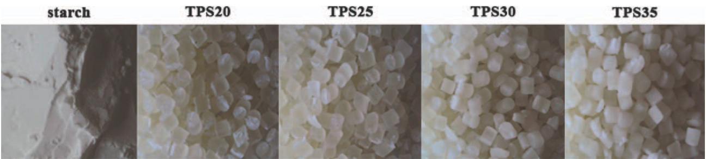
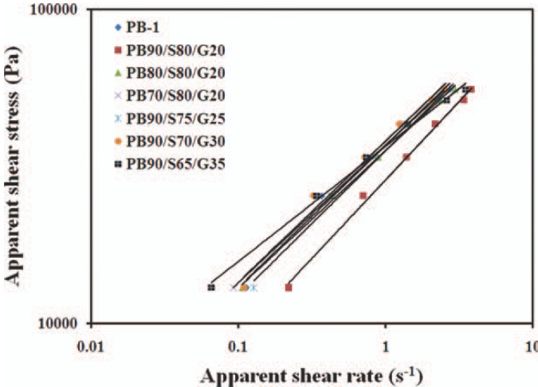
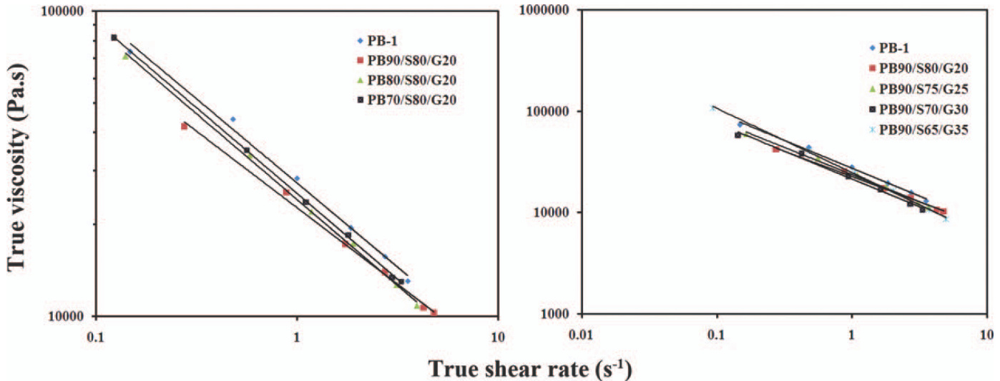
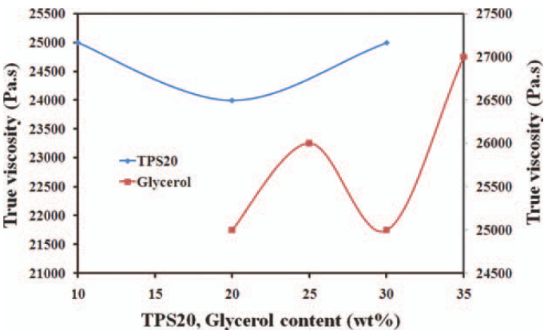
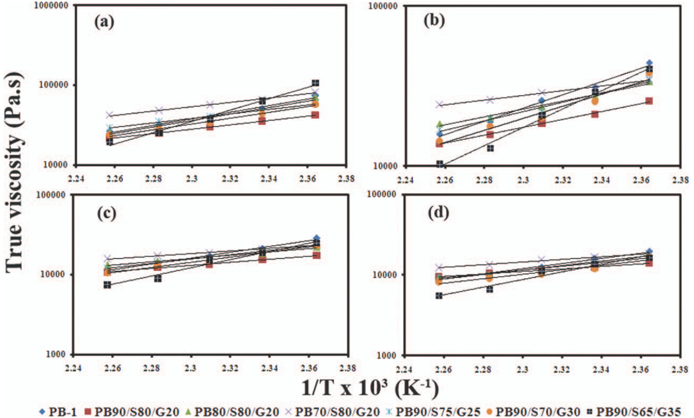
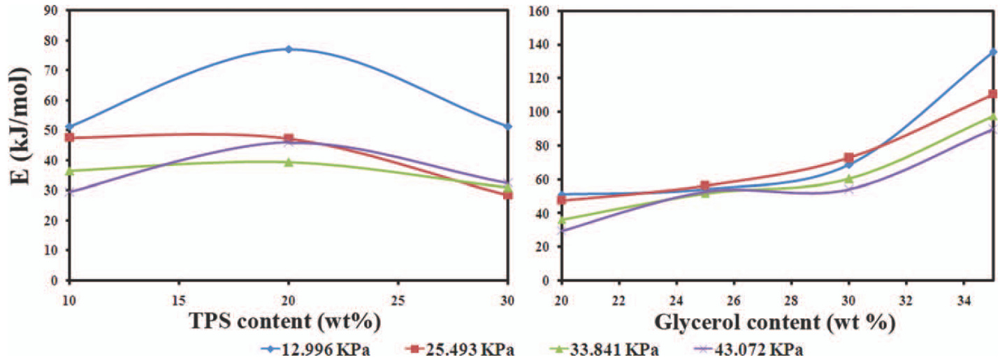
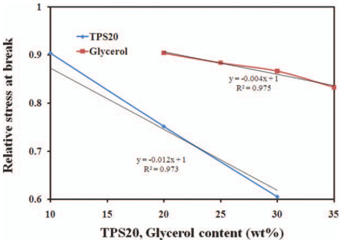
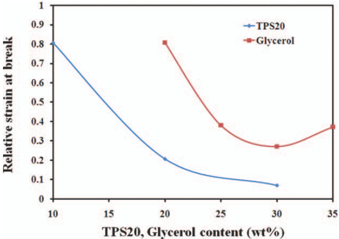
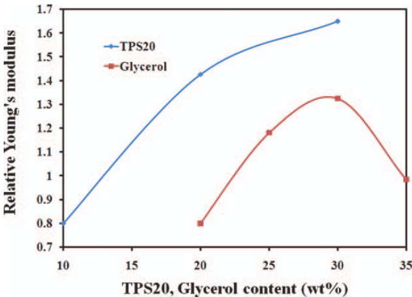

# Preparation and Studying Properties of Polybutene-1/Thermoplastic Starch Blends  

Mosab Kaseem, Kotiba Hamad, Fawaz Deri  

Department of Chemistry, Faculty of Science, Laboratory of Materials Rheology (LMR), University of Damascus, Damascus, Syria  

Received 29 May 2011; accepted 23 July 2011   
DOI 10.1002/app.35350   
Published online 3 November 2011 in Wiley Online Library (wileyonlinelibrary.com).  

ABSTRACT: Starch as an inexpensive and renewable source has been used as a filler for environmental friendly plastics for about two decades. In this study, glycerol was used as a plasticizer for starch to enhance the dispersion and the interfacial affinity in thermoplastic starch (TPS)/ polybutene-1(PB-1) blend. PB-1 was melt blended with TPS using a single screw extrusion process and molded using injection molding process to investigate the rheological and mechanical properties of these blends. Rheological properties were studied using a capillary rheometer, and the Bagley’s correction was performed. Mechanical analysis (stress– strain curves) was performed using Testometric M350-10 kN. The rheological properties showed that the melt viscosity of the blend is less than that of PB-1, and the flow activation energy at a constant shear stress of the blend increases with increasing glycerol content in the blend. The mechanical experiments showed that both stress and strain at break of the blends are less than that of PB-1, whereas the Young’s modulus of the most blends is higher than that of PB-1 which confirms the filling role of TPS in the blend. $\copyright$ 2011 Wiley Periodicals, Inc. J Appl Polym Sci 124: 3092–3098, 2012  

Key words: PB-1; thermoplastic starch; blends; melt viscosity; tensile properties  

# INTRODUCTION  

The environmental pollution by nondegradable plastic wastes attracts more attention to the research and development on the biodegradable polymers of sustainable materials. However, many of the candidates for the biodegradable polymers have some limitation, especially the high cost that is one of the most serious factors restricting the application of biodegradable polymers.  

Starch is a potentially useful material for biodegradable plastics because of its natural abundance and low cost. Starch is a biopolymer, which is attractive raw material for using as a barrier in packaging materials. It has been used to produce biodegradable films to partially or entirely replace plastic polymers because of its low cost and renewability. However, the wide application of starch film is limited by its mechanical properties and efficient barrier against low polarity compound.1 To overcome this shortcoming, starch molecules must be separated by using plasticizers, heat and shear2 to obtain thermoplastic material which is called thermoplastic starch (TPS) and such processing can be done using similar processing equipment as that used for synthetic polymers.  

Plasticizers play an indispensable role, because the plasticizers could form the hydrogen bonds with starch, take the place of the strong action between AOH groups of starch molecules, and make starch plasticizing. Various plasticizers were used to obtain TPS such as glycerol2–6, water7, urea8,9, formamide7,9, ethylenebisformamide10–12, sorbitol,1,12 and citric acid13. By comparing, glycerol is the most using one, because of its low cost and nonvolatile at the processing temperatures range.  

TPS still has some disadvantages compared to most plastics currently in use, i.e. it is highly watersoluble and has poor mechanical properties. These features can be improved by mixing it with certain synthetic polymers and biodegradable polymers. TPS was melt blended with low density polyethylene (LDPE)2,14, polystyrene (PS),5,15–17 polypropylene (PP),4 acrylonitrile-butadiene-styrene (ABS), poly (lactic acid) (PLA),7,19–22 and polycaprolactone (PCL).23 Salcido et al.2 studied the biodegradation of LDPE/TPS blends and they found that mechanical properties of the prepared blend decreases after the biodegradation tests which was attributed to the formation of holes on the surface which behave as fracture propagation sites. Gonzalez et al.14 prepared high performance LDPE/TPS blends under particular one-step extrusion conditions, they found that the extrusion process and the controlled deformation of the TPS phase yields an important improvement in the elongation at break of LDPE/TPS blends as a function of composition. Schlemmer et al.,15–17 studied the biodegradation of PS/TPS blends and they found that the addition of TPS to PS is an effective technique to achieve biodegradability. Rosa et al.,4 studied the influence of the plasticizer type on the thermal and mechanical properties of PP/TPS blends, where they blended TPS, which has $20\%$ of plasticizer, with PP. They found that the incorporation of TPS to PP has generally reduced the mechanical properties in PP. TPS were also blended with recycled (PP, HDPE, and HDPE/PP)3 it was found in this study that the addition of TPS to recycled PP reduces the MFI of PP but it increases the MFI of HDPE and HDPE/PP blends, it was also found that the addition of TPS decreases the tensile strength and increases the Young’s modulus of the recycled polymers and their blend. Wang et al.,7 studied the influence of different plasticizers on rheological, mechanical, thermal, and morphological properties of TPS/PLA. In general, they found that the melt viscosity of the blends is less than that of PLA, but they found that flow activation energy of the blends is higher than that of PLA. Also it was found that the mechanical properties (elongation at break and tensile strength) of the blends are less than that of pure PLA. In our previous work18 we prepared and studied the rheological and die swell properties of ABS/TPS blends. We found in these study that the melt viscosity of the blend decreases with increasing TPS content, which was attributed to the lubrication effect of the used plasticizer (glycerol), but die swell increased with increasing TPS content in the blend.  

TABLE I The Compositions of PB-1/TPS Blends   

<html><body><table><tr><td rowspan="2"></td><td colspan="2">TPS composition</td><td rowspan="2">TPS</td><td rowspan="2">PB-1</td></tr><tr><td>Starch (wt %)</td><td>Glycerol (wt %)</td></tr><tr><td>Sample</td><td></td><td></td><td>(wt %)</td><td>(% 4M)</td></tr><tr><td>PB90/S80/G20</td><td>80</td><td>20</td><td>10 20</td><td>90 80</td></tr><tr><td>PB80/S80/G20</td><td></td><td></td><td>30</td><td>70</td></tr><tr><td>PB70/S80/G20 PB90/S75/G25</td><td>75</td><td>25</td><td>10</td><td>90</td></tr><tr><td>PB90/S70/G30</td><td>70</td><td>30</td><td>10</td><td>90</td></tr><tr><td>PB90/S65/G35</td><td>65</td><td>35</td><td>10</td><td>90</td></tr></table></body></html>  

PB-1 is one of the most important polyolefins. It has number of attractive properties that distinguish it from the most common polyolefins like PP and PE. It exhibits advantages over other polyolefins in toughness, strength, flexibility, stress cracking resistance, impact resistance, abrasion resistance, and high-temperature resistance.  

The aim of this work is to study the shear flow and mechanical properties of polybutene-1/TPS, Up to now, no academic works were focused on the rheological and mechanical properties of this system.  

# EXPERIMENTAL  

# Materials  

Polybutene-1 (PB-1) (Ylem PB-1) was supplied by Jungbo, Korea $[M F I=0.4~\mathrm{g}/10$ min (ASTM D 1238), density $=~0.93~\mathrm{g}/\mathrm{cm}^{3}$ (ASTM 1505)]. Native corn starch is a commercial material; it was brought from local supply and used as received. Glycerol $99.5\%$ is a commercial grade, used without any treatment.  

# Thermoplastic starch and TPS/PB-1 blends preparation  

Corn starch samples were mixed manually with glycerol in different ratios as given in Table I, the obtained mixtures were then fed into a laboratory scale single screw extruder (SSE) $\mathit{\Omega}^{\prime}L/D=25,$ $D=20$ ) [SHAM EXTRUDER 25D, Performance: Kreem Industrial Establishment, Damascus, Syria], which could be operated at different speeds, varied from 0 to100 rpm. The temperatures profile along the barrel of extruder were set at 90, 100, 110, $100^{\circ}C$ (from feed zone to die), and the screw speed was $30~\mathrm{rpm}$ in TPS preparation. TPS were then extruded through a multi holes die $(3\mathrm{mm})$ and the extrudates were left to cool in air and then fed into a granulator which converted them into granules (Fig. 1). The obtained TPS granules with different glycerol ratios were then blended with PB-1 by using the single screw extruder in different ratios (Table I). The temperature profile along the barrel of the extruder in the PB-1/  

  
Figure 1 Thermoplastic starch granules. [Color figure can be viewed in the online issue, which is available at wileyonlinelibrary.com.]  

  
Figure 2 Flow curves of sample melts at $150^{\circ}C$ . [Color figure can be viewed in the online issue, which is available at wileyonlinelibrary.com.]  

TPS blends was set at 110, 120, 130, $140^{\circ}C$ (from feed zone to die) and the speed was $30~\mathrm{rpm}$ . Also the blends were extruded through the multi holes die, left to cool in air, and the extrudates were fed into the granulator, the granules obtained were then dried in $85^{\circ}C$ for a $6\textrm{h}$ before using. The compositions of TPS and the blends are shown in Table I.  

# Tensile samples preparation  

Tensile samples were prepared using Negrai Bossi NB25 injection machine (Leesona Corporation, Italy) at $180–250^{\circ}C,$ the injection pressure was $9\mathrm{~MP~}$ and the cooling time in the mold was $30\mathrm{~s~}$ . The molded samples were dog bone-shaped samples with a thickness and width of 4 and $10\mathrm{mm},$ respectively. The gauge length of the sample was $80~\mathrm{mm}$ .  

# Rheology  

Rheological properties of the blends were studied using a capillary rheometer (Davenport 3\80), it consists of a barrel into which material was loaded before begin pushed by a plunger through a capillary, the load in the plunger provide the total pressure drop in the barrel and capillary, and the volume flow rate. The rheological experiments were carried out at 150, 155, 160, 165, and ${170^{\circ}}C,$ and by using $L/R=8$ , 15, 25, 36 capillaries. Bagley’s correction was performed by using the data from the four capillary dies. The apparent shear rate $(\gamma_{a})$ is given by:  

$$
\gamma_{r}=\left(\frac{3n+1}{4n}\right)\cdot\gamma_{a}
$$  

where $n$ is the nonNewtonian index depending on temperature, the term $({\frac{3n+1}{4n}})$ was the Rabinowitsch correction factor.24 The apparent shear stress $\left(\tau_{a}\right)$ is given by:  

$$
\uptau_{a}=\frac{R P}{2L}
$$  

where $P$ is the pressure at the capillary entrance, and $L$ is the capillary length. The true shear stress $\left(\tau_{r}\right)$ is given by:  

$$
\tau_{r}=\frac{P}{2(L/R+e)}
$$  

where $e$ is the Bagley’s correction factor.25 The true viscosity $(\boldsymbol{\mathfrak{n}}_{r})$ is given by:  

$$
\upeta_{r}=\frac{\uptau_{r}}{\upgamma_{r}}
$$  

The values of flow activation energy at a constant shear stress $(E_{\tau})$ were determined by using Arrhenius equation form:  

$$
\boldsymbol{\mathrm{\eta}}_{r}=\boldsymbol{A}.\boldsymbol{e}^{\frac{E_{\tau}}{R T}}
$$  

where $A$ is the consistency related to structure and formulation and $R$ is the gas constant $(8.314J/\mathrm{mol}\mathrm{K}^{-1})$ .  

# Mechanical properties  

Tensile testing to study stress at break $(\mathrm{N}/\mathrm{mm}^{2})$ , Young’s modulus $(\mathrm{N}/\mathrm{mm}^{2})$ , and strain at break $(\%)$ were performed using Testometric M350-10KN (The Testometric Company, Rochdale, UK) at room temperature, all samples were strained at $50\mathrm{mm/min}$ . Samples were conditioned at room temperature for a period of $48\mathrm{~h~}$ prior to testing. Results from 4–7 specimens were averaged. Relative stress at break, strain at break and Young’s modulus (Relative property $R P$ ) were calculated:  

$$
R P=\frac{P_{i}}{P_{0}}
$$  

Where $P_{i}$ is the property of the blend and $P_{0}$ is the property of PB-1.  

# RESULTS AND DISCUSSION  

$$
\gamma_{a}=\frac{4Q}{\pi R^{3}}
$$  

where $R$ is the capillary radius, and $Q$ is the volumetric flow rate. The true shear rate $(\gamma_{r})$ is given by:  

# Rheological properties  

Flow curves  

For evaluating the processing behavior, the flow curves of these blends were determined. Figure 2 shows the flow curves of all sample melts at $150^{\circ}C$ . It can be noted from Figure 2, that the linearity of these lines is excellent and they obey the power law in a certain range of shear rate:  

TABLE II $_{n}$ -values of PB-1/TPS Blends   

<html><body><table><tr><td>T (°C)</td><td>PB</td><td>PB1/TPS20</td><td>PB2/TPS20</td><td>PB3/TPS20</td><td>PB1/TPS25</td><td>PB1/TPS30</td><td>PB1/TPS35</td></tr><tr><td>150</td><td>0.45</td><td>0.49</td><td>0.43</td><td>0.43</td><td>0.46</td><td>0.45</td><td>0.37</td></tr><tr><td>155</td><td>0.48</td><td>0.51</td><td>0.46</td><td>0.45</td><td>0.47</td><td>0.47</td><td>0.42</td></tr><tr><td>160</td><td>0.50</td><td>0.54</td><td>0.49</td><td>0.46</td><td>0.47</td><td>0.49</td><td>0.46</td></tr><tr><td>165</td><td>0.51</td><td>0.56</td><td>0.51</td><td>0.47</td><td>0.48</td><td>0.48</td><td>0.47</td></tr><tr><td>170</td><td>0.51</td><td>0.57</td><td>0.53</td><td>0.48</td><td>0.49</td><td>0.49</td><td>0.47</td></tr></table></body></html>  

$$
{\mathfrak{c}}=K.\gamma^{n}
$$  

where $K$ is the consistency index and $n$ is the nonNewtonian index. The nonNewtonian index values were calculated from the slope of the fitted lines. The calculated values of $n$ at 150, 155, 160, 165, and $170^{\circ}C$ are listed in Table II. It could be noted that the obtained values of $n$ for the blends are less than 1 implying that PB-1/TPS blend melts are pseudo plastic. Also it could be noted from Table II that in most cases, the value of $n$ increases with increasing temperature. It is well known that the value of $n$ reflects the viscosity-sensitivity to shear rate, the less the $n$ was, the stronger shear rate-sensitivity the viscosity was. So it could be said that the viscosity of PB1/TPS35 was more sensitive to the shear rate comparing with the least blends.  

of the blend decreases with increasing shear rate in a certain range of shear rate, this behavior was attributed to the alignment of chain segments of polymers in the direction of applied shear stress.26  

Figure 4 shows the effect of TPS and glycerol content on the true viscosity of the blend at $150^{\circ}C$ and $\gamma_{r}=1~{\mathrm{s}}^{-1}$ . It could be noted from Figure 4, that the true viscosity of the blends is less than that of the pure polymer, this behavior was observed previously in PS/TPS,15–17 LLDPE/TPS,13 where the increasing content of glycerol in the blends causes to more arrangement of molecules, and the starch chain mobility increases as the glycerol molecules weaken the inter-chain hydrogen bonding which allows the melt blends to flow smoothly at the experimental temperature. From another side, in addition to acting as plasticizer, glycerol also served as an internal and external lubricant in the rheometer and the extruder which cause lowering the viscosity. Also it could be noted from Figure 4, that the plot of true viscosity versus TPS20 indicates negative deviation blends (NDBs), according to the following log additives rule27:  

# Viscosity curves  

Viscosity curves represent true viscosity versus true shear rate at different temperatures; Figure 3 shows the viscosity curves of the sample melts at $150^{\circ}C$ . It could be noted from Figure 3, that the true viscosity  

$$
\log\upeta_{B}=\sum_{i}w_{i}\log\upeta_{i}
$$  

where $\boldsymbol{\mathrm{n}}_{i}$ and $\boldsymbol{\mathrm{n}}_{B}$ are the viscosity of the ith component and that of the blend and $w_{i}$ is the weight fraction of the ith component.  

  
Figure 3 True viscosity versus true shear rate of sample melts at $150^{\circ}C$ . [Color figure can be viewed in the online issue, which is available at wileyonlinelibrary.com.]  

  
Figure 4 True viscosity versus TPS20 and glycerol content (wt $\%$ ) at $150^{\circ}C$ and $\gamma_{\mathrm{r}}=1~{\mathrm{s}}^{-1}$ . [Color figure can be viewed in the online issue, which is available at wileyonlinelibrary.com.]  

# Flow activation energy  

Figure 5 shows the relationship between true viscosity and $1/T$ at a constant shear stress, it could be noted that the true viscosity decreases with increasing temperature. It is observed that the linearity for all plots in Figure 5, is good, which indicates that the relationship between true viscosity and $1/T$ obeyed by Arrhenius equation form [Eq. (6)], so the flow activation energy at a constant shear stress $(E_{\tau})$ could be determined from the slope of these lines.  

Figure 6 shows the effect of TPS20 and glycerol on the flow activation energy at a constant shear stress of the blends. The flow activation energy represented the effect of the temperature on the flow behavior of material. The more $E_{\uptau}$ was, the more sensitivity of the blend was to the temperature. It could be noted from Figure $^{6,}$ that the addition of TPS (at low glycerol content $20\%$ ) causes decreasing of flow activation energy of the blends comparing with that of pure polymer, at this content of glycerol in TPS20, the high level of hydrogen bonds will be existed between starch chains so the temperature which is required to smooth flow will be high, which means low temperature-sensitivity of viscosity. Also it could be noted from Figure 6, that the flow activation energy of the blend decreases at first with increasing glycerol content at a constant TPS content $10\%$ TPS), then it increases up to $35\%$ glycerol, which has more flow activation energy than PB-1, this behavior could be attributed to the high plasticizing effect of glycerol at this content, where glycerol could easily penetrate into starch granules and accelerate the fluidity of starch chains so the temperature which is required to smooth flow will be low, which means high temperature-sensitivity of viscosity.  

# Mechanical properties  

  
Figure 7 shows the effect of TPS20 and glycerol content on stress at break of the blend, it could be noted   
Figure 5 True viscosity versus $1/\mathrm{T}$ for sample melts (a) $\tau=12.996~\mathrm{kPa}_{,}$ , (b) $\tau=25.493~\mathrm{kPa},$ (c) $\tau=33.841~\mathrm{kPa},$ , and (d) s $=43.072\mathrm{kPa}$ . [Color figure can be viewed in the online issue, which is available at wileyonlinelibrary.com.]  

Journal of Applied Polymer Science DOI 10.1002/app from Figure 7, that stress at break of the blends is slightly less than that of pure polymer, this behavior could be attributed to poor compatibility between TPS and PB-1 in the blend. Also it could be noted that glycerol has less effect on the stress at break of the blend comparing with the effect of TPS20, where the slope of the linear relationship between relative stress at break and glycerol content (for $10\%$ TPS) is less than that of the linear relationship between relative stress at break and TPS20 content. This behavior is attributed to the low content of starch in PB1/ TPS25, PB1/TPS30, and PB1/TPS35 (Table I).  

  
Figure 6 Flow activation energy versus TPS20 and glycerol content (wt $\%$ ). [Color figure can be viewed in the online issue, which is available at wileyonlinelibrary.com.]  

The effect of TPS20 and glycerol content on strain at break of the blends is shown in Figure 8, it is well noted from Figure 8, that the strain at break of the blends decreases with increasing both TPS20 and glycerol content. Presence of $20\%$ of TPS20 in the blend caused a steep decline in strain at break (dropping by a factor of 0.793). This behavior could be attributed also to poor compatibility between TPS and PB-1 in the blend. Figure 9 shows the effect of TPS20 and glycerol (for $10\%$ TPS) contents on the Young’s modulus for the blends, it could be noted from Figure 9, that the Young’s modulus of the most blends is higher than that of PB-1. It could be said that the addition of TPS to PB-1 follows the general trend for filler effects on polymer properties.28 The modulus increases because of stiffening effect of TPS and the strain at break decreases as the TPS content is increased.  

  
Figure 7 Relative stress at break versus TPS20 and glycerol content (wt $\%$ ). [Color figure can be viewed in the online issue, which is available at wileyonlinelibrary.com.]  

Also it could be noted from Figures 7 and 8, that the influence of TPS on the stress at break is less than that on strain at break, so Young’s modulus of the blends was affected by the strain at break (high values of Young’s modulus corresponds to low values of strain at break and vice versa).  

The PB-1 and TPS are incompatible. Partial compatibility of the dispersed phase with the matrix can bring about many property changes, including tensile properties. We feel that this should be investigated further to improve the mechanical properties of the PB-1/TPS system, and this purpose can be done be using different methods, the most using method is the addition of the compatibilizers. This study is under way and will be reported in the near future.  

  
Figure 8 Relative strain at break versus TPS20 and glycerol content (wt $\%$ ). [Color figure can be viewed in the online issue, which is available at wileyonlinelibrary.com.]  

  
Figure 9 Relative Young’s modulus versus TPS20 and glycerol content (wt $\%$ ). [Color figure can be viewed in the online issue, which is available at wileyonlinelibrary.com.]  

# CONCLUSION  

In this study, PB-1/TPS blends were prepared in different ratios using a laboratory scale single screw extruder. The rheological and mechanical properties of the prepared blends were determined. The effect of blending ratio on the rheological and mechanical properties was discussed. The results showed that the blend is pseudo plastic in manner, where its non-Newtonian index was less than 1, and the melt viscosity of the blend is less than that of PB-1 which was attributed to the lubrication role of glycerol. The mechanical properties showed poor compatibility between TPS and PB-1 in the blend where the stress and the strain at break of the blends are less than that of the pure polymer.  

The authors are grateful to Mr. Honny Yoo (Jungbo $\mathrm{Co,}$ Korea) for his aid in supplying PB-1, also the authors gratefully thank Mr. Mohammad AL-koud for his aid in completing this work.  

# References  

1. Bourtoom, T. Songklankarain J Sci Technol 2008, 30(Suppl 1), 149.   
2. Salcido, C. S.; Gonzalez, F. J.; Hernandez, M. L.; Esquivel, J. C. Polym Bull 2008, 60, 677.   
3. Rosa, D. S.; Guedes, C. G. F.; Carvalho, C. L. J Mater Sci 2007, 42, 551.   
4. Rosa, D. S.; Bardi, M. A. G.; Machado, L. D. B.; Dias, D. B.; Silva, L. G. A.; Kodama, Y. J Therm AnalCalorim 2009, 97, 565.   
5. Mihai, M.; Huneault, M. A.; Favis, B. D. J Cell Plast 2007, 43, 215.   
6. Gonzalez, F. J.; Ramasy, B. A.; Favis, B. D. Carbohydr Polym 2004, 58, 139.   
7. Wang, N.; Yu, J.; Chang, P.; Ma, X. Carbohydr Polym 2008, 71, 109.   
8. Ma, X.; Yu, J.; Wan, J. J. Carbohydr Polym 2006, 64, 267.   
9. Ma, X.; Yu, J. Carbohydr Polym 2004, 57, 197.   
10. Yang, J.; Yu, J.; Ma X. Chin Chem Lett 2006, 17, 133.   
11. Yang, J.; Yu, J.; Ma X. Carbohydr Polym 2008, 63, 218.   
12. Yang, J.; Yu, J.; Ma X. Carbohydr Polym 2006, 66, 110.   
13. Wang, N.; Yu, J.; Ma, X.; Ying, W. Carbohydr Polym 2007, 67, 446.   
14. Gonzalez, F. J.; Ramsay, B. A.; Favis, B. D. Polymer 2003, 44, 1517.   
15. Schlemmer, D.; Sales, M.; Resck, I. S. Carbohydr Polym 2009, 75, 58.   
16. Schlemmer, D.; Oliveira, E. R.; Sales, M. J Therm Anal Calorim 2007, 87, 635.   
17. Pimentel, T.; Duraes, J.; Drummond, A.; Schlemmer, D.; Falcao, R.; Salas, M. J Mater Sci 2007, 42, 7530.   
18. Kaseem, M.; Hamad, K.; Deri, F. Malaysian Polym J, to appear.   
19. Wang, N.; Yu, J.; Ma, X. Polym Int 2007, 56, 1440.   
20. Wang, N.; Yu, J.; Chang, P.; Ma, X. Starch 2007, 59, 409.   
21. Huneault, M.; Li, H. Polymer 2007, 48, 270.   
22. Wang, N.; Yu, J.; Ma, X. Polym Compos 2008, 29, 551.   
23. Sarazin, P.; Li, G.; Orts, W.; Favis, B. Polymer 2008, 49, 599.   
24. Han, C. D. Rheology and Processing of Polymeric Materials (Polymer Rheology); Oxford University Press: New York, 2007.   
25. Bagley, E. B. J Appl Phys 1957, 28, 624.   
26. Sinthavathavorn, W.; Nithitanakul, M.; Grady, B.; Mangaraphan, R. Polym Bull 2009, 63, 23.   
27. Utracki, L. A. Polymer Blends Handbook; Kluwer Academic: London, 2002.   
28. Willet, J. L. J Appl Polym Sci 1994, 54, 1685.  