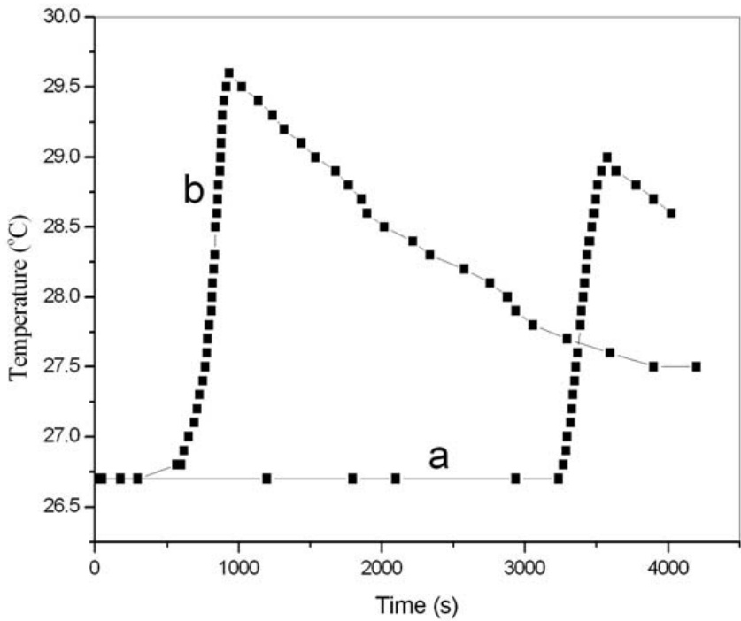
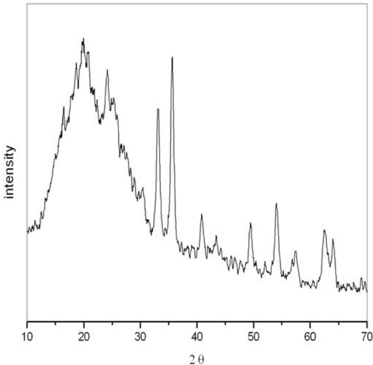
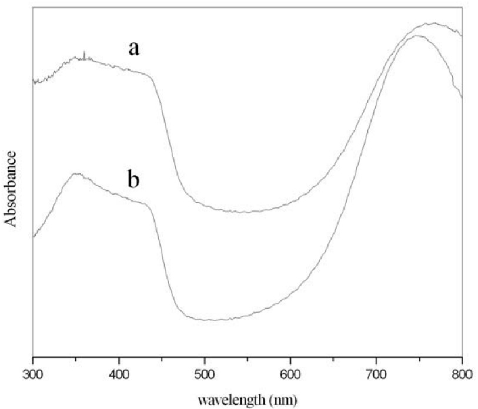
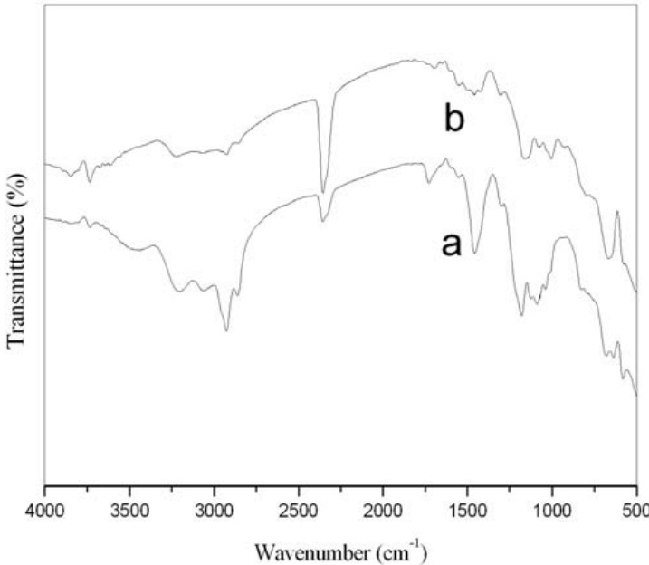
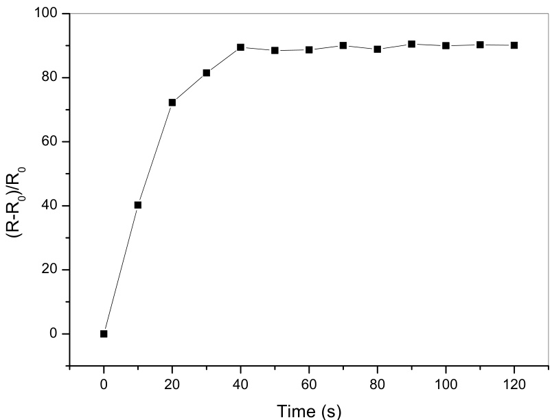

# Preparation of polyaniline/Fe2O3 composite dispersions in the presence of dodecylbenzene sulfonic acid  

Yan Wu,1 Shuangxi Xing,1 2 Shengyu Jing,1 Teili Zhou,1 Chun Zhao ,1\*  

1 State Key Laboratory on Integrated Optoelectronics, College of Electronic Science and Engineering, Jilin University, 2699 Qianjin Street, Changchun 130012, P. R. China   
2 Faculty of Chemistry, Northeast Normal University, Changchun, 130023, P. R. China  

(Received: 21 May, 2007; published: 10 September, 2007)  

Abstract: We reported a chemical approach for the in-situ preparation of conducting polyaniline (PANI) $/{\sf F e}_{2}{\sf O}_{3}$ composite dispersions using dodecylbenzene sulfonic (DBSA) acid both as dopant and surfactant. The $\mathsf{P A N I/F e}_{2}\mathsf{O}_{3}$ composite dispersions were characterized by X-ray diffraction, UV-vis and FT-IR spectra and conductivity measurement. The dispersions showed good stability and existed without precipitate for at least half a year. The gas-sensing behavior of the composite film to 100 ppm of $\mathsf{N H}_{3}$ was studied through monitoring the change of the resistance.  

Keywords: PANI/F $\mathsf{\Gamma}_{\mathsf{\theta}_{2}\mathsf{O}_{3}}$ composite, dispersions, dodecylbenzene sulfonic acid  

# Introduction  

Recently, polymeric composites containing metal oxides have attracted a great deal of attention from researchers because they frequently exhibit unexpected hybrid properties synergistically derived from both components [1-4]. Meanwhile, they exhibit interesting properties with many applications such as quantum electronic devices, gas sensors, capacitors, conducting paints and rechargeable batteries [5-8]. Composites of polyaniline (PANI) have been widely studied in view of their unique electrical, dielectrical, optical and optoelectrical properties in addition to their easy preparation and excellent environmental stability [9-12]. However, the poor solubility limits their application as conducting materials. To overcome this obstacle, functionalized protonic acids such as dedecylbenzenesulfonic acid (DBSA) or camphorsulfonic acid (CSA) have been used to dope PANI and the obtained conducting products were soluble in many kinds of solvents [13-14].  

On the other hand, composite of PANI and iron oxides ( $\mathsf{F e}_{2}\mathsf{O}_{3}$ or $\mathsf{F e}_{3}\mathsf{O}_{4}$ ) has been extensively investigated because of their unique magnetic properties and application prospects in technology [15-24]. But most of the composites were in powder state; therefore, the processes to prepare film for application in devices are complicated. In our experiment, we prepare the conducting $\mathsf{P A N I/F e}_{2}\mathsf{O}_{3}$ composite dispersions in aqueous solution by one step, and the so-obtained $\mathsf{P A N I/F e}_{2}\mathsf{O}_{3}$ composite dispersions can be directly used to prepare conducting films and hence make different devices.  

In our former work, we have investigated the formation of the PANI dispersions under different preparation conductions by changing the concentration of surfactant, aniline, acid and the ratio of aniline to ammonium persulphate (APS) [25]. In this study, we chose the optimum conditions considering the above factors to prepare the PANI/F $\mathsf{i}_{\mathsf{e}_{2}\mathsf{O}_{3}}$ composite dispersions by in-situ polymerization using DBSA both as dopant and surfactant. The dispersions of PANI/F $\mathsf{e}_{2}\mathsf{O}_{3}$ composite could exist without any precipitate for at least half a year. In addition, it can be diluted by distilled water for many times without generation of precipitate, indicating their high stability or nearly solution characteristic. The structure and conductivity of the composite was studied by X-ray, UV-vis and FT-IR spectra, and four-probe technology. The gassensing behavior of the film prepared by directly spinning the dispersions on silicon chip was studied.  

# Results and discussion  

# Formation  

As for the formation of the dispersions, we assumed that the $\mathsf{F e}_{2}\mathsf{O}_{3}$ particles were dispersed in water aqueous solution and it would act as ‘seed’ to induce the polymerization of aniline. In our experiment, the $\mathsf{F e}_{2}\mathsf{O}_{3}$ particles were homogeneously dispersed in the reaction system because DBSA with hydrophilic group acted as surfactant. Then the aniline monomer contacted with $\mathsf{F e}_{2}\mathsf{O}_{3}$ nearly at the same time, which could accelerate the induction time of polymerization [26]. This effect could be observed by monitoring the change of the solution temperature as shown in Fig. 1. From Fig. 1, we can see that the time for the seed polymerization to start was about 300 s (Fig. 1b) while without $\mathsf{F e}_{2}\mathsf{O}_{3}$ particles was about 3300 s along (Fig. 1a).  

  
Fig. 1. Temperature change during the induction time.  

# XRD pattern  

The XRD pattern of $\mathsf{P A N I/F e}_{2}\mathsf{O}_{3}$ composite dispersions is shown in Fig. 2. In the pattern, the 2θ at 35.6, 43.4, 53.6, 57.3, and $62.8^{\mathrm{~\circ~}}$ are contributed to $\mathsf{V}{\cdot}\mathsf{F e}_{2}\mathsf{O}_{3}$ , and 33.08, 40.78 and $49.42^{\mathrm{~o~}}$ are related to $\mathsf{a}\mathsf{-F e}_{2}\mathsf{O}_{3}$ . The broad peaks at about 19.9 and 24.1 o are characteristic peaks of PANI [27]. These results indicate that the  

PANI/F $\mathsf{e}_{2}\mathsf{O}_{3}$ composite dispersions contain two different phases of the $\mathsf{F e}_{2}\mathsf{O}_{3}$ particles, and the PANI is amorphous in the composite.  

  
Fig. 2. XRD pattern of the PANI/F $\mathsf{e}_{2}\mathsf{O}_{3}$ composite dispersions.  

# UV-vis spectra  

  
Fig. 3. UV-vis spectra of PANI (a) and PANI/F $\mathsf{e}_{2}\mathsf{O}_{3}$ composite (b) dispersions.  

The UV-vis absorption spectra of PANI and the PANI $\scriptstyle{\mathsf{\Gamma}}\left({\mathsf{F e}}_{2}{\mathsf{O}}_{3}$ composite dispersions are shown in Fig. 3. A typical absorption spectrum of PANI dispersions has three distinct absorption peaks at 351, 436, and 757 nm, respectively (Fig. 3a). The peak at 351 nm arises from $\pi{-}\pi^{\star}$ electron transition within benzenoid segments, the peak at 436 nm is due to the polaron state and the wide peak at 757 nm is related to the doping level [28]. Compared to the PANI dispersions, the absorption peak of PANI/F $\mathsf{e}_{2}\mathsf{O}_{3}$ composite dispersions show little difference, for example, the peak at 757 nm shifts to $746~\mathrm{nm}$ (Fig. 3b). The shift may be originated from the decreasing doping level by the addition of $\mathsf{F e}_{2}\mathsf{O}_{3}$ .  

# FT-IR spectra  

The FT-IR spectra of PANI and $\mathsf{P A N I/F e}_{2}\mathsf{O}_{3}$ composite dispersions are shown in Fig. 4. From Fig. 4a, we can find the characteristic peaks of PANI: the peak at $684~\mathrm{cm}^{-1}$ is usually assigned to the $\mathsf{C}\mathbf{-H}$ out of plane bending in 1, 2 ring in intrinsic PANI; the peak at $1083~\mathrm{cm}^{-1}$ stands for the $\mathsf{C}\mathbf{-H}$ aromatic in-plane bending on 1, 4 ring; the peak at $1183\mathrm{cm}^{-1}$ may be assigned to the carbon skeleton, and the peak of 1311 cm 1 is contributed to C-N stretching mode. The strong peak at $1459~\mathrm{cm}^{-1}$ is related to $\mathtt{C}{=}\mathtt{C}$ stretching mode of the benzenoid ring and a weak peak of quionoid ring at 1548 $\mathsf{c m}^{-1}$ means the high doping degree of the PANI [29]. And from Fig. 4b, we can see that when the $\mathsf{F e}_{2}\mathsf{O}_{3}$ particles present in the dispersion, the intensity of the peak at $1459~\mathrm{cm}^{-1}$ is decreased and shift to $1461~\mathrm{cm}^{-1}$ , which represents the decrease of doping degree of the PANI. There may be some interaction between the lone pair electrons of N atom in PANI chains with 3d orbit of Fe atom, which could reduce the energy level interval of aromatic nucleus. This also caused the UV-vis absorption band of composite dispersions to have a red shift [30].  

  
Fig. 4. FT-IR spectra of PANI (a) and PANI/F $\mathsf{\Gamma}_{\mathsf{e}_{2}\mathsf{O}_{3}}$ composite (b) dispersions.  

# Conductivity  

Table 1 shows the conductivity values measured by using four-probe technology at $25~^{\circ}\mathrm{C}$ . Compared to pure PANI, the conductivity of PANI/F $\mathsf{e}_{2}\mathsf{O}_{3}$ composite with $\mathsf{F e}_{2}\mathsf{O}_{3}$ content of $0.05~\mathfrak{g}$ increases from 0.98 to $1.07\upmu\mathrm{S/cm}$ . This may be attributed to the doping effect associated with $\mathsf{F e}_{2}\mathsf{O}_{3}$ particles that are believed to help induce the formation of a more efficient network for change transport, thus enhancing the conductivity of the composite [31]. However, with increasing the content of $\mathsf{F e}_{2}\mathsf{O}_{3}$ , the relative contents of the conducting polymer are decreased, resulting in the decrease of the corresponding conductivity. The decrease may be attributed to two factors: (a) the insulating behavior of the $\mathsf{F e}_{2}\mathsf{O}_{3}$ particles in the core of the composites; (b) a decrease of doping degree as the UV-vis and FT-IR spectra show [32].  

Tab. 1. Conductivity values of the composites with different contents of $\mathsf{F e}_{2}\mathsf{O}_{3}$ particles.   

<html><body><table><tr><td>Content of Fe2O3</td><td>Conductivity (μS/cm )</td></tr><tr><td>0</td><td>0.98</td></tr><tr><td>0.05</td><td>1.07</td></tr><tr><td>0.1</td><td>0.78</td></tr><tr><td>0.2</td><td>0.69</td></tr><tr><td>0.465</td><td>0.33</td></tr></table></body></html>  

# Gas-sensing behavior  

The gas-sensing behavior of $\mathsf{P A N I/F e}_{2}\mathsf{O}_{3}$ composite film to 100 ppm of ${\mathsf{N H}}_{3}$ is shown in Fig. 5. The y-axis is the normalized resistance (R- $\mathsf{R}_{0}/\mathsf{R}_{0})$ , where ${\sf R}_{0}$ is the initial resistance of the composite film before exposure to ${\mathsf{N H}}_{3}$ at $\mathfrak{t}=0$ and $\mathsf{R}$ is the time dependent resistance of the film exposed to the test gas.  

  
Fig. 5. The response curve of PANI/F $\mathsf{i}_{\mathsf{e}_{2}\mathsf{O}_{3}}$ composite film to 100 ppm ${\mathsf{N H}}_{3}$ .  

From Fig. 5 we could see that the composite film has a significant sensitivity to ${\mathsf{N H}}_{3}$ . The response time of the composite film is $40\textsf{s}$ . It can be applied to the detection of ammonia, and the further study of the sensitivity to ${\mathsf{N H}}_{3}$ and other gases is under way.  

# Stability  

The stability of the dispersions with different content of $\mathsf{F e}_{2}\mathsf{O}_{3}$ particles was studied. When the content of $\mathsf{F e}_{2}\mathsf{O}_{3}$ particles in the dispersions was lower than $0.05~\mathfrak{g}$ , the dispersions show good stability and existed without precipitate at least half a year. However, when the content was beyond $0.05\mathfrak{g}$ , there were some precipitates on the bottom of the dispersion and the quantity of the precipitates increased with the content of $\mathsf{F e}_{2}\mathsf{O}_{3}$ .  

# Conclusions  

$\mathsf{P A N I/F e}_{2}\mathsf{O}_{3}$ dispersions were prepared using DBSA both as dopant and surfactant. The XRD, UV-vis and FT-IR characterization indicated that there is some interaction between the PANI and $\mathsf{F e}_{2}\mathsf{O}_{3}$ . The conductivity of the dispersions increased when a little of $\mathsf{F e}_{2}\mathsf{O}_{3}$ particles were added and decreased in line when a great quantity of $\mathsf{F e}_{2}\mathsf{O}_{3}$ were added. The dispersions showed good stability and existed without precipitate for at least half a year. A film were prepared by directly spinning the $\mathsf{P A N I/F e}_{2}\mathsf{O}_{3}$ dispersions on a chip of silicon to study the gas-sensing of100ppm ${\mathsf{N H}}_{3}$ ; the response time is only 40 s and further study of the sensitivity to the ${\mathsf{N H}}_{3}$ is under way.  

# Experimental  

# Materials  

Aniline was freshly distilled under reduced pressure and other chemicals were used as received without further purification. $\mathsf{F e}_{2}\mathsf{O}_{3}$ particles were synthesized by coprecipitation.  

# Preparation of PANI/Fe2O3 composite dispersion  

PANI/F $\mathsf{e}_{2}\mathsf{O}_{3}$ composite dispersions were prepared using an in-situ polymerization method. A typical experiment was done as follows: 0.465 g of aniline was dispersed into $100~\mathrm{m}$ of DBSA aqueous solution $(0.2\textsf{M})$ under stirring, after which 0.1 g of $\mathsf{F e}_{2}\mathsf{O}_{3}$ was added into the above solution under ultrasonic. APS in powder state was then added into the mixture solution. The dispersions of PANI/F $\mathsf{\Gamma}_{\mathsf{e}_{2}\mathsf{O}_{3}}$ composite were obtained after stirring for 1 h. The PANI dispersions were prepared by the same approach in absence of $\mathsf{F e}_{2}\mathsf{O}_{3}$ . Acetone damaging dispersions were centrifuged and washed with distilled water, ethanol and acetone three times, respectively. The resulting powder were dried under reduced pressure at room temperature and then used for XRD and conductivity measurements.  

# Characterization  

The composite dispersions was spun onto a chip of silicon and dried under $60~^{\circ}\mathrm{C}$ in order to remove the solvent and form a film for the UV-vis and FT-IR spectra measurement and study ${\mathsf{N H}}_{3}$ gas-sensing behavior. UV-vis and FT-IR spectra were recorded on a UV 3100 spectrometer and on FT-IR-8400s (Shimadzu) spectrometer, respectively. The conductivity measurements were made by the conventional fourprobe (SDY-5) method on pressed pellets of the composite powders prepared at ambient temperature $(25^{\circ}\mathsf{C})$ . The gas-sensing behavior, which could be reflected by the resistance change of the resulting $\mathsf{P A N I/F e}_{2}\mathsf{O}_{3}$ composite film upon exposure to 100 ppm of ${\mathsf{N H}}_{3}$ , was monitored with a digital multimeter (DT9205).  

# References  

[1] Su S.J.; Kuramoto N. Synth. Met. 2000,114, 147.   
[2] Chuang F.Y.; Yang S.M. Synth. Met. 2005, 152, 361.   
[3] Sui X.M.; Chu Y.; Xing S.X.; Yu M.; Liu C.Z. Colloids. Surfaces A. 2004, 251, 103.   
[4] Chen W.; Li X.W.; Xue G.; Wang Z.Q.; Zou W.Q. Appl. Surf. Sci. 2003, 218, 215.   
[5] Tandon R.P.; Tripathy M.R.; Arora A.K.; Hotchandani S. Sens. Actuators B 2005, 114, 768.   
[6] Arshak K.; Moore E.; Cavanagh L.; Cunniffe C.; Clifford S. Prog. Solid State. Ch.   
2005, 33, 199.   
[7] Geng L.N.; Zhao Y.Q.; Huang X.L.; Wang S.R.; Zhang S.M.; Wu S.H. Sens.   
Actuators B 2006, 120, 568.   
[8] Ma X.F.; Wang M.; Li G.; Chen H.Z.; Bai R. Mater. Chem. Phys. 2006, 98, 241.   
[9] Wu C.G.; Liu Y.C.; Hsu S.S. Synth. Met. 1999, 102, 1268.   
[10] Long Y.Z.; Chen Z.J.; Duvailb J.L.; Zhang Z.M.; Wan M.X. Phys. B 2005, 370, 121.   
[11] He Y.J. Appl. Surf. Sci. 2005, 249, 1.   
[12] Geng L. N.; Wang S. R.; Zhao Y. Q.; Li P.; Zhang S. M.; Huang W. P.; Wu S. H.   
Mater. Chem. Phys. 2006, 99, 15.   
[13] Cao Y.; Smith P.; Heeger A. J. Synth. Met. 1992, 48, 91.   
[14] Poussin D.; Morgan H.;Foot P.J. Polym. Int. 2003, 52, 433.   
[15] Mallikarjuna N.N.; Manohar S.K.; Kulkarni P. Venkataraman V.A.; Aminabhavi T.M. J. Appl. Polym. Sci. 2005, 97, 1868.   
[16] Reddy K.R.; Lee K.P.; Iyengar A. G. J. Appl. Polym. Sci. 2007, 104, 4127.   
[17] Wan M.X.; Li W.G. J. Polym. Sci. Part A :Polym. Chem. 1997,35, 2129.   
[18] Zhang Z.M.; Deng J.Y.; Shen J.Y.; Wan M.X.; Chen Z. J. Macromol. Rapid Commun. 2007, 28, 585.   
[19] Aphesteguy J.C.; Jacobo S.E. Phys. B. 2004, 354, 224.   
[20] Bao L.; Jiang J.S. Phys. B. 2005, 67, 182.   
[21] Reddy K.R.; Lee K.P.; Gopalan A.I.; Showkat A.M. Polym. Adv. Technol. 2007, 18, 38.   
[22] Wan M.X.; Zhou W.X. Synth. Met. 1996, 78, 27.   
[23] Zhang Z.M.; Wan M.X. Synth. Met. 2003, 132, 205.   
[24] Deng J.G.; He C.L.; Peng Y.X.; Wang J.H.; Long X.P.; Li P.; Chan A.S.C. Synth.   
Met. 2003, 139, 295.   
[25] Xing S.X.; Zhao C.; Jing S.Y.; Wang Z.C. J. Mater. Sci. 2006, 41, 2761.   
[26] Xing S.X., Zhao C., Jing S.Y., Wang Z. C. Polymer. 2006, 47, 2305.   
[27] Brezoi D.V.; Iom R.M. Sens. Actuators B 2005, 109, 171.   
[28] Schnitzler D.C.; Meruvia M.S.; Hummelgen I.A.; Zarbin A.J.G. Chem. Mater.   
2003, 15, 4658.   
[29] Sharma S.; Nirkhe C.; Pethkar S.; Athawale A.A. Sens. Actuators B 2002, 85, 131.   
[30] Deng J.G.; Ding X.B.; Zhang W.C.; Peng Y.X.; Wang J.H.; Long X.P.; Li P.;   
Chan A.S.C. Polymer. 2002, 43, 2179.   
[31] Xu J.C.; Liu W.M.; Li H.L. Mater. Sci. Eng. C 2005, 25, 444.   
[32] Aphesteguy J.C.; Jacobo S.E. Phys. B 2004, 354, 224.  